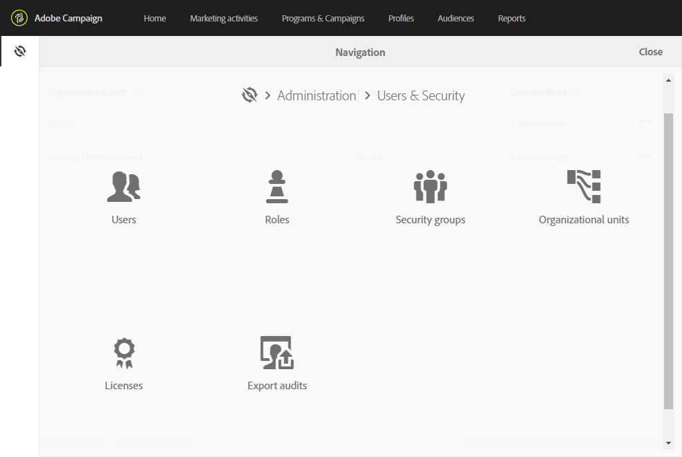

# Informazioni sulla gestione degli accessi{#about-access-management}

Adobe Campaign consente di definire e gestire le autorizzazioni assegnate a utenti diversi. Le autorizzazioni sono un insieme di diritti e restrizioni che autorizzano o negano l&#39;accesso a determinate funzionalità o oggetti nell&#39;interfaccia. Queste autorizzazioni si basano su due concetti:

* **Unità** organizzative: Questi consentono di definire una gerarchia di autorizzazioni sui diversi oggetti della piattaforma (e-mail, flussi di lavoro, modelli, utenti, profili, ecc.). Fare riferimento alla sezione Unità  organizzative.
* **Ruoli**: Un insieme di diritti unitari che consente di definire le autorizzazioni assegnate a utenti e gruppi di utenti. Fare riferimento alla sezione [Elenco di ruoli](../../administration/using/list-of-roles.md) .

   Insieme alle unità organizzative, i ruoli forniscono agli utenti una visualizzazione filtrata dell&#39;interfaccia e definiscono il loro accesso alle diverse funzioni. Per ulteriori informazioni, consulta la tabella Autorizzazioni.

>[!IMPORTANT]
>
>Si noti che la capacità dell&#39;unità geografica è stata dichiarata obsoleta. Per ulteriori informazioni, consultare questa [pagina](https://helpx.adobe.com/campaign/kb/acs-deprecated-and-removed-features.html).

Ruoli, gruppi e unità organizzative possono essere gestiti dall&#39;amministratore funzionale della piattaforma, nel **[!UICONTROL Administration > Users & Security]**menu.

Gli utenti vengono gestiti in Admin Console (consulta la sezione [Gestione di gruppi e utenti](../../administration/using/managing-groups-and-users.md) o la documentazione [di](https://helpx.adobe.com/enterprise/managing/user-guide.html)Admin Console).

>[!IMPORTANT]
>
>Solo gli utenti con diritti di amministrazione hanno accesso alla gestione degli utenti.

**Argomenti correlati**

* [Unità organizzative](../../administration/using/organizational-units.md)
* [Elenco di ruoli](../../administration/using/list-of-roles.md)
* [Gestione di gruppi e utenti](../../administration/using/managing-groups-and-users.md)

