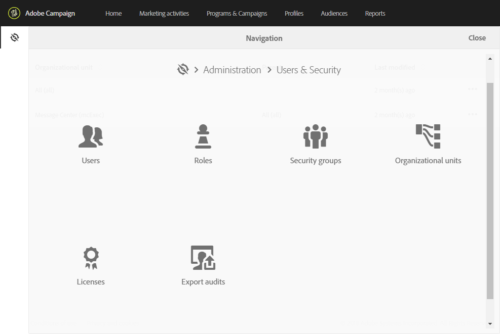
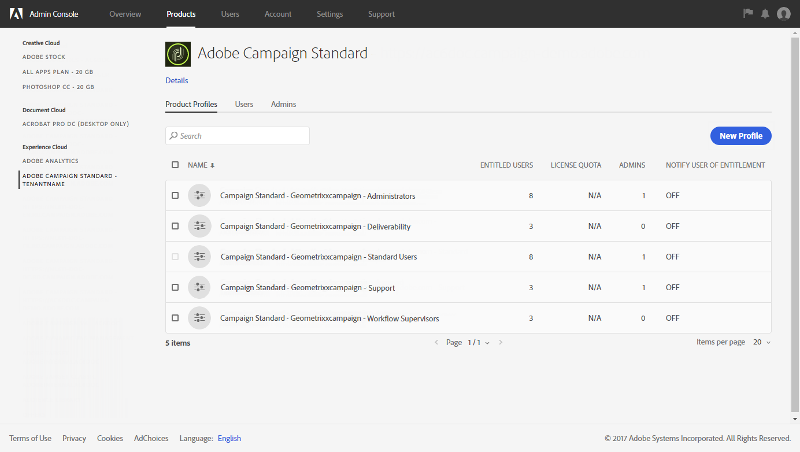

# Informazioni sulla gestione degli accessi{#about-access-management}

Con Adobe Campaign puoi definire e gestire le autorizzazioni assegnate a utenti diversi. Le autorizzazioni sono un insieme di diritti e restrizioni che autorizzano o negano l’accesso a determinate funzionalità o oggetti dell’interfaccia. Queste autorizzazioni si basano su due concetti:

* **Unità organizzative**: ti permettono di definire una gerarchia di autorizzazioni sui diversi oggetti della piattaforma (e-mail, flussi di lavoro, modelli, utenti, profili, ecc.). Consulta la sezione [Unità organizzative](../../administration/using/organizational-units.md).
* **Ruoli**: un insieme di diritti unitari che ti consentono di definire le autorizzazioni assegnate a utenti e gruppi di utenti. Consulta la sezione [Elenco di ruoli](../../administration/using/list-of-roles.md).

  Insieme alle unità organizzative, i ruoli forniscono agli utenti una visualizzazione filtrata dell’interfaccia e ne definiscono l’accesso alle diverse funzioni. Per ulteriori informazioni, consulta la [tabella Autorizzazioni](../../administration/using/list-of-roles.md).

>[!IMPORTANT]
>
>La capacità dell’unità geografica è stata dichiarata obsoleta. Per ulteriori informazioni, consulta questa [pagina](../../rn/using/deprecated-features.md).

Nel menu **[!UICONTROL Administration > Users & Security]**, l’amministratore funzionale della piattaforma può gestire ruoli, gruppi e unità organizzative.

Gli utenti vengono gestiti in Admin Console. Ulteriori informazioni sono disponibili nella sezione [Gestione di gruppi e utenti](../../administration/using/managing-groups-and-users.md) e nella [documentazione di Admin Console](https://helpx.adobe.com/it/enterprise/managing/user-guide.html).

>[!IMPORTANT]
>
>Solo gli utenti con diritti di amministrazione accedono alla gestione degli utenti.

**Argomenti correlati**

* [Unità organizzative](../../administration/using/organizational-units.md)
* [Elenco di ruoli](../../administration/using/list-of-roles.md)
* [Gestione di gruppi e utenti](../../administration/using/managing-groups-and-users.md)
