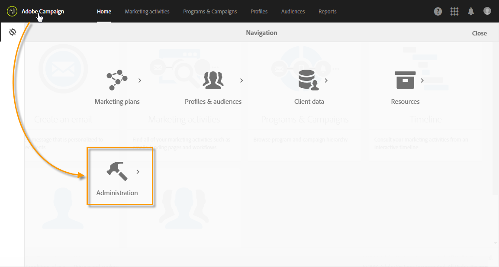

# About Administrating Adobe Campaign{#about-administrating-adobe-campaign}

In qualità di soluzione basata su cloud, Adobe Campaign offre agli amministratori metodi diversi per configurare l'applicazione. Anche se la configurazione dell'infrastruttura è eseguita da Adobe, gli amministratori funzionali possono:

* Invitare gli utenti ad accedere all'applicazione e a gestire gruppi di utenti, nonché i loro diritti e ruoli.
* Configurate account esterni, che vengono utilizzati per connettere Adobe Campaign a server esterni.
* Regola e configura i parametri di routing per tutti i canali di comunicazione.
* Monitorate la piattaforma tramite l'accesso ai flussi di lavoro tecnici.
* Importare ed esportare pacchetti e estendere il modello dati per aggiungere nuovi campi o risorse.

>[!NOTE]
>
>In caso di domande o richieste relative all'implementazione e alla configurazione, contatta il tuo responsabile commerciale Adobe.

The different Adobe Campaign admin operations are carried out via the **[!UICONTROL Administration]** menu. Questa parte dell'interfaccia è accessibile solo dagli amministratori funzionali della piattaforma.

To access this menu, click the **[!UICONTROL Adobe Campaign]** logo, in the top left-hand corner, then click **[!UICONTROL Administration]**.

I diversi menu disponibili sono:

* [Utenti e sicurezza](../../administration/using/about-access-management.md): Questo menu consente di gestire l'accesso alla piattaforma (utenti, ruoli, gruppi di sicurezza, unità).
* [Canali](../../administration/using/about-channel-configuration.md): Questo menu raggruppa i parametri tecnici collegati ai diversi canali della piattaforma (E-mail, SMS) nonché alla gestione di tipologie e quarantena.
* [Impostazioni applicazione](../../administration/using/external-accounts.md): Questo menu consente di configurare diversi elementi applicazione (account esterni, opzioni e flussi di lavoro tecnici).
* [Sviluppo](../../developing/using/data-model-concepts.md): Questo menu consente di gestire le risorse personalizzate e accedere agli strumenti diagnostici.
* [Impostazioni istanza](../../administration/using/branding.md): Questo menu consente di definire i marchi diversi e configurarne le impostazioni (logo, gestione del tracciamento, dominio dell'URL per accedere alle pagine di destinazione, ecc.).
* [Distribuzione](../../automating/using/managing-packages.md): Questo menu riassume le opzioni di importazione ed esportazione del pacchetto.
* [Metriche dei clienti](../../audiences/using/active-profiles.md): Adobe Campaign fornisce un rapporto che mostra il numero di profili attivi. Questo rapporto è solo informativo, non ha un impatto diretto sulla fatturazione.
* [Strumenti sulla privacy](https://docs.campaign.adobe.com/doc/standard/getting_started/en/ACS_GDPR.html): Questo menu consente di creare le richieste di accesso ed eliminazione del GDPR e di tracciarne l'evoluzione.

