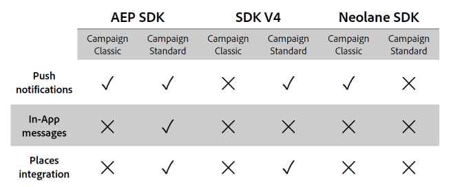

# Domande frequenti sull’integrazione di Experience Platform SDK {#aep-faq}

Per inviare notifiche push e messaggi in-app con l’applicazione SDK Experience Platform, è necessario configurare un’app mobile nell’SDK di Adobe Experience Platform e configurarla in Adobe Campaign.

Nella sezione seguente sono elencate le domande più frequenti sulla sincronizzazione.

Per ulteriori informazioni su push o in-app, consulta le seguenti domande frequenti:

* [Domande frequenti sulle notifiche push](../../channels/using/about-push-notifications.md#push-faq)
* [Domande frequenti in-app](../../channels/using/in-app-faq.md)
* [Domande frequenti sulla sincronizzazione dei tag in Adobe Experience Platform](../../administration/using/syncwithlaunch-faq.md)

## Risorse utili prima di iniziare {#resource-mobile-property}

Consulta le risorse seguenti per ulteriori informazioni sull’SDK per Adobe Experience Platform e l’integrazione di Campaign Standard:

* Launch/Mobile [Video introduttivo](https://www.adobe.com/experience-platform/launch.html#acpl-mobile-video)
* Launch/Mobile [Guida ai suggerimenti](https://www.adobe.com/content/dam/dx/us/en/products/experience-platform/launch-tag-manager/pdfs/adobe-cloud-platform-launch-tips-and-tricks-sheet.pdf)

## L’integrazione dell’SDK di Adobe Experience Platform è disponibile sia per Adobe Campaign Standard che per Adobe Campaign Classic? {#aep-validity}

Sì, [!DNL Adobe Experience Platform SDK] L’integrazione è disponibile sia per Adobe Campaign Standard che per Adobe Campaign Classic. È necessario installare il **[!UICONTROL Extension]** tramite [!DNL Data Collection UI] per abilitare l’integrazione.

Per ulteriori informazioni, consulta questa [pagina]https://developer.adobe.com/client-sdks/documentation/adobe-campaign-standard).

## Quali funzionalità facilita l’integrazione di Adobe Experience Platform SDK in Adobe Campaign? {#aep-capabilities}

Per ulteriori informazioni su queste funzionalità, consulta la tabella seguente.

>[!NOTE]
>
>[!DNL Places] L’integrazione di include eventi places come trigger per i messaggi in-app (N/D per le notifiche push), arricchendo i profili con [!DNL Places] Supporto di dati e notifiche locali. Fai riferimento a questo [pagina](../../channels/using/preparing-and-sending-an-in-app-message.md) per ulteriori informazioni.  [!DNL Places] l’integrazione limitata include l’arricchimento di profili con [!DNL Places] dati.

## Quale caso d’uso facilita l’integrazione di Adobe Experience Platform SDK in Adobe Campaign Standard? {#aep-use-cases}

Sono supportati i seguenti casi d’uso:

* Acquisire un **[!UICONTROL Mobile Profile]** in Campaign (identificato da ECID in **[!UICONTROL Administration]** > **[!UICONTROL Channels]** > **[!UICONTROL Mobile app (AEP SDK)]** > **[!UICONTROL Mobile Application subscribers]** tab)
* Arricchire una **[!UICONTROL Mobile Profile]** in Adobe Campaign (richiede **[!UICONTROL Custom resource Extension]** della tabella appSubscriberRcp)
* Acquisire un token push per l’invio di messaggi push (richiede il consenso dell’utente per la ricezione di messaggi push)
* Inviare messaggi push e in-app
* Monitora l’interazione dell’utente con i messaggi push e in-app e fornisci rapporti su di essa

## Cosa devo fare per acquisire un profilo mobile in Campaign? {#mobile-profile-campaign}

A questo scopo, segui i passaggi riportati qui sotto:

1. Configurare un **[!UICONTROL Mobile property]** in [!DNL Launch].
1. Installa l’estensione Adobe Campaign Standard. L’estensione Adobe Campaign Standard richiede anche **[!UICONTROL Mobile Core]**, **[!UICONTROL Profile]** e **[!UICONTROL Lifecycle]** estensioni installate per impostazione predefinita in [!DNL Launch].
   * Gli utenti devono configurare il timeout della sessione in **[!UICONTROL Mobile Core]** che influisce sulla frequenza degli eventi del ciclo di vita.
   * Una volta configurata l’estensione, gli utenti devono aggiungere le dipendenze appropriate nell’app mobile utilizzando Cocoapods per iOS e Gradle per Android. Seguire le indicazioni [qui](https://developer.adobe.com/client-sdks/documentation/adobe-campaign-standard).
   * Prendi sempre le versioni più recenti delle librerie.
   * In Mobile App, registrati **[!UICONTROL Campaign]**, **[!UICONTROL UserProfile]**, **[!UICONTROL Identity]**, **[!UICONTROL Lifecycle]** e **[!UICONTROL Signal]** estensioni. Seguire le indicazioni [qui](https://developer.adobe.com/client-sdks/documentation/adobe-campaign-standard/#register-the-campaign-standard-extension-with-mobile-core).
   * Una volta registrate le estensioni, avvia ACPCore. Per Android, assicurati di impostareApplication onCreate(). Segui esattamente le istruzioni fornite nelle Istruzioni di installazione per dispositivi mobili per la tua proprietà mobile in Launch.
   * Saranno necessarie anche le seguenti API SDK. Implementare le API di avvio e pausa del ciclo di vita come descritto [qui](https://developer.adobe.com/client-sdks/documentation/mobile-core/lifecycle/android) per Android e qui per iOS.
1. Configurare un **[!UICONTROL Mobile Property]** in Adobe Campaign Standard. Segui la procedura [qui](../../administration/using/configuring-a-mobile-application.md#channel-specific-config).

## Cosa devo fare per arricchire un profilo mobile in Campaign? {#enrich-mobile-profile}

È necessario configurare un postback CollectPII (fare riferimento a questo [pagina](../../administration/using/configuring-rules-launch.md#pii-postback)) e implementa l’API CollectPII dall’SDK (consulta questa sezione [pagina](https://developer.adobe.com/client-sdks/documentation/mobile-core/api-reference)).

## Con quale frequenza deve essere attivata una chiamata CollectPII? {#collect-pii}

L’obiettivo della chiamata CollectPII è arricchire il profilo mobile in Campaign. Dovrebbe essere attivato ogni volta che ci sono nuove informazioni significative che i clienti vorrebbero aggiungere al profilo in base ai loro casi d’uso e alle loro esigenze aziendali.

## È possibile attivare le chiamate CollectPII in risposta a più eventi trigger? {#collect-pii-calls}

Sì. A seconda delle esigenze aziendali, puoi attivare le chiamate CollectPII in risposta alla registrazione dell’utente nell’app o all’acquisto di qualcosa o di un evento del ciclo di vita o all’immissione di un recinto geografico da parte dell’utente, ecc. In sintesi, un’interazione dell’utente con l’app che genera le informazioni da utilizzare per l’arricchimento dei profili.

## Posso semplicemente attivare le chiamate CollectPII in risposta a tutti gli eventi Mobile? {#collect-pii-events}

La frequenza e la progettazione delle chiamate CollectPII devono essere dettate da esigenze aziendali e non devono essere attivate in modo cieco in quanto creano un carico aggiuntivo sul database.

### Quando si tenta di accedere alle app Adobe Experience Platform in Campaign o Launch, a volte viene visualizzato un errore di proprietà non disponibile. {#aep-error}

Si tratta di un problema noto e si verifica a causa della scadenza del token. Prova ad effettuare l’accesso.

## Quali sono i consigli sulle risorse utili per saperne di più sull’SDK per Adobe Experience Platform (precedentemente noto come SDK V5)?{#resource-aep}

Consulta le risorse seguenti:

* SDK EXPERIENCE PLATFORM [documentazione](https://developer.adobe.com/client-sdks/documentation/)
* Guida introduttiva all’SDK di Launch e Experience Platform [documentazione](https://developer.adobe.com/client-sdks/documentation/getting-started/create-a-mobile-property/)
* Aggiornamento ad Experience Platform SDK [documentazione](https://developer.adobe.com/client-sdks/documentation/upgrade-platform-sdks)
* SDK per Experience Platform Github [documentazione](https://github.com/Adobe-Marketing-Cloud/acp-sdks/)

## Viene visualizzato l’errore &quot;Non disponi dell’accesso in scrittura alla consegna&quot; durante la creazione di una consegna di notifica push. {#write-access-error}

Verifica quanto segue:

* L’app mobile deve essere mappata sull’unità organizzativa dell’utente che deve creare e inviare consegne push. L’utente di un’unità organizzativa figlio non può creare una consegna push utilizzando un’app mappata all’unità organizzativa padre.

* La campagna o il programma all’interno del quale viene creata la consegna push deve essere mappato sull’unità organizzativa dell’utente che deve creare e inviare le consegne push. L’utente dell’unità organizzativa figlio non può creare una consegna push in una campagna o in un programma mappato all’unità organizzativa padre.
