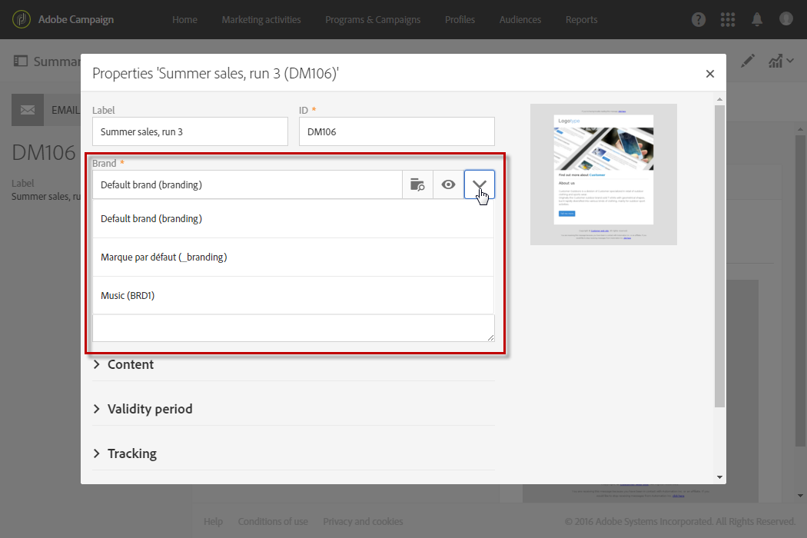

# Branding{#branding}

## About brand identity {#about-brand-identity}

Ogni azienda ha linee guida tecniche e di marchio. Con Adobe Campaign, puoi definire un set di specifiche per presentare un marchio coerente ai tuoi clienti, dal logo a aspetti tecnici, come il mittente e-mail, l'URL o i domini.

Gli amministratori tecnici possono definire uno o più marchi per inserire in modo centralizzato i parametri che influenzano l'identità di un marchio. Ciò include il logo del marchio, il dominio dell'URL di accesso delle pagine di destinazione o le impostazioni di tracciamento dei messaggi. Con Adobe Campaign puoi creare marchi e collegarli a messaggi o pagine di destinazione. Questa configurazione viene gestita nei modelli.

## Configuring and using brands {#configuring-and-using-brands}

Il principio principale per configurare e usare i marchi è:

1. Crea e configura il marchio; questa operazione richiede autorizzazioni specifiche e viene eseguita dall'amministratore tecnico di Adobe Campaign.
1. Crea uno o più modelli di consegna e pagina di destinazione per questo marchio. Refer to the [Creating a template](../../start/using/about-templates.md) section.
1. Crea messaggi e pagine di destinazione basate su questo modello. Refer to the [Creating an email](../../channels/using/creating-an-email.md) and [Creating a landing page](../../channels/using/designing-a-landing-page.md) sections.

>[!CAUTION]
>
>I marchi non possono essere creati o modificati dagli utenti finali: queste operazioni devono essere eseguite dall'amministratore tecnico di Adobe Campaign. Per qualsiasi richiesta, contatta l'assistenza clienti Adobe. Il multimarchio non può essere utilizzato nel contesto dei messaggi transazionali. For more on this, see [Transactional messages and branding](../../channels/using/about-transactional-messaging.md#permissions-and-branding).

Brands can be found in the **[!UICONTROL Administration > Instance settings > Brand configuration]** menu.

Per impostazione predefinita, un marchio appena creato è visibile solo agli utenti assegnati con i diritti corrispondenti dall'amministratore.

A **Brand** is defined by the following characteristics:

* **Un'identità** che definisce e personalizza il marchio. Questa sezione contiene i campi seguenti:

   

   * **Etichetta** visibile nell'interfaccia
   * **Nome marchio**
   * **Etichetta URL** e **etichetta sito Web** del marchio
   * **Logo marchio**

* **[!UICONTROL Header parameters of sent emails]** che personalizza ciò che i destinatari delle campagne vedranno. Questa sezione contiene i campi seguenti:

   

   * **Mittente (indirizzo e-mail)** con l'indirizzo e-mail del marchio.
   * **Mittente (nome)** con il nome del marchio.
   * **Rispondi a (indirizzo e-mail)** con l'indirizzo e-mail a cui il cliente può rispondere.
   * **Rispondi a (nome)** con il nome del marchio.
   * **Errore (indirizzo e-mail)** con l'indirizzo e-mail da utilizzare per un errore.
   >[!CAUTION]
   >
   >Dopo aver aggiornato i parametri dell'intestazione delle e-mail, se il nome e l'indirizzo e-mail del mittente non sono cambiati nell'e-mail creata dal modello, controllate le impostazioni avanzate del modello.

* **I server esposti su Internet** definiscono i server utilizzati per il tracciamento, ma anche per l'accesso alla pagina di destinazione. Questa sezione contiene i campi seguenti:

   

   * **URL esterno del server applicazione** utilizzato per ospitare e accedere alle diverse pagine di destinazione create.
   * **URL esterno del server di tracciamento** utilizzato come URL tracciato durante le consegne.
   * **URL esterno del server della pagina speculare** utilizzato come pagina speculare predefinita nelle consegne.

* **[!UICONTROL Tracking URL configuration (Web Analytics)]**, che definisce la configurazione del tracciamento degli URL per il marchio.

   Qui sono illustrati i parametri aggiuntivi che consentono di tenere traccia dei collegamenti da tenere traccia dei sistemi esterni come ad esempio strumenti di analisi Web come Adobe Analytics o Google Analytics.

   

## Assigning a brand to an email {#assigning-a-brand-to-an-email}

### Linking a brand to a template {#linking-a-brand-to-a-template}

Per utilizzare i parametri definiti per un marchio, questo deve essere collegato a un modello di consegna o a un modello di pagina di destinazione. A tal fine, devi creare o modificare un modello.

>[!NOTE]
>
>For more information about creating a template, refer to the [Creating a template](../../start/using/about-templates.md) section.

Una volta creato il modello, potete collegarlo a un marchio. A tal fine:

1. Click the **[!UICONTROL Edit properties]** button to access the template properties.

   

1. Utilizza l'elenco a discesa per selezionare il marchio che desideri collegare al modello.

   >[!NOTE]
   >
   >By default, the **[!UICONTROL Default brand (branding)]** is selected.

   

   To view how the brand selected is configured, click the **[!UICONTROL Navigate to the detail of the element selected]** icon.

   

1. Confermate la selezione e salvate il modello.

Il modello è collegato al marchio. In the email editor, the elements such as the **Email address of default sender**, the **Default sender name**, or the **Logo** will use the configured brand data.

### Branding use case {#branding-use-case}

In questo esempio, creeremo un nuovo marchio correlato al viaggio e utilizzeremo un messaggio e-mail.

#### Configure a new brand {#configure-a-new-brand}

>[!CAUTION]
>
>La configurazione del marchio è gestita da Adobe solo perché richiede autorizzazioni specifiche e impostazioni tecniche.

1. The Adobe Campaign administrator creates the brand in **[!UICONTROL Administration > Instance settings > Brand configuration]**. He adds the **Vacations in the Tropics** element from the advanced menu and configures the **[!UICONTROL ID]** and the **[!UICONTROL Header parameters of sent emails]** of the brand.

   

1. The administrator then configures the URL of the **Server(s) exposed on the Internet** so that landing pages can be used, then the tracking URLs.

   In this example, the **Web Analytics** tool used is **Google Analytics**. L'amministratore configura l'URL di tracciamento come segue:

   

Il marchio viene creato e configurato correttamente. Ora può essere usato dai team di marketing.

#### Implement a new brand {#implement-a-new-brand}

In qualità di manager consegna, hai il compito di creare i modelli di consegna per utilizzare il nuovo marchio. A tal fine, attenetevi alla procedura seguente:

1. In the advanced menu **[!UICONTROL Resources > Templates > Delivery templates]**, duplicate a built-in template to configure a new delivery template.

   

1. To link this template to the **Vacations in the Tropics** brand, edit the template properties and select the brand from the drop-down list.

   

1. Configurate questo modello e-mail per riflettere l'identità del marchio.
1. Una volta completato il modello, è possibile salvarlo.

   

   Ora è possibile utilizzare il modello di consegna per creare e-mail da inviare a un pubblico.

#### Use the new brand in a delivery {#use-the-new-brand-in-a-delivery}

Per creare un'e-mail collegata a un marchio, segui i passaggi seguenti:

1. Click the **[!UICONTROL Create]** button from the **[!UICONTROL Marketing activities]** menu.

   

1. Select the **[!UICONTROL Email]** activity, then choose the template linked to the new brand.

   

1. L'e-mail è già configurata. Potete controllare le informazioni prima di testarle utilizzando i profili di prova, inviandola al pubblico.

   

