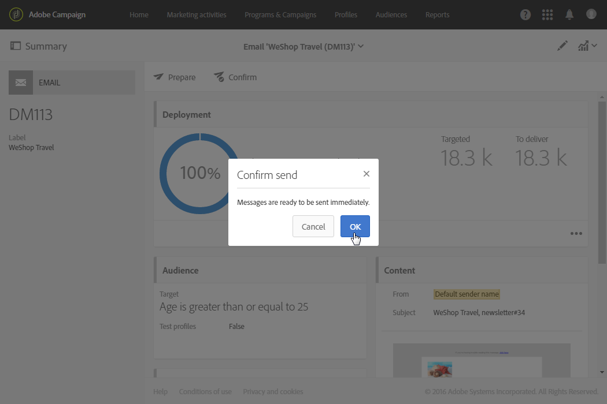

# Branding{#branding}

## Informazioni sull&#39;identità del marchio {#about-brand-identity}

Ogni azienda ha linee guida visive e tecniche del marchio. Con Adobe Campaign, puoi definire una serie di specifiche per presentare ai clienti un marchio coerente, dai logo agli aspetti tecnici, come il mittente dell&#39;e-mail, l&#39;URL o i domini.

Gli amministratori tecnici possono definire uno o più marchi per immettere centralmente i parametri che influiscono sull&#39;identità di un marchio. Questo include il logo del marchio, il dominio dell&#39;URL di accesso delle pagine di destinazione o le impostazioni di tracciamento dei messaggi. Con Adobe Campaign, puoi creare questi marchi e collegarli a messaggi o pagine di destinazione. Questa configurazione è gestita in modelli.

## Configurazione e utilizzo dei marchi {#configuring-and-using-brands}

Il principio principale della configurazione e dell&#39;utilizzo dei marchi è:

1. Crea e configura il marchio: questa operazione richiede autorizzazioni specifiche ed è eseguita dall&#39;amministratore tecnico di Adobe Campaign.
1. Crea uno o più modelli di consegna e pagina di destinazione per questo marchio. Fare riferimento alla sezione [Creazione di un modello](../../start/using/marketing-activity-templates.md) .
1. Crea messaggi e pagine di destinazione in base a questo modello. Consultate [Creazione di un messaggio e-mail](../../channels/using/creating-an-email.md) e [Creazione di una pagina](../../channels/using/designing-a-landing-page.md) di destinazione.

>[!IMPORTANT]
>
>I marchi non possono essere creati o modificati dagli utenti finali: queste operazioni devono essere eseguite dall&#39;amministratore tecnico di Adobe Campaign. Per qualsiasi richiesta, contatta l&#39;Assistenza clienti Adobe.
>
>Il multi-branding non può essere utilizzato nel contesto dei messaggi transazionali. Per ulteriori informazioni, consulta Messaggi [transazionali e branding](../../channels/using/about-transactional-messaging.md#permissions-and-branding).

I marchi si trovano nel **[!UICONTROL Administration > Instance settings > Brand configuration]** menu.

Per impostazione predefinita, un marchio appena creato è visibile solo agli utenti ai quali l&#39;amministratore ha assegnato i diritti corrispondenti.

Un **marchio** è definito dalle seguenti caratteristiche:

* Un&#39; **identità** che definisce e personalizza il tuo marchio. Questa sezione contiene i campi seguenti:

   

   * **Etichetta** visibile nell&#39;interfaccia
   * **Nome marchio**
   * **URL** del sito Web ed etichetta **del** sito Web del marchio
   * **Logo marchio**

* **[!UICONTROL Header parameters of sent emails]** che personalizza i contenuti visualizzati dai destinatari delle campagne. Questa sezione contiene i campi seguenti:

   

   * **Mittente (indirizzo e-mail)** con l&#39;indirizzo e-mail del marchio.
   * **Mittente (nome)** con il nome del marchio.
   * **Rispondi a (indirizzo e-mail)** con l&#39;indirizzo e-mail a cui il cliente può rispondere.
   * **Rispondi a (nome)** con il nome del marchio.
   * **Errore (indirizzo e-mail)** con l&#39;indirizzo e-mail da utilizzare in caso di errore.
   >[!IMPORTANT]
   >
   >Dopo aver aggiornato i parametri di intestazione delle e-mail, se il nome e l&#39;indirizzo e-mail del mittente non sono cambiati nell&#39;e-mail creata dal modello, controllate le impostazioni avanzate del modello.

* **I server esposti su Internet** definiscono i server utilizzati per il tracciamento ma anche per l’accesso alla pagina di destinazione. Questa sezione contiene i campi seguenti:

   

   * **URL esterno del server** applicazione utilizzato per ospitare e accedere alle diverse pagine di destinazione create.
   * **URL esterno del server** di tracciamento utilizzato come URL tracciato durante le consegne.
   * **URL esterno del server** delle pagine mirror utilizzato come pagina mirror predefinita nelle distribuzioni.
   >[!NOTE]
   >
   >Per visualizzare l&#39;anteprima della pagina di destinazione e il rendering della pagina mirror nell&#39;interfaccia utente di Campaign, è necessario proteggere gli URL del server dell&#39;applicazione e del server delle pagine mirror. In tal caso, per configurare questi URL utilizzate https:// anziché http://.

* **[!UICONTROL Tracking URL configuration (Web Analytics)]**, che definisce la configurazione del tracciamento degli URL per il marchio.

   I parametri aggiuntivi che consentono il tracciamento dei collegamenti su sistemi esterni come gli strumenti di analisi Web come Adobe Analytics o Google Analytics sono definiti qui.

   

## Assegnazione di un marchio a un’e-mail {#assigning-a-brand-to-an-email}

### Collegamento di un marchio a un modello {#linking-a-brand-to-a-template}

Per utilizzare i parametri definiti per un marchio, deve essere collegato a un modello di consegna o a un modello di pagina di destinazione. A tal fine, dovete creare o modificare un modello.

>[!NOTE]
>
>Per ulteriori informazioni sulla creazione di un modello, consultate la sezione [Creazione di un modello](../../start/using/marketing-activity-templates.md) .

Una volta creato il modello, potete collegarlo a un marchio. Per eseguire questa operazione:

1. Fate clic sul **[!UICONTROL Edit properties]** pulsante per accedere alle proprietà del modello.

   

1. Utilizzate l&#39;elenco a discesa per selezionare il marchio da collegare al modello.

   >[!NOTE]
   >
   >Per impostazione predefinita, l’opzione **[!UICONTROL Default brand (branding)]** è selezionata.

   

   Per visualizzare la configurazione del marchio selezionato, fai clic sull’ **[!UICONTROL Navigate to the detail of the element selected]** icona .

   

1. Confermate la selezione e salvate il modello.

Il modello è collegato al marchio. Nell&#39;editor e-mail, gli elementi come l&#39;indirizzo **E-mail del mittente** predefinito, il nome **del mittente** predefinito o il **logo** utilizzeranno i dati del marchio configurati.

### Caso di utilizzo del marchio {#branding-use-case}

In questo esempio, creeremo un nuovo marchio correlato ai viaggi e lo useremo in un&#39;e-mail.

#### Configurare un nuovo marchio {#configure-a-new-brand}

>[!IMPORTANT]
>
>La configurazione del marchio è gestita da Adobe solo in quanto richiede autorizzazioni specifiche e impostazioni tecniche.

1. L&#39;amministratore di Adobe Campaign crea il marchio in **[!UICONTROL Administration > Instance settings > Brand configuration]**. Aggiunge le **Vacanze nell&#39;elemento Tropici** dal menu avanzato e configura il **[!UICONTROL ID]** e il **[!UICONTROL Header parameters of sent emails]** marchio.

   

1. L’amministratore configura quindi l’URL del **server esposto su Internet** in modo da poter utilizzare le pagine di destinazione e quindi gli URL di tracciamento.

   In questo esempio, lo strumento **Web Analytics** utilizzato è **Google Analytics**. L’amministratore configura l’URL di tracciamento come segue:

   

Il marchio viene creato e configurato correttamente. Ora può essere utilizzato dai team di marketing.

#### Implementare un nuovo marchio {#implement-a-new-brand}

In qualità di responsabile della distribuzione, hai il compito di creare i modelli di consegna per utilizzare il nuovo marchio. A questo scopo, attenetevi alla procedura seguente:

1. Nel menu avanzato **[!UICONTROL Resources > Templates > Delivery templates]**, duplicate un modello predefinito per configurare un nuovo modello di consegna.

   

1. Per collegare questo modello alle **vacanze nel marchio Tropici** , modificare le proprietà del modello e selezionare il marchio dall&#39;elenco a discesa.

   

1. Configurate questo modello e-mail per riflettere l’identità del marchio.
1. Una volta completato il modello, potete salvarlo.

   

   Ora è possibile utilizzare il modello di consegna per creare e-mail che verranno inviate a un pubblico.

#### Utilizzo del nuovo marchio in una consegna {#use-the-new-brand-in-a-delivery}

Per creare un messaggio e-mail collegato a un marchio, effettuate le seguenti operazioni:

1. Fate clic sul **[!UICONTROL Create]** pulsante dal **[!UICONTROL Marketing activities]** menu.

   

1. Selezionate l&#39; **[!UICONTROL Email]** attività, quindi scegliete il modello collegato al nuovo marchio.

   

1. L&#39;e-mail è già configurata. Potete controllare le informazioni prima di testarle utilizzando i profili di test, quindi inviarle al pubblico.

   

