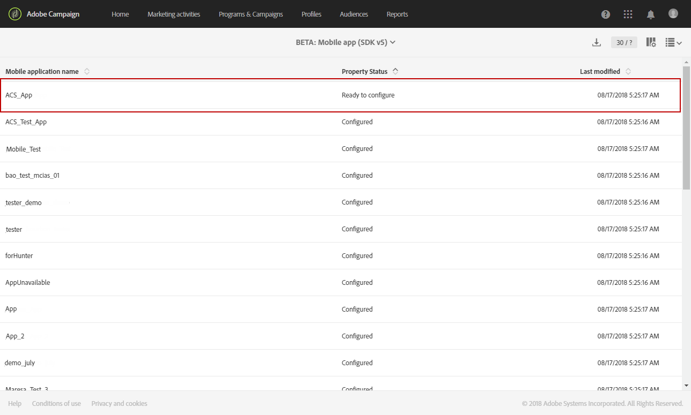

# Configurazione di un’applicazione mobile{#configuring-a-mobile-application}

## Configurazione di un’applicazione mobile mediante  SDK per Adobi Experience Platform {#using-adobe-experience-platform-sdk}

>[!IMPORTANT]
>
>Le notifiche push e le implementazioni in-app devono essere eseguite da utenti esperti. Se avete bisogno di assistenza, contattate il vostro responsabile Adobe Account o il partner di servizi Professional.

Per inviare notifiche push e messaggi in-app con ’applicazione SDK Experience Platform, è necessario impostare un’applicazione mobile  Adobe Experience Platform  Experience Platform Launch Experience Platform e configurarla in  Adobe Campaign.

Per ulteriori informazioni sulla funzione obsoleta SDK per dispositivi mobili versione 4, consulta questa [pagina](https://helpx.adobe.com/campaign/kb/configuring-app-sdkv4-deprecated.html).

Una volta impostata l’applicazione per dispositivi mobili, è possibile recuperare i dati PII raccolti per creare o aggiornare i profili dal database. Per ulteriori informazioni, consulta questa sezione: [Creazione e aggiornamento delle informazioni sul profilo in base ai dati](../../channels/using/updating-profile-with-mobile-app-data.md)delle applicazioni mobili.

Per ulteriori informazioni sui diversi casi di utilizzo per dispositivi mobili supportati in  Adobe Campaign Standard mediante gli SDK per Adobi Experience Platform , consulta questa [pagina](https://helpx.adobe.com/campaign/kb/configure-launch-rules-acs-use-cases.html).

Per completare la configurazione, completare i seguenti passaggi:

1. In  Adobe Campaign, accertatevi di poter accedere ai seguenti elementi:
   * **[!UICONTROL Push notification]**
   * **[!UICONTROL In-App message]**
   * **[!UICONTROL Adobe Places]**

   In caso contrario, contattate il team di account.

1. Verificate che l&#39;utente disponga delle autorizzazioni necessarie in  Adobe Campaign Standard e Experience Platform Launch.
   * In  Adobe Campaign Standard, accertatevi che l&#39;utente IMS faccia parte dei profili di prodotto standard per l&#39;utente e l&#39;amministratore. Questo passaggio consente all&#39;utente di accedere  Adobe Campaign Standard, passare alla  pagina dell&#39;app mobile Experience Platform SDK e visualizzare le proprietà dell&#39;app mobile che hai creato Experience Platform Launch.

   * Ad Experience Platform Launch, accertatevi che l&#39;utente IMS faccia parte di un profilo di prodotto di Experience Platform Launch.
Questo passaggio consente all&#39;utente di accedere al Experience Platform Launch per creare e visualizzare le proprietà. Per ulteriori informazioni sui profili di prodotto nell&#39;Experience Platform Launch, consulta Creazione del profilo di prodotto. Nel profilo di prodotto non dovrebbero essere impostate autorizzazioni per la società o le proprietà, ma l&#39;utente dovrebbe essere ancora in grado di effettuare l&#39;accesso.

   Per completare altre attività come l&#39;installazione di un&#39;estensione, la pubblicazione di un&#39;app, la configurazione di ambienti e così via, è necessario impostare le autorizzazioni nel profilo di prodotto.

1. Nel Experience Platform Launch, create un **[!UICONTROL Mobile property]**. Per ulteriori informazioni, consultate [Configurare una proprietà](https://aep-sdks.gitbook.io/docs/getting-started/create-a-mobile-property)mobile.

1. In Experience Platform Launch, fate clic sulla **[!UICONTROL Extensions]** scheda, andate a **[!UICONTROL Catalog]** cercare l’ **[!UICONTROL Adobe Campaign Standard]** estensione. Per ulteriori informazioni, vedere [Adobe Campaign Standard](https://aep-sdks.gitbook.io/docs/using-mobile-extensions/adobe-campaign-standard).

1. Per supportare i casi di utilizzo della posizione in Campaign Standard, installate l&#39; **[!UICONTROL Places]** estensione e l&#39; **[!UICONTROL Places Monitor]** estensione.
   * Installate l’ **[!UICONTROL Places]** estensione nel Experience Platform Launch. Fare riferimento a questa [pagina](https://docs.adobe.com/content/help/en/places/using/places-ext-aep-sdks/places-extension/places-extension.html).
   * Installate l’ **[!UICONTROL Places Monitor]** estensione nel Experience Platform Launch. Fare riferimento a questa [pagina](https://docs.adobe.com/content/help/en/places/using/places-ext-aep-sdks/places-monitor-extension/using-places-monitor-extension.html)

1. In  Adobe Campaign Standard, configurate la proprietà mobile creata nel Experience Platform Launch. Fare riferimento a [Impostazione dell&#39;applicazione Lancio Adobe Experience Platform  in  Adobe Campaign](../../administration/using/configuring-a-mobile-application.md#set-up-campaign).

1. Aggiungi la configurazione specifica per il canale alla configurazione dell’applicazione mobile.
Per ulteriori informazioni, consulta Configurazione dell’applicazione specifica per il [canale in  Adobe Campaign](../../administration/using/configuring-a-mobile-application.md#channel-specific-config).

1. Se necessario, è possibile eliminare la proprietà Experience Platform Launch.
Per ulteriori informazioni, vedere [Eliminazione dell’applicazione](../../administration/using/configuring-a-mobile-application.md#delete-app)Experience Platform Launch.

## Sincronizza AEPSDK app mobile dal flusso di lavoro tecnico di Launch {#aepsdk-workflow}

>[!IMPORTANT]
>
>Questa funzione è una funzionalità beta in  Adobe Campaign a partire dalla release 20.3. Dovrai inviare un ticket all&#39;Assistenza clienti Adobe (direttamente o tramite il contatto Adobe) per far sì che il flusso di lavoro **[!UICONTROL sync Mobile app AEPSDK from Launch]** tecnico sia attivato nell&#39;istanza  Adobe Campaign.

Dopo aver creato e configurato la proprietà mobile nel Experience Platform Launch, il flusso di lavoro **[!UICONTROL Sync Mobile app AEPSDK from Launch]** tecnico sincronizzerà le proprietà mobili di Adobe Launch importate nel Adobe Campaign Standard .

Per impostazione predefinita, il flusso di lavoro tecnico inizia ogni 15 minuti. Se necessario, può essere riavviato manualmente:

1. In  Adobe Campaign Standard, nel menu avanzato, selezionate **[!UICONTROL Administration]** > **[!UICONTROL Application Settings]** > **[!UICONTROL Workflows]**.
1. Aprire il **[!UICONTROL Sync Mobile app AEPSDK from Launch (syncWithLaunch)]** flusso di lavoro.

   

1. Fate clic sull&#39; **[!UICONTROL Scheduler]** attività.

1. Selezionare **[!UICONTROL Immediate execution]**.

   

Il flusso di lavoro verrà ora riavviato e sincronizzato con le proprietà mobile di Adobe Launch importate in  Adobe Campaign Standard.

## Impostazione dell’applicazione di avvio  Adobe Experience Platform in  Adobe Campaign {#set-up-campaign}

Per utilizzare una proprietà mobile Experience Platform Launch in Campaign, devi anche configurare questa proprietà in  Adobe Campaign. In  Adobe Campaign, accertatevi che l&#39;utente IMS faccia parte dei profili di prodotto standard per l&#39;utente e l&#39;amministratore.

Per gli utenti con il flag della funzione di sincronizzazione AEPSDK dell&#39;app mobile da Launch abilitato, è necessario attendere che il flusso di lavoro tecnico venga eseguito e sincronizzare la proprietà Launch mobile al Adobe Campaign . Potete quindi configurarlo in  Adobe Campaign.

Per ulteriori informazioni sull’SDK per sincronizzazione app mobile da Launch dal flag della funzione del flusso di lavoro tecnico, consulta questa [sezione](../../administration/using/configuring-a-mobile-application.md#aepsdk-workflow).

>[!NOTE]
>
>Per impostazione predefinita, gli amministratori con unità organizzativa impostata su ALL possono modificare l’applicazione mobile.

1. Dal menu avanzato, selezionate **[!UICONTROL Administration]** > **[!UICONTROL Channels]** > **[!UICONTROL Mobile app (AEP SDK)]**.

   

1. Selezionate l’applicazione mobile creata nel Experience Platform Launch.
La sua **[!UICONTROL Property Status]** dovrebbe essere **[!UICONTROL Ready to configure]**.

   >[!NOTE]
   >
   >Per impostazione predefinita, per recuperare l’elenco delle applicazioni mobili create in Adobe Launch, Campaign Standard utilizza il valore definito nell’opzione NmsServer_URL per cercare le proprietà corrispondenti.
In alcuni casi, l&#39;endpoint della campagna per un&#39;applicazione mobile può essere diverso da quello definito in NmsServer_URL. In tal caso, definite l’endpoint nell’opzione Launch_URL_Campaign. Campaign utilizza il valore di questa opzione per cercare le proprietà corrispondenti in Adobe Launch.

   

1. Puoi cambiare l&#39;unità organizzativa dell&#39;applicazione mobile nella **[!UICONTROL Access Authorization]** sezione per limitare l&#39;accesso a questa applicazione mobile a unità aziendali specifiche. Per ulteriori informazioni, consultare questa pagina.

   In questo caso, l’amministratore può assegnare unità organizzative secondarie selezionandole dall’elenco a discesa.

   

1. Per stabilire la connessione tra Campaign e Experience Platform Launch, fai clic su **[!UICONTROL Save]**.

1. Verifica che lo stato dell’app mobile sia cambiato da **[!UICONTROL Ready to Configure]** a **[!UICONTROL Configured]**.

   Quando l&#39;estensione Campagna di Experience Platform Launch mostra che la chiave è stata configurata correttamente, puoi anche verificare che la proprietà sia stata configurata correttamente in Campaign.

   

1. Affinché questa configurazione abbia effetto, le modifiche devono essere pubblicate in Experience Platform Launch.

   Per ulteriori informazioni, consultate Configurazione Pubblica.

## Configurazione dell&#39;applicazione specifica per il canale in  Adobe Campaign {#channel-specific-config}

L&#39;applicazione mobile ora è pronta per essere utilizzata in Campaign per le notifiche push o le consegne in-app. Ora puoi configurarlo ulteriormente, se necessario, per creare eventi che attivino i messaggi in-app e/o che caricino i certificati push.

1. Dal menu avanzato, selezionate **[!UICONTROL Administration]** > **[!UICONTROL Channels]** > **[!UICONTROL Mobile app (AEP SDK)]**.

1. Seleziona l’applicazione mobile creata e configurata nel Experience Platform Launch.

1. Nella **[!UICONTROL Mobile application properties]** scheda, puoi iniziare ad aggiungere gli eventi disponibili nell&#39;applicazione mobile per i messaggi in-app.

1. Per configurare gli eventi, fate clic su **[!UICONTROL Create Element]**.

   

1. Digitate un nome e una descrizione.

   

1. Clic **[!UICONTROL Add]**.

   L&#39;evento è ora disponibile nella scheda Triggers quando crei un messaggio in-app. Per ulteriori informazioni, consultate [Preparazione e invio di un messaggio](../../channels/using/preparing-and-sending-an-in-app-message.md)in-app.

1. Nella **[!UICONTROL Device-specific settings]** sezione di un dashboard di un’applicazione mobile, fornite i dettagli dell’applicazione per ciascun dispositivo, incluso il certificato per iOS e la chiave server per Android.

   Dopo il caricamento del certificato, un messaggio notifica l’avvenuta riuscita del caricamento e visualizza la data di scadenza del certificato.

   >[!NOTE]
   >
   >Dopo l&#39;aggiunta del certificato in  Adobe Campaign Standard, non sarà più possibile ripristinare le impostazioni perché è possibile aggiungere una sola piattaforma APNS (produzione o sandbox) all&#39;app MCPNS.

   

1. Fate clic sulla **[!UICONTROL Mobile application subscribers]** scheda per visualizzare un elenco di utenti iscritti e altre informazioni su tali utenti, ad esempio se hanno rifiutato o meno le notifiche.

## Eliminazione dell’applicazione di avvio  Adobe Experience Platform {#delete-app}

L&#39;eliminazione dell&#39;applicazione di Experience Platform Launch non può essere annullata.

>[!CAUTION]
>
>L&#39;eliminazione dell&#39;applicazione di Experience Platform Launch non può essere annullata.

Per eliminare l&#39;applicazione di Experience Platform Launch, completare i passaggi descritti in [Eliminazione delle proprietà](https://aep-sdks.gitbook.io/docs/using-mobile-extensions/adobe-campaign-standard#deleting-mobile-properties-in-experience-platform-launch)mobili.

Dopo che l&#39;applicazione è stata eliminata, in  Adobe Campaign, verificate che lo stato delle proprietà dell&#39;applicazione sia stato aggiornato correttamente in Eliminato in Launch.

Facendo clic sull&#39;applicazione in  Adobe Campaign, potete scegliere di rimuovere completamente l&#39;applicazione  Adobe Campaign facendo clic su Elimina da campagna.

