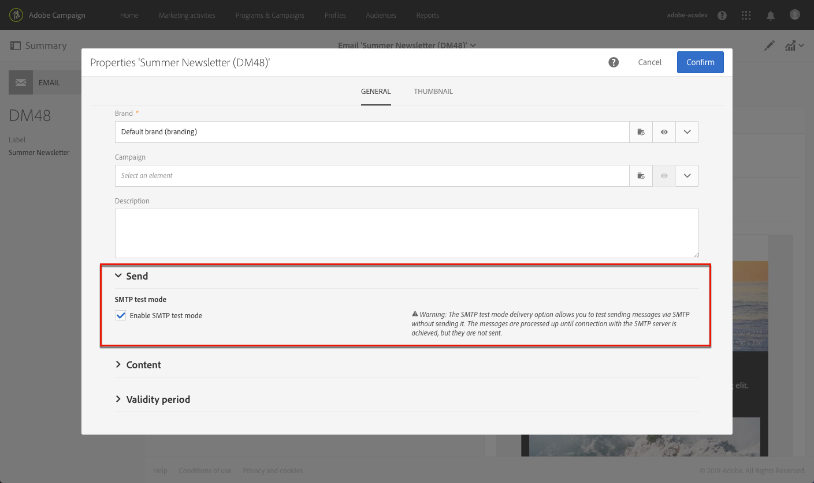

# Configurazione del canale e-mail{#configuring-email-channel}

## Parametri canale e-mail {#email-channel-parameters}

La schermata di configurazione e-mail consente di definire i parametri per il canale e-mail.

* **Parametri di intestazione delle e-mail inviate**

   In questa sezione, puoi specificare l&#39;indirizzo **[!UICONTROL masks]**autorizzato per il mittente e l&#39;indirizzo di errore. Se necessario, queste maschere possono essere separate utilizzando una virgola. Questa configurazione è facoltativa. Quando questi campi vengono immessi, durante la fase di preparazione dei messaggi Adobe Campaign verifica che gli indirizzi immessi siano validi. Questa modalità operativa assicura che non vengano utilizzati indirizzi che possano causare problemi di recapito. Gli indirizzi di consegna devono essere configurati sul server di consegna.

* **Realizzazione**

   Questo ID è fornito dal supporto. È necessario che i rapporti sulla recapito funzionino correttamente.

* **Parametri di consegna**

   Adobe Campaign invia i messaggi a partire dalla data di inizio. Il **[!UICONTROL Message delivery duration]**campo consente di specificare la durata durante la quale i messaggi possono essere inviati.

   Il **[!UICONTROL Online resources validity duration]**campo viene utilizzato per le risorse caricate, principalmente per la pagina mirror e le immagini. Le risorse presenti in questa pagina sono valide per un periodo di tempo limitato (per risparmiare spazio su disco).

* **Tentativi**

   I messaggi temporaneamente non consegnati sono soggetti a un nuovo tentativo automatico. Questa sezione indica quanti tentativi devono essere eseguiti il giorno successivo all’inizio dell’invio (**numero di tentativi**) e il ritardo minimo tra i tentativi (periodo **** tentativi).

   Per impostazione predefinita, cinque tentativi sono pianificati per il primo giorno con un intervallo minimo di un&#39;ora, distribuiti nelle 24 ore del giorno. Un nuovo tentativo al giorno viene programmato dopo tale data e fino alla scadenza della consegna, definita nella **[!UICONTROL Delivery parameters]**sezione.

* **Parametri di quarantena e-mail**

   Nel **[!UICONTROL Time between two significant errors]**campo, immettere un valore per definire l&#39;ora in cui l&#39;applicazione attende prima di incrementare il contatore di errori in caso di errore. Valore predefinito:**&quot;1d&quot;**, per 1 giorno.

   Una volta raggiunto il **[!UICONTROL Maximum number of errors before quarantine]**valore, l&#39;indirizzo e-mail viene quindi messo in quarantena. Valore predefinito:**&quot;5&quot;**: l&#39;indirizzo verrà messo in quarantena al sesto errore. Ciò significa che il contatto sarà automaticamente escluso dalle consegne successive.

**Argomento** correlato:

[Riconoscimento della gestione della quarantena](../../sending/using/understanding-quarantine-management.md)

## Account di routing e-mail {#email-routing-accounts}

L&#39;account **[!UICONTROL Integrated email routing]**esterno è fornito per impostazione predefinita. Contiene i parametri tecnici che consentono all&#39;applicazione di inviare e-mail.

Il tipo di account deve essere sempre impostato su **[!UICONTROL Routing]**, il canale su**[!UICONTROL Email]** e la modalità di consegna impostata su **[!UICONTROL Bulk delivery]**.

**Argomento** correlato:

[Account esterni](../../administration/using/external-accounts.md)

## Regole di elaborazione e-mail {#email-processing-rules}

Queste regole contengono l&#39;elenco di stringhe di caratteri che possono essere restituite dai server remoti e che consentono di qualificare l&#39;errore (**Hard**, **Soft** o **Ignored**).

Le regole predefinite sono le seguenti:

**Messaggi di rimbalzo**

Quando un&#39;e-mail non riesce, il server dei messaggi remoto restituisce un messaggio di errore bounce all&#39;indirizzo specificato nelle impostazioni dell&#39;applicazione. Adobe Campaign confronta il contenuto di ogni messaggio di rimbalzo con le stringhe nell&#39;elenco delle regole, quindi le assegna uno dei tre tipi di errore.

L&#39;utente può creare regole personalizzate.

>[!CAUTION]
>
>Quando importate un pacchetto e aggiornate i dati tramite il flusso di lavoro **Aggiorna per la recapito** , le regole create dall&#39;utente vengono sovrascritte.

**Gestione dei domini e-mail**

Le regole di gestione del dominio vengono utilizzate per regolare il flusso di e-mail in uscita per un dominio specifico. Se necessario, vengono campionati i messaggi di rimbalzo e l’invio di blocchi. Il server di messaggistica di Adobe Campaign applica regole specifiche per i domini, quindi le regole per il caso generale rappresentate da un asterisco nell&#39;elenco delle regole. Le regole per i domini Hotmail e MSN sono disponibili per impostazione predefinita in Adobe Campaign.

Per configurare le regole di gestione del dominio, è sufficiente impostare una soglia e selezionare alcuni parametri SMTP. Una **soglia** è un limite calcolato come percentuale di errore oltre il quale tutti i messaggi verso un dominio specifico vengono bloccati.

Ad esempio, nel caso generale, per un minimo di 300 messaggi, l&#39;invio di e-mail viene bloccato per tre ore se il tasso di errore raggiunge il 90%.

I parametri **** SMTP fungono da filtri applicati per una regola di blocco.

* È possibile scegliere se attivare o meno determinati standard di identificazione e chiavi di crittografia per controllare il nome di dominio, ad esempio **Sender ID**, **DomainKeys**, **DKIM** e **S/MIME**.
* **Relè** SMTP: consente di configurare l’indirizzo IP e la porta di un server di inoltro per un determinato dominio.

**Gestione MX**

Ogni regola definisce una maschera di indirizzo per l&#39;MX. È pertanto ammissibile qualsiasi MX il cui nome corrisponda a questa maschera. La maschera può contenere &quot;*&quot; e &quot;?&quot; caratteri generici.

Ad esempio, i seguenti indirizzi:

* a.mx.yahoo.com
* b.mx.yahoo.com
* c.mx.yahoo.com

sono compatibili con le seguenti maschere:

* *.yahoo.com
* ?.mx.yahoo.com

Queste regole vengono applicate in sequenza: viene applicata la prima regola la cui maschera MX è compatibile con l&#39;MX di destinazione.

Per ogni regola sono disponibili i seguenti parametri:

* **[!UICONTROL Range of IDs]**: questa opzione consente di indicare gli intervalli di identificatori (publicId) per i quali si applica la regola. Potete specificare:

   * Numero: la regola verrà applicata solo a publicId.
   * Un intervallo di numeri (numero1-numero2): la regola verrà applicata a tutti gli publicID tra questi due numeri.
   Se il campo è vuoto, la regola si applica a tutti gli ID.

* **[!UICONTROL Shared]**: questa opzione indica che il numero massimo di messaggi all&#39;ora e di connessioni si applica a tutte le MX collegate a questa regola.
* **[!UICONTROL Maximum number of connections]**: numero massimo di connessioni simultanee a un MX da un dato indirizzo.
* **Numero massimo di messaggi**: numero massimo di messaggi che possono essere inviati da una connessione. Dopo questo valore, la connessione viene chiusa e ne viene riaperta una nuova.
* **[!UICONTROL Messages per hour]**: numero massimo di messaggi che possono essere inviati in un&#39;ora per un MX tramite un dato indirizzo.

>[!CAUTION]
>
>* Se i parametri sono stati modificati, è necessario riavviare il server di consegna (MTA).
>* La modifica o la creazione di regole di gestione è riservata esclusivamente agli utenti esperti.
>

## Elenco delle proprietà delle e-mail {#list-of-email-properties}

In questa sezione viene illustrato l&#39;elenco dei parametri disponibili nella schermata delle proprietà di un modello e-mail o e-mail.

>[!NOTE]
>
>Alcuni parametri sono disponibili solo nei modelli. I parametri a cui potete accedere [dipendono dalle vostre autorizzazioni](../../administration/using/users-management.md).

Per modificare le proprietà di un modello e-mail o e-mail, utilizzate il **[!UICONTROL Edit properties]**pulsante .

### Parametri generali {#general-parameters}

Nella parte superiore della schermata dei parametri e-mail, identificate il messaggio e-mail utilizzando i **[!UICONTROL Label]**campi e**[!UICONTROL ID]** . Queste informazioni vengono visualizzate nell&#39;interfaccia ma non sono visibili ai destinatari del messaggio.

>[!CAUTION]
>
>L&#39;ID deve essere univoco.

Il **[!UICONTROL Brand]**campo consente di selezionare il marchio collegato alla consegna. Per ulteriori informazioni sull’utilizzo e la configurazione dei marchi, consulta la sezione[Branding](../../administration/using/branding.md).

Il **[!UICONTROL Campaign]**campo consente di inserire la campagna collegata al messaggio e-mail.

Potete anche aggiungere un **[!UICONTROL Description]**nel campo corrispondente e modificare l’immagine visualizzata nella miniatura dell’e-mail negli elenchi.

### Invio di parametri {#sending-parameters}

La **[!UICONTROL Send]**sezione è disponibile solo per i modelli e-mail. Contiene i seguenti parametri:

#### Parametri dei tentativi {#retries-parameters}

I messaggi temporaneamente non consegnati sono soggetti a un nuovo tentativo automatico. Questa sezione indica quanti tentativi devono essere eseguiti il giorno successivo all&#39;inizio dell&#39;invio ( **[!UICONTROL Max. number of retries]**) e il ritardo minimo tra i tentativi (**[!UICONTROL Retry period]** ).

Per impostazione predefinita, cinque tentativi sono pianificati per il primo giorno con un intervallo minimo di un&#39;ora, distribuiti nelle 24 ore del giorno. Un nuovo tentativo al giorno viene programmato dopo tale data e fino alla scadenza della consegna, definita nella sezione Parametri [del periodo di](#validity-period-parameters) validità.

Il numero di tentativi può essere modificato a livello globale (contattare l&#39;amministratore tecnico Adobe) o per ogni modello di consegna o consegna

#### Parametri del formato e-mail {#email-format-parameters}

Potete configurare il formato delle e-mail da inviare. Sono disponibili tre opzioni:

* **Usa preferenze** del destinatario (modalità predefinita): il formato del messaggio viene definito in base ai dati memorizzati nel profilo del destinatario e memorizzato per impostazione predefinita nel campo Formato **** e-mail (@emailFormat). Se un destinatario desidera ricevere i messaggi in un determinato formato, si tratta del formato inviato. Se il campo non è completato, viene inviato un messaggio alternativo multiparte (vedi sotto).
* **Consenti al client di posta elettronica destinatario di scegliere il formato più appropriato (alternativa multiparte)**: il messaggio contiene entrambi i formati: text e HTML. Il formato visualizzato in base alla ricezione dipende dalla configurazione del software di posta del destinatario (multipart-alternative).

   >[!CAUTION]
   >
   >Questa opzione include entrambe le versioni del messaggio. Di conseguenza, influisce sulla velocità di consegna, poiché la dimensione del messaggio è maggiore.

* **Invia tutti i messaggi in formato** testo: il messaggio viene inviato in formato testo. Il formato HTML non verrà inviato, ma utilizzato per la pagina mirror solo quando il destinatario fa clic sul collegamento nel messaggio.

#### Modalità di prova SMTP {#smtp-test-mode}

L&#39; **[!UICONTROL Enable SMTP test mode]**opzione consente di verificare l&#39;invio di e-mail tramite una connessione SMTP senza inviare effettivamente i messaggi.
I messaggi vengono elaborati fino al raggiungimento della connessione con il server SMTP, ma non vengono inviati.

Questa opzione è disponibile per i modelli e-mail e e-mail.

Se abilitate l&#39;opzione della modalità di prova SMTP per un modello e-mail, questa opzione sarà attivata per tutti i messaggi e-mail creati da questo modello.

>[!CAUTION]
>
>Quando questa opzione è abilitata per un messaggio e-mail, nessun messaggio verrà inviato finché non viene deselezionato.
>Nel dashboard del modello e-mail o del modello e-mail verrà visualizzato un avviso.

Per ulteriori informazioni sulla configurazione di SMTP, vedere la sezione [Elenco dei parametri](#list-of-email-smtp-parameters) SMTP dell&#39;e-mail.

### Parametri periodo di validità {#validity-period-parameters}

La **[!UICONTROL Validity]**sezione contiene i seguenti parametri:

* **[!UICONTROL Explicitly set validity dates]**: quando questa casella è deselezionata, è necessario immettere una durata nei campi**[!UICONTROL Delivery duration]** e **[!UICONTROL Resource validity limit]**. Selezionare questa casella se si desidera definire date e ore specifiche.
* **[!UICONTROL Delivery duration]**:Adobe Campaign invia i messaggi a partire dalla data di inizio. Questo campo consente di specificare la durata durante la quale i messaggi possono essere inviati.
* **[!UICONTROL Resource validity duration]**: questo campo viene utilizzato per le risorse caricate, principalmente per la pagina mirror e le immagini. Le risorse presenti in questa pagina sono valide per un periodo di tempo limitato (per risparmiare spazio su disco).
* **[!UICONTROL Mirror page management]**: la pagina mirror è una pagina HTML accessibile online tramite un browser Web. Il contenuto è identico al contenuto dell’e-mail. Per impostazione predefinita, la pagina mirror viene generata se il collegamento viene inserito nel contenuto della posta. Questo campo consente di modificare il modo in cui viene generata la pagina:

   >[!CAUTION]
   >
   >È necessario che sia stato definito un contenuto HTML per il messaggio e-mail per la pagina mirror da creare.

   * **[!UICONTROL Generate the mirror page if a mirror link appears in the email content]**(modalità predefinita): la pagina mirror viene generata se il collegamento viene inserito nel contenuto della posta.
   * **Forza la generazione della pagina** mirror: anche se nei messaggi non viene inserito alcun collegamento alla pagina mirror, verrà creata la pagina mirror.
   * **Non generate la pagina** mirror: non viene generata alcuna pagina mirror, anche se il collegamento è presente nei messaggi.
   * **Genera una pagina mirror accessibile solo utilizzando l&#39;ID** messaggio: questa opzione consente di accedere al contenuto della pagina mirror, con informazioni sulla personalizzazione, nella finestra del registro di distribuzione.

>[!NOTE]
>
>I **[!UICONTROL Explicitly set validity dates]**parametri e**[!UICONTROL Delivery duration]** non si applicano ai messaggi transazionali. Per ulteriori informazioni sui messaggi transazionali, consulta [questa sezione](../../channels/using/about-transactional-messaging.md).

### Parametri di tracciamento {#tracking-parameters}

La **[!UICONTROL Tracking]**sezione contiene i seguenti parametri:

* **[!UICONTROL Activate tracking]**: consente di attivare/disattivare il tracciamento URL del messaggio. Per gestire il tracciamento di ciascun URL del messaggio, utilizza l&#39;**[!UICONTROL Links]** icona nella barra delle azioni di Designer e-mail. Consultate [Gli URL](../../designing/using/links.md#about-tracked-urls)tracciati.
* **[!UICONTROL Tracking validity limit]**: consente di definire la durata per la quale verrà attivato il tracciamento sugli URL.
* **[!UICONTROL Substitution URL for expired URLs]**: potete immettere un URL per una pagina Web che verrà visualizzata una volta scaduto il tracciamento.

### Parametri avanzati {#advanced-parameters}

La **[!UICONTROL Advanced parameters]**sezione contiene più parametri.

I primi campi consentono di inserire le informazioni necessarie per elaborare le intestazioni dei messaggi e-mail. È possibile gestire qui l&#39;indirizzo e il testo della risposta, nonché l&#39;indirizzo del mittente (che riempie il campo &quot;Da:&quot;). Queste informazioni possono essere personalizzate.

Fate clic sul pulsante a destra del campo da modificare, quindi aggiungete il campo di personalizzazione, il blocco di contenuto o il testo dinamico.

L&#39;inserimento e l&#39;utilizzo del contenuto di personalizzazione sono descritti dettagliatamente nella documentazione [Personalizzazione del contenuto](../../designing/using/personalization.md) dell&#39;e-mail.

#### Contesto di destinazione {#target-context}

Il contesto di targeting consente di definire un set di tabelle da utilizzare per il targeting delle e-mail (nella schermata di definizione dell&#39;audience) e la personalizzazione (definizione dei campi di personalizzazione nell&#39;editor di contenuti HTML).

#### Routing {#routing}

Questo campo indica la modalità di routing utilizzata. Fa riferimento a un account esterno. Ad esempio, questo può essere utilizzato se desiderate utilizzare un account esterno contenente specifiche configurazioni di branding.

>[!NOTE]
>
>Gli account esterni sono accessibili tramite il menu **Amministrazione** > Impostazioni **** applicazione > Account **** esterni.

#### Preparazione {#preparation}

La preparazione dei messaggi è dettagliata nella sezione [Approvare i messaggi](../../sending/using/preparing-the-send.md) .

* **[!UICONTROL Typology]**: prima di qualsiasi invio, i messaggi devono essere preparati per convalidare il contenuto e la configurazione. Le regole di verifica applicate durante la fase di preparazione sono definite in una** tipologia **. Ad esempio, per le e-mail, la preparazione prevede il controllo dell’oggetto, degli URL e delle immagini, ecc. Selezionare la tipologia da applicare in questo campo.

   >[!NOTE]
   >
   >Le tipologie, a cui è possibile accedere tramite il **[!UICONTROL Administration]**>**[!UICONTROL Channels]** > **[!UICONTROL Typologies]**menu, sono presentate nella sezione[Tipologie](../../administration/using/about-typology-rules.md).

* **[!UICONTROL Compute the label during delivery preparation]**: consente di calcolare il valore dell’etichetta dell’e-mail durante la fase di preparazione dei messaggi utilizzando campi di personalizzazione, blocchi di contenuto e testo dinamico.

   È inoltre possibile personalizzare l&#39;etichetta di consegna con le variabili di evento dichiarate nell&#39;attività del segnale esterno del flusso di lavoro. For more on this, refer to [this section](../../automating/using/calling-a-workflow-with-external-parameters.md).

* **[!UICONTROL Save SQL queries in the log]**: questa opzione consente di aggiungere i registri query SQL nel giornale di registrazione durante la fase di preparazione.

### Elenco dei parametri SMTP dell&#39;e-mail {#list-of-email-smtp-parameters}

La **[!UICONTROL SMTP]**sezione contiene i seguenti parametri:

* **[!UICONTROL Character encoding]**: seleziona la**[!UICONTROL Force encoding]** casella se desideri forzare la codifica dei messaggi, quindi seleziona la codifica da utilizzare.
* **[!UICONTROL Bounce mails]**: per impostazione predefinita, i messaggi di rimbalzo vengono ricevuti nella inbox degli errori della piattaforma (definita in**[!UICONTROL Administration]** > **[!UICONTROL Channels]**>**[!UICONTROL Email]** > **[!UICONTROL Configuration]**schermata). Per definire un indirizzo di errore specifico per un&#39;e-mail, immettete l&#39;indirizzo nel**[!UICONTROL Error address]** campo.
* **[!UICONTROL Additional SMTP headers]**: questa opzione consente di aggiungere intestazioni SMTP aggiuntive ai messaggi. Lo script immesso nel**[!UICONTROL Headers]** campo deve fare riferimento a un&#39;intestazione per riga, sotto forma di **nome:valore**. Se necessario, i valori vengono codificati automaticamente.

   >[!CAUTION]
   >
   >L&#39;aggiunta di uno script per l&#39;inserimento di intestazioni SMTP aggiuntive è riservata agli utenti avanzati. La sintassi di questo script deve essere conforme ai requisiti di questo tipo di contenuto: nessuno spazio inutilizzato, nessuna linea vuota, ecc.

### Elenco dei parametri di autorizzazione di accesso {#list-of-access-authorization-parameters}

La **[!UICONTROL Access authorization]**sezione contiene i seguenti parametri:

* Il **[!UICONTROL Organizational unit]**campo consente di limitare l’accesso a questo messaggio e-mail a determinati utenti. Gli utenti associati all&#39;unità o alle unità padre specificate avranno accesso in lettura e scrittura a questa e-mail. Gli utenti associati alle unità figlie avranno accesso in sola lettura a questo messaggio e-mail.

   >[!NOTE]
   >
   >Potete configurare le unità organizzative dal menu **Amministrazione** > **Utenti e sicurezza** .

* I **[!UICONTROL Created by]**,**[!UICONTROL Created]****[!UICONTROL Modified by]**e**[!UICONTROL Last modified]** i campi vengono completati automaticamente.

## Archiviazione di e-mail {#archiving-emails}

Puoi configurare Adobe Campaign per mantenere una copia dei messaggi e-mail inviati dalla tua piattaforma.

Tuttavia, Adobe Campaign non gestisce i file archiviati. Consente di inviare i messaggi di vostra scelta a un indirizzo dedicato, da dove possono essere elaborati e archiviati utilizzando un sistema esterno.

Quando attivata nel modello di consegna, questa funzione consente di inviare una copia esatta dei messaggi inviati corrispondenti a un indirizzo e-mail CCN (invisibile ai destinatari della consegna) che è necessario specificare.

### Recommendations e limitazioni {#recommendations-and-limitations}

* Questa funzione è facoltativa. Controllare il contratto di licenza e contattare il responsabile commerciale di riferimento per attivarlo.
* È possibile utilizzare un solo indirizzo e-mail CCN.
* Vengono prese in considerazione solo le e-mail inviate correttamente. I rimbalzi non lo sono.
* Per motivi di privacy, le e-mail in CCN devono essere elaborate da un sistema di archiviazione in grado di memorizzare informazioni personali (PII) sicure.
* Quando si crea un nuovo modello di consegna, CCN e-mail non è abilitata per impostazione predefinita, anche se l&#39;opzione è stata acquistata. È necessario attivarlo manualmente in ogni modello di consegna in cui si desidera utilizzarlo.

### Attivazione dell&#39;archiviazione delle e-mail {#activating-email-archiving}

Ccn e-mail è attivato nel modello [di](../../start/using/marketing-activity-templates.md)e-mail tramite un&#39;opzione dedicata:

1. Andate a **Risorse** > **Modelli** > Modelli **di** consegna.
1. Duplica il modello predefinito **[!UICONTROL Send via email]**.
1. Selezionate il modello duplicato.
1. Fate clic sul **[!UICONTROL Edit properties]**pulsante per modificare le proprietà del modello.
1. Expand the **[!UICONTROL Send]**section.
1. Selezionare la **[!UICONTROL Archive emails]**casella per conservare una copia di tutti i messaggi inviati per ogni consegna basata su questo modello.

   

>[!NOTE]
>
>Se le e-mail inviate all&#39;indirizzo CCN vengono aperte e si fa clic su di esse, queste verranno prese in considerazione nell&#39;analisi **[!UICONTROL Total opens]**e**[!UICONTROL Clicks]** dall&#39;analisi di invio, il che potrebbe causare errori di calcolo.
