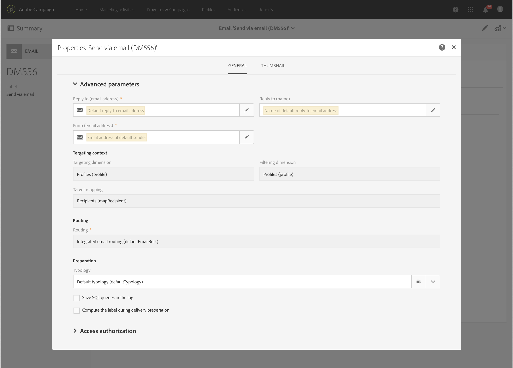

# Configurazione del canale e-mail{#configuring-email-channel}

In qualità di [amministratore](../../administration/using/users-management.md#functional-administrators) di Campaign, puoi effettuare la configurazione delle impostazioni del canale e-mail. Tali impostazioni avanzate includono i parametri generali del canale e-mail, account di indirizzamento e-mail, regole di elaborazione e-mail e proprietà e-mail. In questa pagina imparerai a modificare i valori predefiniti per l’e-mail generale e i parametri di invio.

## Parametri del canale e-mail {#email-channel-parameters}

La schermata di configurazione e-mail consente di definire i parametri per il canale e-mail. Gli amministratori possono accedere a queste configurazioni nel menu **[!UICONTROL Administration]> [!UICONTROL Channels] > [!UICONTROL Email] >[!UICONTROL Configuration]**.

* **Campi delle maschere autorizzate**

   La sezione **[!UICONTROL Header parameters of sent emails]** elenca gli indirizzi e-mail autorizzati che puoi utilizzare per spedire e-mail ai destinatari (indirizzo del mittente) e per consentir loro di inviare risposte automatizzate, quali messaggi non recapitati asincroni, risposte fuori sede e così via (indirizzo di errore). Durante la fase di preparazione dei messaggi, Adobe Campaign verifica che gli indirizzi immessi siano validi. Questa modalità operativa assicura che non vengano utilizzati indirizzi che possono causare problemi di consegna.
   * Sia l’indirizzo del mittente che l’indirizzo di errore sono impostati da Adobe. Questi campi non possono essere vuoti.
   * Non è possibile modificarli. Per aggiornare un indirizzo, contatta il team di Assistenza cliente Adobe.
   * Per aggiungere un altro indirizzo, puoi utilizzare il [Pannello di controllo Campaign](https://experienceleague.adobe.com/docs/control-panel/using/subdomains-and-certificates/setting-up-new-subdomain.html?lang=it) per impostare un nuovo sottodominio o contattare il team di Assistenza cliente di Adobe. Se vengono utilizzate più maschere, saranno separate da virgole.
   * È buona norma impostare gli indirizzi utilizzando un asterisco, ad esempio *@tuodominio.com: ti consente di usare qualsiasi indirizzo che termina con il nome del sottodominio.

* **Consegna**

   L’**[!UICONTROL Delivery reports ID]** è fornito dal team di Assistenza cliente Adobe. Identifica ogni istanza con un ID di consegna che viene utilizzato nei report tecnici di consegna.
   <!--The Technical Deliverability report is not accessible through the UI in ACS. It will be replaced with 250ok in the future (project starting).-->

* **Parametri di consegna**

   Adobe Campaign invia i messaggi a partire dalla data di inizio.

   Il campo **[!UICONTROL Message delivery duration]** consente di specificare l’intervallo di tempo entro il quale verrà ritentato qualsiasi messaggio della consegna che riscontri un errore temporaneo o un messaggio non recapitato.

   >[!IMPORTANT]
   >
   >**Questo parametro adesso viene utilizzato in Campaign solo se è impostato su 3,5 giorni o meno.** Se definisci un valore superiore a 3,5 giorni, questo non verrà preso in considerazione.

   Il campo **[!UICONTROL Online resources validity duration]** viene utilizzato per le risorse caricate, principalmente per la pagina speculare e per le immagini. Le risorse presenti in questa pagina sono valide per un periodo di tempo limitato (per risparmiare spazio su disco).

* **Nuovi tentativi**

   I messaggi temporaneamente non consegnati sono soggetti a un nuovo tentativo automatico. Per ulteriori informazioni, consulta [Tentativi dopo un errore temporaneo di consegna](../../sending/using/understanding-delivery-failures.md#retries-after-a-delivery-temporary-failure).

   >[!IMPORTANT]
   >
   >Il numero massimo di nuovi tentativi da eseguire e il ritardo minimo tra i nuovi tentativi si basano ora sulle prestazioni di un IP sia storicamente che attualmente in un determinato dominio. La **[!UICONTROL Retry period]** e **[!UICONTROL Number of retries]** le impostazioni in Campaign verranno ignorate.

   <!--This section indicates how many retries should be performed the day after the send is started (**Number of retries**) and the minimum delay between retries (**Retry period**). By default, five retries are scheduled for the first day with a minimum interval of one hour, spread out over the 24 hours of the day. One retry per day is programmed after that and until the delivery deadline, which is defined in the **[!UICONTROL Delivery parameters]** section.-->

* **Parametri di quarantena e-mail**

   Nel campo **[!UICONTROL Time between two significant errors]**, immetti un valore per definire il tempo che l’applicazione attende prima di incrementare il contatore degli errori in caso di errore di messaggio non recapitato. Il valore predefinito è **&quot;1d&quot;**, che corrisponde a 1 giorno.

   Una volta raggiunto il valore **[!UICONTROL Maximum number of errors before quarantine]**, l’indirizzo e-mail viene quindi messo in quarantena. Il valore predefinito è **&quot;5&quot;**: l’indirizzo sarà messo in quarantena al quinto errore. Ciò significa che il contatto sarà automaticamente escluso dalle consegne successive.
   <!--Actually the way ACS works is that the address is already on the quarantine list on the first bounce, but with a different status meaning that the error count has started.-->

   Per ulteriori informazioni sulle quarantena, consulta [Informazioni sulla gestione della quarantena](../../sending/using/understanding-quarantine-management.md).

## Account di indirizzamento e-mail {#email-routing-accounts}

L’account esterno **[!UICONTROL Integrated email routing]** è fornito per impostazione predefinita. Contiene i parametri tecnici che consentono all’applicazione di effettuare l’invio di e-mail.

Il tipo di account deve essere sempre impostato su **[!UICONTROL Routing]**, il canale su **[!UICONTROL Email]** e la modalità di consegna su **[!UICONTROL Bulk delivery]**.

**Argomento correlato**:

[Account esterni](../../administration/using/external-accounts.md)

## Regole di elaborazione e-mail {#email-processing-rules}

È possibile accedere alle **[!UICONTROL Email processing rules]** tramite il menu **[!UICONTROL Administration > Channels > Email]**.

>[!IMPORTANT]
>
>I domini e-mail e le regole MX vengono ora gestiti automaticamente<!--by the Adobe Campaign Enhanced MTA (Message Transfer Agent)--> e non può essere modificato.

* **DKIM (DomainKeys Identified Mail)** la firma di autenticazione e-mail viene eseguita per tutti i messaggi con tutti i domini. Non firma con **ID mittente**, **DomainKeys** oppure **S/MIME**.
* Le regole MX personalizzano automaticamente il throughput in base al dominio in base alla reputazione cronologica dell’e-mail e al feedback in tempo reale proveniente dai domini in cui invii e-mail.

<!--Note that the email domains and the MX rules are now managed by the Adobe Campaign Enhanced MTA:
* **DKIM (DomainKeys Identified Mail)** email authentication signing is done by the Enhanced MTA for all messages with all domains. It does not sign with **Sender ID**, **DomainKeys**, or **S/MIME** unless otherwise specified at the Enhanced MTA level.
* The Enhanced MTA uses its own MX rules that allow it to customize your throughput by domain based on your own historical email reputation, and on the real-time feedback coming from the domains where you are sending emails.-->

### Messaggi non recapitati {#bounce-mails}

I messaggi non recapitati asincroni sono ancora qualificati dal processo Campaign inMail attraverso le regole **[!UICONTROL Bounce mails]**.

Tali regole contengono l’elenco di stringhe di caratteri che possono essere restituite dai server remoti e che ti consentono di qualificare l’errore (**Rigido**, **Morbido** o **Ignorato**).

>[!IMPORTANT]
>
>I messaggi di errore di consegna sincroni sono ora qualificati dall’MTA avanzato di Adobe Campaign, che determina il tipo di messaggio non recapitato e la relativa qualifica, e li invia nuovamente a Campaign.

Per ulteriori informazioni sulla qualifica della posta non recapitata, consulta questa [sezione](../../sending/using/understanding-delivery-failures.md#bounce-mail-qualification).

<!--Because they are now managed by the Enhanced MTA, the bounce qualifications in the Campaign **[!UICONTROL Message qualification]** table are no longer used. For more on bounce mail qualification, see this [section](../../sending/using/understanding-delivery-failures.md#bounce-mail-qualification).

### Management of email domains {#managing-email-domains}

The email domains are now managed by the Adobe Campaign Enhanced MTA. The Adobe Campaign **[!UICONTROL Domain management]** rules are no longer used.

**DKIM (DomainKeys Identified Mail)** email authentication signing is done by the Enhanced MTA for all messages with all domains. It does not sign with **Sender ID**, **DomainKeys**, or **S/MIME** unless otherwise specified at the Enhanced MTA level.

### MX management {#mx-management}

The MX rules are now managed by the Adobe Campaign Enhanced MTA. The Adobe Campaign **[!UICONTROL MX management]** delivery throughput rules are no longer used.

The Enhanced MTA uses its own MX rules that allow it to customize your throughput by domain based on your own historical email reputation, and on the real-time feedback coming from the domains where you are sending emails.-->

## Elenco delle proprietà delle e-mail {#list-of-email-properties}

In questa sezione viene illustrato l’elenco dei parametri disponibili nella schermata delle proprietà di un e-mail o di un modello e-mail.

>[!NOTE]
>
>Alcuni parametri sono disponibili solo nei modelli. I parametri a cui puoi accedere [dipendono dalle tue autorizzazioni](../../administration/using/users-management.md).

Per modificare le proprietà di un e-mail o di un modello e-mail, utilizza il pulsante **[!UICONTROL Edit properties]**.

### Parametri generali {#general-parameters}

Nella parte superiore della schermata dei parametri e-mail, identifica il messaggio e-mail utilizzando i campi **[!UICONTROL Label]** e **[!UICONTROL ID]**. Queste informazioni vengono visualizzate nell’interfaccia ma non sono visibili ai destinatari del messaggio.

>[!IMPORTANT]
>
>L’ID deve essere univoco.

Il campo **[!UICONTROL Brand]** ti consente di selezionare il brand collegato alla consegna. Per ulteriori informazioni sull’utilizzo e sulla configurazione dei brand, consulta la sezione [Branding](../../administration/using/branding.md).

Il campo **[!UICONTROL Campaign]** consente di inserire la campagna collegata all’e-mail.

Puoi anche aggiungere una **[!UICONTROL Description]** nel campo corrispondente e modificare l’immagine visualizzata nella miniatura dell’e-mail negli elenchi.

### Parametri di invio {#sending-parameters}

La sezione **[!UICONTROL Send]** è disponibile solo per i modelli e-mail. Contiene i seguenti parametri:

#### Parametri dei nuovi tentativi {#retries-parameters}

I messaggi temporaneamente non consegnati sono soggetti a un nuovo tentativo automatico. Per ulteriori informazioni, consulta [Tentativi dopo un errore temporaneo di consegna](../../sending/using/understanding-delivery-failures.md#retries-after-a-delivery-temporary-failure).

>[!IMPORTANT]
>
>Il ritardo minimo tra i nuovi tentativi e il numero massimo di tentativi da eseguire ora si basa sulle prestazioni di un IP sia storicamente che attualmente in un determinato dominio. La **[!UICONTROL Retry period]** e **[!UICONTROL Max. number of retries]** le impostazioni in Campaign verranno ignorate.

L’**impostazione della durata di consegna** (definita nella sezione [Parametri del periodo di validità](#validity-period-parameters)) **configurata in Campaign continuerà a essere rispettata, ma solo fino a 3,5 giorni**. A questo punto, tutti i messaggi nella coda dei nuovi tentativi verranno rimossi e reinviati come messaggi non recapitati. Per ulteriori informazioni sugli errori di consegna, consulta questa [sezione](../../sending/using/understanding-delivery-failures.md#about-delivery-failures).

#### Parametri del formato e-mail {#email-format-parameters}

Puoi configurare il formato delle e-mail da inviare. Sono disponibili tre opzioni:

* **Use recipient preferences** (modalità predefinita): il formato del messaggio viene definito in base ai dati memorizzati nel profilo del destinatario e poi memorizzato per impostazione predefinita nel campo **Email format** (@emailFormat). Se un destinatario desidera ricevere i messaggi in un determinato formato, questo sarà il formato inviato. Se il campo non è completato, viene inviato un messaggio multipart-alternative (vedi sotto).
* **Let recipient mail client choose the most appropriate format (multipart-alternative)**: il messaggio contiene entrambi i formati: testo e HTML. Il formato visualizzato in base alla ricezione dipende dalla configurazione del software di posta del destinatario (multipart-alternative).

   >[!IMPORTANT]
   >
   >Questa opzione include entrambe le versioni del messaggio. Di conseguenza, influisce sulla velocità effettiva di consegna, poiché la dimensione del messaggio è maggiore.

* **Send all messages in text format**: il messaggio viene inviato in formato testo. Il formato HTML non verrà inviato, ma sarà utilizzato per la pagina speculare solo quando il destinatario farà clic sul collegamento nel messaggio.

#### Modalità di prova SMTP {#smtp-test-mode}

L’opzione **[!UICONTROL Enable SMTP test mode]** consente di verificare l’invio di e-mail tramite una connessione SMTP, senza inviare effettivamente i messaggi.
I messaggi vengono elaborati fino a che non si stabilisce la connessione con il server SMTP, ma non ne viene eseguito l’invio.

Questa opzione è disponibile per le e-mail e per i modelli e-mail.

Se abiliti l’opzione della modalità di prova SMTP per un modello e-mail, questa opzione sarà attivata per tutti i messaggi e-mail creati da questo modello.

>[!IMPORTANT]
>
>Quando questa opzione è abilitata per un’e-mail, nessun messaggio verrà inviato finché non viene deselezionato.
>Nell’e-mail o nel dashboard del modello e-mail verrà visualizzato un avviso.

Per ulteriori informazioni sulla configurazione di SMTP, consulta la sezione [Elenco dei parametri SMTP dell’e-mail](#list-of-email-smtp-parameters).

### Parametri del periodo di validità {#validity-period-parameters}

La sezione **[!UICONTROL Validity period]** contiene i seguenti parametri:

* **[!UICONTROL Explicitly set validity dates]**: quando questa casella è deselezionata, è necessario inserire una durata nei campi **[!UICONTROL Delivery duration]** e **[!UICONTROL Resource validity limit]**.

   Se desideri date e ore specifiche, seleziona questa casella.

   

* **[!UICONTROL Delivery duration]**/**[!UICONTROL Validity limit for sending messages]**: Adobe Campaign invia i messaggi a partire dalla data di inizio. Questo campo consente di specificare la durata nel corso della quale è possibile inviare i messaggi.

   >[!IMPORTANT]
   >
   >**È necessario definire un valore fino a 3,5 giorni.** Se imposti un valore superiore a 3,5 giorni, non verrà preso in considerazione.

* **[!UICONTROL Resource validity duration]**/**[!UICONTROL Validity limit date for resources]**: questo campo viene utilizzato per le risorse caricate, principalmente per la pagina speculare e per le immagini. Le risorse presenti in questa pagina sono valide per un periodo di tempo limitato (per risparmiare spazio su disco).
* **[!UICONTROL Mirror page management]**: la pagina speculare è una pagina HTML accessibile online tramite un browser web. Il contenuto è identico a quello dell’e-mail. Per impostazione predefinita, la pagina speculare viene generata se il collegamento viene inserito nel contenuto della posta. Questo campo ti consente di modificare la modalità di generazione della pagina:

   >[!IMPORTANT]
   >
   >Per poter creare la pagina speculare, il contenuto HTML deve essere stato definito per l’e-mail.

   * **[!UICONTROL Generate the mirror page if a mirror link appears in the email content]** (modalità predefinita): la pagina speculare viene generata se il collegamento viene inserito nel contenuto della posta.
   * **Force the generation of the mirror page**: anche se nei messaggi non viene inserito alcun collegamento alla pagina speculare, la pagina verrà creata ugualmente.
   * **Do not generate the mirror page**: non viene creata alcuna pagina speculare, anche se il collegamento è presente nei messaggi.
   * **Generate a mirror page accessible using only the message ID**: questa opzione consente di accedere al contenuto della pagina speculare, con le informazioni sulla personalizzazione riportate nella finestra del registro di consegna.

>[!NOTE]
>
>Il parametro **[!UICONTROL Delivery duration]** non si applica ai messaggi sulle transazioni. Per ulteriori informazioni sulla messaggistica transazionale, consulta [questa sezione](../../channels/using/getting-started-with-transactional-msg.md).

### Parametri di tracciamento {#tracking-parameters}

La sezione **[!UICONTROL Tracking]** contiene i seguenti parametri:

* **[!UICONTROL Activate tracking]**: consente di attivare/disattivare il tracciamento URL del messaggio. Per gestire il tracciamento di ciascun URL del messaggio, utilizza l’icona **[!UICONTROL Links]** nella barra delle azioni di E-mail Designer. Consulta la sezione [Informazioni sugli URL tracciati](../../designing/using/links.md#about-tracked-urls).
* **[!UICONTROL Tracking validity limit]**: consente di definire la durata per la quale verrà attivato il tracciamento sugli URL.
* **[!UICONTROL Substitution URL for expired URLs]**: puoi immettere un URL per una pagina web che verrà visualizzata alla scadenza del tracciamento.
* **[!UICONTROL Use tracking pixel at the top of email]**: consente di spostare il pixel di tracciamento nella parte superiore dell’e-mail invece che nella parte inferiore.

### Parametri avanzati {#advanced-parameters}

La sezione **[!UICONTROL Advanced parameters]** contiene più parametri.

I primi campi consentono di inserire le informazioni necessarie per l’elaborazione delle intestazioni dei messaggi e-mail. Qui puoi gestire l’indirizzo e il testo della risposta, nonché l’indirizzo del mittente, che riempie il campo &quot;Da:&quot;. Queste informazioni possono essere personalizzate.

Fai clic sul pulsante a destra del campo da modificare, quindi aggiungi il campo di personalizzazione, il blocco di contenuto o il testo dinamico.

L’inserimento e l’utilizzo del contenuto di personalizzazione sono descritti in modo dettagliato nella documentazione [Personalizzazione del contenuto dell’e-mail](../../designing/using/personalization.md).

#### Contesto del target {#target-context}

Il contesto di targeting ti permette di definire un set di tabelle da utilizzare per il targeting delle e-mail (nella schermata di definizione del pubblico) e per la personalizzazione (impostazione dei campi di personalizzazione nell’editor di contenuti HTML).

#### Indirizzamento {#routing}

Questo campo indica la modalità di indirizzamento utilizzata. Fa riferimento a un account esterno. Ad esempio, può essere utilizzato se desideri ricorrere a un account esterno contenente configurazioni di branding specifiche.

>[!NOTE]
>
>Gli account esterni sono accessibili tramite il menu **Administration** > **Application settings** > **External accounts**.

#### Preparazione {#preparation}

La preparazione dei messaggi è spiegata nel dettaglio nella sezione [Approvazione dei messaggi](../../sending/using/preparing-the-send.md).

* **[!UICONTROL Typology]**: prima di qualsiasi invio, i messaggi devono essere preparati al fine di convalidarne il contenuto e la configurazione. Le regole di verifica applicate durante la fase di preparazione sono definite in una **tipologia**. Ad esempio, per le e-mail, la preparazione prevede il controllo dell’oggetto, degli URL e delle immagini e così via. Seleziona la tipologia da applicare in questo campo.

   >[!NOTE]
   >
   >Le tipologie, accessibili tramite il menu **[!UICONTROL Administration]** > **[!UICONTROL Channels]** > **[!UICONTROL Typologies]**, sono presentate in [questa sezione](../../sending/using/about-typology-rules.md).

* **[!UICONTROL Compute the label during delivery preparation]**: consente di calcolare il valore dell’etichetta dell’e-mail durante la fase di preparazione dei messaggi tramite campi di personalizzazione, blocchi di contenuto e testo dinamico.

   È inoltre possibile personalizzare l’etichetta di consegna con le variabili evento dichiarate nell’attività del segnale esterno del flusso di lavoro. Per ulteriori informazioni, consulta [questa sezione](../../automating/using/calling-a-workflow-with-external-parameters.md).

* **[!UICONTROL Save SQL queries in the log]**: questa opzione consente di aggiungere i registri di query SQL nel giornale di registrazione durante la fase di preparazione.

#### Impostazioni di bozza {#proof-settings}

Questa sezione consente di configurare il prefisso predefinito da utilizzare nella riga dell’oggetto della bozza. Per ulteriori informazioni, consulta [questa sezione](../../sending/using/sending-proofs.md).

### Elenco dei parametri SMTP dell’e-mail {#list-of-email-smtp-parameters}

La sezione **[!UICONTROL SMTP]** contiene i seguenti parametri:

* **[!UICONTROL Character encoding]**: seleziona la casella **[!UICONTROL Force encoding]** per forzare la codifica dei messaggi, quindi scegli la codifica da utilizzare.
* **[!UICONTROL Bounce mails]**: per impostazione predefinita, i messaggi non recapitati vengono ricevuti nella casella in entrata degli errori della piattaforma (definita nella schermata **[!UICONTROL Administration]** > **[!UICONTROL Channels]** > **[!UICONTROL Email]** > **[!UICONTROL Configuration]**). Per impostare un indirizzo di errore specifico per un’e-mail, inseriscilo nel campo **[!UICONTROL Error address]**.
* **[!UICONTROL Additional SMTP headers]**: questa opzione ti consente di aggiungere ai messaggi le intestazioni SMTP aggiuntive. Lo script immesso nel campo **[!UICONTROL Headers]** deve fare riferimento a un’intestazione per riga, nella forma di **nome:valore**. Se necessario, i valori vengono codificati automaticamente.

   >[!IMPORTANT]
   >
   >L’aggiunta di uno script per l’inserimento di intestazioni SMTP aggiuntive è un’operazione riservata agli utenti avanzati. La sintassi di questo script deve essere conforme ai requisiti di questo tipo di contenuto: nessuno spazio inutilizzato, nessuna linea vuota e così via.

### Elenco dei parametri di autorizzazione di accesso {#list-of-access-authorization-parameters}

La sezione **[!UICONTROL Access authorization]** contiene i seguenti parametri:

* Il campo **[!UICONTROL Organizational unit]** consente di limitare l’accesso a questo messaggio e-mail a determinati utenti. Gli utenti associati all’unità o alle unità principali specificate avranno accesso in lettura e scrittura a questa e-mail. Gli utenti associati alle unità secondarie avranno accesso in sola lettura a questa e-mail.

   >[!NOTE]
   >
   >Puoi configurare le unità organizzative dal menu **Administration** > **Users &amp; Security**.

* I campi **[!UICONTROL Created by]**, **[!UICONTROL Created]**, **[!UICONTROL Modified by]** e **[!UICONTROL Last modified]** vengono completati automaticamente.

## Impostazioni legacy {#legacy-settings}

Se sei **NOT** se esegui la versione più recente di Campaign, i parametri e le sezioni di interfaccia descritte di seguito restano applicabili.

### Nuovi tentativi {#legacy-retries}

La **[!UICONTROL Retries]** nelle impostazioni [Menu Configurazione](#email-channel-parameters) e [Parametri di invio](#retries-parameters) delle proprietà e-mail indicano quanti tentativi devono essere eseguiti il giorno successivo all’inizio dell’invio (**[!UICONTROL Number of retries]** / **[!UICONTROL Max. number of retries]**) e il ritardo minimo tra i tentativi (**[!UICONTROL Retry period]**).

Il numero di tentativi può essere modificato a livello globale (contatta l’amministratore tecnico di Adobe) o per ogni consegna o modello di consegna.

Per impostazione predefinita, sono pianificati cinque tentativi per il primo giorno con un intervallo minimo di un’ora, distribuiti nelle 24 ore del giorno. Un nuovo tentativo al giorno viene programmato dopo e fino alla scadenza della consegna, che è definita a livello globale nel **[!UICONTROL Delivery parameters]** della sezione **[!UICONTROL Configuration]** o **[!UICONTROL Validity period]** a livello di consegna (consulta la sezione [Durata della consegna](#legacy-delivery-duration) sezione seguente).

### Durata della consegna {#legacy-delivery-duration}

La **[!UICONTROL Message delivery duration]** nel [Menu Configurazione](#email-channel-parameters) consente di specificare l’intervallo di tempo entro il quale verrà ritentato qualsiasi messaggio nella consegna che riscontri un errore temporaneo o un messaggio non recapitato.

La **[!UICONTROL Delivery duration]** o **[!UICONTROL Validity limit for sending messages]** nel [Parametri del periodo di validità](#validity-period-parameters) consente di specificare la durata durante la quale i messaggi possono essere inviati.

### Regole di elaborazione e-mail {#legacy-email-processing-rules}

La **[!UICONTROL MX management]**, **[!UICONTROL Bounce mails]** e **[!UICONTROL Domain management]** è possibile accedere alle regole e modificarle dagli amministratori tramite **[!UICONTROL Administration > Channels > Email > Email processing rules]** [menu](#email-processing-rules).

### Qualificazione di mail non recapitate {#legacy-bounce-mail-qualification}

Per elencare i vari rimbalzi e i relativi tipi di errore e motivi, fai clic sul pulsante **Adobe** , in alto a sinistra, quindi seleziona **[!UICONTROL Administration > Channels > Quarantines > Message qualification]**.

I rimbalzi possono avere i seguenti stati di qualifica:

* **[!UICONTROL To qualify]**: la mail non recapitata deve essere qualificata. Per garantire il corretto funzionamento del recapito messaggi della piattaforma, il team di Adobe Deliverability deve qualificarsi. Se non è qualificato, la posta non recapitata non viene utilizzata per arricchire l’elenco delle regole di elaborazione delle e-mail.
* **[!UICONTROL Keep]**: la mail non recapitata è stata qualificata e verrà utilizzata dal **Aggiornamento per il recapito messaggi** da confrontare con le regole di elaborazione e-mail esistenti e arricchire l’elenco.
* **[!UICONTROL Ignore]**: la mail non recapitata è stata qualificata ma non verrà utilizzata dal **Aggiornamento per il recapito messaggi** workflow. Quindi non verrà inviato alle istanze client.

>[!NOTE]
>
>In caso di interruzione di un ISP, le e-mail inviate tramite Campaign verranno erroneamente contrassegnate come mancate consegne. Per correggere questo problema, è necessario aggiornare la qualifica di mancato recapito. Per ulteriori informazioni, consulta [questa pagina](../../administration/using/update-bounce-qualification.md).

<!--Bounces are qualified through the **[!UICONTROL Bounce mails]** processing rule. For more on accessing this rule, refer to this [section](#legacy-bounce-mail-qualification).-->

### Segnalazione indicatore recapitato {#legacy-delivered-status-report}

In **[!UICONTROL Summary]** visualizzazione di ogni messaggio, **[!UICONTROL Delivered]** percentuale aumenterà progressivamente durante tutto il periodo di validità della consegna, in quanto vengono segnalati i rimbalzi morbidi e duri.

I messaggi di rimbalzo morbido verranno visualizzati come **[!UICONTROL Failed]** dopo il primo giorno della consegna, e saranno riprovati in ogni giorno aggiuntivo del periodo di validità per la consegna.
