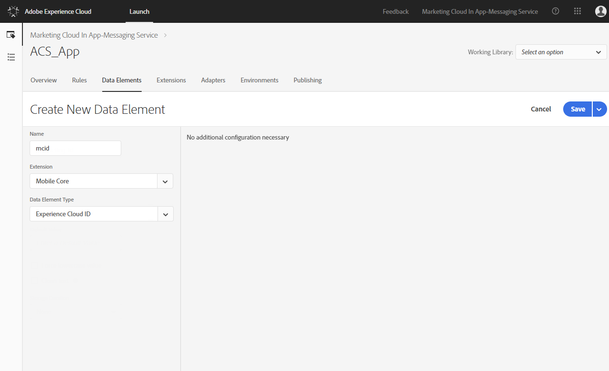

# Configurazione delle regole di Launch per supportare  casi di utilizzo di Adobe Campaign Standard {#configuring-rules-launch}

In [!DNL Adobe Experience Platform Launch], devi creare elementi di dati e regole per inviare dati PII e altri dati dalle applicazioni mobili a [!DNL Adobe Campaign Standard].

Per assicurarsi che tutte le modifiche alla configurazione [!DNL Adobe Experience Platform Launch] abbiano effetto, è necessario pubblicare tali modifiche. Per ulteriori informazioni, consultate [Pubblicazione](https://aep-sdks.gitbook.io/docs/getting-started/create-a-mobile-property#publish-the-configuration).

Per creare le regole in [!DNL Experience Platform Launch], procedere come segue:

1. [Creazione di elementi di dati](../../administration/using/configuring-rules-launch.md#create-data-elements)
2. [Creazione di regole](../../administration/using/configuring-rules-launch.md#create-data-elements) per i casi di utilizzo da supportare:
   * [Postback PII](../../administration/using/configuring-rules-launch.md#pii-postback)
   * [Postback per tracciamento in-app](../../administration/using/configuring-rules-launch.md#inapp-tracking-postback)
   * [Post-back di tracciamento delle notifiche push](../../administration/using/configuring-rules-launch.md#push-tracking-postback)
   * [Postback posizione](../../administration/using/configuring-rules-launch.md#location-postback)

## Creazione di elementi di dati {#create-data-elements}

Ecco gli elementi di dati che consigliamo di creare in [!DNL Experience Platform Launch].
Puoi creare elementi di dati aggiuntivi in base alle tue esigenze.

* **[!UICONTROL Experience Cloud ID]**
* **[!UICONTROL Pkey]**
* **[!UICONTROL Campaign server]**

Per creare i seguenti elementi di dati:

1. In [!DNL Experience Platform Launch], dal dashboard delle applicazioni mobili, fai clic sulla **[!UICONTROL Data Elements]** scheda.

1. Per creare l&#39;elemento **[!UICONTROL Experience Cloud ID]** dati, fare clic su **[!UICONTROL Create New Data Element]**.

1. Nel **[!UICONTROL Name]** campo, ad esempio, digitare **mcid**.

1. Dall’ **[!UICONTROL Extension]** elenco a discesa, selezionate **[!UICONTROL Mobile Core]**. Quindi **[!UICONTROL Experience Cloud ID]** nell&#39;elenco a discesa **[!UICONTROL Data element]** Tipo.

   

1. Per creare l’elemento dati Pkey, fate clic su **[!UICONTROL Add data element]**.

1. Nel **[!UICONTROL Name]** campo, ad esempio, digitare **key**.

1. Dall’ **[!UICONTROL Extension]** elenco a discesa, selezionate **[!UICONTROL Adobe Campaign Standard]**. Quindi **[!UICONTROL pkey]** nell&#39;elenco a discesa **[!UICONTROL Data element]** Tipo.

1. Per creare l&#39;elemento dati del server Campaign, fai clic su **[!UICONTROL Add data element]**.

1. Nel **[!UICONTROL Name]** campo, digitate un nome, ad esempio **campeggio-server**.

1. Dall’ **[!UICONTROL Extension]** elenco a discesa, selezionate **[!UICONTROL Adobe Campaign Standard]**. Quindi, **[!UICONTROL Campaign Server]** nel menu a discesa **[!UICONTROL Data element]** Tipo.

## Creazione di regole {#creating-rules}

È necessario creare regole per i seguenti elementi:

* [Postback PII](../../administration/using/configuring-rules-launch.md#pii-postback)
* [Postback per tracciamento in-app](../../administration/using/configuring-rules-launch.md#inapp-tracking-postback)
* [Post-back di tracciamento delle notifiche push](../../administration/using/configuring-rules-launch.md#push-tracking-postback)
* [Postback posizione](../../administration/using/configuring-rules-launch.md#location-postback)

### Postback PII {#pii-postback}

>[!NOTE]
>
>Per inviare informazioni PII da un&#39;app mobile a  Adobe Campaign, devi implementare un&#39;API SDK. Per ulteriori informazioni, vedere [CollectPII](https://aep-sdks.gitbook.io/docs/using-mobile-extensions/mobile-core/mobile-core-api-reference#collect-pii).

Per inviare dati PII a [!DNL Adobe Campaign Standard], crea una regola in [!DNL Experience Platform Launch]:

1. In [!DNL Experience Platform Launch], dal dashboard dell’applicazione mobile, fai clic sulla **[!UICONTROL Rules]** scheda e quindi **[!UICONTROL Create New Rule]**.

1. Digitate un nome, ad esempio, **Mobile Core - Raccoglie PII**.

1. In the **[!UICONTROL Events]** section, click **[!UICONTROL Add]**.

1. Dall’ **[!UICONTROL Extension]** elenco a discesa, selezionate **[!UICONTROL Mobile Core]**. Quindi, **[!UICONTROL Collect PII]** nell&#39; **[!UICONTROL Event type]** elenco a discesa.

1. Fai clic su **[!UICONTROL Keep changes]**.

1. In the **[!UICONTROL Actions]** section, click **[!UICONTROL Add]**.

1. Dall’ **[!UICONTROL Extension]** elenco a discesa, selezionate **[!UICONTROL Mobile Core]**. Quindi, **[!UICONTROL Send PII]** nell&#39; **[!UICONTROL Action type]** elenco a discesa.

1. In **[!UICONTROL URL]**, immettete il seguente URL:

   ```
   https://{%%camp-server%%}/rest/head/mobileAppV5/{%%pkey%%}/subscriptions/{%%mcid%%}
   ```

1. Selezionare la **[!UICONTROL Add Post Body]** casella di controllo.

1. In **[!UICONTROL Post Body]**, digitate quanto segue:

   ```
   {
   "marketingCloudId":
   "{%%mcid%%}",
   "cusEmail":
   "",
   "cusFirstName":
   "",
   "cusLastName":
   "" }
   ```

   MarketingCloudId consente di riconciliare gli abbonati all&#39;app con i destinatari nel database e, di conseguenza, è necessario. Puoi specificare altre coppie chiave-valore in base alle tue esigenze aziendali. Nell&#39;esempio precedente, dall&#39;app vengono passati e-mail, nome e cognome.

   Le chiavi (ad esempio cusEmail, cusFirstName e cusLastName) devono corrispondere agli ID campo definiti nella risorsa personalizzata nell&#39;istanza di Adobe Campaign Standard . Le variabili del valore (ad esempio email, firstName e LastName) devono corrispondere alle chiavi nei dati JSON inviati dall’app mobile mentre richiamano l’API AMS collectPII dal codice dell’app.

   Potete anche trasmettere i dati del ciclo di vita nel postback Collect PII o in un postback diverso a seconda delle attivazioni dell’evento. di seguito è riportato un esempio del JSON dei dati del ciclo di vita:

   ```
   {
   "marketingCloudId":"{%%mcid%%}",
   "cusDayslastlaunch": "{%%DaysSinceLastUse%%}", 
   "cusDaysfirstlaunch": "{%%DaysSinceFirstUse%%}", 
   "cusLaunches": "{%%Launches%%}"
   }
   ```

   Gli elementi dati definiti in [!DNL Experience Platform Launch] devono essere racchiusi in due percentuali, ad esempio %%mcid%%, e le variabili di contesto dell&#39;app devono essere racchiuse in singole percentuali, ad esempio %contextdata.email%.

1. In **[!UICONTROL Content Type]**, digitate **application/json**.

1. In **[!UICONTROL Timeout]**, select 0.

   

I dati utente sono ora configurati per essere inviati a Campaign.

### Postback per tracciamento in-app {#inapp-tracking-postback}

Per inviare i dati di tracciamento [!DNL Adobe Campaign Standard] per segnalare il modo in cui gli utenti interagiscono con i messaggi in-app nell&#39;applicazione mobile, crea la seguente regola in [!DNL Experience Platform Launch]:

1. In [!DNL Experience Platform Launch], dal dashboard delle applicazioni mobili, seleziona la **[!UICONTROL Rules]** scheda e fai clic su **[!UICONTROL Add Rule]**.

1. Digitate un nome, ad esempio, **Adobe Campaign - Tracciamento** clic in-app.

1. In the **[!UICONTROL Events]** section, click **[!UICONTROL Add]**.

1. Dall’ **[!UICONTROL Extension]** elenco a discesa, selezionate **[!UICONTROL Adobe Campaign Standard]**. Quindi, **[!UICONTROL In-App click tracking]** nell&#39; **[!UICONTROL Event type]** elenco a discesa.

1. Fai clic su **[!UICONTROL Keep changes]**.

1. In the **[!UICONTROL Actions]** section, click **[!UICONTROL Add]**.

1. Dall’ **[!UICONTROL Extension]** elenco a discesa, selezionate **[!UICONTROL Mobile Core]**. Quindi, **[!UICONTROL Send postback]** nell&#39; **[!UICONTROL Event type]** elenco a discesa.

1. In **[!UICONTROL URL]**, digitate il seguente URL:

   ```
   https://{%%camp-server%%}/r/?id=&mcid={%%mcid%%}
   ```

1. Selezionare la **[!UICONTROL Add post body]** casella di controllo.

1. In **[!UICONTROL Post Body]**, digita **{}**.

1. In **[!UICONTROL Content Type]**, digitate **application/json**.

1. In **[!UICONTROL Timeout]**, select 0.

   

### Post-back di tracciamento delle notifiche push {#push-tracking-postback}

Per inviare i dati di tracciamento a [!DNL Adobe Campaign Standard], in modo da tenere traccia delle consegne delle notifiche push e dell&#39;interazione degli utenti con l&#39;applicazione mobile, è necessario creare una regola in [!DNL Experience Platform Launch].

Per ulteriori informazioni sul tracciamento push, consulta Tracciamento [](../../administration/using/push-tracking.md)push.

Per tracciare le azioni dell&#39;app, usa l&#39;API trackAction. Per ulteriori informazioni, vedi [Tracciare le azioni](https://app.gitbook.com/@aep-sdks/s/docs/using-mobile-extensions/mobile-core/mobile-core-api-reference#track-app-actions)dell&#39;app.

1. In [!DNL Experience Platform Launch], dal dashboard delle applicazioni mobili, fai clic sulla **[!UICONTROL Rules]** scheda e fai clic su **[!UICONTROL Add Rule]**.

1. Digitate un nome, ad esempio, **Adobe Campaign - tracciamento** dei clic push.

1. In the **[!UICONTROL Events]** section, click **[!UICONTROL Add]**.

1. Dall’ **[!UICONTROL Extension]** elenco a discesa, selezionate **[!UICONTROL Mobile Core]**. Quindi, **[!UICONTROL Track Action]** nell&#39; **[!UICONTROL Event type]** elenco a discesa.

1. Dal **[!UICONTROL Action]** menu a discesa, seleziona **[!UICONTROL Action]**, seleziona **[!UICONTROL equals]** e digita **tracciamento**.

1. Fai clic su **[!UICONTROL Keep changes]**. Quindi, nella **[!UICONTROL Actions]** sezione, fate clic su **[!UICONTROL Add]**.

1. Dall’ **[!UICONTROL Extension]** elenco a discesa, selezionate **[!UICONTROL Mobile Core]**. Quindi, **[!UICONTROL Send postback]** nell&#39; **[!UICONTROL Action type]** elenco a discesa.

1. In **[!UICONTROL URL]**, immettete il seguente URL:

   ```
   https://{%%camp-server%%}/r/?id=,,&mcId={%%mcid%%}
   ```

1. Selezionare la **[!UICONTROL Add post body]** casella di controllo.

1. Aggiungi il corpo del post, ad esempio { }.

1. In **[!UICONTROL Content Type]**, digitate **application/json**.

1. In **[!UICONTROL Timeout]**, select 0.

### Postback posizione {#location-postback}

1. In [!DNL Experience Platform Launch], dal dashboard delle applicazioni mobili, fai clic sulla **[!UICONTROL Rules]** scheda e fai clic su **[!UICONTROL Add Rule]**.

1. Digitate un nome, ad esempio **Posizione postback**.

1. In the **[!UICONTROL Events]** section, click **[!UICONTROL Add]**.

1. Create un evento, ad esempio, Enter POI o Exit POI. Dall&#39; **[!UICONTROL Extension]** elenco a discesa, selezionate **Luoghi - Beta**. Quindi, **immettete POI** o **Esci dal POI** nell’ **[!UICONTROL Event type]** elenco a discesa.

1. Inserite un nome, ad esempio **Luoghi - Beta - Immettete POI** o **Esci POI**.

1. In the **[!UICONTROL Actions]** section, click **[!UICONTROL Add]**.

1. Dall’ **[!UICONTROL Extension]** elenco a discesa, selezionate **[!UICONTROL Mobile Core]**. Quindi, **[!UICONTROL Send postback]** dal **[!UICONTROL Action type]** menu a discesa.

1. Inserite un nome, ad esempio, **Mobile Core - Invia postback** posizione.

1. In **[!UICONTROL URL]**, immettete il seguente URL:

   ```
   https://{%%camp-server%%}/rest/head/mobileAppV5/{%%pkey%%}/locations/
   ```

1. Selezionate la **[!UICONTROL Add post body]** casella di controllo e aggiungete il corpo del post, ad esempio:

   ```
   {
   "locationData": {
       "distances": "{%%Distance%%}",
       "poiLabel": "{%%POILabel%%}",
       "latitude": "{%%Latitude%%}",
       "longitude": "{%%Longitude%%}",
       "appId": "{%%AppId%%}",
       "marketingCloudId": "{%%ECID%%}"
   }
   }
   ```

   >[!NOTE]
   >
   >Nell&#39;esempio precedente, gli elementi di dati sul lato destro devono essere configurati in [!DNL Experience Platform Launch] sfruttando i passaggi descritti nella sezione [Creazione di elementi](../../administration/using/configuring-rules-launch.md#create-data-elements)di dati. Gli elementi di dati sul lato sinistro sono supportati in [!DNL Adobe Campaign Standard] e non richiedono alcuna configurazione. Se sono necessari dati aggiuntivi, è necessario eseguire estensioni di risorse personalizzate in [!DNL Adobe Campaign Standard].

1. In **[!UICONTROL Content Type]**, digitate **application/json**.

1. In **[!UICONTROL Timeout]**, select 5.

   
