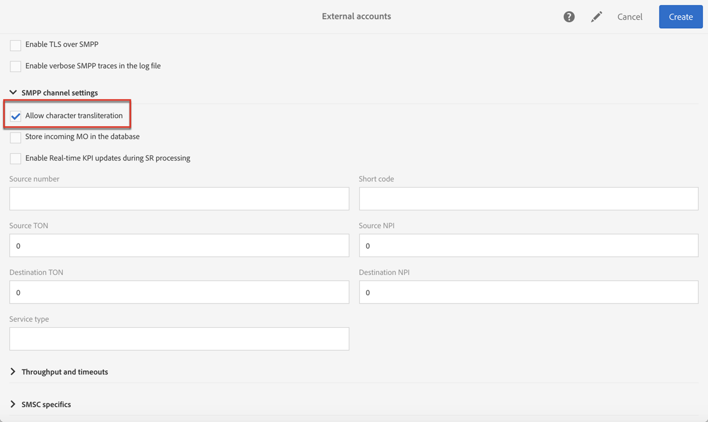

# Configurazione del canale SMS{#configuring-sms-channel}

Per inviare messaggi SMS, uno o più account esterni devono essere configurati da un amministratore nel menu **[!UICONTROL Administration]** &gt; **[!UICONTROL Channels]** &gt; **[!UICONTROL SMS]** &gt; **[!UICONTROL SMS accounts]** .

I passaggi per creare e modificare un account esterno sono descritti in dettaglio nella sezione [Conti](../../administration/using/external-accounts.md) esterni. Di seguito sono riportati i parametri specifici degli account esterni per l'invio di messaggi SMS.

## Definizione di un ciclo SMS {#defining-an-sms-routing}

L'account esterno **[!UICONTROL SMS routing via SMPP]** è fornito per impostazione predefinita, ma può essere utile aggiungere altri account.

Se desiderate utilizzare il protocollo SMPP, potete anche creare un nuovo account esterno. Per ulteriori informazioni sul protocollo e sulle impostazioni SMS, consultare questa nota [tecnica](https://helpx.adobe.com/campaign/kb/sms-connector-protocol-and-settings.html).

1. Crea un nuovo account esterno da **[!UICONTROL Administration > Application settings > External accounts]**.
1. Definite il tipo di account come **[!UICONTROL Routing]**, il canale come **[!UICONTROL Mobile (SMS)]** e la modalità di consegna come **[!UICONTROL Bulk delivery]**.

   Una volta definiti questi parametri di routing, il connettore SMS ( **[!UICONTROL Generic SMPP]** ) viene selezionato automaticamente. Questo connettore consente ad Adobe Campaign di inviare messaggi SMS direttamente ai profili di destinazione, collegandosi a un centro di servizi di messaggi brevi (SMS-C) tramite il protocollo SMPP.

   

1. Definire le impostazioni di connessione.

   Per immettere le impostazioni di connessione specifiche per l'invio di messaggi SMS, contattare il provider di servizi SMS che vi spiegherà come completare i diversi campi dell'account esterno.

   

   L' **[!UICONTROL Enable TLS over SMPP]** opzione consente di crittografare il traffico SMPP.

   **[!UICONTROL Enable verbose SMPP traces in the log file]** consente di scaricare tutto il traffico SMPP nei file di registro. Questa opzione deve essere abilitata per la risoluzione dei problemi del connettore e per il confronto con il traffico rilevato dal provider.

1. Contattate Adobe che vi darà il valore da immettere nel **[!UICONTROL SMS-C implementation name]** campo, a seconda del fornitore scelto.
1. Definire le impostazioni dei canali SMPP. Per ulteriori informazioni, consulta la sezione dedicata alla codifica [SMS e ai formati](#sms-encoding-and-formats) .

   Abilitate l' **[!UICONTROL Store incoming MO in the database]** opzione se desiderate che tutti gli SMS in ingresso siano memorizzati nella tabella inSMS. Per ulteriori informazioni su come recuperare gli SMS in arrivo, consulta questa [sezione](../../channels/using/managing-incoming-sms.md#storing-incoming-sms).

   L’ **[!UICONTROL Enable Real-time KPI updates during SR processing]** opzione consente di aggiornare i **[!UICONTROL Delivered]** KPI o **[!UICONTROL Bounces + Errors]** i KPI in tempo reale dopo l’invio. Questi KPI si trovano nella **[!UICONTROL Deployment]** finestra e vengono ricalcolati direttamente dall'SR (Report di stato) ricevuto dal provider.

   

1. Definite i **[!UICONTROL Throughput and timeouts]** parametri.

   È possibile specificare il volume massimo di messaggi in uscita ("MT", Mobile Terminated) in MT al secondo. Se si inserisce "0" nel campo corrispondente, la velocità effettiva sarà illimitata.

   I valori di tutti i campi corrispondenti alle durate devono essere completati in secondi.

1. Definite i parametri specifici di SMS-C nel caso sia necessario definire una mappatura di codifica specifica. Per ulteriori informazioni, fare riferimento alla sezione [SMSC](#smsc-specifics) .

   Abilitate l' **[!UICONTROL Send full phone number (send characters other than digits)]** opzione se non desiderate rispettare il protocollo SMPP e trasferire il **[!UICONTROL +]** prefisso al server del provider SMS (SMS-C).

   Tuttavia, dato che alcuni fornitori richiedono l'uso del **[!UICONTROL +]** prefisso, si consiglia di consultare il provider e si consiglia di abilitare questa opzione se necessario.

1. Se necessario, definire le risposte automatiche per attivare azioni in base al contenuto di una risposta. For more on this, refer to [this section](../../channels/using/managing-incoming-sms.md#managing-stop-sms).
1. Salvate la configurazione dell'account esterno di routing SMS.

Ora puoi usare il nuovo routing per inviare messaggi SMS con Adobe Campaign.

## Codifica e formati SMS {#sms-encoding-and-formats}

### Codifica, lunghezza e traslitterazione SMS {#sms-encoding--length-and-transliteration}

Per impostazione predefinita, il numero di caratteri in un SMS soddisfa gli standard GSM (Global System for Mobile Communications).

I messaggi SMS che utilizzano la codifica GSM sono limitati a 160 caratteri, o 153 caratteri per SMS per i messaggi inviati in più parti.

>[!NOTE]
>
>Alcuni caratteri contano come due (parentesi quadre, simboli dell'euro, ecc.). L'elenco dei caratteri GSM disponibili è presentato nella sezione [Tabella dei caratteri - GSM Standard](#table-of-characters---gsm-standard) .

Se lo desideri, puoi autorizzare la traslazione dei caratteri selezionando la casella corrispondente.

La traslitterazione consiste nel sostituire un carattere di un SMS con un altro quando tale carattere non è preso in considerazione dallo standard GSM.

* Se la traslitterazione è **autorizzata**, ogni carattere non preso in considerazione viene sostituito da un carattere GSM al momento dell'invio del messaggio. Ad esempio, la lettera "ë" è sostituita da "e". Il messaggio viene quindi leggermente modificato, ma il limite di caratteri rimane lo stesso.
* Quando la traslitterazione **non è autorizzata**, ogni messaggio che contiene caratteri non presi in considerazione viene inviato in formato binario (Unicode): tutti i caratteri vengono quindi inviati così come sono. Tuttavia, i messaggi SMS che utilizzano Unicode sono limitati a 70 caratteri (o 67 caratteri per SMS per i messaggi inviati in più parti). Se viene superato il numero massimo di caratteri, verranno inviati diversi messaggi, con conseguenti costi aggiuntivi.

>[!CAUTION]
>
>L'inserimento di campi di personalizzazione nel contenuto del messaggio SMS potrebbe introdurre caratteri che non vengono presi in considerazione dalla codifica GSM. Un esempio di contenuto è disponibile nella sezione [Personalizzazione dei messaggi](../../channels/using/personalizing-sms-messages.md) SMS.

Per impostazione predefinita, la traduzione dei caratteri è disabilitata. Se si desidera che tutti i caratteri nei messaggi SMS siano mantenuti invariati, per non modificare ad esempio i nomi propri, si consiglia di non abilitare questa opzione.

Tuttavia, se i messaggi SMS contengono molti caratteri che generano messaggi Unicode, è possibile abilitare questa opzione per limitare i costi di invio dei messaggi.

### Tabella di caratteri - GSM Standard {#table-of-characters---gsm-standard}

Questa sezione presenta i caratteri presi in considerazione dallo standard GSM. Tutti i caratteri inseriti nel corpo del messaggio, diversi da quelli indicati di seguito, convertono l'intero messaggio in formato binario (Unicode) e quindi lo limitano a 70 caratteri. Per ulteriori informazioni, consulta la sezione dedicata alla codifica [SMS, alla lunghezza e alla traslitterazione](#sms-encoding--length-and-transliteration) .

**Caratteri base**

<table> 
 <tbody> 
  <tr> 
   <td> @  </td> 
   <td>    </td> 
   <td> SP  </td> 
   <td> 0  </td> 
   <td> ¡  </td> 
   <td> P  </td> 
   <td> ¿  </td> 
   <td> P  </td> 
  </tr> 
  <tr> 
   <td> £  </td> 
   <td> _  </td> 
   <td> !  </td> 
   <td> 1  </td> 
   <td> A  </td> 
   <td> Q  </td> 
   <td> a  </td> 
   <td> q  </td> 
  </tr> 
  <tr> 
   <td> $  </td> 
   <td>    </td> 
   <td> "  </td> 
   <td> 2  </td> 
   <td> B  </td> 
   <td> R  </td> 
   <td> b  </td> 
   <td> r  </td> 
  </tr> 
  <tr> 
   <td> ¥  </td> 
   <td>    </td> 
   <td> #  </td> 
   <td> 3  </td> 
   <td> C  </td> 
   <td> S  </td> 
   <td> c  </td> 
   <td> s  </td> 
  </tr> 
  <tr> 
   <td> è  </td> 
   <td>    </td> 
   <td> ¤  </td> 
   <td> 4  </td> 
   <td> D  </td> 
   <td> T  </td> 
   <td> d  </td> 
   <td> t  </td> 
  </tr> 
  <tr> 
   <td> é  </td> 
   <td>    </td> 
   <td> %  </td> 
   <td> 5  </td> 
   <td> E  </td> 
   <td> U  </td> 
   <td> e  </td> 
   <td> u  </td> 
  </tr> 
  <tr> 
   <td> ù  </td> 
   <td>    </td> 
   <td> &amp;  </td> 
   <td> 6  </td> 
   <td> F  </td> 
   <td> V  </td> 
   <td> f  </td> 
   <td> v  </td> 
  </tr> 
  <tr> 
   <td> ì  </td> 
   <td>    </td> 
   <td> '  </td> 
   <td> 7  </td> 
   <td> G  </td> 
   <td> W  </td> 
   <td> g  </td> 
   <td> w  </td> 
  </tr> 
  <tr> 
   <td> ò  </td> 
   <td>    </td> 
   <td> (  </td> 
   <td> 8  </td> 
   <td> H  </td> 
   <td>  X  </td> 
   <td> h  </td> 
   <td> x  </td> 
  </tr> 
  <tr> 
   <td> OA  </td> 
   <td>    </td> 
   <td> )  </td> 
   <td> 9 </td> 
   <td> I  </td> 
   <td> Y  </td> 
   <td> i  </td> 
   <td> y  </td> 
  </tr> 
  <tr> 
   <td> LF  </td> 
   <td>    </td> 
   <td> *  </td> 
   <td> :  </td> 
   <td> J  </td> 
   <td> Z  </td> 
   <td> j  </td> 
   <td> z  </td> 
  </tr> 
  <tr> 
   <td> Ø  </td> 
   <td> ESC  </td> 
   <td> +  </td> 
   <td> ;  </td> 
   <td> K  </td> 
   <td> Execute  </td> 
   <td> k  </td> 
   <td> ä  </td> 
  </tr> 
  <tr> 
   <td> ø  </td> 
   <td> AE  </td> 
   <td> ,  </td> 
   <td> &lt;  </td> 
   <td> L  </td> 
   <td> Ö  </td> 
   <td> l  </td> 
   <td> ö  </td> 
  </tr> 
  <tr> 
   <td> CR  </td> 
   <td> æ  </td> 
   <td> -  </td> 
   <td> = </td> 
   <td> M  </td> 
   <td> question  </td> 
   <td> m  </td> 
   <td> D  </td> 
  </tr> 
  <tr> 
   <td> ank  </td> 
   <td> ß  </td> 
   <td> .  </td> 
   <td> &gt;  </td> 
   <td> N  </td> 
   <td> ü  </td> 
   <td> n  </td> 
   <td> ü  </td> 
  </tr> 
  <tr> 
   <td> å  </td> 
   <td> É  </td> 
   <td> /  </td> 
   <td> ?  </td> 
   <td> O  </td> 
   <td> §  </td> 
   <td> o  </td> 
   <td> à  </td> 
  </tr> 
 </tbody> 
</table>

SP: Space

ESC: Esc

LF: Avanzamento riga

CR: Ritorno a capo

**Caratteri avanzati (contati due volte)**

^ { } [ ~ ] | €

### Specifiche SMSC {#smsc-specifics}

>[!NOTE]
>
>Queste opzioni consentono di adattare il connettore in modo che funzioni con SMSC non standard (ovvero non esattamente conforme alle specifiche SMPP 3.4) o con requisiti di codifica specifici e devono essere configurate solo da utenti esperti.

Quando invii un messaggio SMS, Adobe Campaign può utilizzare una o più codifiche di testo. Ogni codifica ha un set di caratteri specifico e determina il numero di caratteri che possono essere inclusi in un messaggio SMS.

Il **[!UICONTROL DATA_CODING]** campo consente ad Adobe Campaign di comunicare all'SMS-C quale codifica viene utilizzata.

>[!NOTE]
>
>La mappatura tra il valore **data_coding** e la codifica effettivamente utilizzata è standardizzata. Tuttavia, alcuni SMS-C hanno una propria mappatura specifica: in questo caso, l'amministratore di **Adobe Campaign** deve dichiarare questa mappatura. Consultate il vostro fornitore per ulteriori informazioni.

La **[!UICONTROL Define a specific mapping of encodings]** funzionalità consente di dichiarare **data_codings** e forzare la codifica, se necessario: a tal fine, specificate una singola codifica nella tabella.

**Configurazione**

* Quando la **[!UICONTROL Define a specific mapping of encodings]** funzionalità non è selezionata, il connettore assume un comportamento generico:

   * Proverà a utilizzare la codifica GSM a cui assegna il valore **data_coding = 0**.
   * Se la codifica GSM non riesce, utilizzerà la codifica **UCS2** a cui assegna il valore **data_coding = 8**.
   

* Quando la **[!UICONTROL Define a specific mapping of encodings]** funzionalità è selezionata, è possibile definire sia le codifiche che i valori dei **[!UICONTROL data_coding]** campi collegati. Adobe Campaign cercherà di utilizzare la prima codifica nell'elenco, quindi la seguente, se la prima codifica risulta impossibile.

   L'ordine di dichiarazione è importante: si consiglia di inserire l'elenco in ordine crescente **di costo** per favorire le codifiche che consentono di contenere il maggior numero possibile di caratteri in ogni messaggio SMS.

   Dichiarare solo le codifiche che si desidera utilizzare. Se alcune delle codifiche fornite dall'SMS-C non devono corrispondere al vostro scopo di utilizzo, non dichiararle nell'elenco.

   

### Risposta automatica inviata al MO {#automatic-reply-sent-to-the-mo}

Quando un profilo risponde a un messaggio SMS inviato tramite Campaign, puoi configurare i messaggi che gli vengono automaticamente inviati e l'azione da eseguire.

For more information, refer to [this section](../../channels/using/managing-incoming-sms.md).

## Configurazione delle proprietà SMS {#configuring-sms-properties}

Questa sezione descrive l'elenco dei parametri unici per SMS nella schermata delle proprietà di un SMS delivery o di un modello SMS.

I parametri specifici per l'invio di messaggi SMS sono raggruppati nelle sezioni **[!UICONTROL Send]** e nelle **[!UICONTROL Advanced parameters]** .

* L' **[!UICONTROL From]** opzione consente di personalizzare il nome del mittente del messaggio SMS utilizzando una stringa di caratteri. Nome che verrà visualizzato come nome mittente del messaggio SMS sul telefono cellulare del destinatario.

   Se questo campo è vuoto, sarà il numero di origine fornito nell'account esterno che verrà utilizzato. Se non viene fornito alcun numero di origine, verrà utilizzato il codice breve. L'account esterno specifico per la consegna SMS è presentato nella sezione [Esterno account](#defining-an-sms-routing) SMS.

   

   >[!CAUTION]
   >
   >Controlla la legislazione del tuo paese riguardo alla modifica dell'indirizzo del mittente. È inoltre necessario verificare con il provider di servizi SMS se offre questa funzionalità.

* L' **[!UICONTROL Maximum number of SMS per message]** opzione consente di definire il numero di messaggi SMS da utilizzare per inviare un messaggio. Se questo numero viene superato, il messaggio non verrà inviato.

   >[!CAUTION]
   >
   >Se hai inserito campi di personalizzazione o testo condizionale nel contenuto del tuo messaggio SMS, la lunghezza del messaggio e, di conseguenza, il numero di messaggi SMS da inviare possono variare da un destinatario all'altro. Per ulteriori informazioni, consulta la sezione [Personalizzazione dei messaggi](../../channels/using/personalizing-sms-messages.md) SMS.

* Il **[!UICONTROL Transmission mode]** campo consente di determinare il metodo di consegna dei messaggi SMS:

   * **[!UICONTROL Saved on SIM card]**: il messaggio è memorizzato sulla scheda SIM del destinatario.
   * **[!UICONTROL Saved on mobile]**: il messaggio è memorizzato nella memoria interna del telefono.
   * **[!UICONTROL Flash]**: il messaggio viene visualizzato sul telefono cellulare del destinatario come notifica, quindi scompare senza essere salvato.

