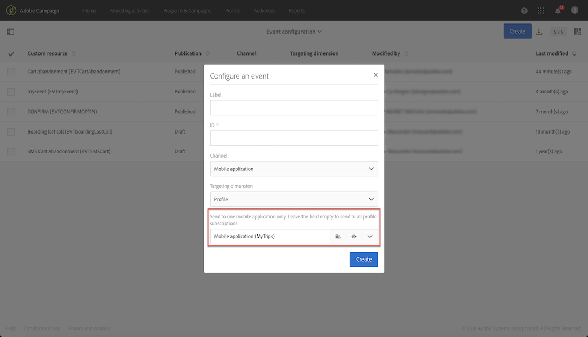

# Configurazione dei messaggi transazionali{#configuring-transactional-messaging}

Per inviare un messaggio di transazione con Adobe Campaign, devi prima descrivere la struttura dei dati dell'evento.

La configurazione dell'evento deve essere eseguita da un **amministratore** seguendo i passaggi seguenti:

La configurazione può variare in base al tipo di messaggio transazionali da inviare. Per ulteriori informazioni, fare riferimento alle configurazioni specifiche dell'evento [Transazionali](../../administration/using/configuring-transactional-messaging.md#transactional-event-specific-configurations)

Una volta pubblicato l'evento, viene automaticamente creato il messaggio transazionali corrispondente. Per ulteriori informazioni sui messaggi transazionali, fare riferimento [a questa pagina](../../channels/using/about-transactional-messaging.md).

## Creazione di un evento {#creating-an-event}

Iniziate creando l'evento in base alle vostre esigenze.

1. Fate clic sul **[!UICONTROL Adobe Campaign]** logo, nell'angolo in alto a sinistra, quindi selezionate **[!UICONTROL Marketing plans]** &gt; **[!UICONTROL Transactional messages]** &gt; **[!UICONTROL Event configuration]**.
1. Fate clic sul **[!UICONTROL Create]** pulsante.
1. Assegnate a **[!UICONTROL Label]** e all **[!UICONTROL ID]** 'evento un evento. **[!UICONTROL ID]** Il campo è obbligatorio e deve iniziare con il prefisso "EVT". Se non utilizzate questo prefisso, viene aggiunto automaticamente dopo aver fatto clic **[!UICONTROL Create]** su.

   

   >[!CAUTION]
   >
   >L'ID non deve superare i 64 caratteri, incluso il prefisso EVT.

1. Seleziona il canale che verrà utilizzato per inviare i messaggi **[!UICONTROL Email]** transazionali, **[!UICONTROL Mobile (SMS)]** o **[!UICONTROL Mobile application]** (notifica push).

   >[!NOTE]
   >
   >Per ogni configurazione di evento è possibile utilizzare un solo canale. Una volta creato l'evento, non potete modificare il canale.

1. Selezionate la dimensione di targeting corrispondente alla configurazione desiderata dell'evento e fate clic **[!UICONTROL Create]** su.

   I messaggi transazionali basati su evento contengono dati di destinazione contenuti nell'evento stesso, mentre i messaggi transazionali basati su profilo contengono dati di destinazione contenuti nel database Adobe Campaign. Per ulteriori informazioni, fare riferimento alle configurazioni specifiche dell'evento [Transazionali](../../administration/using/configuring-transactional-messaging.md#transactional-event-specific-configurations).

## Definizione degli attributi dell'evento {#defining-the-event-attributes}

Nella **[!UICONTROL Fields]** sezione, definite gli attributi che verranno integrati nel contenuto dell'evento e quindi potranno essere utilizzati per personalizzare il messaggio transazionali.

I passaggi per aggiungere e modificare i campi sono identici a quelli per [le risorse personalizzate](../../developing/using/configuring-the-resource-s-data-structure.md#adding-fields-to-a-resource).

>[!NOTE]
>
>Se desiderate creare un messaggio transazionale multilingue, definite un attributo evento aggiuntivo con l' **[!UICONTROL AC_language]** ID. Ciò vale solo per i messaggi transazionali degli eventi. Una volta pubblicato l'evento, i passaggi per modificare il contenuto di un messaggio transazionale multilingue sono identici a quelli per un'e-mail standard multilingue. Consultate [Creazione di un messaggio e-mail multilingue](../../channels/using/creating-a-multilingual-email.md).

## Definizione delle raccolte di dati {#defining-data-collections}

Potete aggiungere al contenuto dell'evento una raccolta di elementi, ogni elemento stesso compreso vari attributi.

This collection can be used in a transactional email to add product lists to the content of the message, for example a list of products - with the price, reference number, quantity, etc. per ciascun prodotto dell'elenco.

1. Nella **[!UICONTROL Collections]** sezione, fate clic sul **[!UICONTROL Create element]** pulsante.

   

1. Aggiungete un'etichetta e un ID per la raccolta.
1. Aggiungi tutti i campi da visualizzare nel messaggio di transazione per ogni prodotto dell'elenco.

   In questo esempio sono stati aggiunti i seguenti campi:

   

Una volta pubblicati l'evento e il messaggio, potrete utilizzare questa raccolta nel messaggio transazionali.

Di seguito viene illustrata l'anteprima API per questo esempio:

**Argomenti correlati:**

* [Anteprima e pubblicazione dell'evento](../../administration/using/configuring-transactional-messaging.md#previewing-and-publishing-the-event)
* [Uso degli elenchi di prodotti in un messaggio transazionale](../../channels/using/event-transactional-messages.md#using-product-listings-in-a-transactional-message)

## Arricchimento del contenuto dei messaggi transazionali {#enriching-the-transactional-message-content}

L'arricchimento del contenuto dei messaggi transazionali con informazioni dal database Adobe Campaign consente di personalizzare i messaggi. Dal cognome o dall'ID CRM di ciascun destinatario, ad esempio, puoi recuperare dati quali indirizzo o data di nascita o qualsiasi altro campo personalizzato aggiunto nella tabella Profilo, per personalizzare le informazioni che sono state loro inviate.

È possibile arricchire il contenuto dei messaggi transazionali con informazioni estesi **[!UICONTROL Profile]** o **[!UICONTROL Service]** risorse.

Queste informazioni possono essere memorizzate anche in nuove risorse. In tal caso, la risorsa deve essere collegata direttamente alle risorse **[!UICONTROL Profile]** o **[!UICONTROL Service]** tramite un'altra tabella. Ad esempio, nella configurazione seguente, è possibile arricchire il contenuto del messaggio transazionali con informazioni provenienti dalla **[!UICONTROL Product]** risorsa come la categoria di prodotto o l'ID, se la **[!UICONTROL Product]** risorsa è collegata alla **[!UICONTROL Profile]** risorsa.

Per ulteriori informazioni sulla creazione e la pubblicazione di risorse, consultate [questa pagina](../../developing/using/key-steps-to-add-a-resource.md).

1. Nella **[!UICONTROL Enrichment]** sezione, fate clic sul **[!UICONTROL Create element]** pulsante.

   

1. Selezionate la risorsa con la quale desiderate collegare il messaggio. In questo caso, scegliete la **[!UICONTROL Profile]** risorsa.

   

1. Usate il **[!UICONTROL Create element]** pulsante per collegare un campo dalla risorsa selezionata a uno dei campi precedentemente aggiunti all'evento (consultate [Definizione degli attributi dell'evento](../../administration/using/configuring-transactional-messaging.md#defining-the-event-attributes)).

   

1. In questo esempio, abbiamo riconciliato i **[!UICONTROL Last name]****[!UICONTROL First name]** campi con i campi corrispondenti nella **[!UICONTROL Profile]** risorsa.

   

1. Nella **[!UICONTROL Targeting enrichment]** sezione, seleziona l'arricchimento che verrà utilizzato come destinazione del messaggio durante l'esecuzione. In questo esempio, selezionate **[!UICONTROL Profile]**. La selezione di un arricchimento di targeting è obbligatoria per gli eventi basati su profilo.

   

Una volta pubblicati l'evento e il messaggio, il collegamento con la **[!UICONTROL Profile]** risorsa vi consentirà di arricchire il contenuto del messaggio.

**Argomenti correlati:**

* [Anteprima e pubblicazione dell'evento](../../administration/using/configuring-transactional-messaging.md#previewing-and-publishing-the-event).
* [Personalizzazione di un messaggio transazionale](../../channels/using/event-transactional-messages.md#personalizing-a-transactional-message).

## Anteprima e pubblicazione dell'evento {#previewing-and-publishing-the-event}

Prima di poter utilizzare l'evento, è necessario visualizzarlo in anteprima e pubblicarlo.

1. Fate clic **[!UICONTROL API preview]** sul pulsante per visualizzare una simulazione dell'API REST che verrà utilizzata dagli sviluppatori di siti Web prima della pubblicazione. Una volta pubblicato l'evento, questo pulsante consente anche di visualizzare un'anteprima dell'API in produzione. Consultate [Integrazione dell'attivazione dell'evento in un sito Web](../../administration/using/configuring-transactional-messaging.md#integrating-the-triggering-of-the-event-in-a-website).

   

   >[!NOTE]
   >
   >La REST API varia a seconda del canale selezionato e della dimensione di targeting selezionata. Per ulteriori dettagli sulle diverse configurazioni, consultate Configurazioni specifiche per l'evento [Transazionali](../../administration/using/configuring-transactional-messaging.md#transactional-event-specific-configurations).

1. Fate clic per **[!UICONTROL Publish]** avviare la pubblicazione.

   

1. Potete visualizzare i registri di pubblicazione selezionando la scheda corrispondente.

   

   Potete inoltre consultare le pubblicazioni precedenti selezionando la scheda.

>[!NOTE]
>
>Ogni volta che modificate l'evento, dovete fare **[!UICONTROL Publish]** di nuovo clic per generare l'API REST aggiornata che verrà utilizzata dagli sviluppatori di siti Web.

Una volta pubblicato l'evento, viene automaticamente creato un messaggio transazionale collegato al nuovo evento. Affinché questo evento attivi l'invio di un messaggio transazionale, è necessario modificare e pubblicare il messaggio appena creato. Consultate [Messaggi transazionali evento](../../channels/using/event-transactional-messages.md).

Potete accedere al messaggio transazionali creato direttamente dal collegamento nell'area lato sinistro.

Dovete anche integrare questo evento di attivazione nel sito Web. Consultate [Integrazione dell'attivazione dell'evento in un sito Web](../../administration/using/configuring-transactional-messaging.md#integrating-the-triggering-of-the-event-in-a-website).

### Annullamento della pubblicazione di un evento {#unpublishing-an-event}

**[!UICONTROL Unpublish]** Il pulsante consente di annullare la pubblicazione dell'evento, che elimina dalla REST API la risorsa corrispondente all'evento creato in precedenza. Ora, anche se l'evento viene attivato attraverso il sito Web, i messaggi corrispondenti non vengono più inviati e non vengono memorizzati nel database.

>[!NOTE]
>
>Se avete già pubblicato il messaggio transazionali corrispondente, viene annullata anche la pubblicazione dei messaggi transazionali. Consultate [Annullamento della pubblicazione di un messaggio transazionale](../../channels/using/event-transactional-messages.md#unpublishing-a-transactional-message).

Fate clic **[!UICONTROL Publish]** sul pulsante per generare una nuova REST API.

## Integrazione dell'attivazione dell'evento in un sito Web {#integrating-the-triggering-of-the-event-in-a-website}

Dopo aver creato un evento, dovrete integrare l'attivazione di questo evento nel sito Web.

Nell'esempio descritto nella sezione del principio operativo [di messaggistica](../../channels/using/about-transactional-messaging.md#transactional-messaging-operating-principle) transazionali, si desidera attivare un evento di abbandono del carrello ogni volta che un cliente lascia il sito Web prima di acquistare i prodotti nel carrello. A tal fine, lo sviluppatore Web del sito Web deve utilizzare l'API REST di Adobe Campaign Standard.

Consulta la Documentazione [REST API](https://docs.campaign.adobe.com/doc/standard/en/api/ACS_API.html#transactional-messages-api) .

## Configurazioni specifiche dell'evento transazionali {#transactional-event-specific-configurations}

La configurazione dell'evento transazionali può variare a seconda del tipo di messaggio transazionale da inviare (evento o profilo) e del canale che verrà utilizzato.

Nelle sezioni seguenti viene descritto quale configurazione specifica deve essere impostata in base al messaggio transazionale desiderato. Per ulteriori informazioni su come configurare un evento, consultate [Creazione di un evento](../../administration/using/configuring-transactional-messaging.md#creating-an-event).

### Messaggi transazionali basati su eventi {#event-based-transactional-messages}

Per inviare un messaggio transazionali basato su eventi, occorre innanzitutto creare e configurare un evento con i dati contenuti nell'evento stesso.
Per ulteriori informazioni, consulta [Uso dei messaggi transazionali](https://helpx.adobe.com/campaign/kb/simplify-campaign-management.html#Managedatatofuelengagingexperiences).

1. Quando create la configurazione dell'evento, selezionate la **[!UICONTROL Real-time event]** dimensione di targeting (consultate [Creazione di un evento](../../administration/using/configuring-transactional-messaging.md#creating-an-event)).
1. Aggiungete i campi all'evento, per personalizzare il messaggio transazionali (consultate [Definizione degli attributi dell'evento](../../administration/using/configuring-transactional-messaging.md#defining-the-event-attributes)).
1. Potenziate il contenuto dei messaggi transazionali se desiderate utilizzare informazioni aggiuntive dal database Adobe Campaign (consultate [Arricchimento del contenuto dei messaggi transazionali](../../administration/using/configuring-transactional-messaging.md#enriching-the-transactional-message-content)).

   >[!NOTE]
   >
   >La messaggistica transazionale basata su evento dovrebbe utilizzare solo i dati presenti nell'evento inviato per definire il destinatario e la personalizzazione dei contenuti dei messaggi. Tuttavia, puoi arricchire il contenuto del messaggio transazionale utilizzando informazioni provenienti dal database Adobe Campaign.

1. Visualizzate l'anteprima e pubblicate l'evento (consultate [Anteprima e pubblicazione dell'evento](../../administration/using/configuring-transactional-messaging.md#previewing-and-publishing-the-event)).

   Quando si visualizza l'anteprima dell'evento, l'API REST contiene un attributo che specifica l'indirizzo e-mail o il cellulare in base al canale selezionato.

   Una volta pubblicato l'evento, viene automaticamente creato un messaggio transazionale collegato al nuovo evento. Affinché l'evento attivi l'invio di un messaggio transazionale, dovete modificare e pubblicare il messaggio appena creato, consultate [Messaggi transazionali evento](../../channels/using/event-transactional-messages.md).

1. Integrare l'evento nel sito Web (consultate [Integrazione dell'attivazione dell'evento in un sito Web](../../administration/using/configuring-transactional-messaging.md#integrating-the-triggering-of-the-event-in-a-website)).

### Messaggi transazionali basati su profilo {#profile-based-transactional-messages}

Per inviare un messaggio transazionale basato su profilo, devi prima creare e configurare i dati di targeting degli eventi contenuti nel database Adobe Campaign.

1. Quando create la configurazione dell'evento, selezionate la **[!UICONTROL Profile event]** dimensione di targeting (consultate [Creazione di un evento](../../administration/using/configuring-transactional-messaging.md#creating-an-event)).
1. Aggiungete i campi all'evento, per personalizzare il messaggio transazionali (consultate [Definizione degli attributi dell'evento](../../administration/using/configuring-transactional-messaging.md#defining-the-event-attributes)). È necessario aggiungere almeno un campo per creare un arricchimento. Non devi creare altri campi, come **Nome** e **Cognome** , in quanto potrai utilizzare i campi di personalizzazione dal database Adobe Campaign.
1. Create un arricchimento per collegare l'evento alla **[!UICONTROL Profile]** risorsa (consultate [Arricchimento del contenuto dei messaggi transazionali](../../administration/using/configuring-transactional-messaging.md#enriching-the-transactional-message-content)). La creazione di un arricchimento è obbligatoria quando si utilizza una **[!UICONTROL Profile]** dimensione di targeting.
1. Visualizzate l'anteprima e pubblicate l'evento (consultate [Anteprima e pubblicazione dell'evento](../../administration/using/configuring-transactional-messaging.md#previewing-and-publishing-the-event)).

   Quando si visualizza l'anteprima dell'evento, REST API non contiene un attributo che specifica l'indirizzo e-mail o il cellulare così come sarà recuperato dalla **[!UICONTROL Profile]** risorsa.

   Una volta pubblicato l'evento, viene automaticamente creato un messaggio transazionale collegato al nuovo evento. Per attivare l'invio di un messaggio di transazione, dovete modificare e pubblicare il messaggio appena creato, consultate [Invio di un messaggio transazionale profilo](../../channels/using/profile-transactional-messages.md#sending-a-profile-transactional-message).

1. Integrare l'evento nel sito Web (consultate [Integrazione dell'attivazione dell'evento in un sito Web](../../administration/using/configuring-transactional-messaging.md#integrating-the-triggering-of-the-event-in-a-website)).

### Notifiche push transazionali basate su evento {#event-based-transactional-push-notifications}

Per poter inviare notifiche push transazionali, devi configurare di conseguenza Adobe Campaign. Consultate [Configurazione push](https://helpx.adobe.com/campaign/kb/configuring-app-sdkv4.html).

Per inviare una notifica push transazionale a tutti gli utenti che hanno acconsentito alla ricezione di notifiche dall'applicazione mobile, occorre innanzitutto creare e configurare un evento con i dati contenuti nell'evento stesso. I passaggi corrispondenti sono indicati di seguito.

L'evento deve contenere i tre elementi seguenti:

* Token **di registrazione**, ID utente per un'applicazione mobile e un dispositivo. Potrebbe non corrispondere ad alcun profilo dal database Adobe Campaign.
* Un nome applicazione **mobile** (uno per tutti i dispositivi - Android e iOS). Si tratta dell'ID dell'applicazione mobile configurata in Adobe Campaign che verrà utilizzata per ricevere notifiche push sui dispositivi degli utenti. Per ulteriori informazioni, consulta questa [pagina](https://helpx.adobe.com/campaign/kb/configuring-app-sdkv4.html)
* Una piattaforma **push** ("gcm" per Android o "apns" per iOS).

1. Quando create la configurazione dell'evento, selezionate il **[!UICONTROL Mobile application]** canale e la dimensione **[!UICONTROL Real-time event]** di targeting (consultate [Creazione di un evento](../../administration/using/configuring-transactional-messaging.md#creating-an-event)).
1. Aggiungete i campi all'evento, per personalizzare il messaggio transazionali (consultate [Definizione degli attributi dell'evento](../../administration/using/configuring-transactional-messaging.md#defining-the-event-attributes)).
1. Potenziate il contenuto dei messaggi transazionali se desiderate utilizzare informazioni aggiuntive dal database Adobe Campaign (consultate [Arricchimento del contenuto dei messaggi transazionali](../../administration/using/configuring-transactional-messaging.md#enriching-the-transactional-message-content)).

   >[!NOTE]
   >
   >La messaggistica transazionale basata su evento dovrebbe utilizzare solo i dati presenti nell'evento inviato per definire il destinatario e la personalizzazione dei contenuti dei messaggi. Tuttavia, puoi arricchire il contenuto del messaggio transazionale utilizzando informazioni provenienti dal database Adobe Campaign.

1. Visualizzate l'anteprima e pubblicate l'evento (consultate [Anteprima e pubblicazione dell'evento](../../administration/using/configuring-transactional-messaging.md#previewing-and-publishing-the-event)).

   Quando si visualizza l'anteprima dell'evento, l'API REST contiene gli attributi "registrationtoken", "application" e "pushplatform" che verranno utilizzati per eseguire il targeting della distribuzione.

   

   Una volta che l'evento è stato pubblicato, viene automaticamente creata una notifica push transazionale collegata al nuovo evento. Per modificare e pubblicare il messaggio appena creato, consultate [Invio di una notifica push transazionale come evento](../../channels/using/transactional-push-notifications.md#transactional-push-notifications-targeting-an-event).

1. Integrare l'evento nel sito Web (consultate [Integrazione dell'attivazione dell'evento in un sito Web](../../administration/using/configuring-transactional-messaging.md#integrating-the-triggering-of-the-event-in-a-website)).

### Notifiche push transazionali basate su profilo {#profile-based-transactional-push-notifications}

Per inviare una notifica push transazionale ai profili di Adobe Campaign che hanno effettuato la sottoscrizione all'applicazione mobile, devi prima creare e configurare un evento con il database Adobe Campaign.

1. Quando create la configurazione dell'evento, selezionate il **[!UICONTROL Mobile application]** canale e la dimensione **[!UICONTROL Profile]** di targeting (consultate [Creazione di un evento](../../administration/using/configuring-transactional-messaging.md#creating-an-event)).

   Per impostazione predefinita, la notifica push transazionale viene inviata a tutte le applicazioni mobili a cui sono iscritti i destinatari. Per inviare la notifica push a un'applicazione mobile specifica, selezionala nell'elenco. Le altre applicazioni mobili verranno eseguite in base al messaggio, ma saranno escluse dall'invio.

   

1. Aggiungete i campi all'evento, se desiderate personalizzare il messaggio transazionali (consultate [Definizione degli attributi dell'evento](../../administration/using/configuring-transactional-messaging.md#defining-the-event-attributes)).

   >[!NOTE]
   >
   >È necessario aggiungere almeno un campo per creare un arricchimento. Non devi creare altri campi, come **Nome** e **Cognome** , in quanto potrai utilizzare i campi di personalizzazione dal database Adobe Campaign.

1. Create un arricchimento per collegare l'evento alla **[!UICONTROL Profile]** risorsa (consultate [Arricchimento del contenuto dei messaggi transazionali](../../administration/using/configuring-transactional-messaging.md#enriching-the-transactional-message-content)). La creazione di un arricchimento è obbligatoria quando si utilizza una **[!UICONTROL Profile]** dimensione di targeting.
1. Visualizzate l'anteprima e pubblicate l'evento (consultate [Anteprima e pubblicazione dell'evento](../../administration/using/configuring-transactional-messaging.md#previewing-and-publishing-the-event)).

   Quando si visualizza l'anteprima dell'evento, REST API non contiene un attributo che specifica il token di registrazione, il nome dell'applicazione e la piattaforma push così come saranno recuperate dalla **[!UICONTROL Profile]** risorsa.

   Una volta che l'evento è stato pubblicato, viene automaticamente creata una notifica push transazionale collegata al nuovo evento. Per modificare e pubblicare il messaggio appena creato, vedi [Invio di una notifica push transazionale a un profilo](../../channels/using/transactional-push-notifications.md#transactional-push-notifications-targeting-a-profile).

1. Integrare l'evento nel sito Web (consultate [Integrazione dell'attivazione dell'evento in un sito Web](../../administration/using/configuring-transactional-messaging.md#integrating-the-triggering-of-the-event-in-a-website)).

### Configurazione di un evento per inviare un messaggio di follow-up {#configuring-an-event-to-send-a-follow-up-message}

Un messaggio di follow-up è un modello di consegna di marketing predefinito che può essere utilizzato in un flusso di lavoro per inviare messaggi ai destinatari di un messaggio transazionali specifico. Per ulteriori informazioni, consulta [Messaggi di follow-up](../../channels/using/follow-up-messages.md).

1. Utilizzate la stessa configurazione evento creata per inviare un messaggio transazionale evento. Vedere [Messaggi transazionali basati su eventi](../../administration/using/configuring-transactional-messaging.md#event-based-transactional-messages).
1. Durante la configurazione dell'evento, controllate la **[!UICONTROL Create follow-up delivery template for this event]** casella prima di pubblicare l'evento.

   

1. Visualizzate l'anteprima e pubblicate l'evento (consultate [Anteprima e pubblicazione dell'evento](../../administration/using/configuring-transactional-messaging.md#previewing-and-publishing-the-event)).

   Una volta pubblicato l'evento, viene automaticamente creato un messaggio di transazione e un modello di consegna successivo collegato al nuovo evento. Per ulteriori informazioni sull'uso dei messaggi di follow-up, vedi [Invio di un messaggio di follow-up](../../channels/using/follow-up-messages.md#sending-a-follow-up-message).

## Caso d'uso: configurazione di un evento per inviare un messaggio transazionale {#use-case--configuring-an-event-to-send-a-transactional-message}

In questo esempio, desideriamo configurare un evento per inviare messaggi di conferma dopo ogni acquisto sul nostro sito Web con i seguenti prerequisiti:

Per identificare il nostro client tramite il suo ID CRM, assicurati prima che la **[!UICONTROL Profile]** risorsa sia stata estesa con questo nuovo campo.

Analogamente, una risorsa personalizzata corrispondente agli acquisti deve essere stata creata e pubblicata e deve essere collegata alla **[!UICONTROL Profile]** risorsa. In questo modo potrete ottenere informazioni da questa risorsa per arricchire il contenuto dei messaggi.

Per ulteriori informazioni sulla creazione e la pubblicazione di risorse, consultate [questa pagina](../../developing/using/key-steps-to-add-a-resource.md).

1. Create un nuovo evento utilizzando il **[!UICONTROL Email]** canale e la dimensione **[!UICONTROL Profile]** di targeting (consultate [Creazione di un evento](../../administration/using/configuring-transactional-messaging.md#creating-an-event)).
1. Definite gli attributi che saranno disponibili per personalizzare il messaggio transazionale. Nel nostro caso, aggiungete i campi «CRM ID» e «Product identifier» (consultate [Definizione degli attributi degli eventi](../../administration/using/configuring-transactional-messaging.md#defining-the-event-attributes)).

   

1. Per arricchire il contenuto dei messaggi con informazioni relative agli acquisti precedenti del cliente, create un arricchimento per la **[!UICONTROL Purchase]** risorsa (consultate [Arricchimento del contenuto dei messaggi transazionali](../../administration/using/configuring-transactional-messaging.md#enriching-the-transactional-message-content)).

   

1. Creare una condizione di partecipazione tra il campo "Product Identifier" precedentemente aggiunto al messaggio e il campo corrispondente dalla **[!UICONTROL Purchase]** risorsa

   

1. Visualizzate l'anteprima e pubblicate l'evento (consultate [Anteprima e pubblicazione dell'evento](../../administration/using/configuring-transactional-messaging.md#previewing-and-publishing-the-event)).
1. Integrare l'evento nel sito Web (consultate [Integrazione dell'attivazione dell'evento in un sito Web](../../administration/using/configuring-transactional-messaging.md#integrating-the-triggering-of-the-event-in-a-website)).

