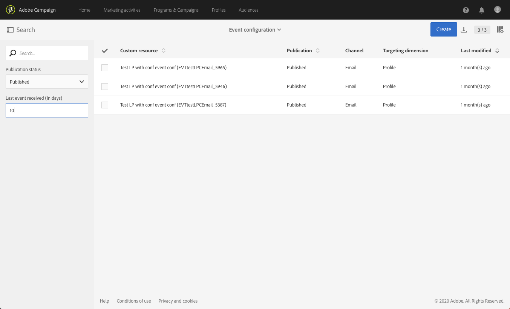

# Configurazione della messaggistica transazionale{#configuring-transactional-messaging}

Per inviare un messaggio transazionale con  Adobe Campaign, è necessario innanzitutto descrivere la struttura dei dati dell&#39;evento.

La configurazione dell&#39;evento deve essere eseguita da un [amministratore](../../administration/using/users-management.md#functional-administrators) seguendo la procedura indicata di seguito.

>[!NOTE]
>
>La configurazione può variare a seconda del tipo di messaggio transazionale che si desidera inviare. Per ulteriori informazioni, consultate Configurazioni [specifiche per gli eventi](#transactional-event-specific-configurations)transazionali.

Una volta pubblicato l’evento:

* L&#39;API che verrà utilizzata dallo sviluppatore del sito Web viene distribuita e gli eventi transazionali possono ora essere inviati. Consultate [Integrazione dell’attivazione dell’evento in un sito Web](#integrating-the-triggering-of-the-event-in-a-website).

* Il messaggio transazionale corrispondente viene creato automaticamente. Consulta [Guida introduttiva ai messaggi](../../channels/using/getting-started-with-transactional-msg.md)transazionali.

## Creazione di un evento {#creating-an-event}

Per iniziare, create l&#39;evento corrispondente alle vostre esigenze.

>[!IMPORTANT]
>
>Solo gli utenti che detengono il **[!UICONTROL Administration]** ruolo e fanno parte dell’unità **[!UICONTROL All]**  organizzativa dispongono dei diritti appropriati per creare una configurazione dell’evento.

1. Fai clic sul logo **[!UICONTROL Adobe Campaign]** nell’angolo in alto a sinistra, quindi seleziona **[!UICONTROL Marketing plans]** > **[!UICONTROL Transactional messages]** > **[!UICONTROL Event configuration]**.
1. Fai clic sul pulsante **[!UICONTROL Create]**.
1. Assegnate un **[!UICONTROL Label]** e un **[!UICONTROL ID]** all’evento. Il **[!UICONTROL ID]** campo è obbligatorio e deve iniziare con il prefisso &quot;EVT&quot;. Se non si utilizza questo prefisso, viene aggiunto automaticamente dopo aver fatto clic **[!UICONTROL Create]**.

   

   >[!IMPORTANT]
   >
   >L&#39;ID non deve superare i 64 caratteri, incluso il prefisso EVT.

1. Seleziona il canale che verrà utilizzato per inviare i messaggi transazionali **[!UICONTROL Email]**, **[!UICONTROL Mobile (SMS)]** o **[!UICONTROL Mobile application]** (notifica push).

   >[!NOTE]
   >
   >Puoi utilizzare un solo canale per ogni configurazione dell’evento. Dopo la creazione dell’evento, non puoi più cambiare il canale.

1. Selezionate la dimensione di targeting corrispondente alla configurazione dell&#39;evento desiderata e fate clic su **[!UICONTROL Create]**.

   I messaggi transazionali basati su eventi sono destinati ai dati contenuti nell&#39;evento stesso, mentre i messaggi transazionali basati su profilo sono destinati ai dati contenuti nel database Adobe Campaign . Per ulteriori informazioni, consultate Configurazioni [specifiche per gli eventi](#transactional-event-specific-configurations)transazionali.

>[!NOTE]
>
>Il numero di eventi in tempo reale creati può avere un impatto sulla piattaforma. Per garantire prestazioni ottimali, eliminate gli eventi in tempo reale di cui non avete più bisogno. See [Deleting an event](#deleting-an-event).

## Definizione degli attributi dell’evento {#defining-the-event-attributes}

Nella **[!UICONTROL Fields]** sezione, definite gli attributi che saranno integrati nel contenuto dell&#39;evento e che potranno quindi essere utilizzati per personalizzare il messaggio di transazione.

La procedura per aggiungere e modificare i campi è la stessa utilizzata per le risorse personalizzate.

>[!NOTE]
>
>Se desiderate creare un messaggio transazionale multilingue, definite un attributo dell&#39;evento aggiuntivo con l&#39; **[!UICONTROL AC_language]** ID. Ciò vale solo per i messaggi relativi alle transazioni degli eventi. Dopo la pubblicazione dell’evento, i passaggi per modificare il contenuto di un messaggio transazionale in più lingue sono gli stessi di un messaggio e-mail standard in più lingue. See [Creating a multilingual email](../../channels/using/creating-a-multilingual-email.md).

## Definizione delle raccolte di dati {#defining-data-collections}

Potete aggiungere al contenuto dell&#39;evento una raccolta di elementi, ciascuno stesso elemento con diversi attributi.

Questa raccolta può essere utilizzata in un messaggio e-mail transazionale per aggiungere elenchi di [prodotti](../../channels/using/event-transactional-messages.md#using-product-listings-in-a-transactional-message) al contenuto del messaggio, ad esempio un elenco di prodotti - con il prezzo, il numero di riferimento, la quantità, ecc. per ogni prodotto dell&#39;elenco.

1. In the **[!UICONTROL Collections]** section, click the **[!UICONTROL Create element]** button.

   

1. Aggiungete un&#39;etichetta e un ID per la raccolta.
1. Aggiungete tutti i campi che desiderate visualizzare nel messaggio transazionale per ciascun prodotto dell’elenco.

   In questo esempio, sono stati aggiunti i campi seguenti:

   

1. La **[!UICONTROL Enrichment]** scheda consente di arricchire ogni elemento della raccolta. In questo modo potrete personalizzare gli elementi dell&#39;elenco di prodotti corrispondente con informazioni provenienti dal database Adobe Campaign  o da altre risorse create.

>[!NOTE]
>
>I passaggi per l&#39;arricchimento degli elementi di una raccolta sono gli stessi descritti nella sezione [Arricchimento dell&#39;evento](#enriching-the-transactional-message-content) . Tenete presente che l&#39;arricchimento dell&#39;evento non consente di arricchire una raccolta: è necessario aggiungere un arricchimento alla raccolta stessa nella **[!UICONTROL Collections]** sezione.

Una volta pubblicati l&#39;evento e il messaggio, potrete utilizzare questa raccolta nel messaggio transazionale.

Anteprima API per questo esempio:

**Argomenti correlati:**

* [Anteprima e pubblicazione dell’evento](#previewing-and-publishing-the-event)
* [Utilizzo degli elenchi di prodotti in un messaggio sulle transazioni](../../channels/using/event-transactional-messages.md#using-product-listings-in-a-transactional-message)

## Arricchimento dell’evento {#enriching-the-transactional-message-content}

Puoi arricchire il contenuto dei messaggi transazionali con informazioni provenienti dal database Adobe Campaign  per personalizzare i messaggi. Dal cognome o dall&#39;ID CRM di ciascuno dei destinatari, ad esempio, puoi recuperare dati quali l&#39;indirizzo o la data di nascita o qualsiasi altro campo personalizzato aggiunto nella tabella Profilo, al fine di personalizzare le informazioni inviate.

È possibile arricchire il contenuto dei messaggi transazionali con informazioni provenienti da un sito esteso **[!UICONTROL Profile and services Ext API]**. Per ulteriori informazioni, consultate [Estensione dell&#39;API: Pubblicazione dell’estensione](../../developing/using/step-2--publish-the-extension.md)

Queste informazioni possono essere memorizzate anche in nuove risorse. In tal caso, la risorsa deve essere collegata direttamente alla **[!UICONTROL Profile]** o alle **[!UICONTROL Service]** risorse oppure tramite un&#39;altra tabella. Ad esempio, nella configurazione seguente, è possibile arricchire il contenuto del messaggio di transazione con informazioni provenienti dalla **[!UICONTROL Product]** risorsa come la categoria di prodotto o l&#39;ID, se la **[!UICONTROL Product]** risorsa è collegata alla **[!UICONTROL Profile]** risorsa.

Per ulteriori informazioni sulla creazione e la pubblicazione delle risorse, consultate [questa pagina](../../developing/using/key-steps-to-add-a-resource.md).

1. In the **[!UICONTROL Enrichment]** section, click the **[!UICONTROL Create element]** button.

   

1. Seleziona la risorsa con cui collegare il messaggio. In questo caso, scegliete la **[!UICONTROL Profile]** risorsa.

   

1. Utilizzate il **[!UICONTROL Create element]** pulsante per collegare un campo dalla risorsa selezionata a uno dei campi aggiunti in precedenza all’evento (consultate [Definizione degli attributi](#defining-the-event-attributes)dell’evento).

   

1. In questo esempio, i campi **[!UICONTROL Last name]** e quelli **[!UICONTROL First name]** corrispondenti vengono riconciliati con quelli corrispondenti nella **[!UICONTROL Profile]** risorsa.

   

   Puoi anche arricchire il contenuto dei messaggi transazionali utilizzando la **[!UICONTROL Service]** risorsa. For more on services, see this [section](../../audiences/using/creating-a-service.md).

1. Se stai creando o modificando un evento basato sul profilo, nella **[!UICONTROL Targeting enrichment]** sezione, seleziona l&#39;arricchimento che verrà utilizzato come destinazione del messaggio durante l&#39;esecuzione del recapito.

   

   >[!NOTE]
   >
   >La selezione di un arricchimento di targeting basato sulla **[!UICONTROL Profile]** risorsa è obbligatoria per gli eventi basati sul profilo.

Dopo la pubblicazione dell’evento e del messaggio, questo collegamento consente di arricchire il contenuto del messaggio transazionale.

**Argomenti correlati:**

* [Visualizzazione in anteprima e pubblicazione dell’evento](#previewing-and-publishing-the-event).
* [Personalizzazione di un messaggio sulle transazioni](../../channels/using/event-transactional-messages.md#personalizing-a-transactional-message).

## Previewing and publishing the event {#previewing-and-publishing-the-event}

Prima di poter utilizzare l’evento, dovete visualizzarlo in anteprima e pubblicarlo.

1. Fate clic sul **[!UICONTROL API preview]** pulsante per visualizzare una simulazione dell’API REST che verrà utilizzata dallo sviluppatore del sito Web prima della pubblicazione. Una volta pubblicato l&#39;evento, questo pulsante consente anche di visualizzare un&#39;anteprima dell&#39;API in produzione. Consultate [Integrazione dell’attivazione dell’evento in un sito Web](#integrating-the-triggering-of-the-event-in-a-website).

   

   >[!NOTE]
   >
   >L&#39;API REST varia in base al canale selezionato e alla dimensione di targeting selezionata. Per ulteriori dettagli sulle diverse configurazioni, consultate Configurazioni [specifiche per gli eventi](#transactional-event-specific-configurations)transazionali.

1. Fare clic **[!UICONTROL Publish]** per avviare la pubblicazione.

   

   L&#39;API che verrà utilizzata dallo sviluppatore del sito Web viene distribuita e gli eventi transazionali possono ora essere inviati.

1. Potete visualizzare i registri di pubblicazione nella scheda corrispondente.

   

   >[!IMPORTANT]
   >
   >Ogni volta che modificate l’evento, dovete fare di **[!UICONTROL Publish]** nuovo clic per generare l’API REST aggiornata che verrà utilizzata dallo sviluppatore del sito Web.

   Una volta pubblicato l’evento, viene automaticamente creato un messaggio transazionale collegato al nuovo evento.

1. Puoi accedere direttamente a questo messaggio transazionale tramite il collegamento situato nell’area a sinistra.

   

Affinché l’evento possa attivare l’invio di un messaggio transazionale, è necessario modificare e pubblicare il messaggio appena creato. Vedi [Messaggi transazionali di evento](../../channels/using/event-transactional-messages.md).

È inoltre necessario integrare questo evento attivatore nel sito Web. Consultate [Integrazione dell’attivazione dell’evento in un sito Web](#integrating-the-triggering-of-the-event-in-a-website).

Una volta  Adobe Campaign inizia a ricevere gli eventi relativi a questa configurazione di evento, il **[!UICONTROL Latest transactional events]** collegamento nella **[!UICONTROL History]** sezione consente di accedere agli eventi più recenti inviati dal servizio di terze parti ed elaborati da  Adobe Campaign.

Gli eventi (in formato JSON) sono elencati tra quelli più recenti e quelli meno recenti. Questo elenco consente di controllare dati quali il contenuto o lo stato di un evento, a scopo di controllo e debug.

### Annullamento della pubblicazione di un evento {#unpublishing-an-event}

Il **[!UICONTROL Unpublish]** pulsante consente di annullare la pubblicazione dell’evento, che elimina dall’API REST la risorsa corrispondente all’evento creato in precedenza. Adesso, anche se l’evento viene attivato nel sito web, i messaggi corrispondenti non saranno più inviati e pertanto non verranno memorizzati nel database.

>[!NOTE]
>
>Se hai già pubblicato il messaggio transazionale corrispondente, anche la pubblicazione dei messaggi transazionali viene annullata. See [Unpublishing a transactional message](../../channels/using/event-transactional-messages.md#unpublishing-a-transactional-message).

Fate clic sul **[!UICONTROL Publish]** pulsante per generare una nuova API REST.

### Processo di pubblicazione della messaggistica transazionale {#transactional-messaging-pub-process}

Il grafico seguente illustra il processo di pubblicazione della messaggistica transazionale.

Per ulteriori informazioni sulla pubblicazione, l&#39;interruzione e l&#39;annullamento della pubblicazione di un messaggio transazionale, consulta [questa sezione](../../channels/using/event-transactional-messages.md#publishing-a-transactional-message).

### Eliminazione di un evento {#deleting-an-event}

Dopo aver annullato la pubblicazione di un evento o se l’evento non è ancora stato pubblicato, potete eliminarlo dall’elenco di configurazione dell’evento. Per eseguire questa operazione:

1. Fai clic sul logo **[!UICONTROL Adobe Campaign]** nell’angolo in alto a sinistra, quindi seleziona **[!UICONTROL Marketing plans]** > **[!UICONTROL Transactional messages]** > **[!UICONTROL Event configuration]**.
1. Passate il mouse sulla configurazione dell&#39;evento desiderata e fate clic sul **[!UICONTROL Delete element]** pulsante.

   

   >[!NOTE]
   >
   >Make sure the event configuration has the **[!UICONTROL Draft]** status, otherwise you will not be able to delete it. The **[!UICONTROL Draft]** status applies to an event that has not been published yet or that has been [unpublished](#unpublishing-an-event).

1. Fai clic sul pulsante **[!UICONTROL Confirm]**.

   

>[!IMPORTANT]
>
>Eliminando una configurazione di evento che è stata pubblicata e già utilizzata, verranno eliminati anche i messaggi transazionali corrispondenti e i relativi registri di invio e tracciamento.

## Ricerca di eventi transazionali {#searching-transactional-events}

Per accedere agli eventi transazionali già creati ed eseguire ricerche, procedere come segue.

1. Fai clic sul logo **[!UICONTROL Adobe Campaign]** nell’angolo in alto a sinistra, quindi seleziona **[!UICONTROL Marketing plans]** > **[!UICONTROL Transactional messages]** > **[!UICONTROL Event configuration]**.
1. Fai clic sul pulsante **[!UICONTROL Show search]**.

   

1. Potete filtrare il contenuto sul **[!UICONTROL Publication status]**. Questo consente di visualizzare solo gli eventi pubblicati, ad esempio.
1. Potete anche filtrare gli eventi utilizzando l&#39; **[!UICONTROL Last event received]**. Ad esempio, se immettete 10, verranno visualizzate solo le configurazioni dell&#39;evento con l&#39;ultimo evento ricevuto 10 giorni fa o più. Questo consente di visualizzare gli eventi inattivi per un determinato periodo di tempo.

   

   >[!NOTE]
   >
   >Il valore predefinito è 0. Vengono visualizzati tutti gli eventi.

## Integrazione dell’attivazione dell’evento in un sito Web {#integrating-the-triggering-of-the-event-in-a-website}

Dopo aver creato un evento, dovrete integrare l’attivazione di questo evento nel sito Web.

Nell&#39;esempio descritto nella sezione relativa ai principi [operativi per i messaggi](../../channels/using/getting-started-with-transactional-msg.md#transactional-messaging-operating-principle) transazionali, si desidera attivare un evento di abbandono del carrello ogni volta che uno dei clienti abbandona il sito Web prima di acquistare i prodotti nel carrello. A tal fine, lo sviluppatore Web del sito Web deve utilizzare l&#39;API REST di Adobe Campaign Standard .

Consultate la Documentazione REST API.

## Configurazioni specifiche per eventi transazionali {#transactional-event-specific-configurations}

La configurazione dell&#39;evento transazionale può variare a seconda del tipo di messaggio transazionale che si desidera inviare (evento o profilo) e del canale che verrà utilizzato.

Le sezioni seguenti descrivono la configurazione specifica da impostare in base al messaggio transazionale desiderato. Per ulteriori informazioni sui passaggi generali per configurare un evento, vedere [Creazione di un evento](#creating-an-event).

### Messaggi transazionali basati su eventi {#event-based-transactional-messages}

Per inviare un messaggio di transazione basato su eventi, è innanzitutto necessario creare e configurare un evento per il targeting dei dati contenuti nell&#39;evento stesso.
Per ulteriori informazioni, consulta [Coinvolgimento con i messaggi](https://helpx.adobe.com/it/campaign/kb/simplify-campaign-management.html#Managedatatofuelengagingexperiences)transazionali.

1. Quando create la configurazione dell&#39;evento, selezionate la dimensione di **[!UICONTROL Real-time event]** targeting (consultate [Creazione di un evento](#creating-an-event)).
1. Aggiungete i campi all’evento per poter personalizzare il messaggio transazionale (consultate [Definizione degli attributi](#defining-the-event-attributes)dell’evento).
1. Arricchite il contenuto dei messaggi transazionali se desiderate utilizzare informazioni aggiuntive provenienti dal database Adobe Campaign  (consultate [Arricchimento del contenuto](#enriching-the-transactional-message-content)dei messaggi transazionali).

   >[!NOTE]
   >
   >La messaggistica transazionale basata su eventi dovrebbe utilizzare solo i dati presenti nell’evento inviato per definire il destinatario e la personalizzazione del contenuto del messaggio. Tuttavia, puoi arricchire il contenuto del messaggio transazionale utilizzando le informazioni contenute nel database di Adobe Campaign.

1. Visualizzate l’anteprima e pubblicate l’evento (consultate [Anteprima e pubblicazione dell’evento](#previewing-and-publishing-the-event)).

   Quando si visualizza l&#39;anteprima dell&#39;evento, l&#39;API REST contiene un attributo che specifica l&#39;indirizzo e-mail o il telefono cellulare in base al canale selezionato.

   Una volta pubblicato l’evento, viene automaticamente creato un messaggio transazionale collegato al nuovo evento. Affinché l’evento possa attivare l’invio di un messaggio transazionale, è necessario modificare e pubblicare il messaggio appena creato. Consultate Messaggi transazionali [evento](../../channels/using/event-transactional-messages.md).

1. Integrare l’evento nel sito Web (consultate [Integrazione dell’attivazione dell’evento in un sito Web](#integrating-the-triggering-of-the-event-in-a-website)).

### Messaggi transazionali basati su profili {#profile-based-transactional-messages}

Per inviare un messaggio transazionale basato sul profilo, è innanzitutto necessario creare e configurare i dati di targeting di un evento contenuti nel database Adobe Campaign .

1. Quando create la configurazione dell&#39;evento, selezionate la dimensione di **[!UICONTROL Profile event]** targeting (consultate [Creazione di un evento](#creating-an-event)).
1. Aggiungete i campi all’evento per poter personalizzare il messaggio transazionale (consultate [Definizione degli attributi](#defining-the-event-attributes)dell’evento). Per creare un arricchimento è necessario aggiungere almeno un campo. Non è necessario creare altri campi quali **Nome** e **Cognome** , in quanto sarà possibile utilizzare i campi di personalizzazione del database Adobe Campaign .
1. Create un arricchimento per collegare l’evento alla **[!UICONTROL Profile]** risorsa (consultate [Arricchimento del contenuto](#enriching-the-transactional-message-content)del messaggio transazionale). La creazione di un arricchimento è obbligatoria quando si utilizza una dimensione di **[!UICONTROL Profile]** targeting.
1. Visualizzate l’anteprima e pubblicate l’evento (consultate [Anteprima e pubblicazione dell’evento](#previewing-and-publishing-the-event)).

   Quando si visualizza l&#39;anteprima dell&#39;evento, l&#39;API REST non contiene un attributo che specifica l&#39;indirizzo e-mail o il telefono cellulare così come verrà recuperato dalla **[!UICONTROL Profile]** risorsa.

   Una volta pubblicato l’evento, viene automaticamente creato un messaggio transazionale collegato al nuovo evento. Affinché l’evento attivi l’invio di un messaggio transazionale, è necessario modificare e pubblicare il messaggio appena creato. Consultate [Invio di un messaggio](../../channels/using/profile-transactional-messages.md#sending-a-profile-transactional-message)transazionale di profilo.

1. Integrare l’evento nel sito Web (consultate [Integrazione dell’attivazione dell’evento in un sito Web](#integrating-the-triggering-of-the-event-in-a-website)).

### Notifiche push transazionali basate su eventi {#event-based-transactional-push-notifications}

Per poter inviare notifiche push transazionali, devi configurare  Adobe Campaign di conseguenza. Consultate Configurazione push.

Per inviare una notifica push transazionale anonima a tutti gli utenti che hanno acconsentito alla ricezione di notifiche dall&#39;applicazione mobile, è innanzitutto necessario creare e configurare un evento con targeting dei dati contenuti nell&#39;evento stesso. Le fasi corrispondenti sono presentate di seguito.

L&#39;evento deve contenere i tre elementi seguenti:

* Un token **di** registrazione, che è l’ID utente per un’applicazione mobile e un dispositivo. Potrebbe non corrispondere ad alcun profilo del database Adobe Campaign .
* Un nome **applicazione** mobile (uno per tutti i dispositivi - Android e iOS). Si tratta dell&#39;ID dell&#39;applicazione mobile configurata in  Adobe Campaign che verrà utilizzata per ricevere le notifiche push sui dispositivi degli utenti. Per ulteriori informazioni, consulta questa [pagina](https://docs.adobe.com/content/help/it-IT/campaign-standard/using/administrating/configuring-channels/configuring-a-mobile-application.html)
* Una piattaforma **** push (&quot;gcm&quot; per Android o &quot;apns&quot; per iOS).

1. Quando create la configurazione dell&#39;evento, selezionate il **[!UICONTROL Mobile application]** canale e la dimensione di **[!UICONTROL Real-time event]** targeting (consultate [Creazione di un evento](#creating-an-event)).
1. Aggiungete i campi all’evento per poter personalizzare il messaggio transazionale (consultate [Definizione degli attributi](#defining-the-event-attributes)dell’evento).
1. Arricchite il contenuto dei messaggi transazionali se desiderate utilizzare informazioni aggiuntive provenienti  database Adobe Campaign (consultate [Arricchimento del contenuto](#enriching-the-transactional-message-content)dei messaggi transazionali).

   >[!NOTE]
   >
   >La messaggistica transazionale basata su eventi dovrebbe utilizzare solo i dati presenti nell’evento inviato per definire il destinatario e la personalizzazione del contenuto del messaggio. Tuttavia, puoi arricchire il contenuto del messaggio transazionale utilizzando le informazioni contenute nel database di Adobe Campaign.

1. Visualizzate l’anteprima e pubblicate l’evento (consultate [Anteprima e pubblicazione dell’evento](#previewing-and-publishing-the-event)).

   Quando si visualizza l&#39;anteprima dell&#39;evento, l&#39;API REST contiene gli attributi &quot;registrationToken&quot;, &quot;application&quot; e &quot;pushPlatform&quot; che verranno utilizzati per eseguire il targeting della consegna.

   

   Una volta pubblicato l&#39;evento, viene automaticamente creata una notifica push transazionale collegata al nuovo evento. Per modificare e pubblicare il messaggio appena creato, consultate [Invio di una notifica push transazionale per un evento](../../channels/using/transactional-push-notifications.md#transactional-push-notifications-targeting-an-event).

1. Integrare l’evento nel sito Web (consultate [Integrazione dell’attivazione dell’evento in un sito Web](#integrating-the-triggering-of-the-event-in-a-website)).

### Notifiche push transazionali basate su profilo {#profile-based-transactional-push-notifications}

Per inviare una notifica push transazionale ai profili Adobe Campaign  che hanno effettuato l&#39;iscrizione all&#39;applicazione mobile, è innanzitutto necessario creare e configurare un evento per il targeting del database Adobe Campaign .

1. Quando create la configurazione dell&#39;evento, selezionate il **[!UICONTROL Mobile application]** canale e la dimensione di **[!UICONTROL Profile]** targeting (consultate [Creazione di un evento](#creating-an-event)).

   Per impostazione predefinita, la notifica push transazionale viene inviata a tutte le applicazioni mobili alle quali i destinatari hanno effettuato la sottoscrizione. Per inviare la notifica push a una specifica applicazione mobile, selezionatela nell&#39;elenco. Le altre applicazioni mobili verranno indirizzate in base al messaggio, ma verranno escluse dall’invio.

   

1. Aggiungete campi all’evento, se desiderate personalizzare il messaggio transazionale (consultate [Definizione degli attributi](#defining-the-event-attributes)dell’evento).

   >[!NOTE]
   >
   >Per creare un arricchimento è necessario aggiungere almeno un campo. Non è necessario creare altri campi quali **Nome** e **Cognome** , in quanto sarà possibile utilizzare i campi di personalizzazione del database Adobe Campaign .

1. Create un arricchimento per collegare l’evento alla **[!UICONTROL Profile]** risorsa (consultate [Arricchimento del contenuto](#enriching-the-transactional-message-content)del messaggio transazionale). La creazione di un arricchimento è obbligatoria quando si utilizza una dimensione di **[!UICONTROL Profile]** targeting.
1. Visualizzate l’anteprima e pubblicate l’evento (consultate [Anteprima e pubblicazione dell’evento](#previewing-and-publishing-the-event)).

   Quando si visualizza l&#39;anteprima dell&#39;evento, l&#39;API REST non contiene un attributo che specifica il token di registrazione, il nome dell&#39;applicazione e la piattaforma push così come verranno recuperati dalla **[!UICONTROL Profile]** risorsa.

   Una volta pubblicato l&#39;evento, viene automaticamente creata una notifica push transazionale collegata al nuovo evento. Per modificare e pubblicare il messaggio appena creato, consultate [Invio di una notifica push transazionale per un profilo](../../channels/using/transactional-push-notifications.md#transactional-push-notifications-targeting-a-profile).

1. Integrare l’evento nel sito Web (consultate [Integrazione dell’attivazione dell’evento in un sito Web](#integrating-the-triggering-of-the-event-in-a-website)).

### Configurazione di un evento per inviare un messaggio di follow-up {#configuring-an-event-to-send-a-follow-up-message}

Un messaggio di follow-up è un modello di consegna marketing predefinito che può essere utilizzato in un flusso di lavoro per inviare messaggi ai destinatari di un messaggio transazionale specifico. For more on this, see [Follow-up messages](../../channels/using/follow-up-messages.md).

1. Utilizzate la stessa configurazione evento creata per inviare un messaggio di transazione evento. See [Event-based transactional messages](#event-based-transactional-messages).
1. Quando configurate l&#39;evento, verificate la **[!UICONTROL Create follow-up delivery template for this event]** casella prima di pubblicare l&#39;evento.

   

1. Visualizzate l’anteprima e pubblicate l’evento (consultate [Anteprima e pubblicazione dell’evento](#previewing-and-publishing-the-event)).

   Una volta pubblicato l’evento, vengono automaticamente creati un messaggio transazionale e un modello di consegna di follow-up collegato al nuovo evento. Per ulteriori informazioni sull&#39;uso dei messaggi di follow-up, vedere [Invio di un messaggio](../../channels/using/follow-up-messages.md#sending-a-follow-up-message)di follow-up.

## Caso di utilizzo: configurazione di un evento per l&#39;invio di un messaggio transattivo {#use-case--configuring-an-event-to-send-a-transactional-message}

In questo esempio, vogliamo configurare un evento per inviare messaggi di conferma dopo ogni acquisto sul nostro sito Web con i seguenti prerequisiti:

Poiché vogliamo identificare il nostro cliente tramite il suo ID CRM, assicurati innanzitutto che la **[!UICONTROL Profile]** risorsa sia stata estesa con questo nuovo campo.

Allo stesso modo, una risorsa personalizzata corrispondente agli acquisti deve essere stata creata e pubblicata e deve essere collegata alla **[!UICONTROL Profile]** risorsa. In questo modo, potrai recuperare informazioni da questa risorsa per arricchire il contenuto del messaggio.

Per ulteriori informazioni sulla creazione e la pubblicazione delle risorse, consultate [questa pagina](../../developing/using/key-steps-to-add-a-resource.md).

1. Create un nuovo evento utilizzando il **[!UICONTROL Email]** canale e la dimensione di **[!UICONTROL Profile]** targeting (consultate [Creazione di un evento](#creating-an-event)).
1. Definite gli attributi che saranno disponibili per personalizzare il messaggio transazionale. Nel nostro caso, aggiungete i campi &quot;CRM ID&quot; e &quot;Product Identifier&quot; (ID prodotto) (consultate [Definizione degli attributi](#defining-the-event-attributes)dell&#39;evento).

   

1. Per arricchire il contenuto del messaggio con informazioni relative ai precedenti acquisti del cliente, create un arricchimento con targeting della **[!UICONTROL Purchase]** risorsa (consultate [Arricchimento del contenuto](#enriching-the-transactional-message-content)del messaggio transazionale).

   

1. Crea una condizione di partecipazione tra il campo &quot;ID prodotto&quot; precedentemente aggiunto al messaggio e il campo corrispondente della **[!UICONTROL Purchase]** risorsa.

   

1. Visualizzate l’anteprima e pubblicate l’evento (consultate [Anteprima e pubblicazione dell’evento](#previewing-and-publishing-the-event)).
1. Integrare l’evento nel sito Web (consultate [Integrazione dell’attivazione dell’evento in un sito Web](#integrating-the-triggering-of-the-event-in-a-website)).

