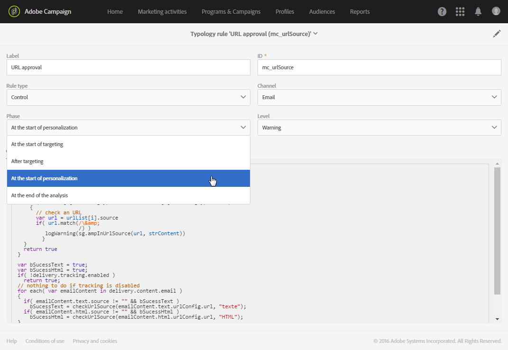

# Control rules{#control-rules}

Le regole di controllo consentono all'utente di controllare la validità e la qualità dei messaggi prima dell'invio, come visualizzazione dei caratteri, dimensioni del messaggio SMS, formato indirizzo ecc.

Un set di regole predefinite disponibili in Adobe Campaign garantisce i controlli standard:

* **[!UICONTROL Check subject]** (e-mail): controlla che l'oggetto e l'indirizzo mittente non contengano caratteri speciali che potrebbero causare problemi su determinati agenti di trasferimento e-mail e verificare che l'oggetto del messaggio sia stato completato.
* **[!UICONTROL Check URL labels]** (e-mail): controlla che ogni URL di tracciamento contenga un'etichetta.
* **[!UICONTROL Check URLs]** (e-mail): controlla gli URL di tracciamento (presenza del carattere " &amp;").
* **[!UICONTROL Check proof size]** (tutti i canali): genera un messaggio di errore se la popolazione di destinazione della prova supera i 100 destinatari.
* **Check unsubscription link** (email): verifica la presenza di almeno un URL di annullamento iscrizione (opt-out) in ciascun contenuto (HTML e Testo).
* **[!UICONTROL Check delivery size]** (tutti i canali): controlla le dimensioni dei messaggi.
* **[!UICONTROL Check social network sharing link]** (e-mail): controlla la presenza di un collegamento a una pagina speculare quando si inserisce un collegamento di condivisione della rete social (virallinks) nel contenuto.
* **[!UICONTROL A/B Test]**: estrae la popolazione di prova per una consegna con un test A/B.

Puoi scegliere il momento in cui applicare la regola da una delle fasi del ciclo di vita della distribuzione. Select the value to apply in the drop-down list from the **[!UICONTROL Phase]** field of the typology rule.

I valori possibili sono:

* **All'inizio del targeting**

   La regola di controllo può essere applicata in questa fase in modo che il passaggio di personalizzazione non venga eseguito in caso di errore.

* **Dopo il targeting**

   Se dovete conoscere il volume della destinazione per applicare la regola di controllo, selezionate questa fase.

   For example, the **Check proof size** control rule applies after the targeting stage: this rule prevents the preparation of message personalization if there are too many proof recipients.

* **All'inizio della personalizzazione**

   Questa fase deve essere selezionata se il controllo riguarda l'approvazione della personalizzazione dei messaggi. La personalizzazione dei messaggi viene eseguita durante la fase di analisi.

* **Alla fine dell'analisi**

   Quando un controllo richiede che la personalizzazione dei messaggi sia completa, selezionate questa fase.

>[!NOTE]
>
>Per motivi di sicurezza, il contenuto delle regole di controllo non può essere modificato. **[!UICONTROL Code]** Il campo è di sola lettura.
