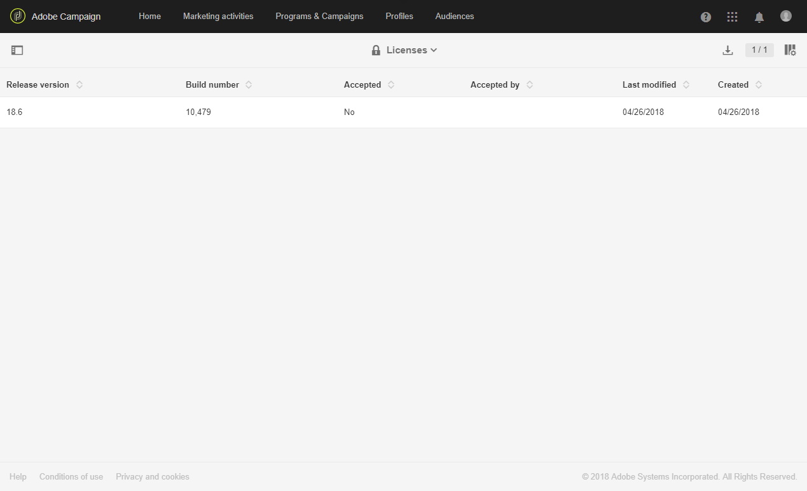
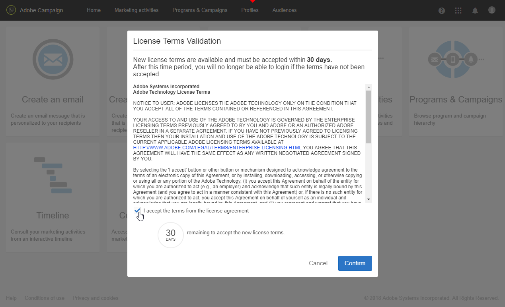
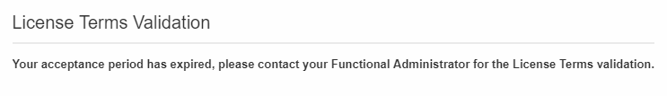

# Licenze{#licenses}

La finestra **[!UICONTROL Licenses]** consente di visualizzare le licenze installate nell&#39;istanza e diverse informazioni su di essa, ad esempio il numero di build, la versione o se i termini del contratto sono stati accettati e da chi.

Con una nuova build o una nuova funzione, le condizioni di licenza possono cambiare e devono essere accettate da un amministratore funzionale dell’istanza.

La seguente finestra viene visualizzata per gli utenti standard dopo l’accesso; non è richiesta alcuna azione da parte loro. Possono comunque lavorare su Adobe Campaign facendo clic sul pulsante **[!UICONTROL OK]**.

Un amministratore deve leggere e confermare i nuovi termini del contratto nei successivi 30 giorni dell&#39;installazione della build selezionando **[!UICONTROL I accept the terms from the license agreement]** e facendo clic su **[!UICONTROL Confirm]**.

Trascorsi questi 30 giorni, se il contratto non viene accettato, nessun utente potrà utilizzare questa istanza. Gli utenti standard non potranno accedere alle funzionalità di Adobe Campaign e visualizzeranno il seguente messaggio solo dopo che un amministratore funzionale avrà accettato i termini del contratto.

