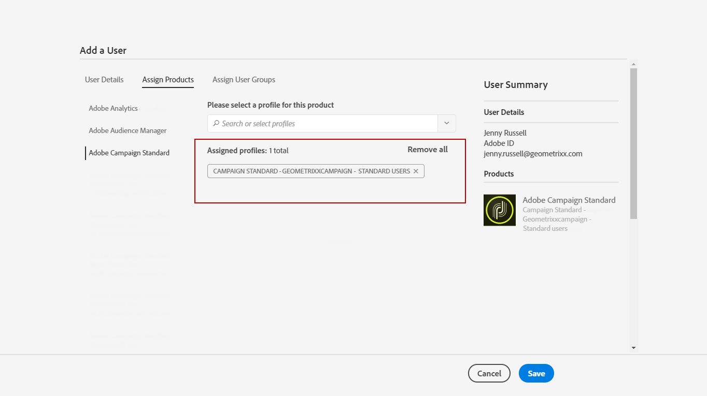

# Gestione di gruppi e utenti{#managing-groups-and-users}

## Informazioni sui gruppi di protezione {#about-security-groups}

I gruppi di sicurezza sono insiemi di utenti che condividono gli stessi ruoli e diritti all&#39;interno dell&#39;organizzazione.

Gli utenti devono sempre essere collegati a un gruppo di protezione. Questo consente di assegnare loro ruoli specifici e unità organizzative.

Per ulteriori informazioni sui ruoli, le tabelle della pagina seguente presentano le diverse operazioni disponibili in base ai ruoli di un utente: Autorizzazioni [Adobe Campaign Standard](https://docs.campaign.adobe.com/doc/standard/en/Technotes/AdobeCampaign-ACSRights.pdf).

I gruppi di sicurezza predefiniti sono:

* **[!UICONTROL Administrators]**
* **[!UICONTROL Delivery supervisors]**
* **[!UICONTROL Message Center agents]**
* **[!UICONTROL Standard Users]**
* **[!UICONTROL Workflow supervisors]**

Se un utente non è collegato ad alcun gruppo di sicurezza, non potrà accedere ad Adobe Campaign.

Per limitare l&#39;accesso di un utente, non aggiungete l&#39;utente al gruppo di utenti di Campaign Standard in quanto è collegato all&#39;unità **[!UICONTROL All]**organizzativa.

>[!NOTE]
>
>Per impostazione predefinita, l&#39;unità **[!UICONTROL All (all)]**organizzativa viene assegnata al gruppo di**[!UICONTROL Administrators]** sicurezza. È di sola lettura e non può essere modificato.

## Creazione di un gruppo di protezione e assegnazione di utenti {#creating-a-security-group-and-assigning-users}

>[!CAUTION]
>
>Nella console di amministrazione, i gruppi di sicurezza sono denominati profili.

Potete creare gruppi di sicurezza personalizzati se i gruppi forniti non sono sufficienti per gestire i vostri utenti. Possono essere gestiti dagli amministratori che hanno accesso ai menu di amministrazione di Adobe Campaign e all&#39;Admin Console. Per ulteriori informazioni su Admin Console, consulta questa [documentazione](https://helpx.adobe.com/enterprise/managing/user-guide.html).

In questo caso, è innanzitutto necessario assegnare ai nostri utenti i due gruppi predefiniti Standard user and Administrator. Questi gruppi di sicurezza limiteranno alcune funzionalità di Adobe Campaign: l&#39;utente standard dispone dell&#39;accesso di base ad Adobe Campaign, mentre l&#39;amministratore può accedere, ad esempio, ai menu di amministrazione.

Eventuali modifiche apportate ai gruppi di sicurezza nella console di amministrazione verranno sincronizzate non appena gli utenti accedono ad Adobe Campaign.

Quindi, vogliamo creare un set di gruppi di sicurezza Geometrixx e Geometrixx Clothes che limiteranno l&#39;accesso a seconda delle unità organizzative del nostro utente standard e amministratore.

È innanzitutto necessario assegnare agli utenti uno dei gruppi di sicurezza predefiniti:

1. In Admin Console, seleziona l’istanza e quindi la scheda **Utenti** .

   

1. Fate clic sul **[!UICONTROL Add user]**pulsante e immettete l’indirizzo e-mail dell’utente.
1. Nella **[!UICONTROL Assign Products]**scheda, selezionate l&#39;istanza e quindi il gruppo di protezione**[!UICONTROL Administrators]** out-of-the-box dall&#39;elenco a discesa. In questo modo l&#39;utente potrà accedere ai menu di amministrazione e creare i gruppi di sicurezza successivi.

   

1. Fate clic **[!UICONTROL Save]**e seguite le stesse procedure per assegnare il gruppo di sicurezza**[!UICONTROL Standard Users]** out-of-the-box al nuovo utente.

   

Una volta che i due utenti sono collegati ai gruppi di sicurezza **[!UICONTROL Administrators]**e**[!UICONTROL Standard users]** out-of-the-box che assegnano ruoli ai nostri utenti, l&#39;utente amministratore può ora creare i due gruppi di sicurezza **Geometrixx** e **Geometrixx Clothes** che assegneranno unità organizzative ai nostri utenti oltre ai gruppi di sicurezza out-of-the-box.

1. In Admin Console, seleziona l’istanza e quindi la scheda **Prodotti** .
1. Fate clic sul pulsante **Nuovo profilo** per creare il gruppo di sicurezza **Geometrixx** .

   

1. Digitate il testo **[!UICONTROL Profile name]**seguendo la sintassi esatta:**[!UICONTROL Campaign Standard- instance name - ID of the security group]** e fate clic **[!UICONTROL Done]**.

   L&#39;ID scelto verrà quindi utilizzato durante la creazione del gruppo di sicurezza in Adobe Campaign.

   >[!NOTE]
   >
   >Se la sintassi di cui sopra non funziona con un&#39;istanza precedente, deve essere sostituita da **[!UICONTROL Campaign - instance name - ID of the security group]**.

   

1. Quindi, seguite le stesse procedure per creare il gruppo di sicurezza **Geometrixx Clothes** .
1. Per assegnare il gruppo di protezione all’utente, selezionate la **[!UICONTROL Users]**scheda.

   

1. Fate clic sull’utente creato in precedenza e quindi sull’  icona nella **[!UICONTROL Products]**categoria.

   Selezionate **[!UICONTROL Edit products assigned directly]**per iniziare ad assegnare un nuovo gruppo di sicurezza all’utente.

   

1. Nella **[!UICONTROL Assign Products]**scheda, selezionate l’istanza e quindi i gruppi di sicurezza Geometrixx creati in precedenza dall’elenco a discesa per assegnarla all’utente Amministratore.

   Clic **[!UICONTROL Save]**.

   

   Se un utente si trova in diversi gruppi:

   * I ruoli dei diversi gruppi sono cumulati. Gli utenti si trovano in due gruppi diversi: uno che agisce sui ruoli dell&#39;altro sulle unità.
   * Si tratta dell&#39;unità più alta della gerarchia che verrà utilizzata (vedere l&#39;esempio nella sezione Unità  organizzative).
   * L&#39;utente non sarà più in grado di connettersi se le unità hanno lo stesso livello equivalente e si trovano in rami paralleli nella gerarchia.

1. Seguite le stesse procedure per assegnare il gruppo di sicurezza Geometrixx Clothes all’utente Standard.

   

I gruppi di sicurezza appena creati vengono ora creati in Admin Console. Affinché possano essere completamente sincronizzati, devi anche crearli in Adobe Campaign.

L&#39;utente Amministratore deve creare il set di gruppi di sicurezza utilizzati per assegnare le unità organizzative: Vestiti Geometrixx e Geometrixx. Per informazioni sulla creazione di unità organizzative, vedere [Creazione e gestione di unità](../../administration/using/organizational-units.md#creating-and-managing-units) .

1. Fate clic sul **[!UICONTROL Adobe Campaign]**logo, nell’angolo in alto a sinistra, quindi selezionate**[!UICONTROL Administration > Users & Security > Security groups]**.
1. Create il nuovo gruppo di sicurezza e specificate il relativo **[!UICONTROL Label]**e**[!UICONTROL ID]**.

   L’ID deve essere lo stesso scelto nell’Admin Console.

1. Nel **[!UICONTROL User access]**campo, assegnare l&#39;unità organizzativa. In questo caso, al gruppo di sicurezza Geometrixx viene assegnata l’unità**[!UICONTROL All]** organizzativa.

   

1. Potete anche assegnare ruoli al gruppo di sicurezza. Nel nostro caso, questo passaggio non è necessario perché i gruppi di sicurezza out-of-the-box **[!UICONTROL Administrators]**e**[!UICONTROL Standard users]** vengono utilizzati per assegnare i ruoli.
1. Seguire le stesse procedure per creare gli ultimi vestiti Geometrixx di sicurezza e assegnare l&#39;unità organizzativa Geometrixx Clothes.

   

Gli utenti ora sono assegnati a un gruppo di sicurezza e possono connettersi ad Adobe Campaign.

>[!CAUTION]
>
>Se gli utenti vengono rimossi da un gruppo di sicurezza nella console di amministrazione, rimarranno parte del gruppo di sicurezza Adobe Campaign e non potranno più accedere ad Adobe Campaign. In questo caso, rimuovete gli indirizzi e-mail degli utenti nella console di amministrazione per impedire loro di ricevere informazioni riservate.

