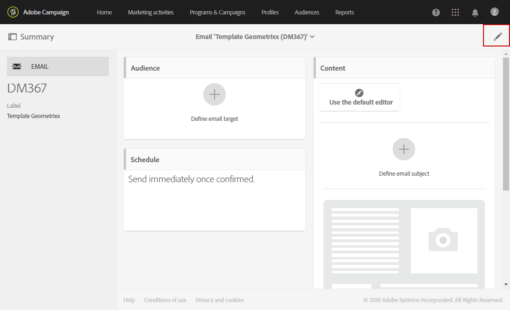

# Unità organizzative{#organizational-units}

## Informazioni sulle unità {#about-units}

Ogni oggetto e utente della piattaforma è collegato a un'unità organizzativa. Questa unità consente di definire una struttura gerarchica per fornire agli utenti una visualizzazione filtrata. L'unità di un utente definisce il livello di accesso per i diversi oggetti piattaforma.

>[!CAUTION]
>
>Se un utente non è collegato ad alcuna unità, non sarà in grado di connettersi ad Adobe Campaign. Se si desidera limitare l'accesso a un utente o a un gruppo specifico di utenti, non collegarlo all' **[!UICONTROL All]** unità.

Un utente ha accesso in sola lettura a tutti gli oggetti nelle unità principali. Ha accesso in lettura e scrittura a tutti gli oggetti della sua unità e delle sue unità figlie. Un utente non ha accesso agli oggetti in rami paralleli.

Per impostazione predefinita, sono disponibili solo **[!UICONTROL All]** le unità.

Quando all'utente viene assegnata un'unità organizzativa, questa unità verrà sempre applicata agli oggetti creati dall'utente.

>[!NOTE]
>
>Quando un utente si trova in diversi gruppi collegati a unità diverse, vengono applicate determinate regole. Per ulteriori informazioni, consultate la sezione [Gestione di gruppi e utenti](../../administration/using/managing-groups-and-users.md) .

## Creazione e gestione di unità {#creating-and-managing-units}

Le unità organizzative consentono di filtrare l’istanza in base all’organizzazione a cui sono collegati gli utenti. Questa unità può rappresentare una regione, un paese o persino un marchio nell'istanza.

In questa sezione sono stati creati in precedenza gruppi di sicurezza con ruoli diversi per due utenti: a un utente vengono assegnati i gruppi di sicurezza Amministratori e Geometrixx, l’altro utente appartiene ai gruppi di sicurezza Standard user and Geometrixx Clothes Vedere [Creazione di un gruppo di protezione e assegnazione di utenti](../../administration/using/managing-groups-and-users.md#creating-a-security-group-and-assigning-users) per l’esempio completo.

È ora necessario creare le unità organizzative per i gruppi di sicurezza Geometrixx Clothes e Geometrixx:

1. Dal menu avanzato della campagna Adobe, selezionate **[!UICONTROL Administration]** &gt; **[!UICONTROL Users & security]** &gt; **[!UICONTROL Organizational units]**.
1. Fare clic **[!UICONTROL Create]** per iniziare a configurare l'unità organizzativa.

   

1. Modificate il valore predefinito **[!UICONTROL Label]** e **[!UICONTROL ID]** in Geometrixx.
1. Collegate quindi l'unità a un'unità padre. Qui, abbiamo scelto **[!UICONTROL All]**.

   

1. Infine, fare clic **[!UICONTROL Create]** per iniziare ad assegnare la nuova unità organizzativa al gruppo di sicurezza.
1. Seguire la stessa procedura per l'unità Geometrixx Clothes (Abbigliamento Geometrixx), fatta eccezione per il fatto che l'unità principale deve essere l'unità creata in precedenza, Geometrixx.

   

Per verificare l’impatto dell’assegnazione di diverse unità a diversi gruppi di sicurezza, l’utente assegnato ai gruppi Amministratore e Geometrixx creerà due modelli e-mail per vedere a cosa possono o non possono accedere gli altri utenti assegnati a Standard User e Geometrixx Clothes.

1. Dal menu avanzato, selezionate **[!UICONTROL Resources]** &gt; **[!UICONTROL Templates]** &gt; **[!UICONTROL Delivery Templates]**.
1. Duplica un modello esistente e personalizzalo come necessario. Per ulteriori informazioni, consultare la sezione [Informazioni sui modelli](../../start/using/about-templates.md) .
1. Quando il modello viene creato, selezionate l' **[!UICONTROL Edit properties]** icona per assegnare le unità al modello.

   

1. Nel menu a **[!UICONTROL Access authorization]** discesa, selezionate l'unità organizzativa.

   Qui stiamo per creare un modello con l'unità organizzativa precedentemente creata Geometrixx.

   

1. Seguite le stesse procedure per creare il secondo modello assegnato all’unità organizzativa Geometrixx Clothes creata in precedenza.

L’utente assegnato ai gruppi Standard User (Utente standard) e Geometrixx Clothes (Abiti Geometrixx) potrà visualizzare entrambi i modelli. A causa della struttura gerarchica delle unità organizzative, gli sarà consentito l’accesso in lettura e scrittura al modello collegato all’unità vestiti Geometrixx e l’accesso in sola lettura al modello collegato all’unità Geometrixx.

Poiché l’unità Abbigliamento Geometrixx è un’unità secondaria di Geometrixx, quando l’utente tenta di modificare il modello Geometrixx viene visualizzato il seguente messaggio:

Le unità organizzative possono limitare l'accesso a funzioni diverse come i profili. Ad esempio, se il nostro utente Geometrixx Clothes accede alla **[!UICONTROL Profiles]** scheda, potrà accedere e modificare completamente i profili con l'unità organizzativa Geometrixx Clothes.

Mentre i profili con l’unità organizzativa Geometrixx saranno di sola lettura, se l’utente tenta di modificare un profilo verrà visualizzato il seguente errore: **[!UICONTROL You do not have the rights needed to modify the 'profile' resource of ID]**.

## Profili di partizionamento {#partitioning-profiles}

Se l'organizzazione deve isolare i profili contattati da ciascuno dei marchi, puoi suddividere i profili in base alle unità organizzative.

Per impostazione predefinita, i campi dell’unità organizzativa non sono disponibili nei profili e devono essere aggiunti.

Gli utenti non possono accedere ai profili senza unità organizzative.

>[!CAUTION]
>
>È consigliabile aggiungere questa opzione prima di importare qualsiasi profilo. Se avete già importato il database dei clienti, è necessario un aggiornamento per impostare i valori delle unità organizzative sui profili già importati.

1. Dal menu avanzato, tramite il logo Adobe Campaign, seleziona **Amministrazione &gt; Sviluppo &gt; Risorse** personalizzate.
1. Selezionate **Profilo** o create una nuova risorsa personalizzata per estendere i profili.
1. Selezionate la casella **Aggiungi campi** di gestione autorizzazione di accesso per aggiungere le unità organizzative nell’estensione **Profilo** .

   

1. Click **[!UICONTROL Save]**.
1. Aggiornate la struttura pubblicando nuovamente le risorse personalizzate. Per ulteriori informazioni sul processo di pubblicazione, vedere [Aggiornamento della sezione struttura](../../developing/using/data-model-concepts.md) .

Il campo unità organizzativa viene aggiunto ai profili nella **[!UICONTROL Access authorization]** sezione.

**Argomenti** correlati:

* [Informazioni sulle unità](../../administration/using/organizational-units.md#about-units)
* [Informazioni sulla gestione degli accessi](../../administration/using/about-access-management.md)

