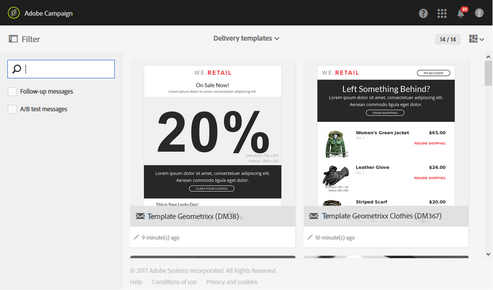

# Unità organizzative{#organizational-units}

## Informazioni sulle unità {#about-units}

Ogni oggetto e utente della piattaforma è collegato a un’unità organizzativa. Questa unità consente di definire una struttura gerarchica al fine di fornire agli utenti una visualizzazione filtrata. L’unità di un utente definisce il livello di accesso per i diversi oggetti della piattaforma.

>[!IMPORTANT]
>
>Se un utente non è collegato ad alcuna unità, non sarà in grado di connettersi ad Adobe Campaign. Se desideri limitare l’accesso a un particolare utente o gruppo di utenti, non collegarlo al **[!UICONTROL All]** unità. È consigliabile aggiungere l’opzione **Accedere ai campi di gestione delle autorizzazioni** prima di importare qualsiasi profilo. Per ulteriori informazioni, consulta questa [sezione](../../administration/using/organizational-units.md#partitioning-profiles).
>
>Per impostazione predefinita, l’unità organizzativa **[!UICONTROL All (all)]** viene assegnata al gruppo di sicurezza **[!UICONTROL Administrators]**. È di sola lettura e non può essere modificata.

Un utente ha accesso in sola lettura a tutti gli oggetti nelle unità principali. Tale utente ha accesso in lettura e scrittura a tutti gli oggetti della propria unità e unità figlio. Un utente non ha accesso agli oggetti nei rami paralleli.

Per impostazione predefinita, solo la variabile **[!UICONTROL All]** unità disponibili.

Quando all’utente viene assegnata un’unità organizzativa, questa unità viene sempre applicata agli oggetti creati dall’utente.

>[!NOTE]
>
>Quando un utente si trova in diversi gruppi collegati a unità diverse, vengono applicate determinate regole. Per ulteriori informazioni, consulta la [Gestione di gruppi e utenti](../../administration/using/managing-groups-and-users.md) sezione .

## Creazione e gestione di unità {#creating-and-managing-units}

Le unità organizzative ti consentono di filtrare l’istanza in base all’organizzazione a cui sono collegati gli utenti. Questa unità può rappresentare una regione, un paese o persino un marchio nella tua istanza.

In precedenza, abbiamo creato gruppi di sicurezza con ruoli diversi per due utenti: a un utente vengono assegnati i gruppi di sicurezza Amministratori e Geometrixx, l&#39;altro utente appartiene ai gruppi di sicurezza Utenti e vestiti standard Vedere [Creazione di un gruppo di sicurezza e assegnazione di utenti](../../administration/using/managing-groups-and-users.md#creating-a-security-group-and-assigning-users) per l&#39;esempio completo.

Ora è necessario creare le unità organizzative per i gruppi di sicurezza Geometrixx Vestiti e Geometrixx:

1. Dal menu avanzato di Adobe Campaign, seleziona **[!UICONTROL Administration]** > **[!UICONTROL Users & security]** > **[!UICONTROL Organizational units]**.
1. Fai clic su **[!UICONTROL Create]** per iniziare a configurare l’unità organizzativa.

   

1. Modificare il valore predefinito **[!UICONTROL Label]** e **[!UICONTROL ID]** a Geometrixx.
1. Quindi, collega l&#39;unità a un&#39;unità principale. Qui abbiamo scelto **[!UICONTROL All]**.

   

1. Infine, fai clic su **[!UICONTROL Create]** per iniziare ad assegnare la nuova unità organizzativa al gruppo di sicurezza.
1. Seguire la stessa procedura per l&#39;unità Abbigliamento Geometrixx, tranne per il fatto che l&#39;unità madre deve essere l&#39;unità creata in precedenza, Geometrixx.

   

Per vedere l’impatto dell’assegnazione di unità diverse a gruppi di sicurezza diversi, l’utente assegnato all’amministratore e ai gruppi di Geometrixx creerà due modelli e-mail per vedere a cosa può o non può accedere l’altro utente assegnato a Utente standard e vestiti Geometrixx.

1. Dal menu avanzato, seleziona **[!UICONTROL Resources]** > **[!UICONTROL Templates]** > **[!UICONTROL Delivery Templates]**.
1. Duplica un modello esistente e personalizzalo in base alle esigenze. Per ulteriori informazioni, consulta la sezione [Informazioni sui modelli](../../start/using/marketing-activity-templates.md) sezione .
1. Quando il modello viene creato, seleziona la **[!UICONTROL Edit properties]** per assegnare unità al modello.

   

1. In **[!UICONTROL Access authorization]** dal menu a discesa, seleziona l’unità organizzativa .

   Qui creeremo un modello con il Geometrixx di unità organizzativa creato in precedenza.

   

1. Seguire le stesse procedure per creare il secondo modello assegnato all&#39;unità organizzativa Geometrixx Clothes creata in precedenza.

Utenti assegnati al **Utente standard** e **Vestiti Geometrixx** i gruppi potranno visualizzare entrambi i modelli. A causa della struttura gerarchica delle unità organizzative, avranno accesso in lettura e scrittura al modello collegato all&#39;unità Abbigliamento Geometrixx e accesso in sola lettura al modello collegato all&#39;unità Geometrixx.

Poiché l’unità Abiti Geometrixx è un’unità secondaria di Geometrixx, quando gli utenti tentano di modificare il modello di Geometrixx viene visualizzato il seguente messaggio:

Le unità organizzative possono limitare l’accesso a funzioni diverse, come i profili. Ad esempio, se i nostri utenti di Abbigliamento Geometrixx accedono al **[!UICONTROL Profiles]** potranno accedere e modificare completamente i profili con l’unità organizzativa Geometrixx Clothes.

Mentre i profili con l’unità organizzativa Geometrixx saranno di sola lettura, se gli utenti tentano di modificare un profilo viene visualizzato il seguente errore: **[!UICONTROL You do not have the rights needed to modify the 'profile' resource of ID]**.

## Profili di partizione {#partitioning-profiles}

>[!IMPORTANT]
>
>È consigliabile aggiungere questa opzione prima di importare qualsiasi profilo, in quanto gli utenti non possono accedere a profili privi di unità organizzative.
>
>Se hai già importato il database dei clienti, è necessario un aggiornamento per impostare i valori delle unità organizzative sui profili già importati.

Se l’organizzazione deve isolare i profili contattati da ciascuno dei diversi marchi, puoi suddividere i profili in base alle unità organizzative.

Per impostazione predefinita, i campi dell’unità organizzativa non sono disponibili sui profili e devono essere aggiunti.

1. Dal menu avanzato, tramite il logo Adobe Campaign, seleziona **Amministrazione > Sviluppo > Risorse personalizzate**.
1. Seleziona **Profilo** oppure crea una nuova risorsa personalizzata per estendere i profili. Per ulteriori informazioni su come estendere i profili, consulta questo [page](../../developing/using/extending-the-profile-resource-with-a-new-field.md#step-1--extend-the-profile-resource).
1. Controlla la **Aggiungi campi di gestione delle autorizzazioni di accesso** per aggiungere le unità organizzative nel **Profilo** estensione.

   

1. Fai clic su **[!UICONTROL Save]**.
1. Aggiorna la struttura ripubblicando le risorse personalizzate. Per ulteriori informazioni sul processo di pubblicazione, consulta [Aggiornamento della struttura](../../developing/using/updating-the-database-structure.md) sezione .

Il campo dell’unità organizzativa viene aggiunto ai profili nella sezione **[!UICONTROL Access authorization]** sezione .

**Argomenti correlati**:

* [Informazioni sulle unità](../../administration/using/organizational-units.md#about-units)
* [Informazioni sulla gestione degli accessi](../../administration/using/about-access-management.md)
