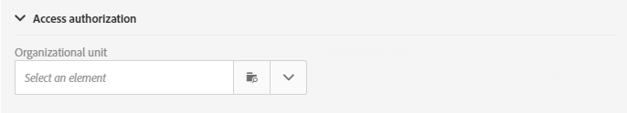

# Unità organizzative{#organizational-units}

## Informazioni sulle unità {#about-units}

Ogni oggetto e utente della piattaforma è collegato a un’unità organizzativa. Questa unità consente di definire una struttura gerarchica per offrire agli utenti una vista filtrata. L’unità di un utente definisce il proprio livello di accesso per diversi oggetti piattaforma.

>[!IMPORTANT]
>
>Se un utente non è collegato ad alcuna unità, non potrà connettersi ad Adobe Campaign. Se si desidera limitare l&#39;accesso per un utente o un gruppo di utenti specifico, non collegarlo all&#39;unità **[!UICONTROL All]**. È consigliabile aggiungere l&#39;opzione **Accedere ai campi di gestione delle autorizzazioni** prima di importare qualsiasi profilo. Per ulteriori informazioni, consulta questa [sezione](../../administration/using/organizational-units.md#partitioning-profiles).
>
>Per impostazione predefinita, l’unità organizzativa **[!UICONTROL All (all)]** viene assegnata al gruppo di sicurezza **[!UICONTROL Administrators]**. È di sola lettura e non può essere modificata.

Un utente ha accesso in sola lettura a tutti gli oggetti nelle unità padre. Tale utente dispone dell&#39;accesso in lettura e scrittura a tutti gli oggetti della propria unità e delle unità secondarie. Un utente non ha accesso agli oggetti nei rami paralleli.

Per impostazione predefinita, sono disponibili solo le **[!UICONTROL All]** unità.

Quando all’utente viene assegnata un’unità organizzativa, questa viene sempre applicata agli oggetti creati dall’utente.

>[!NOTE]
>
>Quando un utente si trova in più gruppi collegati a unità diverse, vengono applicate determinate regole. Per ulteriori informazioni, vedere la sezione [Gestione di gruppi e utenti](../../administration/using/managing-groups-and-users.md).

## Creazione e gestione delle unità {#creating-and-managing-units}

Le unità organizzative ti consentono di filtrare l’istanza a seconda dell’organizzazione a cui sono collegati gli utenti. L&#39;unità può rappresentare una regione, un paese o persino un marchio.

In precedenza sono stati creati gruppi di sicurezza con ruoli diversi per due utenti: a un utente sono assegnati i gruppi di sicurezza Administrators e Geometrixx, all&#39;altro utente appartiene ai gruppi di sicurezza Standard user e Geometrixx Clothes Vedere [Creazione di un gruppo di sicurezza e assegnazione di utenti](../../administration/using/managing-groups-and-users.md#creating-a-security-group-and-assigning-users) per l&#39;esempio completo.

Ora dobbiamo creare le unità organizzative per i gruppi di sicurezza Geometrixx Clothes e Geometrixx:

1. Dal menu avanzato della campagna di Adobe, selezionare **[!UICONTROL Administration]** > **[!UICONTROL Users & security]** > **[!UICONTROL Organizational units]**.
1. Fai clic su **[!UICONTROL Create]** per iniziare a configurare l&#39;unità organizzativa.

   

1. Modificare i valori predefiniti **[!UICONTROL Label]** e **[!UICONTROL ID]** in Geometrixx.
1. Quindi, collegare l&#39;unità a un&#39;unità padre. In questo caso, abbiamo scelto **[!UICONTROL All]**.

   

1. Infine, fai clic su **[!UICONTROL Create]** per iniziare ad assegnare la nuova unità organizzativa al gruppo di sicurezza.
1. Seguire la stessa procedura per l&#39;unità Geometrixx Clothes, tranne per il fatto che l&#39;unità padre deve essere l&#39;unità creata in precedenza, Geometrixx.

   

Per verificare l’impatto dell’assegnazione di diverse unità a gruppi di sicurezza diversi, l’utente assegnato all’amministratore e ai Geometrixx creerà due modelli e-mail per verificare a cosa possono o non possono accedere gli altri utenti assegnati a utenti standard e Geometrixx Clothes.

1. Dal menu avanzato, selezionare **[!UICONTROL Resources]** > **[!UICONTROL Templates]** > **[!UICONTROL Delivery Templates]**.
1. Duplica un modello esistente e personalizzalo in base alle esigenze. Per ulteriori informazioni, consulta la sezione [Informazioni sui modelli](../../start/using/marketing-activity-templates.md).
1. Al momento della creazione del modello, seleziona l&#39;icona **[!UICONTROL Edit properties]** per assegnare unità al modello.

   

1. Nel menu a discesa **[!UICONTROL Access authorization]**, seleziona l&#39;unità organizzativa.

   Stiamo per creare un modello con il Geometrixx di unità organizzativa creato in precedenza.

   

1. Segui le stesse procedure per creare il secondo modello assegnato all’unità organizzativa Geometrixx Clothes creata in precedenza.

Gli utenti assegnati ai gruppi **Utente standard** e **Abbigliamento Geometrixx** potranno visualizzare entrambi i modelli. A causa della struttura gerarchica delle unità organizzative, queste disporranno dell’accesso in lettura e scrittura al modello collegato all’unità Geometrixx Clothes e dell’accesso in sola lettura al modello collegato all’unità Geometrixx.

Poiché l&#39;unità Geometrixx Clothes è un&#39;unità figlio di Geometrixx Geometrixx, quando gli utenti tentano di modificare il modello viene visualizzato il seguente messaggio:

Le unità organizzative possono limitare l’accesso a diverse funzioni, ad esempio i profili. Se ad esempio gli utenti di Geometrixx Clothes accedono alla scheda **[!UICONTROL Profiles]**, potranno accedere e modificare completamente i profili con l&#39;unità organizzativa Geometrixx Clothes.

Mentre i profili con l&#39;unità organizzativa Geometrixx saranno di sola lettura, se gli utenti tentano di modificare un profilo verrà visualizzato il seguente errore: **[!UICONTROL You do not have the rights needed to modify the 'profile' resource of ID]**.

## Partizionamento dei profili {#partitioning-profiles}

>[!IMPORTANT]
>
>È consigliabile aggiungere questa opzione prima di importare qualsiasi profilo, in quanto gli utenti non possono accedere a profili privi di unità organizzative.
>
>Se hai già importato il database dei clienti, è necessario un aggiornamento per impostare i valori delle unità organizzative sui profili già importati.

Se la tua organizzazione deve isolare i profili contattati da ciascuno dei diversi brand, puoi suddividere i profili in base alle unità organizzative.

Per impostazione predefinita, i campi dell’unità organizzativa non sono disponibili nei profili e devono essere aggiunti.

1. Dal menu avanzato, tramite il logo Adobe Campaign, seleziona **Amministrazione > Sviluppo > Risorse personalizzate**.
1. Seleziona **Profilo** o crea una nuova risorsa personalizzata per estendere i profili. Per ulteriori informazioni su come estendere i profili, consulta questa [pagina](../../developing/using/extending-the-profile-resource-with-a-new-field.md#step-1--extend-the-profile-resource).
1. Selezionare la casella **Aggiungi campi gestione autorizzazioni di accesso** per aggiungere le unità organizzative nell&#39;estensione **Profilo**.

   

1. Fai clic su **[!UICONTROL Save]**.
1. Aggiorna la struttura ripubblicando le risorse personalizzate. Per ulteriori informazioni sul processo di pubblicazione, fare riferimento alla sezione [Aggiornamento della struttura](../../developing/using/updating-the-database-structure.md).

Il campo unità organizzativa viene aggiunto ai profili nella sezione **[!UICONTROL Access authorization]**.

**Argomenti correlati**:

* [Informazioni sulle unità](../../administration/using/organizational-units.md#about-units)
* [Informazioni sulla gestione degli accessi](../../administration/using/about-access-management.md)
