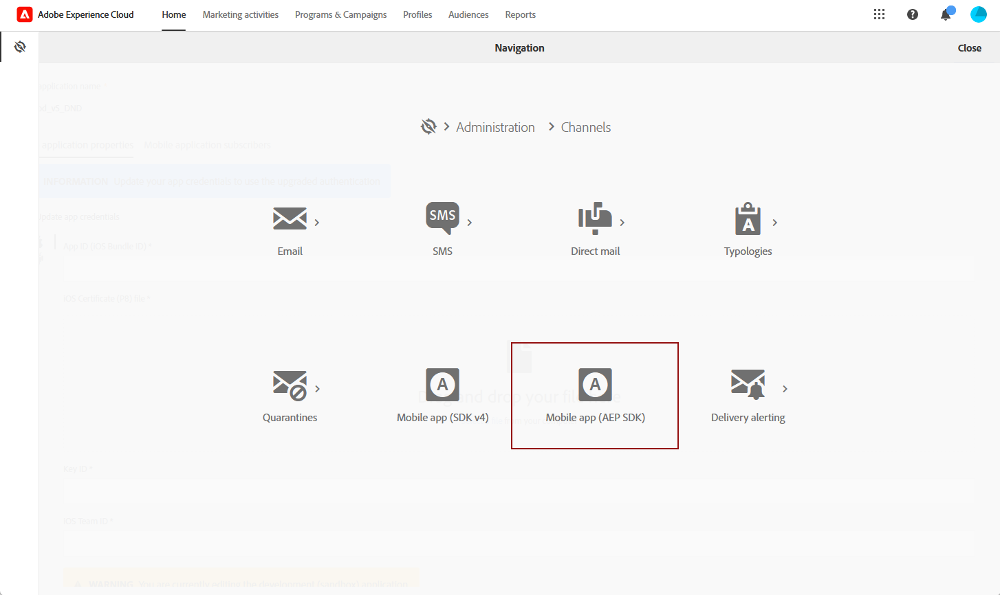

# Modifiche del canale di notifica push {#push-upgrade}

Puoi utilizzare Campaign per inviare notifiche push su dispositivi Android e iOS. Per eseguire questa operazione, Campaign si basa su servizi di abbonamento specifici. Alcune modifiche importanti al servizio Android Firebase Cloud Messaging (FCM) sono state rilasciate nel 2024 e potrebbero influire sull’implementazione di Adobe Campaign. Per supportare questa modifica, potrebbe essere necessario aggiornare la configurazione dei servizi di abbonamento per i messaggi push di Android.

Inoltre, Adobe consiglia vivamente di passare alla connessione basata su token ai numeri APN anziché a una connessione basata su certificati, che è più sicura e scalabile.

Per garantire la continuità del servizio, è necessario aggiornare le applicazioni mobili registrate con Adobe Campaign per incorporare i meccanismi di autenticazione più recenti per FCM (Android) e APN (iOS).

[Scopri come configurare i certificati per app mobili in Adobe Campaign Standard](configuring-a-mobile-application.md#channel-specific-config)

## Servizio Google Android Firebase Cloud Messaging (FCM) {#fcm-push-upgrade}

### Cosa è cambiato? {#fcm-changes}

Nell&#39;ambito del continuo impegno di Google per migliorare i propri servizi, le API FCM legacy cesseranno il **20 giugno 2024**. Ulteriori informazioni sul protocollo HTTP Firebase Cloud Messaging sono disponibili nella [documentazione di Google Firebase](https://firebase.google.com/docs/cloud-messaging/http-server-ref){target="_blank"}.

A partire dalla versione [24.1](../../rn/using/release-notes.md), Adobe Campaign Standard supporta le API HTTP v1 per l&#39;invio dei messaggi di notifica push di Android.

### Sei interessato? {#fcm-impact}

Se utilizzi già Adobe Campaign Standard per l’invio di notifiche push, è necessario aggiornare l’implementazione.

Per evitare distrazioni di servizio, è necessario passare alle API più recenti.

<!--To check if you are impacted, you can filter your **Services and Subscriptions** as per the filter below

* If any of your active push notification service uses the **HTTP (legacy)** API, your setup will be directly impacted by this change. You must review your current configurations and move to the newer APIs as described below.

* If your setup exclusively uses the **HTTP v1** API for Android push notifications, then you are already in compliance and no further action will be required on your part.-->

### Come si esegue l’aggiornamento? {#fcm-transition-procedure}

#### Prerequisiti {#fcm-transition-prerequisites}

* Il supporto della modalità **API HTTP v1** è stato aggiunto nella versione 24.1. Se l&#39;ambiente è in esecuzione su una versione precedente, un prerequisito per questa modifica è aggiornare l&#39;ambiente alla [versione più recente di Campaign Standard](../../rn/using/release-notes.md).

* Il file JSON dell&#39;account del servizio Android Firebase Admin SDK è necessario per spostare l&#39;app mobile su HTTP v1. Scopri come ottenere questo file nella [documentazione di Google Firebase](https://firebase.google.com/docs/admin/setup#initialize-sdk){target="_blank"}.

* Se utilizzi ancora questa versione legacy dell’SDK, devi aggiornare l’implementazione con l’SDK di Adobe Experience Platform. Scopri come migrare all’SDK di Adobe Experience Platform in [questo articolo](sdkv4-migration.md).

* Prima di eseguire i passaggi seguenti, assicurati di disporre dell&#39;autorizzazione **Configurazione app mobile** in Adobe Experience Platform Data Collection Mobile. [Ulteriori informazioni](https://experienceleague.adobe.com/docs/experience-platform/collection/permissions.html?lang=en#adobe-experience-platform-data-collection-permissions){target="_blank"}.

#### Procedura di transizione {#fcm-transition-steps}

Per spostare l’ambiente in HTTP v1, effettua le seguenti operazioni:

1. Passa a **[!UICONTROL Administration]** > **[!UICONTROL Channels]** > **[!UICONTROL Mobile app (AEP SDK)]**.

   

1. Seleziona l’app mobile specifica che richiede l’aggiornamento del certificato.

1. Selezionare la casella di controllo **[!UICONTROL Update app credentials]**.

   

1. Specifica l&#39;ID app (nome pacchetto Android) dal file `build.gradle` del progetto Android. Ad esempio, `com.android.test.testApp`. Assicurati di utilizzare ID diversi per gli ambienti di staging e produzione.

1. Carica il file della chiave privata JSON di Android.

   

1. Fai clic sul pulsante **Salva**.

>[!NOTE]
>
>Una volta applicate queste modifiche, tutte le nuove consegne di notifiche push ai dispositivi Android utilizzano l’API HTTP v1. Le consegne push esistenti in un nuovo tentativo, in corso e in uso utilizzano ancora l’API HTTP (legacy).

## Servizio Apple iOS Push Notification (APNs) {#apns-push-upgrade}

### Cosa è cambiato? {#ios-changes}

Come consigliato da Apple, è necessario proteggere le comunicazioni con il servizio APN (Apple Push Notification Service) utilizzando token di autenticazione senza stato.

L’autenticazione basata su token offre un modo senza stato di comunicare con i numeri APN. La comunicazione senza stato è più veloce della comunicazione basata su certificato perché non richiede che APN ricerchi il certificato o altre informazioni correlate al server provider. L’utilizzo dell’autenticazione basata su token presenta altri vantaggi:

* È possibile utilizzare lo stesso token da più server provider.

* Puoi utilizzare un token per distribuire le notifiche per tutte le app della tua azienda.

Per ulteriori informazioni sulle connessioni basate su token ai numeri APN, consulta la [documentazione per gli sviluppatori di Apple](https://developer.apple.com/documentation/usernotifications/establishing-a-token-based-connection-to-apns){target="_blank"}.

Adobe Campaign Standard supporta sia le connessioni basate su token che quelle basate su certificati. Se l’implementazione si basa su una connessione basata su certificato, Adobe consiglia vivamente di aggiornarla a una connessione basata su token.

### Sei interessato? {#ios-impact}

L’implementazione corrente è interessata se si basa su richieste basate su certificati per la connessione ad APN. Si consiglia di passare a una connessione basata su token.

<!--To check if you are impacted, you can filter your **Services and Subscriptions** as per the filter below:

* If any of your active push notification service uses the **Certificate-based authentication** mode (.p12), your current implementations should be reviewed and moved to a **Token-based authentication** mode (.p8) as described below.

* If your setup exclusively uses the **Token-based authentication** mode for iOS push notifications, then your implementation is already up-to-date and no further action will be required on your part.-->

### Come si esegue l’aggiornamento? {#ios-transition-procedure}

#### Prerequisiti {#ios-transition-prerequisites}

* Il supporto della modalità di autenticazione **basata su token** è stato aggiunto nella versione [24.1](../../rn/using/release-notes.md). Se l&#39;ambiente è in esecuzione su una versione precedente, un prerequisito per questa modifica è aggiornare l&#39;ambiente alla [versione più recente di Campaign Standard](../../rn/using/release-notes.md).

* Per generare i token utilizzati dal server è necessaria una chiave di firma del token di autenticazione APNs. Richiedi questa chiave al tuo account sviluppatore Apple, come descritto nella [documentazione per sviluppatori Apple](https://developer.apple.com/documentation/usernotifications/establishing-a-token-based-connection-to-apns){target="_blank"}.

#### Procedura di transizione {#ios-transition-steps}

Per spostare le app mobili iOS nella modalità di autenticazione basata su token, effettua le seguenti operazioni:

1. Passa a **[!UICONTROL Administration]** > **[!UICONTROL Channels]** > **[!UICONTROL Mobile app (AEP SDK)]**.

   

1. Seleziona l’app mobile specifica che richiede l’aggiornamento del certificato.

1. Selezionare la casella di controllo **[!UICONTROL Update app credentials]**.

   

1. Specifica l&#39;**ID app** (ID bundle iOS). Puoi trovare l’ID bundle di iOS (ID app) nella destinazione principale dell’app in Xcode.

1. Carica il file del certificato **iOS p8**.

1. Specificare le impostazioni di connessione APNs **[!UICONTROL Key Id]** e **[!UICONTROL iOS Team Id]**.

   

1. Fai clic su **[!UICONTROL Save]**.

L’applicazione iOS viene ora spostata nella modalità di autenticazione basata su token.

## Domande frequenti{#push-upgrade-faq}

+++Possiamo mantenere lo stesso appID sull’istanza di stage e produzione?

Per le app mobili iOS, puoi utilizzare lo stesso ID app, che è l’ID del bundle dell’app iOS, sia per gli ambienti di staging che per quelli di produzione. Tuttavia, in Android, l’ID app deve essere univoco per ogni ambiente. Pertanto, il nostro suggerimento è quello di aggiungere &quot;stage&quot; all’App ID creato nell’ambiente di staging

+++

+++È possibile eseguire la migrazione solo dell’app Android?

No, è necessario eseguire la migrazione delle app Android e iOS in base ai passaggi descritti in precedenza.

+++

+++Quale tipo di verifica è necessario eseguire dopo la migrazione?

Consigliamo di eseguire la convalida funzionale di tutti i casi d’uso relativi alle notifiche push.

+++

+++Cosa fare quando si riceve l’errore &quot;Non autorizzato&quot; durante il salvataggio dell’app mobile?

Questo sembra essere un problema di autorizzazione relativo alla raccolta dati di Adobe Experience Platform. Per risolvere questo problema, devi aggiungere le autorizzazioni &quot;Mobile&quot; e &quot;Mobile App Configuration&quot; nel Adobe Admin Console, come descritto nella sezione Prerequisiti di questo articolo.

+++

+++Sono necessarie modifiche nel codice dell’app mobile?

No, sono necessarie solo modifiche relative alla configurazione in Firebase e nell’account per sviluppatori di app. Non sono necessarie modifiche nell’app mobile del cliente.

+++

+++È necessario aggiornare il certificato di iOS ogni anno?

No, dopo questa migrazione non è necessario aggiornare il certificato iOS ogni anno.

+++

+++Cosa succede se la migrazione non viene eseguita?

Il messaggio push di Android inizierà a non riuscire dopo il 20 giugno 2024, come da notifica di Google. [Ulteriori informazioni](https://firebase.google.com/docs/cloud-messaging/migrate-v1){target="_blank"}.

+++

+++I clienti possono tornare a FCM dopo aver completato la migrazione a FCMv1?

Sì, i clienti potranno tornare a FCM fino al 20 giugno 2024. Dopo questa data, l’opzione di migrazione non sarà più disponibile.

+++

+++La migrazione API HTTP v1 è supportata nell’app mobile SDK V4?

No, i clienti devono prima migrare la loro app mobile all’SDK V5 e quindi procedere con la migrazione di cui sopra. Devono farlo in via prioritaria, poiché il loro servizio push inizierà a non funzionare a partire da giugno 2024, come da notifica di Google.

+++

+++Le modifiche apportate all’istanza Stage avranno un impatto sull’istanza Production?

No, nessuna modifica nell’app mobile stage influisce sull’istanza di produzione.

+++