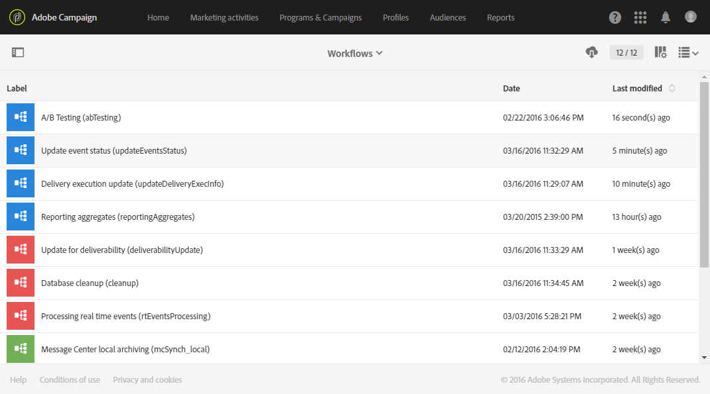

# Technical workflows{#technical-workflows}

I flussi di lavoro tecnici vengono forniti con Adobe Campaign. I flussi di lavoro tecnici sono operazioni o processi pianificati su base regolare sul server.

Consentono di eseguire operazioni di manutenzione sul database, di sfruttare le informazioni di tracciamento contenute nelle consegne e di aggiornare i processi provvisori sulle consegne.

Functional administrators can access technical workflows under the **[!UICONTROL Administration > Application settings > Workflows]** menu.

>[!NOTE]
>
>In qualità di amministratore funzionale, potete riavviare o mettere in pausa i flussi di lavoro tecnici e modificarne le proprietà e la struttura.

## List of technical workflows {#list-of-technical-workflows}

I flussi di lavoro tecnici vengono utilizzati per gestire in Adobe Campaign i processi di sfondo e tecnici autoattivati.

<table> 
 <tbody> 
  <tr> 
   <td> <strong>Etichetta</strong>  </td> 
   <td> <strong>ID</strong>  </td> 
   <td> <strong>Descrizione</strong>  </td> 
  </tr> 
  <tr> 
   <td> Test A/B  </td> 
   <td> Abtest  </td> 
   <td> Questo flusso di lavoro analizza i registri di tracciamento di ciascuna variante. Alla fine del periodo di test A/B, calcola automaticamente la variante vincente. By default, it is started every day.  </td> 
  </tr> 
  <tr> 
   <td> Fatturazione  </td> 
   <td> fatturazione  </td> 
   <td> Questo flusso di lavoro invia tramite e-mail il rapporto sull'attività del sistema all'utente "fatturazione". By default, it is automatically started every day at 1am.  </td> 
  </tr> 
  <tr> 
   <td> Pulizia del database  </td> 
   <td> pulizia  </td> 
   <td> Questo flusso di lavoro è il flusso di lavoro di manutenzione del database: esegue statistiche e processi diversi ed elimina i dati obsoleti dal database in base alla configurazione definita. By default, it is automatically started every day 4am.  </td> 
  </tr> 
  <tr> 
   <td> Previsioni  </td> 
   <td> previsioni  </td> 
   <td> Questo flusso di lavoro esegue l'analisi delle consegne memorizzate nelle previsioni provvisorie (creazione dei registri provvisori). By default, it is started every day at 1am.   </td> 
  </tr> 
  <tr> 
   <td> Importazione di un pubblico condiviso  </td> 
   <td> Importsharedaudience  </td> 
   <td> Questo flusso di lavoro sincronizza i dati del pubblico di Adobe Experience Cloud importati in Adobe Campaign. By default, it is started every hour.  </td> 
  </tr> 
  <tr> 
   <td> Condivisione istantanea dei report  </td> 
   <td> Reportsendingnow  </td> 
   <td> Questo flusso di lavoro viene avviato non appena un rapporto viene pianificato. It converts your report into a pdf file then sends it in an email to the targeted recipients.  </td> 
  </tr> 
  <tr> 
   <td> KPI riconciliazione con Adobe Analytics  </td> 
   <td> Kpiriconciliazione  </td> 
   <td> Questo flusso di lavoro recupera i KPI dal servizio Reporting una volta al giorno e li unisce ai dati provenienti da Adobe Analytics. Quindi invia la differenza se necessario. By default, it is started every day at 4.20am.  </td> 
  </tr> 
  <tr> 
   <td> Gestione rinunce NMAC  </td> 
   <td> Mobileelseptoutmgt  </td> 
   <td> Questo flusso di lavoro aggiorna le sottoscrizioni alle notifiche sui dispositivi mobili. By default, it is started every 6 hours between 1am and midnight.  </td> 
  </tr> 
  <tr> 
   <td> Archiviazione locale del messaggio  </td> 
   <td> Mcsynch_ local  </td> 
   <td> Questo flusso di lavoro archivia gli eventi in tempo reale in una tabella storica. By default, it is started every hour.  </td> 
  </tr> 
  <tr> 
   <td> Aggregazione di rapporti  </td> 
   <td> Reportingaggregates  </td> 
   <td> Questo flusso di lavoro aggiorna gli aggregati utilizzati nei rapporti. By default, it is automatically started at 2am.  </td> 
  </tr> 
  <tr> 
   <td> Condivisione di KPI con Adobe Analytics  </td> 
   <td> Kpisharing  </td> 
   <td> This workflow pushes KPI data every 15 minutes from Adobe Campaign Standard to Adobe Analytics.  </td> 
  </tr> 
  <tr> 
   <td> Aggiornare l'esecuzione della consegna  </td> 
   <td> Updatedeliveryexecinfo  </td> 
   <td> Questo flusso di lavoro aggiorna il tracciamento della distribuzione. By default, it is started every 10 minutes.  </td> 
  </tr> 
  <tr> 
   <td> Indicatori di consegna degli aggiornamenti  </td> 
   <td> Updatedeliveryindicator  </td> 
   <td> Questo flusso di lavoro aggiorna i KPI della distribuzione (Indicatori prestazioni chiave). By default, it is started every hour.  </td> 
  </tr> 
  <tr> 
   <td> Aggiornare lo stato dell'evento  </td> 
   <td> Updateeventsstatus  </td> 
   <td> Questo flusso di lavoro consente di attribuire uno stato a un evento. The following event statuses are available:  <strong>Pending</strong>: The event is in a queue. Non è stato ancora assegnato alcun modello di messaggio. Consegna in sospeso: L'evento è in coda, un modello di messaggio è stato assegnato ad esso e lo sta elaborando. <strong>Inviato</strong>: Questo stato viene copiato dai registri di consegna. Indica che la consegna è stata inviata. <strong>Ignorato dalla distribuzione</strong>: Questo stato viene copiato dai registri di consegna. Ciò significa che la distribuzione è stata ignorata. <strong>Consegna non riuscita</strong>: Questo stato viene copiato dai registri di consegna. Indica che la consegna non è riuscita. L'evento non è considerato : L'evento non è stato collegato a un modello di messaggio. The event will not be processed.  </td> 
  </tr> 
  <tr> 
   <td> Aggiornamento per il recapito  </td> 
   <td> Deliverabilityupdate  </td> 
   <td> Questo flusso di lavoro consente di creare l'elenco delle regole di qualifica delle regole di rimbalzo, nonché l'elenco dei domini e MX nella piattaforma. Questa funzione funziona solo se l'HTTPS è aperto. By default, it is automatically started at 2am.  </td> 
  </tr> 
 </tbody> 
</table>

