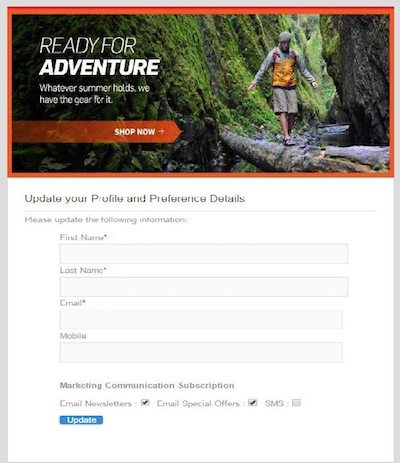
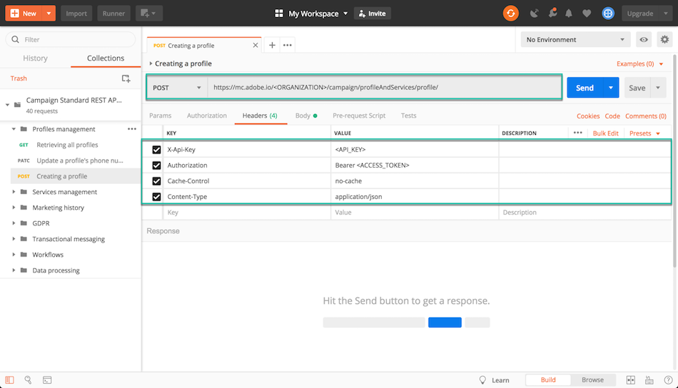

# Perché utilizzare le API di Campaign Standard {#why-using-campaign-standard-apis}

 Adobe Campaign Standard offre API che consentono l&#39;integrazione dei sistemi esistenti con la piattaforma ACS per risolvere problemi reali in tempo reale.

I siti Web pubblici come la pagina di registrazione o di rinuncia devono connettersi ai sistemi di back-end per memorizzare le informazioni sul profilo. I sistemi di back-end come  Adobe Campaign hanno la flessibilità e la potenza per acquisire i dati del profilo e per eseguire operazioni personalizzate su di esso.

Di seguito sono riportati alcuni esempi:

* Prospettive della registrazione online.
* Gestione delle preferenze di comunicazione marketing e profilo cliente esistenti.
* Attivazione della comunicazione transazionale basata sugli eventi - conferma dell&#39;ordine, prenotazione Itinerario, reimpostazione della password, ecc.
* Persino la comunicazione email di abbandono del carrello.

Le pagine di destinazione dell’iscrizione consentono a clienti o potenziali clienti di registrare il proprio nome e indirizzo e-mail. Una volta acquisite le informazioni e le preferenze del profilo, il Campaign Standard può inviare messaggi personalizzati in base agli interessi della persona.

Sono realizzati con gli elementi seguenti:

1. Un modulo di registrazione con listener API per la campagna.

   

1. Azioni personalizzate da eseguire in base alle caselle di controllo. Un cliente che seleziona &quot;Offerte speciali e-mail&quot; riceverà un&#39;altra e-mail personalizzata con un buono regalo rispetto al normale processo di registrazione.

   

1. Un profilo potrebbe cambiare i propri dettagli dopo aver fatto clic sul collegamento &quot;Aggiorna dettagli&quot; nell&#39;e-mail. Questo porta il profilo alla pagina &quot;Aggiorna il tuo profilo e i dettagli delle preferenze&quot;. Per eseguire l&#39;operazione, i dettagli del profilo (Pkey) vengono passati al server Campaign e il profilo viene recuperato e rappresentato. Quando il profilo fa clic sul pulsante &quot;Aggiorna&quot;, le informazioni vengono aggiornate nel sistema (tramite un comando PATCH).

   

È disponibile una raccolta di richieste per acquisire familiarità con le richieste API Campaign Standard. Questa raccolta in formato JSON fornisce richieste API predefinite che rappresentano i casi d&#39;uso più comuni.

Nei passaggi seguenti viene descritto un caso di utilizzo dettagliato per l&#39;importazione e l&#39;utilizzo della raccolta per creare un profilo nel database Campaign Standard.

>[!NOTE]
>
>Il nostro esempio utilizza Postman. Tuttavia, non esitate a utilizzare il vostro client REST preferito.

1. Scarica la raccolta JSON facendo clic [qui](https://helpx.adobe.com/content/dam/help/en/campaign/kb/working-with-acs-api/_jcr_content/main-pars/download_section/download-1/KB_postman_collection.json.zip).

1. Aprite Postman, quindi selezionate il menu **File** / **Importa** .

1. Trascinate e rilasciate il file scaricato nella finestra. Vengono visualizzate richieste API preconfigurate, pronte per essere utilizzate.

   

1. Selezionate **Creazione di una richiesta di profilo** , quindi aggiornate la richiesta di POST e la scheda **Intestazioni** con le vostre informazioni (&lt;ORGANIZATION>, &lt;API_KEY>, &lt;ACCESS_TOKEN>). Per ulteriori informazioni al riguardo, consulta [questa sezione](../../api/using/setting-up-api-access.md).

   

1. Compilate la scheda **Corpo** con le informazioni da aggiungere al nuovo profilo, quindi fate clic sul pulsante **Invia** per eseguire la richiesta.

   

1. Una volta creato un oggetto, vi viene associata una chiave primaria (PKey). È visibile nella risposta di richiesta, così come in altri attributi.

   

1. Aprite l&#39;istanza Campaign Standard, quindi verificate che il profilo sia stato creato, con tutte le informazioni del payload.

   
