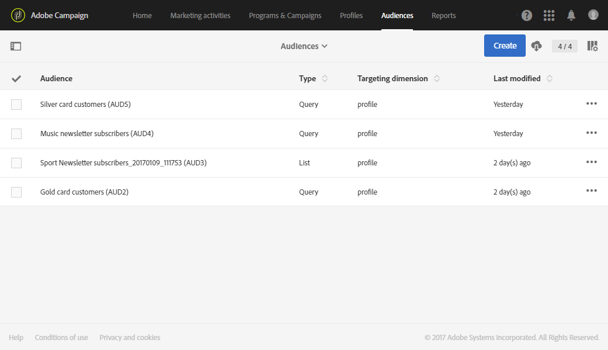
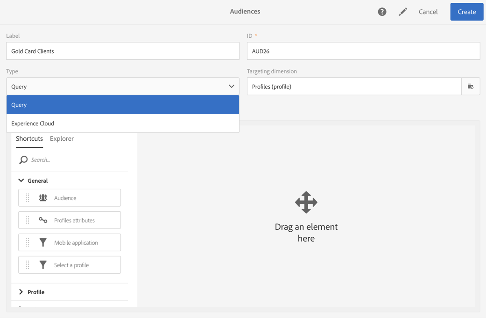

# Informazioni sui tipi di pubblico{#about-audiences}

Un pubblico è un elenco di profili basati su regole e attributi.

Adobe Campaign ti consente di creare tipi di pubblico manualmente utilizzando query o automaticamente tramite flussi di lavoro dedicati. Puoi anche utilizzare i tipi di pubblico condivisi da Adobe Experience Cloud. Tutti i tipi di pubblico vengono raggruppati in un elenco accessibile tramite la scheda **[!UICONTROL Audiences]** nella pagina Home di Adobe Campaign o dal collegamento **[!UICONTROL Audiences]**.

In Adobe Campaign puoi elaborare diversi tipi di pubblico. Il tipo di pubblico corrisponde al modo in cui è stato creato:

* **[!UICONTROL Query]**: indica che il pubblico è stato creato utilizzando una [query](../../automating/using/editing-queries.md#about-query-editor) sui dati del database di Adobe Campaign tramite l&#39;elenco dei tipi di pubblico. I tipi di pubblico definiti da una query vengono ricalcolati a ogni ulteriore utilizzo.
* **[!UICONTROL List]**: indica che il pubblico è un elenco fisso di profili. Questi elenchi vengono creati in un [flusso di lavoro](../../automating/using/get-started-workflows.md), in cui la dimensione dati è nota al momento di salvare il pubblico. Ad esempio, dopo le attività di targeting (in particolare **[!UICONTROL Query]**) o dopo la riconciliazione dei dati importati da un file.
* **[!UICONTROL File]**: indica che il pubblico è stato creato direttamente da un flusso di lavoro del [file di importazione](../../automating/using/load-file.md) e che la dimensione dati era sconosciuta al momento di salvare il pubblico.
* **[!UICONTROL Experience Cloud]**: indica che il pubblico è stato importato da Adobe Experience Cloud. Questa opzione è disponibile solo se è stata configurata la funzionalità di condivisione del pubblico. Per ulteriori informazioni, vedi [Importazione di un pubblico da Adobe Experience Cloud](../../integrating/using/sharing-audiences-with-audience-manager-or-people-core-service.md#importing-an-audience).

