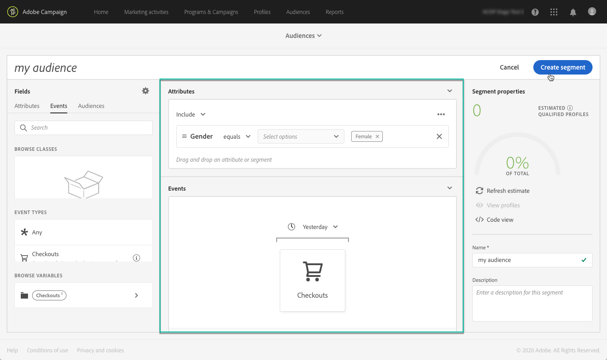

# Gestione dell’audience {#about-audiences}

>[!IMPORTANT]
>
>Audience Destinations Service è attualmente in versione beta, che può essere oggetto di aggiornamenti frequenti senza preavviso. I clienti devono essere ospitati in Azure (attualmente nella versione beta solo per il Nord America) per accedere a tali funzionalità. Per accedere, contatta l&#39;Assistenza clienti Adobe.

## Accesso ai tipi di pubblico

Per accedere ai tipi di pubblico di Adobe Experience Platform, seleziona la **[!UICONTROL Audiences]**scheda nella home page di Campaign Standard oppure il**[!UICONTROL Audiences]** collegamento, quindi seleziona **[!UICONTROL Adobe Experience Platform]**.

Vengono visualizzati tutti i tipi di pubblico creati con Adobe Experience Platform. Sono disponibili una barra di ricerca e dei filtri che consentono di trovare il pubblico desiderato.

## Creazione di audience

Le audience vengono create direttamente dall&#39;elenco dei tipi di pubblico di Adobe Experience Platform. A questo scopo, effettuate le seguenti operazioni:

1. Vai all&#39;elenco delle audience, quindi fai clic sul **[!UICONTROL New audience]**pulsante.

   

1. Il Generatore di segmenti unificato deve ora essere visualizzato nell&#39;area di lavoro. Consente di creare un segmento utilizzando i dati di Adobe Experience Platform, che verranno utilizzati per creare il pubblico.

1. Denominate il segmento nel riquadro a destra e immettete una descrizione (facoltativo).

   

1. Per creare correttamente un segmento, devi selezionare un criterio **di** unione che corrisponda allo scopo di marketing per questo segmento.

   Nel riquadro delle impostazioni, è selezionato un criterio di unione predefinito per la piattaforma. Per ulteriori informazioni sui criteri di unione, consulta la sezione dedicata della guida utente di [Segment Builder](https://www.adobe.io/apis/experienceplatform/home/profile-identity-segmentation/profile-identity-segmentation-services.html#!api-specification/markdown/narrative/technical_overview/segmentation/segment-builder-guide.md)

   

1. Definite le regole che identificheranno i profili da recuperare nel pubblico.

   A questo scopo, trascina gli attributi e/o gli eventi desiderati dal riquadro a sinistra nell&#39;area di lavoro, definisce le regole corrispondenti, quindi fai clic sul **[!UICONTROL Create segment]**pulsante per salvare il segmento (consulta[Utilizzo di Unified Segment Builder](../../audiences/using/aep-using-segment-builder.md)).

   

L&#39;audience è ora pronta per essere attivata e può essere utilizzata come destinazione per le campagne (consultate [Targeting Adobe Experience Platform Audiences](../../automating/using/aep-targeting-audiences.md)).

## Modifica delle audience

Per modificare un&#39;audience, aprirla e modificarne le regole in base alle esigenze all&#39;interno dell&#39;interfaccia Unified Segment Builder (vedere [Utilizzo di Unified Segment Builder](../../audiences/using/aep-using-segment-builder.md)).

Una volta completate le modifiche, fate clic sul **[!UICONTROL Save segment]**pulsante per aggiornare il pubblico.

