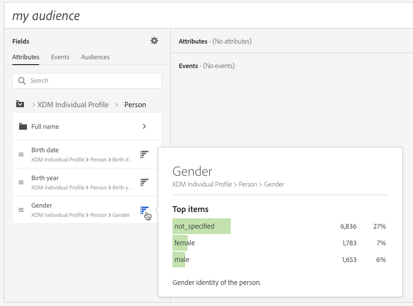
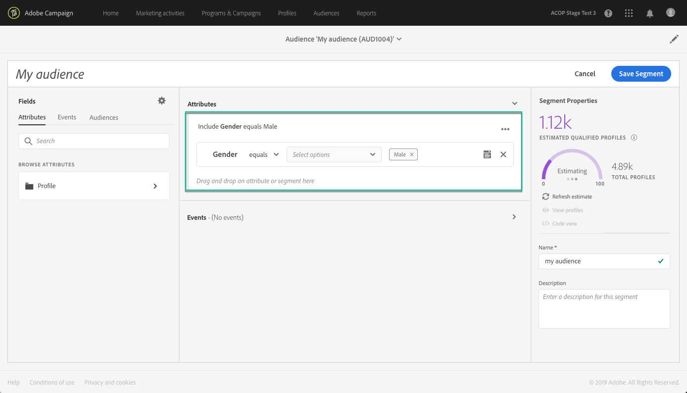

# Utilizzo di Unified Segment Builder {#using-the-unified-segment-builder}

>[!IMPORTANT]
>
>Il servizio Destinazioni audience è attualmente in versione beta, che potrebbe essere soggetto a frequenti aggiornamenti senza preavviso. I clienti devono essere ospitati in Azure (attualmente nella versione beta solo per il Nord America) per accedere a tali funzionalità. Per accedere, contatta l&#39;Assistenza clienti Adobe.

Unified Segment Builder (Generatore di segmenti unificato) consente di creare audience definendo regole basate sui dati provenienti da [Unified Profile Service](https://www.adobe.io/apis/experienceplatform/home/profile-identity-segmentation.html).

Questa sezione presenta i concetti globali per la creazione di un segmento. Per informazioni dettagliate sullo stesso Generatore di segmenti unificato, consulta la guida [utente di Generatore di](https://www.adobe.io/apis/experienceplatform/home/profile-identity-segmentation/profile-identity-segmentation-services.html#!api-specification/markdown/narrative/technical_overview/segmentation/segment-builder-guide.md)segmenti.

L&#39;interfaccia Unified Segment Builder (Generatore di segmenti unificato) è composta come segue:

* Il riquadro a sinistra fornisce tutti gli attributi, gli eventi e le audience disponibili per creare il segmento trascinando e rilasciando i campi desiderati nell’area di lavoro del generatore di segmenti.
* L&#39;area centrale fornisce un&#39;area di lavoro per creare il segmento definendo e combinando regole dai campi disponibili.
* Nel riquadro di intestazione e destra sono visualizzate le proprietà del segmento (nome, descrizione e profili qualificati stimati per il segmento).

## Creazione di un segmento

Per creare un segmento, effettua le seguenti operazioni:

Il Generatore di segmenti unificato deve ora essere visualizzato nell&#39;area di lavoro. Consente di creare un segmento utilizzando i dati di Adobe Experience Platform, che verranno utilizzati per creare il pubblico.

1. Denominate il segmento, quindi immettete una descrizione (facoltativo).

   

1. Accertatevi che nel riquadro delle impostazioni sia selezionato il criterio di unione desiderato.

   Per ulteriori informazioni sui criteri di unione, consulta la sezione dedicata della guida [utente di](https://www.adobe.io/apis/experienceplatform/home/profile-identity-segmentation/profile-identity-segmentation-services.html#!api-specification/markdown/narrative/technical_overview/segmentation/segment-builder-guide.md)Segment Builder.

   

1. Cercate i campi desiderati nel riquadro a sinistra e trascinateli nell’area di lavoro centrale.

   

1. Configurare le regole corrispondenti ai campi trascinati.

   

1. Fate clic sul **[!UICONTROL Create segment]**pulsante.

## Ricerca dei campi corretti per un segmento

Nel riquadro a sinistra sono elencati tutti gli attributi, gli eventi e le audience disponibili per la creazione di regole.

I campi elencati sono attributi acquisiti dalla società e resi disponibili tramite il sistema Experience Data Model (XDM).

I campi sono organizzati in schede:

* **[!UICONTROL Attributes]**: Attributi dei profili esistenti che possono provenire dal database Adobe Campaign e/o da Adobe Experience Platform. Si riferiscono alle informazioni statiche allegate a un profilo (ad esempio, indirizzo e-mail, paese di residenza, stato del programma fedeltà, ecc.).

   

* **[!UICONTROL Events]**: Attività che identificano i consumatori che hanno avuto qualche interazione con i punti di contatto dei clienti della tua azienda, come &quot;chiunque abbia ordinato due volte in due settimane&quot;. Questo può essere trasmesso in streaming da Adobe Analytics o inviato direttamente in Adobe Experience Platform tramite strumenti ETL di terze parti.

   

>[!NOTE]
>
>**La segmentazione** multi-entità consente di estendere i dati del profilo con dati aggiuntivi basati su prodotti, store o altre classi non di profilo. Una volta connessi, i dati di altre classi diventano disponibili come se fossero nativi dello schema Profilo.
>
>Per ulteriori informazioni, consulta la documentazione dedicata.

Per impostazione predefinita, il generatore di segmenti unificati visualizza i campi in cui i dati sono già presenti. Per visualizzare lo schema completo, compresi i campi per i quali i dati non sono presenti, attivare l&#39; **[!UICONTROL Show full XDM schema]**opzione dalle impostazioni.

Il simbolo alla fine di ciascun campo fornisce informazioni aggiuntive sull&#39;attributo e su come utilizzarlo.

## Definizione di regole per un segmento

>[!NOTE]
>
>La sezione seguente fornisce informazioni globali sulla definizione delle regole. Per ulteriori informazioni, consulta la guida [utente di Generatore di](https://www.adobe.io/apis/experienceplatform/home/profile-identity-segmentation/profile-identity-segmentation-services.html#!api-specification/markdown/narrative/technical_overview/segmentation/segment-builder-guide.md)segmenti.

Per creare una regola, effettuate le seguenti operazioni:

1. Trovate il campo nel riquadro a sinistra che riflette gli attributi o gli eventi su cui si baserà la regola.

1. Trascinare il campo nell’area di lavoro centrale, quindi configurarlo in base alla definizione del segmento desiderata. A tal fine, sono disponibili diverse funzioni stringa e data/ora.

   Nell&#39;esempio seguente, la regola sarà applicata a tutti i profili con genere uguale a &quot;Maschio&quot;.

   

   La popolazione stimata corrispondente al segmento viene automaticamente ricalcolata nella **[!UICONTROL Segment Properties]**sezione.

1. Il **[!UICONTROL View Profiles]**pulsante consente di visualizzare un&#39;anteprima dei primi 20 record corrispondenti alla regola e di convalidare rapidamente il segmento.

   

   Potete aggiungere tutte le regole aggiuntive necessarie per eseguire il targeting dei profili appropriati.

   Quando si aggiunge una regola a un contenitore, questa viene aggiunta a tutte le regole esistenti con l&#39;operatore logico AND. Se necessario, fare clic sull&#39;operatore logico per modificarlo.

   

Una volta collegate, le due regole formano un contenitore.

## Confronto dei campi

Il Generatore di segmenti unificato consente di confrontare due campi per definire una regola. Ad esempio, le femmine il cui indirizzo di casa si trova in un codice ZIP diverso dall&#39;indirizzo di lavoro.

A questo scopo, effettuate le seguenti operazioni:

1. Trascinate il primo campo da confrontare (ad esempio, il codice postale dell’indirizzo principale) nell’area di lavoro centrale.

   

1. Selezionare il secondo campo (ad esempio, il codice postale dell&#39;indirizzo di lavoro) che verrà confrontato con il primo campo.

   Trascinatelo nell’area di lavoro centrale, nello stesso contenitore del primo campo, nella **[!UICONTROL Drop here to compare operands]**casella.

   

1. Configurare l&#39;operatore tra i due campi come desiderato. In questo esempio, desideriamo che il nostro segmento si rivolga ai profili con l&#39;indirizzo di casa diverso dall&#39;indirizzo di lavoro.

   

La regola ora è configurata e pronta per essere attivata come pubblico.
