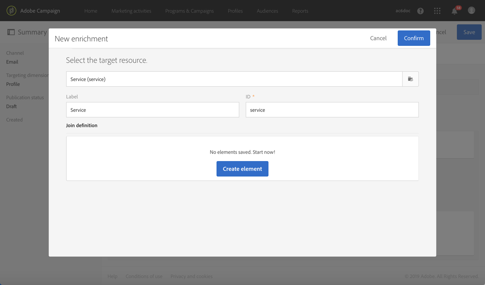

# Conferma della sottoscrizione a un servizio{#confirming-subscription-to-a-service}

## Informazioni sull'invio della conferma di iscrizione {#sending-subscription-confirmation}

In questa sezione viene descritto come inviare un messaggio e-mail di conferma automatica personalizzato ai profili sottoscritti per un servizio specifico.

Se desiderate inviare un messaggio di conferma per un’iscrizione (o annullamento dell’iscrizione) a un servizio, potete utilizzare il messaggio predefinito o personalizzato. I passaggi per selezionare un messaggio di conferma sono descritti nella sezione [Creazione di un servizio](../../audiences/using/creating-a-service.md) .

Se scegliete di utilizzare il messaggio predefinito, potete modificarne il contenuto con le seguenti limitazioni:
* Potete personalizzare il contenuto del messaggio solo con campi limitati dal contesto dell'evento.
* Questo messaggio sarà lo stesso per tutti i servizi che utilizzano la modalità predefinita.

Per inviare un'e-mail di conferma specifica per un determinato servizio, potete creare un messaggio personalizzato in cui potrete sfruttare anche i campi di personalizzazione provenienti da altre risorse. A tal fine, devi creare e configurare un messaggio transazionale. È possibile fare riferimento a questo messaggio:
* Dal servizio stesso. Per ulteriori informazioni, consulta [Configurazione del messaggio di conferma da un servizio](#configuring-confirmation-message-from-service).
* Da una pagina di destinazione di iscrizione. Per ulteriori informazioni, vedere [Configurazione del messaggio di conferma da una pagina](#configuring-confirmation-message-from-landing-page)di destinazione.

## Configurazione del messaggio di conferma da un servizio {#configuring-confirmation-message-from-service}

Ad esempio, se desiderate inviare automaticamente un messaggio di conferma ai visitatori del vostro sito Web quando si iscrivono alla newsletter del vostro marchio,

È necessario configurare un'e-mail transazionale e fare riferimento a tale messaggio dal servizio desiderato (in questo caso, iscriviti alla newsletter del tuo marchio). Per arricchire il messaggio di transazione con le informazioni del servizio, potete definire una riconciliazione al momento della creazione dell'evento.

Quando si configura il servizio dal servizio, il messaggio di conferma della transazione verrà inviato solo la prima volta che ogni visitatore si iscrive a tale servizio. Se un profilo è già sottoscritto, non verrà più inviato alcun messaggio di conferma a tale profilo.

### Passaggio 1: Creare il messaggio e-mail di conferma {#step-1--create-the-confirmation-email-1}

Un messaggio e-mail di conferma verrà inviato automaticamente a ogni profilo che si iscrive alla newsletter (tramite una pagina di destinazione o altri mezzi). L’iscrizione viene considerata un evento e l’e-mail è un messaggio  transazionale destinato a ciascun profilo che si iscrive al servizio.

I passaggi per creare l’e-mail di conferma sono descritti di seguito. Poiché nel servizio verrà fatto riferimento al messaggio di transazione, è necessario prima crearlo.

#### Creazione dell’evento {#create-the-event-1}

Il messaggio e-mail di conferma è un messaggio transazionale in quanto reagisce a un evento: l’iscrizione a un servizio. Questo messaggio verrà inviato per confermare l’iscrizione alla newsletter.

1. Create un evento dal menu **[!UICONTROL Marketing plans]** &gt; **[!UICONTROL Transactional messages]** &gt; **[!UICONTROL Event configuration]** , accessibile dal logo di Adobe Campaign.
1. Immettete un'etichetta, selezionate una dimensione di targeting e fate clic su **[!UICONTROL Create]**.

   I passaggi di configurazione sono descritti nella sezione [Configurazione dei messaggi](../../administration/using/configuring-transactional-messaging.md) transazionali.

1. Nella **[!UICONTROL Fields]** sezione fare clic su **[!UICONTROL Create element]** e aggiungere **[!UICONTROL publicLabel]** alla struttura dati per abilitare la riconciliazione.

   

   >[!NOTE]
   >
   >Il **[!UICONTROL publicLabel]** campo è obbligatorio. Se non lo aggiungete alla struttura dati dell'evento, Adobe Campaign non sarà in grado di eseguire la riconciliazione con il servizio. Con la sottoscrizione a un servizio, questo campo verrà compilato con il **[!UICONTROL Service label]** relativo servizio.

1. Nella **[!UICONTROL Enrichment]** sezione, fate clic su **[!UICONTROL Create element]** e selezionate la risorsa di **[!UICONTROL Service]** destinazione.

   

1. Nella **[!UICONTROL Join definition]** sezione, mappate il **[!UICONTROL publicLabel]** campo della **[!UICONTROL Service]** risorsa con il **[!UICONTROL publicLabel]** campo della configurazione dell’evento.

   

   >[!NOTE]
   >
   >In questo modo potrai usare i campi di personalizzazione della **[!UICONTROL Service]** risorsa nel messaggio di transazione.

1. Salvate la configurazione dell’evento e fate clic **[!UICONTROL Publish]** per pubblicarlo.

L'evento è pronto. Ora puoi progettare il messaggio e-mail transazionale.

#### Progettare il messaggio di conferma {#design-the-confirmation-message-1}

L’e-mail di conferma è un messaggio transazionale basato sull’evento appena pubblicato.

1. Dal logo Adobe Campaign, seleziona **[!UICONTROL Marketing plans]** &gt; **[!UICONTROL Transactional messages]** e fai clic su **[!UICONTROL Transactional messages]**.
1. Selezionate il messaggio e-mail di transazione corrispondente all’evento appena pubblicato.

1. Fate clic sulla **[!UICONTROL Content]** sezione e selezionate un modello e-mail. Per ulteriori informazioni sulla modifica di un contenuto di messaggi transazionali, consulta Messaggi transazionali [evento](../../channels/using/event-transactional-messages.md).
1. Poiché avete accesso diretto a tutti i campi della **[!UICONTROL Service]** risorsa, potete selezionare qualsiasi campo dal **[!UICONTROL Context]** &gt; **[!UICONTROL Real-time event (rtEvent)]** &gt; **[!UICONTROL Event context (ctx)]** &gt;**[!UICONTROL Service]** nodo per personalizzare il contenuto.

   

   Per ulteriori informazioni sulla personalizzazione di un messaggio transazionale, consulta [questa sezione](../../channels/using/event-transactional-messages.md#personalizing-a-transactional-message).

1. Visualizzare l'anteprima del messaggio utilizzando un profilo di prova. Per ulteriori informazioni, vedi [Definizione di un profilo di test in un messaggio](../../channels/using/event-transactional-messages.md#defining-a-test-profile-in-a-transactional-message)transazionale.

1. Fate clic **[!UICONTROL Save & close]** per salvare il contenuto.
1. Pubblicate il messaggio transazionale. Consultate [Pubblicazione di un messaggio](../../channels/using/event-transactional-messages.md#publishing-a-transactional-message)transazionale.

### Passaggio 2: Creazione e configurazione del servizio {#step-2--create-and-configure-the-service-1}

1. Dal menu avanzato **Profili e pubblico** &gt; **Servizi** tramite il logo Adobe Campaign, create un servizio.
1. Andate alla **[!UICONTROL Service properties]** sezione, a cui si accede tramite il  pulsante nel dashboard del servizio.
1. Compila il **[!UICONTROL Service label]** campo.

   

   >[!NOTE]
   >
   >È necessario compilare questo campo per abilitare la riconciliazione con il messaggio di transazione.

1. Nella **[!UICONTROL Confirmation messages]** sezione, selezionare **[!UICONTROL Custom message]**: questa modalità consente di fare riferimento a un messaggio di conferma specifico per i profili che si iscrivono al servizio.
1. Seleziona il messaggio **[!UICONTROL Custom subscription event configuration]** di transazione creato.

   

1. Fate clic su **[!UICONTROL Confirm]** e salvate il servizio.

Ogni volta che un profilo si iscrive a questo servizio, riceve il messaggio transazionale definito dall'utente, con campi personalizzati mappati al servizio selezionato.

>[!NOTE]
>
>Un messaggio verrà inviato solo la prima volta che l'utente si iscrive.

## Configurazione del messaggio di conferma da una pagina di destinazione {#configuring-confirmation-message-from-landing-page}

Potete anche fare riferimento al messaggio di conferma da una pagina di destinazione di iscrizione utilizzando l' **[!UICONTROL Start sending messages]** opzione presente nella **[!UICONTROL Job]** sezione della pagina di destinazione.

Quando si fa riferimento al messaggio di conferma dalla pagina di destinazione, viene inviato un messaggio ogni volta che la pagina di destinazione viene inviata (anche se il profilo è già sottoscritto).

### Passaggio 1: Creare il messaggio e-mail di conferma {#step-1--create-the-confirmation-email-2}

Un messaggio e-mail di conferma verrà inviato automaticamente a ogni profilo che si iscrive alla newsletter tramite una pagina di destinazione. L’iscrizione viene considerata un evento e l’e-mail è un messaggio  transazionale destinato a ciascun profilo che si iscrive al servizio.

I passaggi per creare questi elementi sono descritti di seguito. Poiché alla pagina di destinazione verrà fatto riferimento al messaggio di transazione, è necessario prima crearlo.

#### Creazione dell’evento {#create-the-event-2}

Il messaggio e-mail di conferma è un messaggio  transazionale che risponde a un evento: l’iscrizione a un servizio. Questo messaggio verrà inviato per confermare l’iscrizione alla newsletter.

1. Create un evento dal menu **[!UICONTROL Marketing plans]** &gt; **[!UICONTROL Transactional messages]** &gt; **[!UICONTROL Event configuration]** , accessibile dal logo di Adobe Campaign.
1. Immettete un'etichetta, selezionate una dimensione di targeting e fate clic su **[!UICONTROL Create]**.

   I passaggi di configurazione sono descritti nella sezione [Configurazione dei messaggi](../../administration/using/configuring-transactional-messaging.md) transazionali.

1. Nella **[!UICONTROL Fields]** sezione fare clic su **[!UICONTROL Create element]** e aggiungere **[!UICONTROL serviceName]** alla struttura dati per abilitare la riconciliazione.

   

   >[!NOTE]
   >
   >Il **[!UICONTROL serviceName]** campo è obbligatorio. Se non lo aggiungete alla struttura dati dell'evento, Adobe Campaign non sarà in grado di eseguire la riconciliazione con il servizio sottoscritto.

1. Nella **[!UICONTROL Enrichment]** sezione, fate clic su **[!UICONTROL Create element]** e selezionate la risorsa di **[!UICONTROL Service]** destinazione.
1. Nella **[!UICONTROL Join definition]** sezione, mappate il **[!UICONTROL serviceName]** campo della **[!UICONTROL Service]** risorsa con il **[!UICONTROL name]** campo della configurazione dell’evento.

   

   >[!NOTE]
   >
   >In questo modo potrai usare i campi di personalizzazione della [!UICONTROL Service] risorsa nel messaggio di transazione.

#### Progettare il messaggio di conferma {#design-the-confirmation-message-2}

I passaggi per progettare il messaggio di transazione sono descritti in questa [sezione](#design-the-confirmation-message-1).

### Passaggio 2: Creazione e configurazione del servizio {#step-2--create-and-configure-the-service-2}

1. Dal menu avanzato **[!UICONTROL Profiles & audiences]** &gt; **[!UICONTROL Services]** tramite il logo Adobe Campaign, crea un servizio.
1. Andate alla **[!UICONTROL Service properties]** sezione, a cui si accede tramite il  pulsante nel dashboard del servizio.
1. Compila il **[!UICONTROL Service label]** campo. Questa etichetta verrà visualizzata nel messaggio di conferma e nella pagina di destinazione dell'iscrizione.
1. Fate clic su **[!UICONTROL Confirm]** e salvate il servizio.

### Passaggio 3:Creare e configurare la pagina di destinazione {#step-3--create-and-configure-the-landing-page}

Create una pagina di destinazione di iscrizione che verrà pubblicata sul sito Web.

Per creare e configurare questa pagina di destinazione, effettuate le seguenti operazioni:

1. Progettate una [nuova pagina](../../channels/using/about-landing-pages.md) di destinazione basata sul **[!UICONTROL Subscription]** modello.
1. Modificare le proprietà della pagina di destinazione. Nella sezione **[!UICONTROL Job]** &gt; **[!UICONTROL Specific actions]** , selezionate l' **[!UICONTROL Specific service]** opzione e scegliete il servizio appena creato dall'elenco a discesa.

   

1. Selezionate l’ **[!UICONTROL Start sending message]** opzione e scegliete il messaggio transazionale appena creato dall’elenco a discesa.

   

1. Personalizzare il contenuto della pagina di destinazione.

1. [Test e pubblicazione](../../channels/using/sharing-a-landing-page.md) della pagina di destinazione.

Ogni volta che un profilo si iscrive alla newsletter inviando la pagina di destinazione, riceve il messaggio di conferma definito con campi personalizzati mappati al servizio.

>[!NOTE]
>
>Un messaggio viene inviato ogni volta che la pagina di destinazione viene inviata, anche se il profilo è già sottoscritto.
