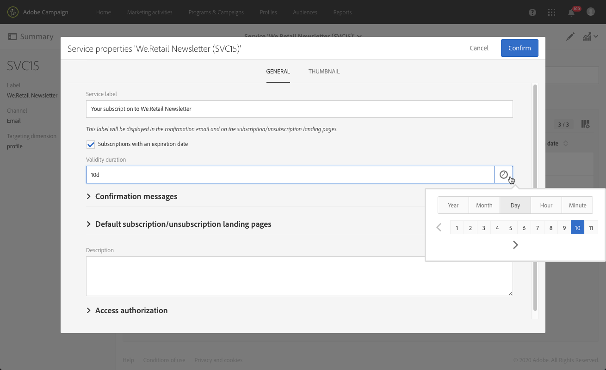

# Creazione di un servizio{#creating-a-service}

Per poter gestire gli abbonamenti, devi innanzitutto creare un servizio e configurarlo. La configurazione di un nuovo servizio ti permette di specificare le conferme e-mail che i profili ricevono al momento dell’abbonamento al servizio o del suo annullamento. Puoi inoltre definire le pagine di destinazione per l’abbonamento e il suo annullamento collegate al servizio. Ad esempio, un collegamento di abbonamento a un servizio inserito in un messaggio e-mail indirizza automaticamente il profilo alla pagina di destinazione di abbonamento specificata nel servizio.

Per configurare un servizio:

1. Dal menu avanzato **[!UICONTROL Profiles & audiences]** > **[!UICONTROL Services]** tramite il logo Adobe Campaign, aggiungi un nuovo servizio o seleziona un servizio esistente. Se scegli di creare un nuovo servizio, segui semplicemente i passaggi mostrati sullo schermo.

   È disponibile un modello di servizio predefinito. Questo modello è preconfigurato con pagine di destinazione ed e-mail di conferma predefinite. Puoi creare altri modelli per definire configurazioni specifiche. Per ulteriori informazioni, consulta la sezione [Gestione dei modelli](../../start/using/marketing-activity-templates.md).

1. Nella sezione **[!UICONTROL Service properties]**, accessibile tramite il pulsante  nel dashboard del servizio, configura i messaggi di conferma per gli abbonamenti e i loro annullamenti.

   

1. Seleziona l’opzione **[!UICONTROL Subscriptions with an expiration date]** per impostare una durata di validità per l’abbonamento.

   

   In un’attività di segmentazione puoi utilizzare la data di scadenza per eseguire il targeting dei profili abbonati a un servizio non scaduto.

1. Compila il campo **[!UICONTROL Service label]**. L’etichetta del servizio è obbligatoria se si utilizza un messaggio di conferma personalizzato.

1. Seleziona un modello per il messaggio di conferma degli abbonamenti e del loro annullamento. Sono disponibili tre modalità:

   * **[!UICONTROL No message]**: con questa modalità puoi creare un servizio senza un messaggio di conferma.
   * **[!UICONTROL Default message]**: con questa modalità utilizzi il messaggio transazionale predefinito di conferma dell’abbonamento o del suo annullamento. I messaggi di conferma predefiniti sono generici e valgono per tutti i servizi che utilizzano la modalità predefinita.

      >[!NOTE]
      >
      >Puoi modificare un messaggio predefinito con un clic sulla relativa etichetta nella sezione **[!UICONTROL Service properties]** o selezionandolo dall’elenco dei messaggi transazionali di Adobe Campaign, dopo aver selezionato la casella **[!UICONTROL Show internal transactional messages]**.

   * **[!UICONTROL Custom message]**: con questa modalità puoi gestire messaggi di conferma personalizzati, specifici per ogni servizio. Quindi seleziona **[!UICONTROL Custom subscription event configuration]** , associato a un modello di [messaggio transazionale](../../channels/using/about-transactional-messaging.md) specifico. Per ulteriori informazioni, consulta [Conferma dell&#39;abbonamento a un servizio](../../audiences/using/confirming-subscription-to-a-service.md).

1. Salva il servizio. Ora puoi utilizzarlo.

Dopo aver creato il servizio, puoi iniziare a promuoverlo.

**Argomenti correlati:**

* Video sulla [Gestione di un servizio e degli abbonamenti](https://docs.adobe.com/content/help/it-IT/campaign-standard-learn/tutorials/profiles-and-audiences/services-and-subscriptions.html)
* [Promozione di un servizio](../../audiences/using/promoting-a-service.md)
* [Creazione di un pubblico composta da iscritti](../../audiences/using/creating-audiences.md#creating-list-audiences)
* [Collegamento di una pagina di destinazione a un servizio](../../channels/using/configuring-landing-page.md#linking-a-landing-page-to-a-service)
