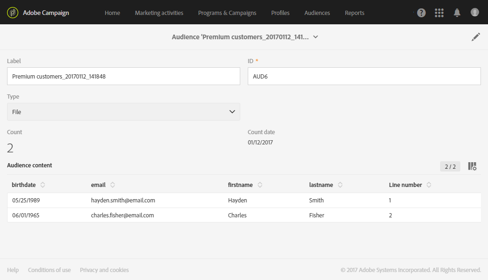

# Creazione di tipi di pubblico{#creating-audiences}

## Creazione di tipi di pubblico di tipo query {#creating-query-audiences}

Questa sezione descrive come creare un pubblico di tipo **Query**. Puoi anche creare tipi di pubblico importando un file o tramite il targeting in un [flusso di lavoro](../../automating/using/get-started-workflows.md).

Dall’elenco del pubblico, puoi creare tipi di pubblico eseguendo query sui profili di Adobe Campaign o importando un pubblico di Adobe Experience Cloud.

1. Passa all’elenco del pubblico tramite la scheda **[!UICONTROL Audiences]**.

   

1. Seleziona **[!UICONTROL Create]** per accedere alla schermata e creare un nuovo pubblico.

   

1. Denomina il pubblico. L’etichetta del pubblico viene utilizzata nell’elenco dei tipi di pubblico e nella palette dello strumento di query.
1. Scegli un pubblico di tipo **[!UICONTROL Query]**: i tipi di pubblico definiti da una query vengono ricalcolati a ogni ulteriore utilizzo.

   

1. Quindi seleziona la **[!UICONTROL Targeting dimension]** che desideri utilizzare per filtrare i clienti. Ogni pubblico è costituito da una singola dimensione di targeting. Ad esempio, non puoi creare un pubblico composto da profili, profili di test e abbonati. Per ulteriori informazioni sulle dimensioni di targeting, consulta [questa pagina](../../automating/using/query.md#targeting-dimensions-and-resources).
1. Crea la query per definire la popolaione del pubblico. Consulta la sezione sulla [modifica di query](../../automating/using/editing-queries.md).
1. Fai clic sul pulsante **[!UICONTROL Create]** per salvare il pubblico.

>[!NOTE]
>
>Puoi aggiungere una descrizione a questo pubblico e definire le autorizzazioni di accesso tramite l’icona **[!UICONTROL Edit properties]**.

## Creazione di tipi di pubblico di tipo list{#creating-list-audiences}

Questa sezione descrive come creare un pubblico di tipo **List** dopo il targeting in un flusso di lavoro. Puoi anche creare tipi di pubblico importando un file in un [flusso di lavoro](../../automating/using/get-started-workflows.md) o tramite una query dal menu **[!UICONTROL Audiences]**.

Per creare un pubblico di tipo **List**, segui questi passaggi:

1. Nella scheda **Marketing activities**, fai clic su **Create**, quindi seleziona **Workflow**.

   

1. Trascina e rilascia, quindi configura le attività di targeting che ti consentono di selezionare un gruppo con una dimensione **nota**. L’elenco delle attività disponibili e la relativa configurazione sono descritti in dettaglio nella sezione [Attività di targeting](../../automating/using/about-targeting-activities.md).

   Puoi utilizzare un’attività **[!UICONTROL Query]** o importare dati tramite un **[!UICONTROL Load file]** prima di ricorrere a una **[!UICONTROL Reconciliation]** per identificare la dimensione di dati importati. In questo caso, vogliamo eseguire il targeting dei destinatari che si sono iscritti alla newsletter Sport con un’attività **[!UICONTROL Query]**.

   

1. Dopo il targeting, trascina e rilascia un’attività **[!UICONTROL Save audience]** nel flusso di lavoro. Ad esempio, puoi scegliere di **[!UICONTROL Create or update an audience]** per creare e aggiornare quindi automaticamente il pubblico con i nuovi dati. In questo caso, aggiungi un’attività **[!UICONTROL Scheduler]** all’inizio del flusso di lavoro.

   Per ulteriori informazioni sulla configurazione di questa attività, consulta la sezione [Save audience](../../automating/using/save-audience.md).

   

1. Salva e avvia il flusso di lavoro.

   Dal momento che l’attività **[!UICONTROL Save audience]** viene inserita dopo un targeting con una dimensione nota, i tipi di pubblico creati tramite questa attività sono di tipo **List**.

   Il contenuto del pubblico salvato è quindi disponibile nella relativa visualizzazione dettagliata accessibile tramite l’elenco dei tipi di pubblico. Le colonne disponibili in questa visualizzazione corrispondono a quelle della transizione in entrata dell’attività di salvataggio del flusso di lavoro. Ad esempio: le colonne del file importato, i dati aggiuntivi aggiunti da una query.

   

## Creazione di tipi di pubblico di tipo file {#creating-file-audiences}

Questa sezione illustra come creare un pubblico di tipo **File** importando un file in un flusso di lavoro. Puoi anche creare tipi di pubblico da un’attività di targeting in un [flusso di lavoro](../../automating/using/get-started-workflows.md) o tramite una query dal menu **[!UICONTROL Audiences]**.

Per creare un pubblico di tipo **File**, segui questi passaggi:

1. Nella scheda **Marketing activities**, fai clic su **Create**, quindi seleziona **Workflow**.
1. Trascina e rilascia, quindi configura un’attività **[!UICONTROL Load file]** che ti consenta di importare una popolazione con una dimensione **sconosciuta** al momento dell’esecuzione del flusso di lavoro. Per ulteriori informazioni sulla configurazione di questa attività, consulta la sezione [Load file](../../automating/using/load-file.md).

   

1. Trascina e rilascia un’attività **[!UICONTROL Save audience]** dopo un’attività **[!UICONTROL Load file]**. Per ulteriori informazioni sulla configurazione di questa attività, consulta la sezione [Save audience](../../automating/using/save-audience.md).
1. Salva e avvia il flusso di lavoro.

   

   Poiché l’attività **[!UICONTROL Save audience]** viene inserita dopo un’importazione, la dimensione dati è sconosciuta e i tipi di pubblico creati tramite questa attività sono di tipo **File**.

   Il contenuto del pubblico salvato è quindi disponibile nella relativa visualizzazione dettagliata accessibile tramite l’elenco dei tipi di pubblico. Le colonne disponibili in questa visualizzazione corrispondono a quelle della transizione in entrata dell’attività di salvataggio del flusso di lavoro. Ad esempio: le colonne del file importato, i dati aggiuntivi aggiunti da una query.

   

## Creazione di tipi di pubblico con Experience Cloud {#creating-experience-cloud-audiences}

Adobe Campaign ti consente di condividere e scambiare tipi di pubblico con Adobe Experience Cloud. Un pubblico di tipo **Experience Cloud** viene importato direttamente dal servizio core People in Adobe Campaign con il flusso di lavoro tecnico **[!UICONTROL Import shared audience]**.

A differenza del pubblico di tipo **Query** che esegue query sui profili da Adobe Campaign, il pubblico di **Experience Cloud** è composto da un elenco di ID visitatore.

Per il corretto funzionamento di questa integrazione, devi innanzitutto configurarla. Per ulteriori informazioni sulla configurazione e su come importare o esportare tipi di pubblico con il servizio core People, consulta la [sezione](../../integrating/using/sharing-audiences-with-audience-manager-or-people-core-service.md)seguente.

## Modifica di tipi di pubblico {#editing-audiences}

Esistono diversi modi per modificare un pubblico in base al suo tipo:

* Per modificare una **Query** di pubblico, passa all’elenco dei tipi di pubblico tramite il menu **[!UICONTROL Audiences]** o la scheda **[!UICONTROL Audiences]** dalla pagina Home di Adobe Campaign.

   Apri il pubblico interessato. Puoi modificare tutti gli elementi di un pubblico creato in precedenza.

   >[!CAUTION]
   >
   >Se modifichi la **[!UICONTROL Filtering dimension]** nella query, le regole precedentemente definite non vengono salvate.

* Per modificare un pubblico di tipo **List** o **File**, modifica il flusso di lavoro d cui è stato creato e l’attività **[!UICONTROL Save audience]**. Avvia il flusso di lavoro per modificare il pubblico.
* Per modificare un pubblico di **Experience Cloud**, consulta la sezione [Importazione/Esportazione di tipi di pubblico con il servizio core People](../../integrating/using/sharing-audiences-with-audience-manager-or-people-core-service.md).

## Eliminazione di tipi di pubblico {#deleting-audiences}

Esistono due modi per eliminare uno o più tipi di pubblico. Prima di tutto puoi aggiungere una data di scadenza al tuo pubblico.

Per eseguire questa operazione:

1. Accedi a uno dei tipi di pubblico.
1. Fai clic sul pulsante  per accedere alla configurazione del pubblico.

   

1. Nel campo **[!UICONTROL Expires on]**, aggiungi una data di scadenza al pubblico.

   

1. Fai clic su **[!UICONTROL Confirm]**, quindi su **[!UICONTROL Save]**.

La data di scadenza è ora configurata. Alla data stabilita, il pubblico viene eliminato automaticamente.

In alternativa, se devi eliminare un pubblico, puoi semplicemente selezionare uno o più tipi di pubblico e fare clic sul pulsante **[!UICONTROL Delete element]**.

