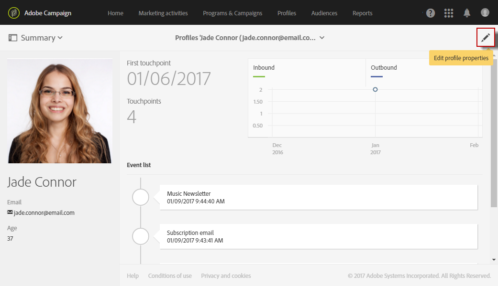

# Modifica dei profili{#editing-profiles}

## Accesso alle proprietà del profilo {#accessing-profile-properties}

Per modificare un profilo esistente e consultare i dati ad esso associati o modificarlo, effettuare le seguenti operazioni:

1. Dalla home page di Adobe Campaign, fare clic sulla scheda **[!UICONTROL Customer profiles]** o sulla scheda **[!UICONTROL Profiles]**.
1. Seleziona un contatto.
1. Fare clic sull&#39;icona **[!UICONTROL Edit profile properties]** per accedere alle informazioni dettagliate del profilo.

   

   La finestra delle proprietà del profilo offre diverse schede che consentono di accedere a tutte le informazioni sul profilo.

   A seconda delle risorse personalizzate create o estese in Adobe Campaign, possono essere visualizzate anche altre schede. Per ulteriori informazioni sulle risorse personalizzate, vedere [Informazioni sulle risorse personalizzate](../../developing/using/data-model-concepts.md).

   >[!NOTE]
   >
   >È possibile modificare le informazioni solo nella scheda **[!UICONTROL General]**, ad eccezione della sezione **[!UICONTROL Traceability]**.

L’edizione dei profili è possibile anche utilizzando l’API di Adobe Campaign Standard. Per ulteriori informazioni, consulta la [documentazione dedicata](../../api/using/updating-profiles.md).

Argomento correlato:

* [Integrated Customer Profile](../../audiences/using/integrated-customer-profile.md)
* [Invio al fuso orario del destinatario](../../sending/using/sending-messages-at-the-recipient-s-time-zone.md)

## Dati generali del profilo {#general-profile-data}

La scheda **[!UICONTROL General]** raggruppa le seguenti informazioni sul profilo:

* Informazioni di contatto, contenenti nome, cognome, data di nascita, foto, lingua preferita del destinatario (per [e-mail multilingue](../../channels/using/creating-a-multilingual-email.md)) e così via.
* Canali su cui è possibile contattare il profilo, che contengono l’indirizzo e-mail del destinatario, il numero di telefono cellulare e informazioni sulla rinuncia.
* Indirizzo postale (per [direct mailing](../../channels/using/about-direct-mail.md)) e fuso orario del contatto (per [pianificare i messaggi nel relativo fuso orario](../../sending/using/sending-messages-at-the-recipient-s-time-zone.md)).
* Autorizzazione di accesso, che indica l&#39;unità organizzativa del destinatario (per [gestire le autorizzazioni](../../administration/using/about-access-management.md)). Consulta anche [Profili di partizione](../../administration/using/organizational-units.md#partitioning-profiles).

## Registri di invio e tracciamento {#sending-and-tracking-logs}

Le schede **[!UICONTROL Sending logs]** e **[!UICONTROL Tracking logs]** raggruppano l&#39;elenco delle consegne inviate al profilo e tutti i relativi dati di tracciamento.

Per ulteriori informazioni sull&#39;invio e sul tracciamento dei registri, consulta le sezioni [registri di consegna](../../sending/using/monitoring-a-delivery.md#delivery-logs) e [messaggi di tracciamento](../../sending/using/tracking-messages.md).

## Abbonamenti {#subscriptions}

Gli abbonamenti del contatto sono elencati nella scheda corrispondente. Per ulteriori informazioni sulla sottoscrizione a un servizio, consulta [questa sezione](../../audiences/using/about-subscriptions.md).

La scheda **[!UICONTROL Mobile App Subscriptions]** fa riferimento alle notifiche push. Per ulteriori informazioni, consulta il canale [Notifica push](../../channels/using/about-push-notifications.md).
