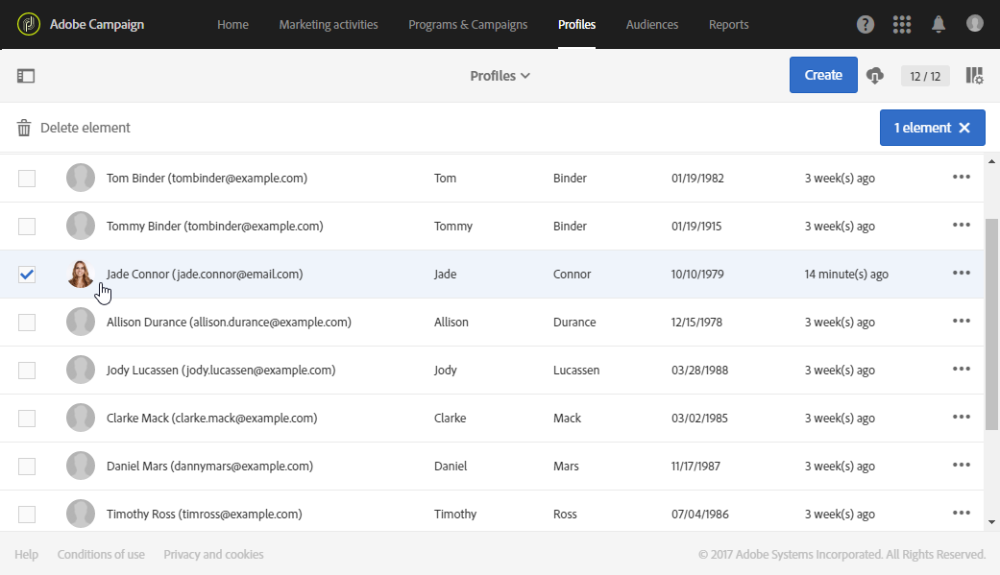

# Integrated customer profile{#integrated-customer-profile}

È disponibile un profilo cliente integrato per ogni contatto del database. Questa cronologia marketing combina tutte le informazioni di marketing rilevanti relative al contatto con un cliente in un'unica vista. Potete quindi accedere a tutti i comportamenti digitali, le transazioni online e offline in una posizione centrale: informazioni di contatto, e-mail ricevute, registri di tracciamento, iscrizioni e cancellazioni di iscrizioni, ecc.

Per accedere al profilo cliente integrato, effettuate le seguenti operazioni:

1. Dalla home page di Adobe Campaign, fai clic sulla **[!UICONTROL Customer profiles]** scheda o sulla scheda **Profili** .
1. Selezionare un contatto.

   

Potete quindi accedere alla cronologia **di** marketing di questo contatto.

Le informazioni chiave sul profilo sono raccolte in questa pagina, così come l'elenco degli eventi.

Fate clic su un evento nell’elenco per aprirlo: puoi accedere al messaggio inviato o al servizio a cui il profilo ha effettuato la sottoscrizione.

>[!NOTE]
>
>La cronologia del marketing è accessibile anche tramite l'API Adobe Campaign Standard. Per ulteriori informazioni, consulta la documentazione  dedicata.

