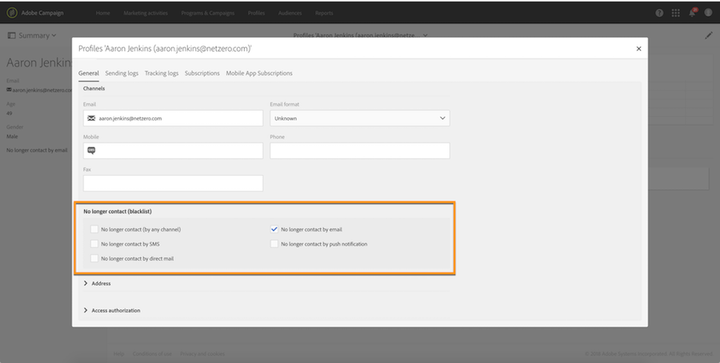

# Gestione del consenso e del rifiuto nella campagna{#managing-opt-in-and-opt-out-in-campaign}

## Gestione del consenso e del rifiuto da un profilo {#managing-opt-in-and-opt-out-from-a-profile}

Gli utenti possono essere ammessi o disabilitati da un operatore direttamente dalla **[!UICONTROL General]** scheda del profilo.

Nella **[!UICONTROL No longer contact (blacklist)]** sezione, le caselle selezionate corrispondono ai canali da cui l'utente ha scelto di rifiutare. Selezionate i canali in base alle esigenze dell'utente.

## Impostazione delle pagine di destinazione di consenso e rinuncia {#setting-up-opt-in-and-opt-out-landing-pages}

Per consentire agli utenti di scegliere se aderire o rifiutare, dovete creare e pubblicare una pagina di **[!UICONTROL Profile acquisition]** destinazione. Essi potranno quindi selezionare i canali in base alle loro esigenze. A questo scopo, attenetevi alla procedura seguente.

Potete anche impostare una **[!UICONTROL BlackList]** pagina di destinazione che consenta agli utenti di rifiutare tutte le consegne. Per ulteriori informazioni, vedere [Impostazione di una pagina di destinazione per rifiutare tutte le consegne](#setting-up-a-landing-page-to-opt-out-from-all-deliveries).

>[!NOTE]
>
>Le pagine di destinazione possono essere utilizzate anche per abilitare l'iscrizione ai servizi. For more on this, refer to [this page](../../channels/using/designing-a-landing-page.md#linking-a-form-to-a-service).

1. Creare una **[!UICONTROL Profile acquisition]** pagina di destinazione (vedere [questa sezione](../../channels/using/about-landing-pages.md)).
1. Aggiungi una casella di controllo nel contenuto della pagina di destinazione per ciascun canale desiderato, quindi collegala al campo corrispondente dal database Campaign.

   

1. Salvate la pagina di destinazione e pubblicatela.
1. Nella pagina di destinazione, le caselle di controllo sono già selezionate in base alla **[!UICONTROL General]** scheda del profilo. L'utente può selezionare o deselezionare i canali in base alle proprie esigenze e inviare il modulo.

   

1. Una volta inviato il modulo, la **[!UICONTROL General]** scheda del profilo viene aggiornata in base alla selezione dell'utente.

   

### Impostazione di una pagina di destinazione per rifiutare tutte le consegne {#setting-up-a-landing-page-to-opt-out-from-all-deliveries}

Per consentire agli utenti di rifiutare tutte le consegne, dovete creare e pubblicare una pagina di **[!UICONTROL BlackList]** destinazione. Per ulteriori informazioni sulla creazione delle pagine di destinazione, consulta [questa pagina](../../channels/using/about-landing-pages.md).

Quando un utente fa clic sul collegamento della pagina di destinazione, l' **[!UICONTROL No longer contact (by any channel)]** opzione nel profilo viene automaticamente selezionata.

