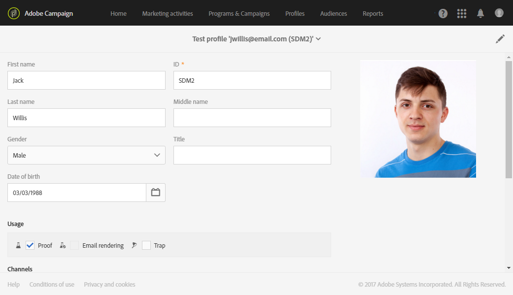
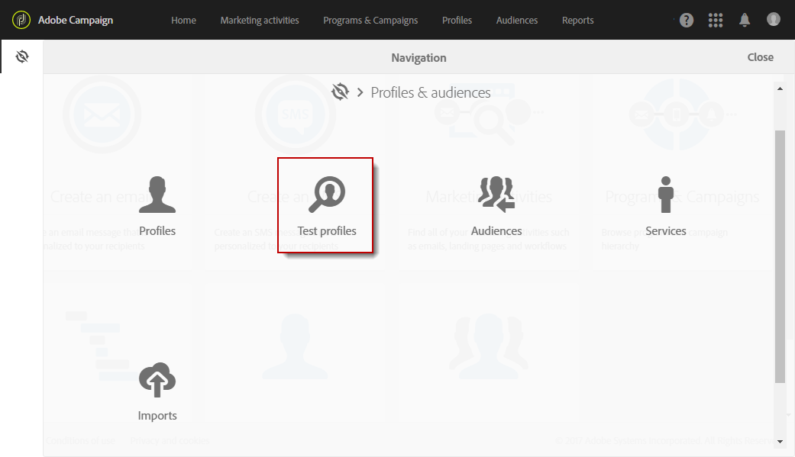
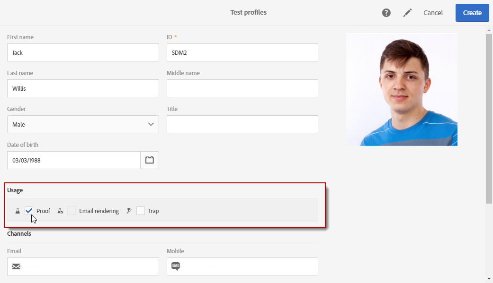

# Gestione dei profili di test {#managing-test-profiles}

## Informazioni sui profili di test {#about-test-profiles}

I profili di test ti consentono di eseguire il targeting di destinatari aggiuntivi che non soddisfano i criteri di targeting definiti. Vengono aggiunti al pubblico di un messaggio per rilevare eventuali utilizzi fraudolenti del database dei destinatari o per assicurarsi che le e-mail arrivino nelle caselle in entrata.

 [Guarda un video su questa funzione](#video)

Puoi gestire i profili di test dal menu avanzato **[!UICONTROL Profiles & audiences > Test profiles]**.

Un profilo di test contiene informazioni di contatto fittizie, o informazioni di contatto controllate dal mittente, che possono essere utilizzate in un messaggio nei seguenti contesti:

* Per l’invio di **bozze**: la bozza è un messaggio specifico utilizzato per verificare il messaggio prima di inviare la consegna finalizzata ai destinatari. Un profilo di test di bozza è incaricato di verificare la consegna per quanto riguarda il contenuto e il formato. Consulta [Invio di bozze](../../sending/using/sending-proofs.md).
* Per **Rendering e-mail**: il profilo di test Rendering e-mail viene utilizzato per verificare il modo in cui un messaggio viene visualizzato in base alla casella in entrata del messaggio che lo riceve. Ad esempio, posta sul web, servizio messaggi, dispositivi mobili, ecc. Vedi [Rendering di e-mail](../../sending/using/email-rendering.md).

  L’utilizzo di **Rendering e-mail** è di sola lettura. I profili di test con questo utilizzo sono disponibili solo preconfigurati in Adobe Campaign.

* Come una **trappola**: il messaggio viene inviato al profilo di test esattamente come viene inviato al target principale. Consulta [Utilizzo delle “trappole”](../../sending/using/using-traps.md).
* Per **visualizzare in anteprima** i messaggi: quando visualizzi l’anteprima di un messaggio per testare gli elementi di personalizzazione, puoi selezionare un profilo di test. Consulta [Anteprima dei messaggi](/help/sending/using/previewing-messages.md).

## Creazione di profili di test {#creating-test-profiles}

1. Dal menu avanzato, tramite il logo Adobe Campaign, seleziona **Profiles &amp; Audiences > Profili di test** per accedere all’elenco dei profili di test.

   

1. Dal dashboard **[!UICONTROL Test profiles]**, fai clic su **Create**.

   

1. Immetti i dati per questo profilo.

   

1. Seleziona l’utilizzo desiderato per il profilo di test.

   

1. Inserisci i canali di contatto **[!UICONTROL Email, Telephone, Mobile, Mobile app]**, nonché l’indirizzo del profilo di test, se necessario.

   >[!NOTE]
   >
   >Puoi definire un formato e-mail preferito: **[!UICONTROL Text]** o **[!UICONTROL HTML]**.

1. Se desideri utilizzare questo profilo di test per testare la personalizzazione di un messaggio transazionale, specifica un tipo di evento e i dati per questo evento.
1. Fai clic su **[!UICONTROL Create]** per salvare il profilo di test.

Il profilo di test verrà quindi aggiunto all’elenco dei profili.

## Modifica dei profili di test {#editing-test-profiles}

Per modificare un profilo di test e consultare i dati ad esso collegati, oppure per modificarli:

1. Seleziona il profilo di test da modificare facendo clic sulla relativa immagine.
1. Consulta o modifica i campi.

   

1. Fai clic su **[!UICONTROL Save]** se hai inserito le modifiche, oppure seleziona il nome del profilo di test e quindi **[!UICONTROL Test profiles]** nella sezione nella parte superiore della schermata per tornare al dashboard dei profili di test.

## Video tutorial {#video}

Questo video mostra come creare un profilo di test.

>[!VIDEO](https://video.tv.adobe.com/v/24094?quality=12)

Ulteriori video dimostrativi di Campaign Standard sono disponibili [qui](https://experienceleague.adobe.com/docs/campaign-standard-learn/tutorials/overview.html?lang=it).
