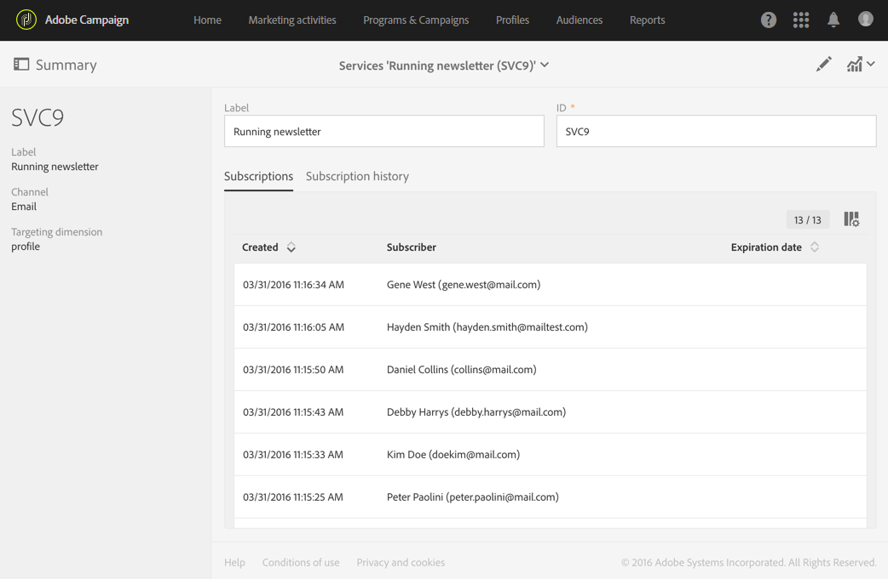

# Monitoraggio degli abbonamenti{#monitoring-subscriptions}

Utilizza l’interfaccia di Adobe Campaign per tenere traccia degli abbonati e misurare il successo dei tuoi servizi.

Sono disponibili diverse opzioni per monitorare gli abbonamenti e i loro annullamenti:

* Visualizza l’elenco degli abbonati al servizio dal dashboard del servizio. Vedi [Dashboard del servizio](#service-dashboard).
* Consulta la cronologia degli abbonamenti e dei loro annullamenti dalla scheda **Cronologia abbonamenti** nel dashboard del servizio. Vedi [Cronologia abbonamenti](#subscription-history).
* Visualizza un report che descrive l&#39;evoluzione degli abbonamenti e dei loro annullamenti nel servizio **Report**. Consulta [Report servizio](#service-reports).
* Trova l&#39;elenco dei servizi a cui una persona ha effettuato l&#39;abbonamento dal suo **profilo**. Vedi [Cronologia degli eventi collegati a un profilo](#history-of-events-linked-to-a-profile).

## Dashboard del servizio {#service-dashboard}

Per visualizzare l’elenco degli abbonati a un servizio:

1. Passa all&#39;elenco dei servizi tramite il menu avanzato **Profili e pubblico** > **Servizi**, accessibile dal logo di Adobe Campaign.
1. Seleziona il servizio desiderato per visualizzare la dashboard corrispondente.
1. L&#39;elenco degli abbonati al servizio si trova nella scheda **Abbonamenti**.

## Cronologia iscrizioni {#subscription-history}

Per consultare la cronologia degli abbonamenti e del loro annullamento:

1. Passa all&#39;elenco dei servizi tramite il menu avanzato **Profili e pubblico** > **Servizi**, accessibile dal logo di Adobe Campaign.
1. Seleziona il servizio desiderato per visualizzare la dashboard corrispondente.
1. Selezionare la scheda **Cronologia abbonamenti** per visualizzare le date di sottoscrizione e annullamento dell&#39;abbonamento di ogni utente.

## Rapporti sui servizi {#service-reports}

Per visualizzare un rapporto che descrive l’evoluzione degli abbonamenti e dei loro annullamenti:

1. Passa all&#39;elenco dei servizi tramite il menu avanzato **Profili e pubblico** > **Servizi**, accessibile dal logo di Adobe Campaign.
1. Seleziona il servizio desiderato per visualizzare la dashboard corrispondente.
1. Fai clic sul pulsante **Rapporti** nella barra delle azioni, quindi **Monitoraggio abbonamento** nella schermata di selezione.

   

1. Il report **Riepilogo servizio** presenta il numero di abbonamenti, l&#39;evoluzione complessiva degli abbonamenti e una curva che mostra l&#39;avanzamento nel tempo.

## Cronologia degli eventi collegati a un profilo {#history-of-events-linked-to-a-profile}

Per consultare l&#39;elenco dei servizi a cui un contatto si è iscritto, è possibile consultare la cronologia di marketing. Per ulteriori informazioni, consulta la sezione [Integrated customer profile](../../audiences/using/integrated-customer-profile.md).

