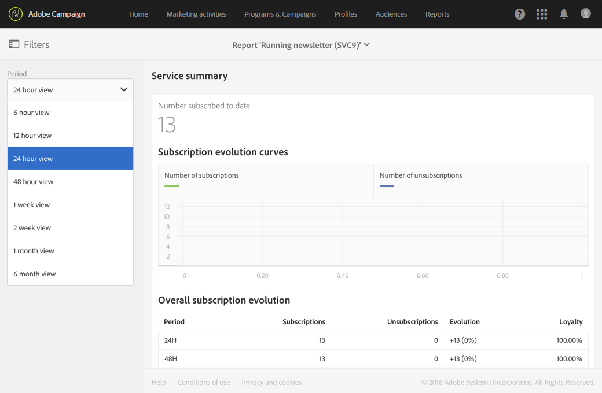

# Monitoraggio delle sottoscrizioni{#monitoring-subscriptions}

Utilizza l'interfaccia di Adobe Campaign per monitorare i tuoi abbonati e misurare il successo dei tuoi servizi.

Sono disponibili diverse opzioni per monitorare le sottoscrizioni e annullarle:

* Visualizzate l'elenco delle persone attualmente sottoscritte al servizio dal dashboard del servizio. Consultate Pannello [dei](#service-dashboard)servizi.
* consultate la cronologia delle sottoscrizioni e delle sottoscrizioni dalla scheda Cronologia **** iscrizioni nel dashboard del servizio. Consultate Cronologia iscrizioni.
* visualizza un rapporto che descrive l'evoluzione delle sottoscrizioni e delle sottoscrizioni nei **Report** di servizio. Consultate Rapporti sui [servizi](#service-reports).
* trova l'elenco dei servizi che una persona ha sottoscritto dal suo **profilo**. Consultate [Cronologia degli eventi collegati a un profilo](#history-of-events-linked-to-a-profile).

## Pannello del servizio {#service-dashboard}

Per visualizzare l’elenco delle persone che hanno effettuato la sottoscrizione a un servizio:

1. Vai all'elenco dei servizi tramite il menu avanzato **Profili e pubblico** &gt; **Servizi**, accessibile dal logo di Adobe Campaign.
1. Selezionate il servizio desiderato per visualizzare il dashboard corrispondente.
1. L'elenco delle persone sottoscritte al servizio si trova nella scheda **Iscrizioni** .

## Cronologia iscrizioni {#subscription-history}

Per consultare la cronologia dell'iscrizione e dell'annullamento dell'iscrizione:

1. Vai all'elenco dei servizi tramite il menu avanzato **Profili e pubblico** &gt; **Servizi**, accessibile dal logo di Adobe Campaign.
1. Selezionate il servizio desiderato per visualizzare il dashboard corrispondente.
1. Selezionate la scheda Cronologia **** iscrizione per visualizzare le date in cui ogni utente ha effettuato la sottoscrizione e ha annullato la sottoscrizione.

## Rapporti sui servizi {#service-reports}

Per visualizzare un rapporto con informazioni dettagliate sull'evoluzione delle sottoscrizioni e delle sottoscrizioni:

1. Vai all'elenco dei servizi tramite il menu avanzato **Profili e pubblico** &gt; **Servizi**, accessibile dal logo di Adobe Campaign.
1. Selezionate il servizio desiderato per visualizzare il dashboard corrispondente.
1. Fate clic sul pulsante **Rapporti** nella barra delle azioni, quindi sul monitoraggio delle **** iscrizioni nella schermata di selezione.

   

1. Il rapporto di riepilogo **del** servizio presenta il numero di sottoscrizioni, l’evoluzione complessiva delle sottoscrizioni e una curva che mostra l’avanzamento nel tempo.

## Cronologia degli eventi collegati a un profilo {#history-of-events-linked-to-a-profile}

Per consultare l'elenco dei servizi sottoscritti da un contatto, è possibile consultare la cronologia di marketing. Per ulteriori informazioni, consulta la sezione [Profilo](../../audiences/using/integrated-customer-profile.md) cliente integrato.

