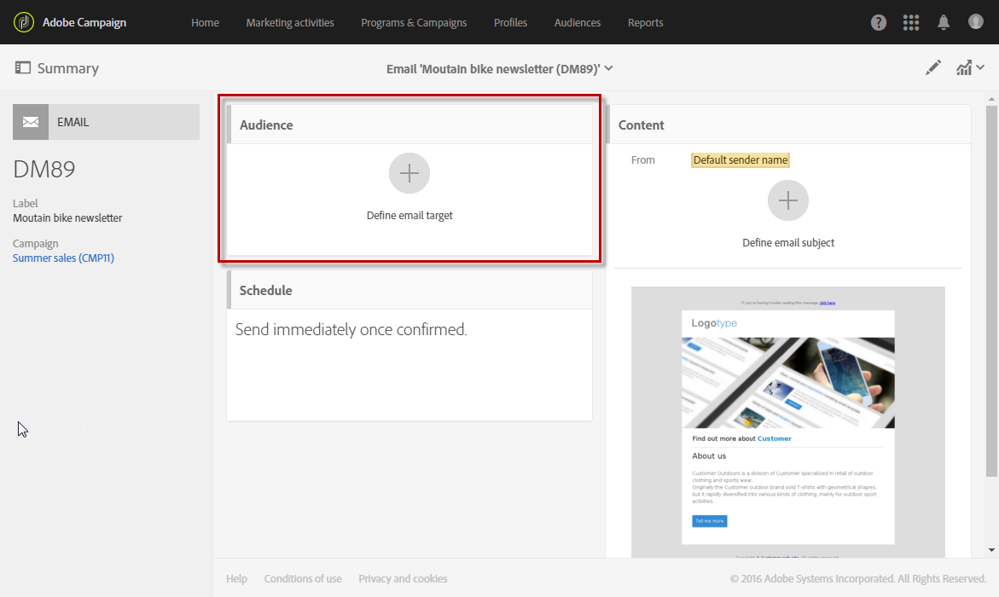

# Selezione di un pubblico in un messaggio{#selecting-an-audience-in-a-message}

Adobe Campaign ti consente di configurare diversi tipi di profilo all’interno del pubblico di un messaggio.

Se il messaggio è già stato creato, puoi definire i tipi di pubblico al momento della creazione del messaggio tramite la procedura guidata di creazione o dal dashboard dei messaggi.

>[!NOTE]
>
>Se il pubblico è stato creato all’interno di un flusso di lavoro e arricchito di dati aggiuntivi, non puoi utilizzare questi dati per personalizzare una consegna autonoma. È possibile utilizzarli solo da una consegna eseguita in un flusso di lavoro.

1. Dal dashboard, passa al blocco del pubblico per iniziare.

   

   Viene visualizzata la schermata che consente di definire i tipi di pubblico. Sono disponibili due schede che ti consentono di definire separatamente ogni tipo di pubblico a cui inviare il messaggio:

   * Target
   * Profili di test
   

1. Definisci il **[!UICONTROL Target]** principale del messaggio e-mail. Si tratta del pubblico target regolare del messaggio e-mail.

   Il target è definito nella scheda **[!UICONTROL Target]** ed è composto da profili identificati nel database.

   Puoi stabilire il target principale utilizzando le funzionalità dell’[editor delle query](../../automating/using/editing-queries.md#creating-queries).

   In questa scheda, la palette **[!UICONTROL Shortcuts]** contiene solo filtri preimpostati e i tipi di pubblico definiti nei profili identificati. La scheda **[!UICONTROL Explorer]** ti consente di accedere a configurazioni aggiuntive.

   Puoi quindi riutilizzare e combinare i tipi di pubblico esistenti, applicarvi ulteriori filtri, ecc.

1. Definisci i **[!UICONTROL Test profiles]** da utilizzare per le e-mail. I profili di test ricevono le bozze, che puoi inviare preliminarmente per verificare l’e-mail prima di inviarla al target principale.

   Per ulteriori informazioni sulla configurazione di profili di test, consulta la sezione [Profili di test](../../audiences/using/managing-test-profiles.md).

Il blocco dei tipi di pubblico viene quindi aggiornato e mostra che sono stati selezionati profili target e di test per l’e-mail in questione.

