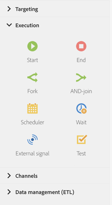

# About execution activities{#about-execution-activities}

From the palette, on the left-hand side of the screen, unfold the **[!UICONTROL Execution]** section.

Le attività seguenti sono specifiche per l'organizzazione e l'esecuzione dei flussi di lavoro. La loro attività principale è coordinare le altre attività.

**[!UICONTROL Execution]** La sezione include le attività seguenti:

* [Inizio e fine](../../automating/using/start-and-end.md)
* [Foratura](../../automating/using/fork.md)
* [AND-join](../../automating/using/and-join.md)
* [Pianificatore](../../automating/using/scheduler.md)
* [Attendi](../../automating/using/wait.md)
* [Segnale esterno](../../automating/using/external-signal.md)
* [Test](../../automating/using/test.md)

