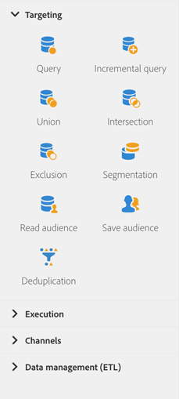

# Informazioni sulle attività di targeting{#about-targeting-activities}

Dalla palette, sul lato sinistro dello schermo, apri la sezione **[!UICONTROL Targeting]**.

Queste attività sono specifiche per il targeting, la manipolazione dei dati sulla popolazione e le attività di filtro. Consentono di creare uno o più target definendo i set e suddividendoli o combinandoli mediante operazioni di intersezione, unione o esclusione.

La sezione **[!UICONTROL Targeting]** include le seguenti attività:

* [Query](../../automating/using/query.md)
* [Query incrementale](../../automating/using/incremental-query.md)
* [Unione](../../automating/using/union.md)
* [Intersezione](../../automating/using/intersection.md)
* [Esclusione](../../automating/using/exclusion.md)
* [Segmentazione](../../automating/using/segmentation.md)
* [Leggere tipi di pubblico](../../automating/using/read-audience.md)
* [Salvare tipi di pubblico](../../automating/using/save-audience.md)
* [Deduplica](../../automating/using/deduplication.md)
* [Arricchimento](../../automating/using/enrichment.md)

Le attività **[!UICONTROL Targeting]** ti consentono di definire **codici di segmento** per le loro transizioni in uscita. Puoi quindi creare report basati su questi codici di segmento per misurare l’efficienza delle campagne di marketing. Per ulteriori informazioni al riguardo, consulta [questa sezione](../../reporting/using/creating-a-report-workflow-segment.md).

## Selezione dei dati {#selecting-data}

Puoi selezionare i dati utilizzando le seguenti attività:

* L’attività **[!UICONTROL Query]** ti consente di filtrare ed estrarre una popolazione di elementi dal database di Adobe Campaign. Consulta la sezione [Query](../../automating/using/query.md).
* L’attività **[!UICONTROL Incremental query]** ti consente di filtrare ed estrarre una popolazione di elementi dal database di Adobe Campaign. Ogni volta che questa attività viene eseguita, i risultati delle esecuzioni precedenti sono esclusi. Questo consente di eseguire il targeting solo dei nuovi elementi. Vedi. [Sezione Incremental query](../../automating/using/incremental-query.md).
* L’attività **[!UICONTROL Read audience]** ti consente di recuperare un pubblico esistente e di perfezionarlo applicando condizioni di filtro aggiuntive.Consulta la sezione [Read audience](../../automating/using/read-audience.md).

## Segmentazione dei dati {#segmenting-data}

Adobe Campaign consente di elaborare i set sui dati in entrata. Puoi quindi combinare più popolazioni, escluderne parte o mantenere i dati comuni a più destinazioni.

* L’attività **[!UICONTROL Union]** ti consente di raggruppare il risultato di più attività in un unico target. Consulta la sezione [Unione](../../automating/using/union.md).
* L’attività **[!UICONTROL Intersection]** ti consente di mantenere solo gli elementi comuni alle diverse popolazioni in entrata all’interno dell’attività. Consulta la sezione [Intersezione](../../automating/using/intersection.md).
* L’attività **[!UICONTROL Exclusion]** consente di escludere elementi da una popolazione in base a determinati criteri. Consulta la sezione [Esclusione](../../automating/using/exclusion.md).
* L’attività **[!UICONTROL Segmentation]** ti consente di creare uno o più segmenti da una popolazione calcolata dalle attività inserite in precedenza nel flusso di lavoro. Al termine dell’attività, puoi elaborarli in un’unica transizione o in diverse transizioni. Consulta la sezione [Segmentazione](../../automating/using/segmentation.md).

## Arricchimento dei dati {#enriching-data}

I dati identificati e raccolti possono essere arricchiti, aggregati e manipolati per ottimizzare la costruzione del target. Puoi semplificare e ottimizzare i processi di targeting includendo dati non modellati nel data mart.

La scheda **[!UICONTROL Additional data]** delle attività **[!UICONTROL Query]** e **[!UICONTROL Incremental query]** ti consente di arricchire i dati di destinazione della query e trasferirli alle seguenti attività del flusso di lavoro, dove è possibile utilizzarli. In particolare, puoi aggiungere:

* Dati semplici
* Aggregati
* Raccolte

**Argomenti correlati:**

* [Caso di utilizzo: personalizzazione di un’e-mail con dati aggiuntivi](../../automating/using/personalizing-email-with-additional-data.md)
