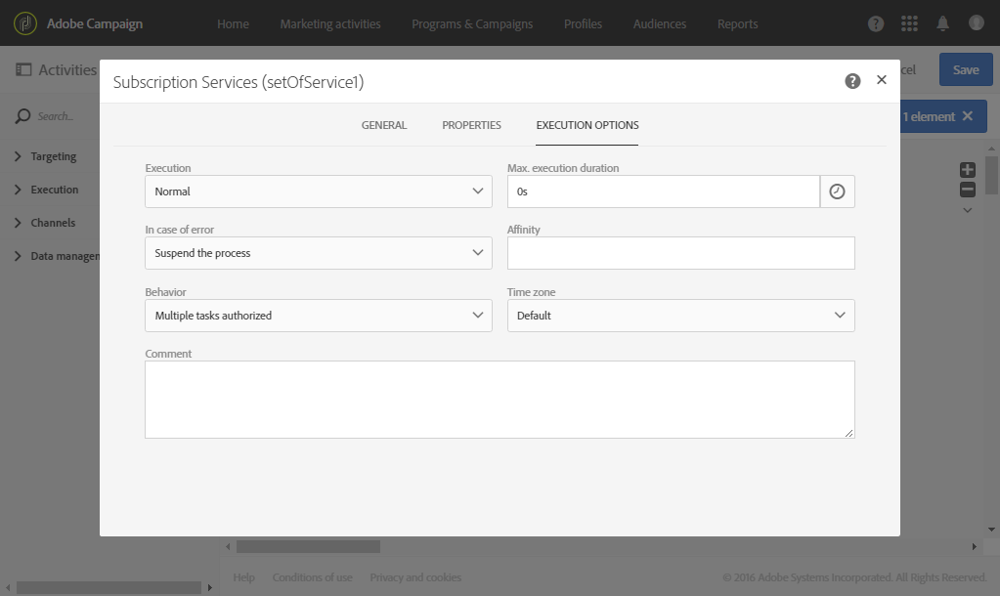

# Gestione delle proprietà delle attività {#activity-properties}

## Proprietà globali di un&#39;attività {#global-properties-of-an-activity}

Ogni attività dispone di una **[!UICONTROL General]** scheda, che consente di modificare i parametri generali specifici per l&#39;attività.

La **[!UICONTROL Properties]** scheda consente di modificare i parametri globali dell&#39;attività, in particolare l&#39;etichetta e l&#39;ID. La configurazione di questa scheda è facoltativa.

## Gestione delle transizioni in uscita di un&#39;attività {#managing-an-activity-s-outbound-transitions}

Per impostazione predefinita, alcune attività non hanno una transizione in uscita. Potete aggiungerne uno dalla **[!UICONTROL Transitions]** scheda o dalla **[!UICONTROL Properties]** scheda dell&#39;attività per applicare altri processi alla popolazione nello stesso flusso di lavoro.

A seconda delle attività, è possibile aggiungere diversi tipi di transizioni in uscita:

* **Transizione** standard: popolazione calcolata dall&#39;attività
* **Transizione senza popolazione**: questo tipo di transizione in uscita può essere aggiunto per continuare il flusso di lavoro e non contiene alcuna popolazione per non utilizzare spazio inutile sul sistema.
* **Rifiuta**: rifiutata la popolazione. Ad esempio, se non è stato possibile elaborare i dati in entrata dell&#39;attività perché errati o incompleti.
* **Complemento**: popolazione rimanente dopo l&#39;esecuzione dell&#39;attività. Ad esempio, se un&#39;attività di segmentazione è configurata per salvare solo una percentuale della popolazione in entrata.

Se applicabile, specificate una **[!UICONTROL Segment code]** per la transizione in uscita dell&#39;attività. Questo codice del segmento ti consentirà di identificare da dove provengono i sottoinsiemi della popolazione di destinazione e, successivamente, di servire a scopi di personalizzazione dei messaggi.

## Opzioni di esecuzione dell&#39;attività {#activity-execution-options}

Nella schermata delle proprietà dell&#39;attività, è presente una **[!UICONTROL Advanced options]** scheda che consente di definire la modalità di esecuzione e il comportamento dell&#39;attività in caso di errori.

Per accedere a queste opzioni, selezionate un&#39;attività in un flusso di lavoro, quindi apritela utilizzando il  pulsante presente nella barra delle azioni.

Il **[!UICONTROL Execution]** campo consente di definire l’azione da eseguire all’avvio dell’attività. Sono disponibili tre opzioni:

* **Normale**: l&#39;attività viene eseguita normalmente.
* **Abilita ma non esegui**: l&#39;attività viene messa in pausa, e di conseguenza anche tutti i processi successivi. Questo può risultare utile se desiderate essere presenti all’avvio dell’attività.
* **Non abilitare**: l&#39;attività non viene eseguita e, di conseguenza, non sono eseguite tutte le attività successive (nello stesso ramo).

Il **[!UICONTROL In case of error]** campo consente di specificare l&#39;azione da eseguire in caso di errore nell&#39;attività. Sono disponibili due opzioni:

* **Sospendere il processo**: il flusso di lavoro viene automaticamente sospeso. Lo stato del flusso di lavoro è quindi **Erroneo** e il colore associato diventa rosso. Una volta risolto il problema, riavviate il flusso di lavoro.
* **Ignora**: l&#39;attività non viene eseguita, e di conseguenza nessuna delle attività che la seguono (nello stesso ramo). Ciò può risultare utile per le attività ricorrenti. Se il ramo dispone di un pianificatore posizionato a monte, questo deve essere attivato alla data di esecuzione successiva.

Il **[!UICONTROL Behavior]** campo consente di definire la procedura da seguire se vengono utilizzate le attività asincrone. Sono disponibili due opzioni:

* **Più attività autorizzate**: è possibile eseguire più attività contemporaneamente anche se la prima non è stata completata.
* **L&#39;attività corrente ha priorità**: una volta che un&#39;attività è in corso, questa è una priorità. Fino a quando un&#39;attività è ancora in corso, non verrà eseguita alcuna altra attività.

Il **[!UICONTROL Max. execution duration]** campo consente di specificare una durata, ad esempio &quot;30 s&quot; o &quot;1 h&quot;. Se l&#39;attività non è finita dopo che è trascorso il periodo specificato, viene attivato un avviso. Questo non ha alcun impatto sul funzionamento del flusso di lavoro.

Il **[!UICONTROL Affinity]** campo consente di forzare l&#39;esecuzione di un flusso di lavoro o di un&#39;attività di workflow su un computer specifico. A questo scopo, dovete specificare una o più affinità per il flusso di lavoro o l&#39;attività in questione.

Il **[!UICONTROL Time zone]** campo consente di selezionare il fuso orario dell&#39;attività.  Adobe Campaign consente di gestire le differenze di tempo tra più paesi sulla stessa istanza. L&#39;impostazione applicata viene configurata al momento della creazione dell&#39;istanza.

>[!NOTE]
>
>Per impostazione predefinita, se non è selezionato alcun fuso orario, l&#39;attività utilizza il fuso orario definito nelle proprietà del flusso di lavoro.

Il campo **Commento** è un campo gratuito che consente di aggiungere una nota.
