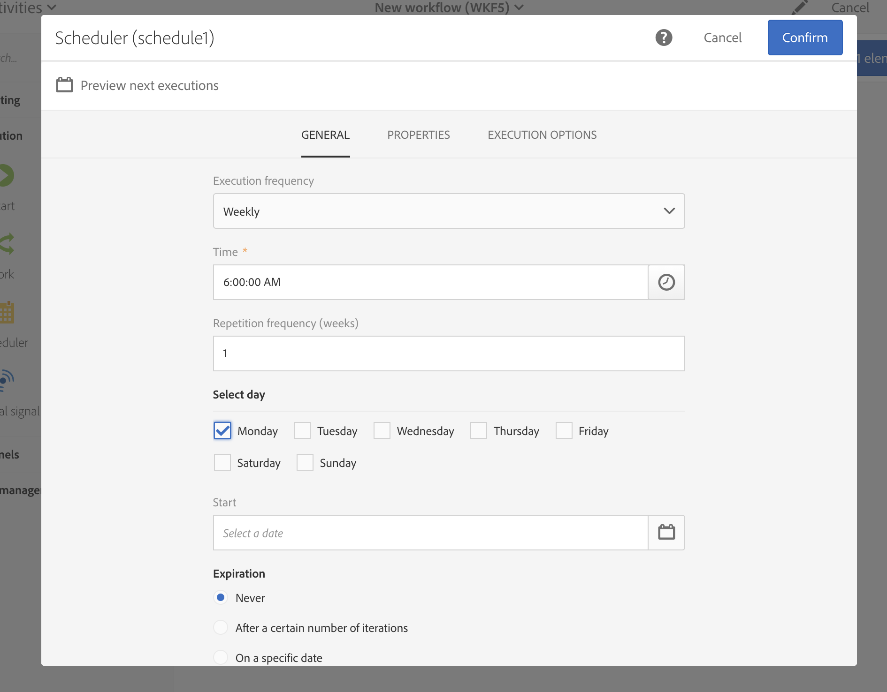

# Workflow best practices{#workflow-best-practices}

Con Adobe Campaign, puoi configurare tutti i tipi di flusso di lavoro per eseguire un'ampia gamma di attività. Tuttavia, durante la progettazione e l'esecuzione dei flussi di lavoro, è necessario essere molto prudenti in quanto un'implementazione insoddisfacente può causare prestazioni, errori e problemi di piattaforma errati. Sotto un elenco di best practice e suggerimenti per la risoluzione di problemi.

>[!NOTE]
>
>La progettazione e l'esecuzione del flusso di lavoro devono essere eseguite da un utente avanzato Adobe Campaign.

## Naming{#naming}

Per semplificare la risoluzione dei problemi del flusso di lavoro, Adobe consiglia di assegnare un nome e etichettare esplicitamente i flussi di lavoro. Compilare il campo di descrizione del flusso di lavoro per riepilogare il processo da eseguire in modo che l'operatore possa facilmente comprenderlo.
Se il flusso di lavoro fa parte di un processo che prevede più flussi di lavoro, puoi utilizzare i numeri per immetterli chiaramente.

Ad esempio:

* 001 - Importazione - Importazione di destinatari
* 002 - Importazione - Importazione di vendite
* 003 - Importazione - Importazione di dettagli di vendita
* 010 - Esportazione - Registri di consegna esportazione
* 011 - Esportazione - Registri di tracciamento esportazione

## Duplicating workflows{#duplicating-workflows}

Potete duplicare i flussi di lavoro. In the **[!UICONTROL Marketing Activities]**, hover over the workflow and click **[!UICONTROL Duplicate element]**. Una volta duplicate, le modifiche del flusso di lavoro non vengono portate alla copia del flusso di lavoro. La copia del flusso di lavoro può essere modificata.

## Execution{#execution}

### Numero di flussi di lavoro

Per impostazione predefinita, si consiglia di non eseguire più di 20 flussi di lavoro attivi contemporaneamente. Dopo aver raggiunto tale limite, i flussi di lavoro verranno messi in coda per non influire sulle prestazioni. Analogamente, Adobe consiglia di distribuire il flusso di lavoro nel tempo.
In contesti specifici, potrebbe essere necessario eseguire più di 20 flussi di lavoro. Non si applica ai flussi di lavoro in attesa di un'esecuzione pianificata. In tal caso, devi controllare i casi d'uso con un esperto di Campaign e contattare l'Assistenza clienti Adobe per aumentare il limite.

### Frequenza

Un flusso di lavoro non può essere eseguito automaticamente più volte di una volta ogni dieci minuti.
La frequenza Ripetuta dell'attività non può essere inferiore a 10 minuti. Se la frequenza di ripetizione è impostata su 0 (anche il valore predefinito), questa opzione non viene considerata e il flusso di lavoro viene eseguito in base alla frequenza di esecuzione.

### Flussi di lavoro in pausa

I flussi di lavoro che sono stati in pausa o in stato non riuscito per più di 7 giorni vengono interrotti per poter utilizzare meno spazio su disco. L'attività di pulizia viene visualizzata nei registri di workflow.

### Transizioni

È possibile eseguire un flusso di lavoro contenente transizioni non ancora chiamate: viene generato un messaggio di avviso e il flusso di lavoro si interrompe una volta raggiunta la transizione ma non genera un errore. Potete anche avviare un flusso di lavoro senza una progettazione completata e completarlo man mano che passate.

For more information, refer to [Executing workflows](../../automating/using//executing-a-workflow.md).

## Activity{#activity}

### Progettazione del flusso di lavoro

To ensure that the workflow ends properly, use an **[!UICONTROL End activity]**. Evitate di uscire dall'ultima transizione di un flusso di lavoro.

To access the detail view of the transitions, check the **[!UICONTROL Keep interim results]** option in the Execution section of the workflow properties.

>[!CAUTION]
>
>Questa opzione consuma molto spazio su disco ed è progettata per facilitare la creazione di un flusso di lavoro e per garantire la corretta configurazione e il comportamento. Lasciatela non selezionata per le istanze di produzione.

### Labelling activities{#activity-labeling}

Durante lo sviluppo del flusso di lavoro, viene generato un nome per ogni attività, come per tutti gli oggetti Adobe Campaign. Mentre il nome di un'attività è generato dallo strumento e non può essere modificato, consigliamo di etichettarlo con un nome esplicito al momento della configurazione.

### Duplicating activities{#activity-duplicating}

Per duplicare le attività esistenti, potete utilizzare copy-paste. In tal modo vengono mantenute le impostazioni definite originariamente. For more information, refer to [Duplicating workflow activities](../../automating/using/workflow-interface.md).

### Scheduler activity{#acheduler-activity}

When building your workflow, only use one **[!UICONTROL Scheduler activity]** per branch. Se lo stesso ramo di un flusso di lavoro dispone di diversi pianificatori (collegati l'uno all'altro), il numero di attività da eseguire verrà moltiplicato esponenzialmente, il che comporterebbe un sovraccarico significativo del database.

You can preview the next ten executions of your workflows by clicking **[!UICONTROL Preview next executions]**.

For more information, refer to [Scheduler activity](../../automating/using/scheduler.md).

## Calling workflow with parameters{#workflow-with-parameters}

Make sure that the name and number of parameters are identical to what is defined when calling the workflow (see [Defining the parameters when calling the workflow](../../automating/using/calling-a-workflow-with-external-parameters.md#defining-the-parameters-when-calling-the-workflow)). I tipi di parametri devono anche essere coerenti con i valori previsti.

Make sure that all the parameters have been declared in the **[!UICONTROL External signal activity]**. In caso contrario, si verificherà un errore durante l'esecuzione dell'attività.

For more information, see [Calling a workflow with external parameters](../../automating/using/calling-a-workflow-with-external-parameters.md).

## Exporting packages{#exporting-packages}

Per esportare i pacchetti, le risorse esportate non devono contenere ID predefiniti. Pertanto, gli ID di risorse opuscole devono essere modificati utilizzando un nome diverso dai modelli forniti come standard da Adobe Campaign Standard.
For more information, see [Managing packages](../../automating/using/managing-packages.md).

## Exporting lists{#exporting-lists}

The export list option allows you to export a maximum of 100,000 lines by default and defined by the **Nms_ExportListLimit option**. This option can be managed by the functional administrator, under **Administration** &gt; **Application settings** &gt; **Options**.
For more information, see [Exporting lists](../../automating/using/exporting-lists.md).

## Troubleshooting{#workflow-troubleshooting}

Adobe Campaign offre vari registri per comprendere meglio i problemi del flusso di lavoro.

### Using workflow logs{#using-workflow-logs}

Potete accedere ai registri di workflow per monitorare l'esecuzione delle attività. Indicizza le operazioni eseguite e gli errori di esecuzione in base all'ordine cronologico.
For more information, refer to [Monitoring workflow execution](../../automating/using/executing-a-workflow.md#monitoring).

### Using delivery logs{#using-delivery-logs}

I registri di distribuzione consentono di monitorare il successo delle consegne. I registri di esclusione restituiscono messaggi esclusi durante la preparazione dell'invio. L'invio di registri fornisce lo stato della consegna per ogni profilo.
For more information, refer to [Understanding delivery failures](../../sending/using/understanding-delivery-failures.md).

### Using delivery alerting{#delivery-alerting}

La funzione di avvisi sulla distribuzione è un sistema di gestione avvisi che consente a un gruppo di utenti di ricevere automaticamente le notifiche relative all'esecuzione delle consegne.
For more information, refer to [Delivery alerting](../../sending/using/receiving-alerts-when-failures-happen.md).
