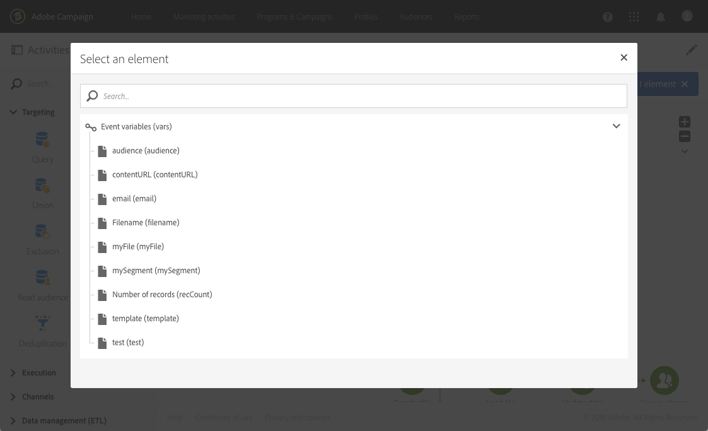
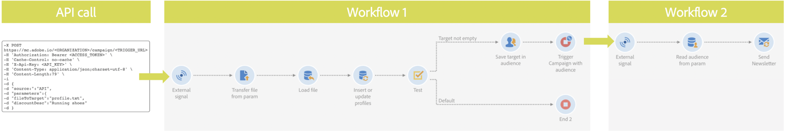
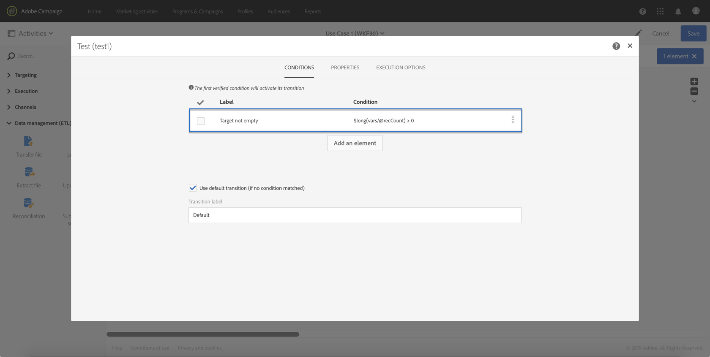
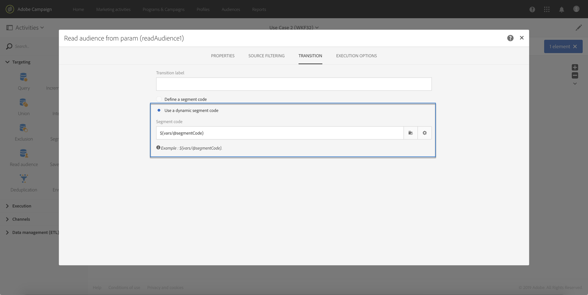

# Chiamata di un flusso di lavoro con parametri esterni{#calling-a-workflow-with-external-parameters}

Campaign Standard consente di richiamare un flusso di lavoro con parametri (un nome di audience per il targeting, un nome di file da importare, una parte del contenuto del messaggio, ecc.). In questo modo, puoi integrare facilmente le automatizzazioni Campaign con il sistema esterno.

Prendiamo l'esempio seguente, in cui desideriamo inviare e-mail direttamente da un CMS. In tal caso, potete configurare il sistema per selezionare l'audience e il contenuto dell'e-mail nel CMS. Facendo clic su Invia, si chiamerà un flusso di lavoro Campaign con questi parametri, che consente di utilizzarli nel flusso di lavoro per definire il pubblico e il contenuto dell'URL da utilizzare nella distribuzione.

La procedura da seguire per chiamare un flusso di lavoro con parametri è la seguente:

1. Dichiarare i parametri nell' **[!UICONTROL External signal]** attività. Vedete [Dichiarazione dei parametri nell'attività](../../automating/using/calling-a-workflow-with-external-parameters.md#declaring-the-parameters-in-the-external-signal-activity)del segnale esterno.
1. Configurate l' **[!UICONTROL End]** attività o la chiamata API per definire i parametri e attivare l' **[!UICONTROL External signal]** attività del flusso di lavoro.

Una volta attivato il flusso di lavoro, i parametri vengono assimilati nelle variabili di eventi del flusso di lavoro e possono essere utilizzati all'interno del flusso di lavoro. Consultate [Personalizzazione di un flusso di lavoro con parametri](../../automating/using/calling-a-workflow-with-external-parameters.md#customizing-a-workflow-with-external-parameters)esterni.


## Dichiarazione dei parametri nell'attività del segnale esterno {#declaring-the-parameters-in-the-external-signal-activity}

Il primo passo per chiamare un flusso di lavoro con parametri consiste nel dichiararlo in un' **[!UICONTROL External signal]** attività.

1. Aprite l' **[!UICONTROL External signal]** attività, quindi selezionate la **[!UICONTROL Parameters]** scheda.
1. Fate clic sul **[!UICONTROL Create element]** pulsante, quindi specificate il nome e il tipo di ogni parametro.

   >[!CAUTION]
   >
   >Accertatevi che il nome e il numero di parametri siano identici a quelli definiti per la chiamata al flusso di lavoro (consultate [Definizione dei parametri per la chiamata al flusso di lavoro](../../automating/using/calling-a-workflow-with-external-parameters.md#defining-the-parameters-when-calling-the-workflow)). Inoltre, i tipi di parametri devono essere coerenti con i valori previsti.

   

1. Dopo aver dichiarato i parametri, completate la configurazione del flusso di lavoro, quindi eseguitela.

## Definizione dei parametri durante la chiamata del flusso di lavoro {#defining-the-parameters-when-calling-the-workflow}

In questa sezione viene illustrato come definire i parametri durante la chiamata di un flusso di lavoro. Per ulteriori informazioni su come eseguire questa operazione da una chiamata API, consulta la documentazione [](https://final-docs.campaign.adobe.com/doc/standard/en/api/ACS_API.html)REST APIs.

Prima di definire i parametri, accertatevi che:

* I parametri sono stati dichiarati nell' **[!UICONTROL External Signal]** attività. Vedete [Dichiarazione dei parametri nell'attività](../../automating/using/calling-a-workflow-with-external-parameters.md#declaring-the-parameters-in-the-external-signal-activity)del segnale esterno.
* Il flusso di lavoro contenente l'attività del segnale è in esecuzione.

Per configurare l' **[!UICONTROL End]** attività, attenetevi alla procedura seguente:

1. Aprite l' **[!UICONTROL End]** attività, quindi selezionate la **[!UICONTROL External signal]** scheda.
1. Seleziona il flusso di lavoro e l’attività del segnale esterno da chiamare.
1. Fate clic sul **[!UICONTROL Create element]** pulsante per aggiungere un parametro, quindi compilate il relativo nome e valore.

   * **[!UICONTROL Name]**: il nome dichiarato nell' **[!UICONTROL External signal]** attività (vedere [Dichiarazione dei parametri nell'attività](../../automating/using/calling-a-workflow-with-external-parameters.md#declaring-the-parameters-in-the-external-signal-activity)del segnale esterno).
   * **[!UICONTROL Value]**: il valore che si desidera assegnare al parametro. Il valore deve seguire la sintassi **** Standard, descritta in [questa sezione](../../automating/using/advanced-expression-editing.md#standard-syntax).
   

   >[!CAUTION]
   >
   >Accertatevi che tutti i parametri siano stati dichiarati nell' **[!UICONTROL External signal]** attività. In caso contrario, si verificherà un errore durante l'esecuzione dell'attività.

1. Una volta definiti i parametri, confermate l'attività, quindi salvate il flusso di lavoro.

## Monitoraggio delle variabili evento {#monitoring-the-events-variables}

È possibile monitorare le variabili di eventi disponibili nel flusso di lavoro, compresi i parametri esterni dichiarati. A questo scopo, effettuate le seguenti operazioni:

1. Selezionate l'attività che segue l'attività, quindi fate clic sul **[!UICONTROL External signal]** **[!UICONTROL Log and tasks]** pulsante.
1. Nella **[!UICONTROL Tasks]** scheda, fare clic  sul pulsante.

   

1. Viene visualizzato il contesto di esecuzione dell’attività (ID, stato, durata, ecc.), comprese tutte le variabili di evento ora disponibili per l’uso nel flusso di lavoro.

   

## Personalizzazione di un flusso di lavoro con parametri esterni {#customizing-a-workflow-with-external-parameters}

Una volta attivato il flusso di lavoro, i parametri vengono assimilati nelle variabili degli eventi e possono essere utilizzati per personalizzare le attività del flusso di lavoro.

Possono, ad esempio, essere utilizzati per definire il pubblico da leggere nell' **[!UICONTROL Read audience]** attività, il nome del file da trasferire nell' **[!UICONTROL Transfer file]** attività, ecc.

Le attività che possono essere personalizzate con variabili di eventi sono descritte in [questa sezione](../../automating/using/calling-a-workflow-with-external-parameters.md#customizing-activities-with-events-variables).

### Uso delle variabili di evento {#using-events-variables}

Le variabili evento sono utilizzate all'interno di un'espressione che deve rispettare la sintassi **[](../../automating/using/advanced-expression-editing.md#standard-syntax)** Standard.

La sintassi per l'utilizzo delle variabili di evento deve seguire il formato seguente e utilizzare il nome del parametro definito nell' **[!UICONTROL External signal]** attività (vedere [Dichiarazione dei parametri nell'attività](../../automating/using/calling-a-workflow-with-external-parameters.md#declaring-the-parameters-in-the-external-signal-activity)di segnale esterno):

```
$(vars/@parameterName)
```

In questa sintassi, la funzione **$** restituisce il tipo di dati **stringa** . Per specificare un altro tipo di dati, utilizzare le seguenti funzioni:

* **$long**: numero intero.
* **$float**: numero decimale.
* **$boolean**: true/false.
* **$datetime**: timestamp.

Quando si utilizza una variabile in un'attività, l'interfaccia fornisce aiuto per chiamarla.


* : selezionate la variabile degli eventi tra tutte le variabili disponibili nel flusso di lavoro (consultate ).

   

* : modificare le espressioni combinando variabili e funzioni. Per ulteriori informazioni sull'Editor espressioni, consulta [questa sezione](../../automating/using/advanced-expression-editing.md).

   

**Argomenti correlati:**

* [Modificare un'espressione](../../automating/using/advanced-expression-editing.md#edit-an-expression)
* [Sintassi standard](../../automating/using/advanced-expression-editing.md#standard-syntax)
* [Elenco delle funzioni](../../automating/using/list-of-functions.md)

### Personalizzazione di attività con variabili di eventi {#customizing-activities-with-events-variables}

Le variabili evento possono essere utilizzate per personalizzare diverse attività, elencate nella sezione seguente. Per ulteriori informazioni su come chiamare una variabile da un'attività, consultate [questa sezione](../../automating/using/calling-a-workflow-with-external-parameters.md#using-events-variables).

**[!UICONTROL Read audience]** activity: definire l'audience di cui eseguire il targeting in base alle variabili di evento.

Per ulteriori informazioni sull'utilizzo dell'attività, consultate la sezione [](../../automating/using/read-audience.md)dedicata.


**[!UICONTROL Test]** activity: creare condizioni basate su variabili di eventi.

Per ulteriori informazioni sull'utilizzo dell'attività, consultate la sezione [](../../automating/using/test.md)dedicata.


**[!UICONTROL Transfer file]** activity: personalizzare il file da trasferire in base alle variabili degli eventi.

Per ulteriori informazioni sull'utilizzo dell'attività, consultate la sezione [](../../automating/using/transfer-file.md)dedicata.


**[!UICONTROL Query]** activity: in una query è possibile fare riferimento ai parametri utilizzando espressioni che combinano variabili di eventi e funzioni. A questo scopo, aggiungete una regola e fate clic sul **[!UICONTROL Advanced mode]** collegamento per accedere alla finestra di modifica delle espressioni (consultate Modifica [delle espressioni](../../automating/using/advanced-expression-editing.md)avanzate).

Per ulteriori informazioni sull'utilizzo dell'attività, consultate la sezione [](../../automating/using/query.md)dedicata.


**[!UICONTROL Channels]** attività: personalizzare le consegne in base alle variabili degli eventi.

>[!NOTE]
>
>I valori dei parametri di consegna vengono recuperati ogni volta che la consegna viene preparata.
>
>La preparazione delle consegne ricorrenti si basa sul periodo **di** aggregazione delle consegne. Ad esempio, se il periodo di aggregazione è "per giorno", la consegna verrà preparata solo una volta al giorno. Se il valore di un parametro di consegna viene modificato durante il giorno, non verrà aggiornato nella consegna, come è già stato preparato una volta.
>
>Se prevedete di richiamare il flusso di lavoro più volte al giorno, utilizzate l' [!UICONTROL No aggregation] opzione in modo che i parametri di consegna vengano aggiornati ogni volta. Per ulteriori informazioni sulla configurazione delle consegne ricorrenti, consulta [questa sezione](/help/automating/using/email-delivery.md#configuration).

Per personalizzare una consegna basata su variabili di eventi, è innanzitutto necessario dichiarare nell'attività di consegna le variabili che si desidera utilizzare:

1. Selezionate l'attività, quindi fate clic sul  pulsante per accedere alle impostazioni.
1. Selezionate la **[!UICONTROL General]** scheda, quindi aggiungete le variabili evento che saranno disponibili come campi di personalizzazione nella distribuzione.

   

1. Fate clic sul **[!UICONTROL Confirm]** pulsante.

Le variabili degli eventi dichiarati ora sono disponibili nell'elenco dei campi di personalizzazione. Puoi utilizzarli nella consegna per eseguire le azioni seguenti:

* Definite il nome del modello da utilizzare per la consegna.

   >[!NOTE]
   >
   >Questa azione è disponibile solo per consegne **ricorrenti** .

   

* Personalizza la consegna: quando si seleziona un campo di personalizzazione per configurare una consegna, nell' **[!UICONTROL Workflow parameters]** elemento sono disponibili variabili di eventi. Puoi usarli come qualsiasi campo di personalizzazione, ad esempio per definire l’oggetto di consegna, il mittente e così via.

   La personalizzazione della distribuzione è dettagliata in [questa sezione](../../designing/using/personalization.md).

   

**Codici** segmento: definisce il codice del segmento in base alle variabili degli eventi.

>[!NOTE]
>
>Questa azione può essere eseguita da qualsiasi attività che consente di definire un codice di segmento come, ad esempio, **[!UICONTROL Query]** o **[!UICONTROL Segmentation]** attività.


**Etichetta** consegna: definire l'etichetta di consegna in base alle variabili degli eventi.


## Caso di utilizzo {#use-case}

Il caso d’uso seguente mostra come chiamare il flusso di lavoro con i parametri all’interno dei flussi di lavoro.

L'obiettivo è attivare un flusso di lavoro da una chiamata API con parametri esterni. Questo flusso di lavoro caricherà i dati nel database da un file e creerà un'audience associata. Una volta creata l'audience, verrà attivato un secondo flusso di lavoro per inviare un messaggio personalizzato con i parametri esterni definiti nella chiamata API.

Per eseguire questo caso di utilizzo, è necessario eseguire le azioni seguenti:

1. **Eseguite una chiamata** API per attivare Workflow 1 con parametri esterni. Vedere [Passaggio 1: Configurazione della chiamata](../../automating/using/calling-a-workflow-with-external-parameters.md#step-1--configuring-the-api-call)API.
1. **Crea flusso di lavoro 1**: il flusso di lavoro trasferisce un file e lo carica nel database. Quindi, verrà verificato se i dati sono vuoti o meno e alla fine salverà i profili in un'audience. Infine, attiverà Workflow 2. Vedere [Passaggio 2: Configurazione del flusso di lavoro 1](../../automating/using/calling-a-workflow-with-external-parameters.md#step-2--configuring-workflow-1).
1. **Crea flusso di lavoro 2**: il flusso di lavoro leggerà l'audience creata nel Flusso di lavoro 1, quindi invierà un messaggio personalizzato ai profili, con un codice del segmento personalizzato con i parametri. Vedere [Passaggio 3: Configurazione del flusso di lavoro 2](../../automating/using/calling-a-workflow-with-external-parameters.md#step-3--configuring-workflow-2).



### Prerequisiti {#prerequisites}

Prima di configurare i flussi di lavoro, è necessario creare i flussi di lavoro 1 e 2 con un' **[!UICONTROL External signal]** attività in ciascuno di essi. In questo modo, potrai eseguire il targeting di queste attività di segnale quando chiami i flussi di lavoro.

### Passaggio 1: Configurazione della chiamata API {#step-1--configuring-the-api-call}

Effettuare una chiamata API per attivare Workflow 1 con i parametri. Per ulteriori informazioni sulla sintassi delle chiamate API, consulta la documentazione [sulle API REST di](https://final-docs.campaign.adobe.com/doc/standard/en/api/ACS_API.html)Campaign Standard.

Nel nostro caso, vogliamo chiamare il flusso di lavoro con i parametri seguenti:

* **fileToTarget**: il nome del file da importare nel database.
* **discountDesc**: la descrizione che vogliamo visualizzare nella consegna per lo sconto.

```
-X POST https://mc.adobe.io/<ORGANIZATION>/campaign/<TRIGGER_URL>
-H 'Authorization: Bearer <ACCESS_TOKEN>' 
-H 'Cache-Control: no-cache' 
-H 'X-Api-Key: <API_KEY>' 
-H 'Content-Type: application/json;charset=utf-8' 
-H 'Content-Length:79' 
-i
-d {
-d "source:":"API",
-d "parameters":{
-d "fileToTarget":"profile.txt",
-d "discountDesc":"Running shoes"
-d } 
```

### Passaggio 2: Configurazione del flusso di lavoro 1 {#step-2--configuring-workflow-1}

Il flusso di lavoro 1 verrà creato come segue:

* **[!UICONTROL External signal]** activity: dove i parametri esterni devono essere dichiarati per essere utilizzati nel flusso di lavoro.
* **[!UICONTROL Transfer file]** activity: importa il file con il nome definito nei parametri.
* **[!UICONTROL Load file]** activity: carica i dati dal file importato nel database.
* **[!UICONTROL Update data]** activity: inserire o aggiornare il database con i dati del file importato.
* **[!UICONTROL Test]** activity: verifica se sono presenti dati importati.
* **[!UICONTROL Save audience]** activity: se il file contiene dei dati, salva i profili in un'audience.
* **[!UICONTROL End activity]** activity: chiama Workflow 2 con i parametri che si desidera utilizzare al suo interno.


Per configurare il flusso di lavoro, effettuate le seguenti operazioni:

1. Dichiarare i parametri definiti nella chiamata API. A questo scopo, aprite l' **[!UICONTROL External signal]** attività, quindi aggiungete i nomi e i tipi dei parametri.

   

1. Aggiungete un' **[!UICONTROL Transfer file]** attività per importare i dati nel database. A tale scopo, trascinate l'attività, apritela, quindi selezionate la **[!UICONTROL Protocol]** scheda.
1. Selezionate l' **[!UICONTROL Use a dynamic file path]** opzione, quindi utilizzate il parametro **fileToTarget** come file da trasferire:

   ```
   $(vars/@fileToTarget)
   ```

   

1. Caricate i dati dal file nel database.

   A tal fine, trascinate un' **[!UICONTROL Load file]** attività nel flusso di lavoro, quindi configuratela in base alle vostre esigenze.

1. Inserite e aggiornate il database con i dati del file importato.

   A tal fine, trascinate un' **[!UICONTROL Update data]** attività, quindi selezionate la **[!UICONTROL Identification]** scheda per aggiungere un criterio di riconciliazione (nel nostro caso, il campo **e-mail** ).

   

1. Selezionate la **[!UICONTROL Fields to update]** scheda, quindi specificate i campi da aggiornare nel database (nel nostro caso, i campi **first name** e **email** ).

   

1. Verificate se i dati vengono recuperati dal file. A tal fine, trascinate un' **[!UICONTROL Test]** attività nel flusso di lavoro, quindi fate clic sul **[!UICONTROL Add an element]** pulsante per aggiungere una condizione.
1. Assegnare un nome e definire la condizione. Nel nostro caso, vogliamo verificare se la transizione in uscita contiene dati con la sintassi seguente:

   ```
   $long(vars/@recCount)>0
   ```

   

1. Se i dati vengono recuperati, salvarli in un'audience. A questo scopo, aggiungete un' **[!UICONTROL Save audience]** attività alla transizione **Target non vuota** , quindi apritela.
1. Selezionate l' **[!UICONTROL Use a dynamic label]** opzione, quindi utilizzate il parametro **fileToTarget** come etichetta dell'audience:

   ```
   $(vars/@fileToTarget)
   ```

   

1. Trascina e rilascia un' **[!UICONTROL End]** attività che chiamerà Flusso di lavoro 2 con i parametri, quindi aprila.
1. Selezionate la **[!UICONTROL External signal]** scheda, quindi specificate il flusso di lavoro da attivare e l'attività del segnale associata.
1. Definite i parametri che desiderate utilizzare in Workflow 2 e i relativi valori associati.

   Nel nostro caso, vogliamo trasmettere i parametri originariamente definiti nella chiamata API (**fileToTarget** e **scontoDesc**), e un parametro aggiuntivo **segmentCode** con un valore costante ("sconto del 20%").

   

Il flusso di lavoro 1 è configurato. È ora possibile generare il flusso di lavoro 2. For more on this, refer to [this section](../../automating/using/calling-a-workflow-with-external-parameters.md#step-3--configuring-workflow-2).

### Passaggio 3: Configurazione del flusso di lavoro 2 {#step-3--configuring-workflow-2}

Il flusso di lavoro 2 verrà creato come segue:

* **[!UICONTROL External signal]** activity: dove i parametri devono essere dichiarati per essere utilizzati nel flusso di lavoro.
* **[!UICONTROL Read audience]** activity: legge il pubblico salvato nel Flusso di lavoro 1.
* **[!UICONTROL Email delivery]** activity: invia un messaggio ricorrente all'audience di destinazione, personalizzato con parametri.


Per configurare il flusso di lavoro, effettuate le seguenti operazioni:

1. Dichiarare i parametri definiti nel Flusso di lavoro 1.

   A questo scopo, aprite l' **[!UICONTROL External signal]** attività, quindi aggiungete il nome e il tipo di ogni parametro definito nell' **[!UICONTROL End]** attività del Flusso di lavoro 1.

   

1. Utilizza il pubblico salvato nel Flusso di lavoro 1. A questo scopo, trascinate un' **[!UICONTROL Read audience]** attività nel flusso di lavoro, quindi apritela.
1. Selezionate l' **[!UICONTROL Use a dynamic audience]** opzione, quindi utilizzate il parametro **fileToTarget** come nome dell'audience da leggere:

   ```
   $(vars/@fileToTarget)
   ```

   

1. Denominate la transizione in uscita in base al parametro **segmentCode** .

   A questo scopo, selezionate la **[!UICONTROL Transition]** scheda, quindi l’ **[!UICONTROL Use a dynamic segment code]** opzione.

1. Utilizzate il parametro **segmentCode** come nome della transizione in uscita:

   ```
   $(vars/@segmentCode)
   ```

   

1. Trascinate e rilasciate un' **[!UICONTROL Email delivery]** attività per inviare un messaggio all'audience.
1. Identificare i parametri da utilizzare nel messaggio per personalizzare con il parametro **scontoDesc** . A questo scopo, aprite le opzioni avanzate dell'attività, quindi aggiungete il nome e il valore del parametro.

   

1. Ora puoi configurare il messaggio. Aprite l'attività, quindi selezionate **[!UICONTROL Recurring email]**.

   

1. Selezionate il modello da usare, quindi definite le proprietà dell’e-mail in base alle vostre esigenze.
1. Usa il parametro **scontoDesc** come campo di personalizzazione. A questo scopo, selezionatelo dall’elenco dei campi di personalizzazione.

   

1. Ora puoi completare la configurazione del messaggio e inviarlo come di consueto.

   

### Esecuzione dei flussi di lavoro {#executing-the-workflows}

Una volta generati i flussi di lavoro, potete eseguirli. Assicurati che i due flussi di lavoro siano avviati prima di eseguire la chiamata API.
