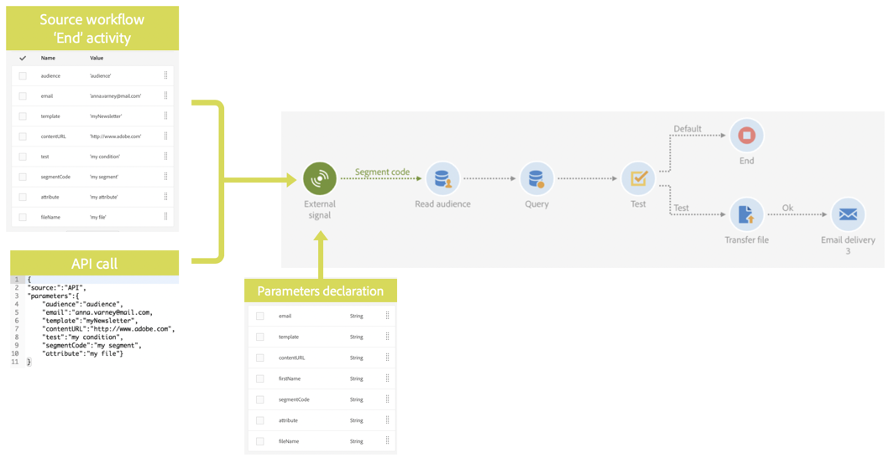

# Panoramica {#calling-a-workflow-with-external-parameters}

Campaign Standard consente di richiamare un flusso di lavoro con parametri (un nome di audience per il targeting, un nome di file da importare, una parte del contenuto del messaggio, ecc.). In questo modo, puoi integrare facilmente le automatizzazioni Campaign con il sistema esterno.

Prendiamo l&#39;esempio seguente, in cui desideriamo inviare e-mail direttamente da un CMS. In tal caso, potete configurare il sistema per selezionare l&#39;audience e il contenuto dell&#39;e-mail nel CMS. Facendo clic su Invia, si chiamerà un flusso di lavoro Campaign con questi parametri, che consente di utilizzarli nel flusso di lavoro per definire il pubblico e il contenuto dell&#39;URL da utilizzare nella distribuzione.

La procedura da seguire per chiamare un flusso di lavoro con parametri è la seguente:

1. Dichiarare i parametri nell&#39; **[!UICONTROL External signal]** attività. Vedete [Dichiarazione dei parametri nell&#39;attività](../../automating/using/declaring-parameters-external-signal.md)del segnale esterno.
1. Configurate l&#39; **[!UICONTROL End]** attività o la chiamata API per definire i parametri e attivare l&#39; **[!UICONTROL External signal]** attività del flusso di lavoro.

Una volta attivato il flusso di lavoro, i parametri vengono assimilati nelle variabili degli eventi del flusso di lavoro e possono essere utilizzati all&#39;interno del flusso di lavoro. A questo proposito, consulta la sezione .

