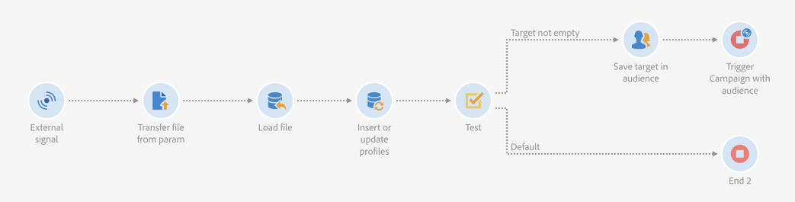

# Calling a workflow with external parameters{#calling-a-workflow-with-external-parameters}

Campaign Standard consente di chiamare un flusso di lavoro con parametri (un nome di pubblico per eseguire l'importazione, un nome di file da importare, una parte del contenuto del messaggio, ecc.). In questo modo potete integrare facilmente le automazioni Campagna con il sistema esterno.

Prendiamo l'esempio seguente, in cui desideriamo inviare le e-mail direttamente da un CMS. In tal caso, puoi configurare il sistema per selezionare il pubblico e il contenuto delle e-mail nel CMS. Facendo clic su Invia, viene quindi chiamato un flusso di lavoro Campagna con questi parametri, che consente di usarli nel flusso di lavoro per definire il pubblico e il contenuto URL da utilizzare nella distribuzione.

The process to call a workflow with parameters is the following:

1. Declare the parameters in the **[!UICONTROL External signal]** activity. See [Declaring the parameters in the External signal activity](../../automating/using/calling-a-workflow-with-external-parameters.md#declaring-the-parameters-in-the-external-signal-activity).
1. Configure the **[!UICONTROL End]** activity or the API call to define the parameters and trigger the workflow **[!UICONTROL External signal]** activity.

Una volta attivato il flusso di lavoro, i parametri vengono assimilati nelle variabili degli eventi del flusso di lavoro e possono essere utilizzati nel flusso di lavoro. See [Customizing a workflow with external parameters](../../automating/using/calling-a-workflow-with-external-parameters.md#customizing-a-workflow-with-external-parameters).


## Declaring the parameters in the External signal activity {#declaring-the-parameters-in-the-external-signal-activity}

The first step to call a workflow with parameters is to declare them in an **[!UICONTROL External signal]** activity.

1. Open the **[!UICONTROL External signal]** activity, then select the **[!UICONTROL Parameters]** tab.
1. Click the **[!UICONTROL Create element]** button, then specify the name and type of each parameter.

   >[!CAUTION]
   >
   >Make sure that the name and number of parameters are identical to what is defined when calling the workflow (see [Defining the parameters when calling the workflow](../../automating/using/calling-a-workflow-with-external-parameters.md#defining-the-parameters-when-calling-the-workflow)). Inoltre, i tipi di parametri devono essere coerenti con i valori previsti.

   

1. Una volta dichiarati i parametri, completate la configurazione del flusso di lavoro, quindi eseguiteli.

## Defining the parameters when calling the workflow {#defining-the-parameters-when-calling-the-workflow}

Questa sezione dettagliata su come definire i parametri durante la chiamata di un flusso di lavoro. For more on how to perform this operation from an API call, refer to the [REST APIs documentation](https://docs.campaign.adobe.com/doc/standard/en/api/ACS_API.html).

Prima di definire i parametri, accertatevi che:

* The parameters have been declared in the **[!UICONTROL External Signal]** activity. See [Declaring the parameters in the External signal activity](../../automating/using/calling-a-workflow-with-external-parameters.md#declaring-the-parameters-in-the-external-signal-activity).
* Il flusso di lavoro contenente l'attività del segnale è in esecuzione.

To configure the **[!UICONTROL End]** activity, follow the steps below:

1. Open the **[!UICONTROL End]** activity, then select the **[!UICONTROL External signal]** tab.
1. Selezionate il flusso di lavoro e l'attività del segnale esterno che desiderate chiamare.
1. Click the **[!UICONTROL Create element]** button to add a parameter, then fill in its name and value.

   * **[!UICONTROL Name]**: nome dichiarato nell **[!UICONTROL External signal]** 'attività (vedere [Dichiarazione dei parametri nell'attività del segnale esterno](../../automating/using/calling-a-workflow-with-external-parameters.md#declaring-the-parameters-in-the-external-signal-activity)).
   * **[!UICONTROL Value]**: il valore che desiderate assegnare al parametro. The value should follow the **Standard syntax**, described in [this section](../../automating/using/advanced-expression-editing.md#standard-syntax).
   

   >[!CAUTION]
   >
   >Make sure that all the parameters have been declared in the **[!UICONTROL External signal]** activity. In caso contrario, si verificherà un errore durante l'esecuzione dell'attività.

1. Una volta definiti i parametri, confermate l'attività, quindi salvate il flusso di lavoro.

## Monitoring the events variables {#monitoring-the-events-variables}

È possibile monitorare le variabili degli eventi disponibili nel flusso di lavoro, compresi i parametri esterni dichiarati. A tal fine, attenetevi alla procedura seguente:

1. Select the activity that follows the **[!UICONTROL External signal]** activity, then click the **[!UICONTROL Log and tasks]** button.
1. In the **[!UICONTROL Tasks]** tab, click  button.

   

1. Il contesto di esecuzione dell'attività (ID, stato, durata ecc.), comprese tutte le variabili degli eventi che sono ora disponibili per l'uso nel flusso di lavoro.

   

## Customizing a workflow with external parameters {#customizing-a-workflow-with-external-parameters}

Una volta attivato il flusso di lavoro, i parametri vengono assimilati nelle variabili degli eventi e possono essere utilizzati per personalizzare le attività del flusso di lavoro.

They can, for example, be used to define which audience to read in the **[!UICONTROL Read audience]** activity, the name of the file to transfer in the **[!UICONTROL Transfer file]** activity, etc.

Activities that can be customized with events variables are detailed in [this section](../../automating/using/calling-a-workflow-with-external-parameters.md#customizing-activities-with-events-variables).

### Using events variables {#using-events-variables}

Events variables are used within an expression that must respect the **[Standard syntax](../../automating/using/advanced-expression-editing.md#standard-syntax)**.

The syntax to use events variables must follow the format below, and use the parameter's name that has been defined in the **[!UICONTROL External signal]** activity (see [Declaring the parameters in the External signal activity](../../automating/using/calling-a-workflow-with-external-parameters.md#declaring-the-parameters-in-the-external-signal-activity)):

```
$(vars/@parameterName)
```

In this syntax, the **$** function returns **string** data type. Se si desidera specificare un altro tipo di dati, utilizzare le seguenti funzioni:

* **$ long**: numero intero.
* **$ float**: numero decimale.
* **$ boolean**: true/false.
* **$ datetime**: marca temporale.

Quando si utilizza una variabile in un'attività, l'interfaccia fornisce aiuto per chiamarla.


* : seleziona la variabile degli eventi tra tutte le variabili disponibili nel flusso di lavoro (vedi).

   

* : modificare le espressioni combinando variabili e funzioni. For more on the Expression editor, refer to [this section](../../automating/using/advanced-expression-editing.md).

   

**Argomenti correlati:**

* [Modificare un'espressione](../../automating/using/advanced-expression-editing.md#edit-an-expression)
* [Sintassi standard](../../automating/using/advanced-expression-editing.md#standard-syntax)
* [Elenco delle funzioni](../../automating/using/list-of-functions.md)

### Customizing activities with events variables {#customizing-activities-with-events-variables}

Le variabili degli eventi possono essere utilizzate per personalizzare diverse attività, elencate nella sezione di seguito. For more on how to call a variable from an activity, refer to [this section](../../automating/using/calling-a-workflow-with-external-parameters.md#using-events-variables).

**[!UICONTROL Read audience]** activity: definire l'audience in base alle variabili degli eventi.

For more on how to use the activity, refer to the [dedicated section](../../automating/using/read-audience.md).


**[!UICONTROL Test]** activity: condizioni di creazione basate sulle variabili degli eventi.

For more on how to use the activity, refer to the [dedicated section](../../automating/using/test.md).


**[!UICONTROL Transfer file]** activity: personalizzare il file in base alle variabili degli eventi.

For more on how to use the activity, refer to the [dedicated section](../../automating/using/transfer-file.md).


**[!UICONTROL Query]** activity: ai parametri è possibile fare riferimento a una query utilizzando le espressioni che combinano variabili e funzioni degli eventi. To do this, add a rule then click the **[!UICONTROL Advanced mode]** link to access the expression editing window (see [Advanced expression editing](../../automating/using/advanced-expression-editing.md)).

For more on how to use the activity, refer to the [dedicated section](../../automating/using/query.md).


**[!UICONTROL Channels]** attività: personalizzare le consegne in base alle variabili degli eventi.

>[!NOTE]
>
>I valori dei parametri di consegna vengono recuperati ogni volta che la distribuzione è preparata.
>
>Recurring deliveries preparation is based on the delivery **aggregation period**. Ad esempio, se il periodo di aggregazione è «per giorno», la consegna sarà ripreparata una volta al giorno. Se il valore di un parametro di consegna viene modificato durante il giorno, non verrà aggiornato nella consegna, poiché è già stato preparato una volta.
>
>If you plan on calling the workflow multiple times a day, use the [!UICONTROL No aggregation] option, so that the delivery parameters are updated each time. For more on recurring deliveries configuration, refer to [this section](/help/automating/using/email-delivery.md#configuration).

Per personalizzare una consegna in base alle variabili degli eventi, devi prima dichiarare nell'attività di consegna le variabili che desideri utilizzare:

1. Select the activity, then click the  button to access the settings.
1. Select the **[!UICONTROL General]** tab, then add the events variables that will be available as personalization fields in the delivery.

   

1. Click the **[!UICONTROL Confirm]** button.

Le variabili di eventi dichiarate sono ora disponibili nell'elenco dei campi di personalizzazione. Potete utilizzarli nella distribuzione per eseguire le operazioni seguenti:

* Definite il nome del modello da utilizzare per la distribuzione.

   >[!NOTE]
   >
   >This action is available for **recurring** deliveries only.

   

* Personalize the delivery: when selecting a personalization field to configure a delivery, events variables are available in the **[!UICONTROL Workflow parameters]** element. Puoi utilizzarli come campi personalizzati, ad esempio per definire l'oggetto della consegna, il mittente e così via.

   Delivery personalization is detailed in [this section](../../designing/using/about-personalization.md).

   

**Codici segmento**: definire il codice del segmento in base alle variabili degli eventi.

>[!NOTE]
>
>This action can be performed from any activity that lets you define a segment code like, for example, **[!UICONTROL Query]** or **[!UICONTROL Segmentation]** activities.


**Etichetta consegna**: Definire l'etichetta di consegna in base alle variabili degli eventi.


## Use case {#use-case}

L'esempio di utilizzo seguente mostra come richiamare il flusso di lavoro con i parametri all'interno dei flussi di lavoro.

L'obiettivo è quello di attivare un flusso di lavoro da una chiamata API con parametri esterni. Questo flusso di lavoro caricherà i dati nel database da un file e crea un pubblico associato. Una volta creato il pubblico, verrà attivato un secondo flusso di lavoro per inviare un messaggio personalizzato con i parametri esterni definiti nella chiamata API.

Per eseguire questo caso d'uso, effettuare le operazioni seguenti:

1. **Eseguite una chiamata** API per attivare Workflow 1 con parametri esterni. See [Step 1: Configuring the API call](../../automating/using/calling-a-workflow-with-external-parameters.md#step-1--configuring-the-api-call).
1. **Genera flusso di lavoro 1**: il flusso di lavoro trasferirà un file e lo carica nel database. Viene quindi eseguito un test se i dati sono vuoti o meno e in seguito vengono salvati in un pubblico. Infine, attiva Workflow 2. See [Step 2: Configuring Workflow 1](../../automating/using/calling-a-workflow-with-external-parameters.md#step-2--configuring-workflow-1).
1. **Genera flusso di lavoro 2**: il flusso di lavoro leggerà il pubblico creato in Workflow 1, quindi invia un messaggio personalizzato ai profili, con un codice di segmento personalizzato con i parametri. See [Step 3: Configuring Workflow 2](../../automating/using/calling-a-workflow-with-external-parameters.md#step-3--configuring-workflow-2).


### Prerequisites {#prerequisites}

Before configuring the workflows, you need to create Workflow 1 and 2 with an **[!UICONTROL External signal]** activity in each of them. In tal modo, potrete eseguire il targeting di queste attività di segnale quando chiamate i flussi di lavoro.

### Step 1: Configuring the API call {#step-1--configuring-the-api-call}

Eseguite una chiamata API per attivare Workflow 1 con i parametri. For more on the API call syntax, refer to the [Campaign Standard REST APIs documentation](https://docs.campaign.adobe.com/doc/standard/en/api/ACS_API.html).

Nel nostro caso, desideriamo richiamare il flusso di lavoro con i parametri seguenti:

* **Filetotarget**: nome del file da importare nel database.
* **Discountdesc**: la descrizione che desideriamo visualizzare nella distribuzione per lo sconto.

```
-X POST https://mc.adobe.io/<ORGANIZATION>/campaign/<TRIGGER_URL>
-H 'Authorization: Bearer <ACCESS_TOKEN>' 
-H 'Cache-Control: no-cache' 
-H 'X-Api-Key: <API_KEY>' 
-H 'Content-Type: application/json;charset=utf-8' 
-H 'Content-Length:79' 
-i
-d {
-d "source:":"API",
-d "parameters":{
-d "fileToTarget":"profile.txt",
-d "discountDesc":"Running shoes"
-d } 
```

### Step 2: Configuring Workflow 1 {#step-2--configuring-workflow-1}

Il flusso di lavoro 1 verrà creato come indicato di seguito:

* **[!UICONTROL External signal]** activity: dove devono essere dichiarati i parametri esterni per poter essere utilizzati nel flusso di lavoro.
* **[!UICONTROL Transfer file]** activity: importa il file con il nome definito nei parametri.
* **[!UICONTROL Load file]** activity: carica nel database i dati dal file importato.
* **[!UICONTROL Update data]** activity: inserire o aggiornare il database con i dati del file importato.
* **[!UICONTROL Test]** activity: verifica se sono presenti dati importati.
* **[!UICONTROL Save audience]** activity: se il file contiene dati, salva i profili in un'audience.
* **[!UICONTROL End activity]** activity: chiama Workflow 2 con i parametri che si desidera utilizzare al suo interno.



Per configurare il flusso di lavoro, effettuate le seguenti operazioni:

1. Dichiarare i parametri definiti nella chiamata API. To do this, open the **[!UICONTROL External signal]** activity, then add the parameters' names and types.

   

1. Add a **[!UICONTROL Transfer file]** activity to import data into the database.To do this, drag and drop the activity, open it, then select the **[!UICONTROL Protocol]** tab.
1. Select the **[!UICONTROL Use a dynamic file path]** option, then use the **fileToTarget** parameter as the file to transfer:

   ```
   $(vars/@fileToTarget)
   ```

   

1. Caricate i dati dal file nel database.

   To do this, drag and drop a **[!UICONTROL Load file]** activity into the workflow, then configure it according to your needs.

1. Inserire e aggiornare il database con i dati del file importato.

   To do this, drag and drop an **[!UICONTROL Update data]** activity, then select the **[!UICONTROL Identification]** tab to add a reconciliation criteria (in our case the **email** field).

   

1. Select the **[!UICONTROL Fields to update]** tab, then specify the fields to update in the database (in our case the **firstname** and **email** fields).

   

1. Verificate se i dati sono recuperati dal file. To do this, drag and drop a **[!UICONTROL Test]** activity into the workflow, then click the **[!UICONTROL Add an element]** button to add a condition.
1. Assegnare un nome e definire la condizione. Nel nostro caso, desideriamo testare se la transizione in uscita contiene dati con la sintassi seguente:

   ```
   $long(vars/@recCount)>0
   ```

   

1. Se recuperate i dati, questo viene salvato in un'audience. To do this, add a **[!UICONTROL Save audience]** activity to the **Target not empty** transition, then open it.
1. Select the **[!UICONTROL Use a dynamic label]** option, then use the **fileToTarget** parameter as the label of the audience:

   ```
   $(vars/@fileToTarget)
   ```

   

1. Drag and drop an **[!UICONTROL End]** activity that will call Workflow 2 with parameters, then open it.
1. Select the **[!UICONTROL External signal]** tab, then specify the workflow to trigger and its associated signal activity.
1. Definite i parametri da utilizzare all'interno del flusso di lavoro 2 e dei relativi valori associati.

   In our case, we want to pass the parameters originally defined in the API call (**fileToTarget** and **discountDesc**), and an additional **segmentCode** parameter with a constant value ("20% discount").

   

Workflow 1 è configurato, è ora possibile generare Workflow 2. For more on this, refer to [this section](../../automating/using/calling-a-workflow-with-external-parameters.md#step-3--configuring-workflow-2).

### Step 3: Configuring Workflow 2 {#step-3--configuring-workflow-2}

Il flusso di lavoro 2 verrà creato come indicato di seguito:

* **[!UICONTROL External signal]** activity: dove i parametri devono essere dichiarati per essere utilizzati nel flusso di lavoro.
* **[!UICONTROL Read audience]** activity: legge l'audience salvata in Workflow 1.
* **[!UICONTROL Email delivery]** activity: invia un messaggio ricorrente al pubblico di destinazione, personalizzato con i parametri.


Per configurare il flusso di lavoro, effettuate le seguenti operazioni:

1. Dichiarare i parametri definiti nel flusso di lavoro 1.

   To do this, open the **[!UICONTROL External signal]** activity, then add the name and type of each parameter defined in the **[!UICONTROL End]** activity of Workflow 1.

   

1. Utilizzate l'audience salvata in Workflow 1. To do this, drag and drop a **[!UICONTROL Read audience]** activity into the workflow, then open it.
1. Select the **[!UICONTROL Use a dynamic audience]** option, then use the **fileToTarget** parameter as the name of the audience to read:

   ```
   $(vars/@fileToTarget)
   ```

   

1. Name the outbound transition according to the **segmentCode** parameter.

   To do this, select the **[!UICONTROL Transition]** tab, then the **[!UICONTROL Use a dynamic segment code]** option.

1. Use the **segmentCode** parameter as the name of the outbound transition:

   ```
   $(vars/@segmentCode)
   ```

   

1. Drag and drop an **[!UICONTROL Email delivery]** activity to send a message to the audience.
1. Identify the parameters to use in the message to personalize it with the **discountDesc** parameter. A tal fine, aprite le opzioni avanzate dell'attività, quindi aggiungete il nome e il valore del parametro.

   

1. Ora puoi configurare il messaggio. Open the activity, then select **[!UICONTROL Recurring email]**.

   

1. Selezionate il modello da utilizzare, quindi definite le proprietà e-mail in base alle vostre esigenze.
1. Use the **discountDesc** parameter as a personalization field. A tal fine, selezionatela dall'elenco dei campi di personalizzazione.

   

1. Ora puoi completare la configurazione del messaggio, quindi inviarlo come di consueto.

   

### Executing the workflows {#executing-the-workflows}

Una volta creati i flussi di lavoro, puoi eseguirli. Assicuratevi che i due flussi di lavoro siano avviati prima di eseguire la chiamata API.
