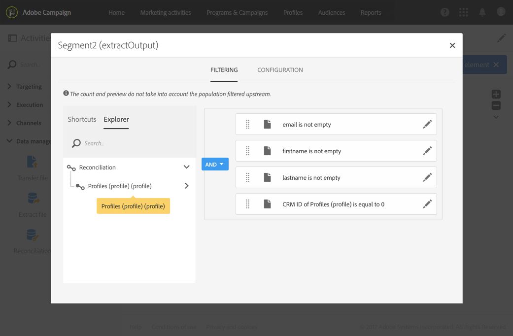

# Creazione di modelli di flusso di lavoro per l’importazione di dati {#import-workflow-template}

L’utilizzo di un modello di importazione è una procedura consigliata se è necessario importare regolarmente file con la stessa struttura.

Questo esempio mostra come impostare un flusso di lavoro che può essere riutilizzato per importare profili provenienti da un CRM nel database Adobe Campaign .

1. Create un nuovo modello di workflow da **[!UICONTROL Resources > Templates > Workflow templates]**.
1. Aggiungete le seguenti attività:

   * **[!UICONTROL Load file]**: Definire la struttura prevista del file contenente i dati da importare.

      >[!NOTE]
      >
      >È possibile importare solo dati da un singolo file. Se il flusso di lavoro include più attività **[!UICONTROL Load file]**, lo stesso file verrà utilizzato ogni volta.

   * **[!UICONTROL Reconciliation]**: Riconciliare i dati importati con i dati del database.
   * **[!UICONTROL Segmentation]**: Creare filtri per elaborare i record in modo diverso a seconda che possano essere riconciliati o meno.
   * **[!UICONTROL Deduplication]**: Deduplicare i dati dal file in entrata prima di essere inseriti nel database.
   * **[!UICONTROL Update data]**: Aggiornate il database con i profili importati.

   

1. Configurare l&#39;attività **[!UICONTROL Load file]**:

   * Definite la struttura prevista caricando un file di esempio. Il file di esempio deve contenere solo poche righe, ma tutte le colonne necessarie per l&#39;importazione. Controllare e modificare il formato del file per essere certi che il tipo di ogni colonna sia impostato correttamente: testo, data, numero intero, ecc. Ad esempio:

      ```
      lastname;firstname;birthdate;email;crmID
      Smith;Hayden;23/05/1989;hayden.smith@mailtest.com;123456
      ```

   * Nella sezione **[!UICONTROL File to load]**, selezionare **[!UICONTROL Upload a new file from the local machine]** e lasciare vuoto il campo. Ogni volta che viene creato un nuovo flusso di lavoro da questo modello, potete specificare qui il file desiderato, purché corrisponda alla struttura definita.

      Potete utilizzare una qualsiasi delle opzioni, ma dovete modificare di conseguenza il modello. Ad esempio, se selezionate **[!UICONTROL Use the file specified in the inbound transition]**, potete aggiungere un&#39;attività **[!UICONTROL Transfer file]** prima di recuperare il file da importare da un server FTP/SFTP.

      Se desiderate che gli utenti siano in grado di scaricare un file contenente errori verificatisi durante un&#39;importazione, controllate l&#39;opzione **[!UICONTROL Keep the rejects in a file]** e specificate il **[!UICONTROL File name]**.

      

1. Configurare l&#39;attività **[!UICONTROL Reconciliation]**. Lo scopo di questa attività in questo contesto è identificare i dati in arrivo.

   * Nella scheda **[!UICONTROL Relations]**, selezionare **[!UICONTROL Create element]** e definire un collegamento tra i dati importati e la dimensione di targeting dei destinatari (vedere [Dimensioni e risorse di targeting](../../automating/using/query.md#targeting-dimensions-and-resources)). In questo esempio, il campo personalizzato **ID CRM** viene utilizzato per creare la condizione di partecipazione. Utilizzare il campo o la combinazione di campi necessari, purché sia possibile identificare record univoci.
   * Nella scheda **[!UICONTROL Identification]**, lasciare l&#39;opzione **[!UICONTROL Identify the document from the working data]** deselezionata.

   

1. Configurate l&#39;attività **[!UICONTROL Segmentation]** per recuperare i destinatari riconciliati in una transizione e i destinatari che non possono essere riconciliati ma che dispongono di dati sufficienti in una seconda transizione.

   La transizione con destinatari riconciliati può quindi essere utilizzata per aggiornare il database. La transizione con destinatari sconosciuti può quindi essere utilizzata per creare nuove voci di destinatari nel database se nel file è disponibile un insieme minimo di informazioni.

   I destinatari che non possono essere riconciliati e che non dispongono di dati sufficienti vengono selezionati in una transizione in uscita complementare e possono essere esportati in un file separato o semplicemente ignorati.

   * Nella scheda **[!UICONTROL General]** dell&#39;attività, impostare **[!UICONTROL Resource type]** su **[!UICONTROL Temporary resource]** e selezionare **[!UICONTROL Reconciliation]** come set di destinazione.
   * Nella scheda **[!UICONTROL Advanced options]**, selezionare l&#39;opzione **[!UICONTROL Generate complement]** per verificare se non è possibile inserire alcun record nel database. Se necessario, è possibile applicare ulteriore elaborazione ai dati complementari: esportazione di file, aggiornamento di elenchi, ecc.
   * Nel primo segmento della scheda **[!UICONTROL Segments]**, aggiungi una condizione di filtro nella popolazione in entrata per selezionare solo i record per i quali l&#39;ID CRM del profilo non è uguale a 0. In questo modo, i dati del file riconciliati con i profili del database vengono selezionati in tale sottoinsieme.

      

   * Aggiungere un secondo segmento che selezioni record non riconciliati con dati sufficienti per essere inseriti nel database. Ad esempio: indirizzo e-mail, nome e cognome. Per i record che non sono riconciliati il valore dell&#39;ID CRM del profilo è uguale a 0.

      

   * Tutti i record non selezionati nei primi due sottoinsiemi sono selezionati in **[!UICONTROL Complement]**.

1. Configurare l&#39;attività **[!UICONTROL Update data]** situata dopo la prima transizione in uscita dell&#39;attività **[!UICONTROL Segmentation]** configurata in precedenza.

   * Selezionare **[!UICONTROL Update]** come **[!UICONTROL Operation type]** poiché la transizione in entrata contiene solo i destinatari già presenti nel database.
   * Nella scheda **[!UICONTROL Identification]**, selezionare **[!UICONTROL Using reconciliation criteria]** e definire una chiave tra **[!UICONTROL Dimension to update]** - Profili in questo caso - e il collegamento creato nell&#39;attività **[!UICONTROL Reconciliation]**. In questo esempio, viene utilizzato il campo personalizzato **ID CRM**.

      

   * Nella scheda **[!UICONTROL Fields to update]**, indicare i campi dalla dimensione Profili da aggiornare con il valore della colonna corrispondente dal file. Se i nomi delle colonne del file sono identici o quasi identici ai nomi dei campi dimensione destinatari, è possibile utilizzare il pulsante bacchetta magica per far corrispondere automaticamente i diversi campi.

      

      >[!NOTE]
      >
      >Se prevedete di inviare e-mail dirette a questi profili, accertatevi di includere un indirizzo postale, in quanto queste informazioni sono essenziali per il fornitore di posta diretta. Verificate inoltre che la casella **[!UICONTROL Address specified]** nelle informazioni dei profili sia selezionata. Per aggiornare questa opzione da un flusso di lavoro, è sufficiente aggiungere un elemento ai campi da aggiornare, specificare **1** come **[!UICONTROL Source]** e selezionare il campo `postalAddress/@addrDefined` come **[!UICONTROL Destination]**. Per ulteriori informazioni sulla posta diretta e sull&#39;utilizzo dell&#39;opzione **[!UICONTROL Address specified]**, vedere [questo documento](../../channels/using/about-direct-mail.md#recommendations).

1. Configurate l&#39;attività **[!UICONTROL Deduplication]** situata dopo la transizione contenente profili non riconciliati:

   * Nella scheda **[!UICONTROL Properties]**, impostare **[!UICONTROL Resource type]** sulla risorsa temporanea generata dall&#39;attività **[!UICONTROL Reconciliation]** del flusso di lavoro.

      

   * In questo esempio, il campo e-mail viene utilizzato per trovare profili univoci. Potete utilizzare qualsiasi campo sicuramente compilato e parte di una combinazione univoca.
   * Scegliete un elemento **[!UICONTROL Deduplication method]**. In questo caso, l&#39;applicazione decide automaticamente quali record vengono conservati in caso di duplicati.

   

1. Configurate l&#39;attività **[!UICONTROL Update data]** situata dopo l&#39;attività **[!UICONTROL Deduplication]** configurata in precedenza.

   * Selezionare **[!UICONTROL Insert only]** come **[!UICONTROL Operation type]** poiché la transizione in entrata contiene solo profili non presenti nel database.
   * Nella scheda **[!UICONTROL Identification]**, selezionare **[!UICONTROL Using reconciliation criteria]** e definire una chiave tra **[!UICONTROL Dimension to update]** - Profili in questo caso - e il collegamento creato nell&#39;attività **[!UICONTROL Reconciliation]**. In questo esempio, viene utilizzato il campo personalizzato **ID CRM**.

      

   * Nella scheda **[!UICONTROL Fields to update]**, indicare i campi dalla dimensione Profili da aggiornare con il valore della colonna corrispondente dal file. Se i nomi delle colonne del file sono identici o quasi identici ai nomi dei campi dimensione destinatari, è possibile utilizzare il pulsante bacchetta magica per far corrispondere automaticamente i diversi campi.

      

      >[!NOTE]
      >
      >Se prevedete di inviare e-mail dirette a questi profili, accertatevi di includere un indirizzo postale, in quanto queste informazioni sono essenziali per il fornitore di posta diretta. Verificate inoltre che la casella **[!UICONTROL Address specified]** nelle informazioni dei profili sia selezionata. Per aggiornare questa opzione da un flusso di lavoro, è sufficiente aggiungere un elemento ai campi da aggiornare e specificare **1** come **[!UICONTROL Source]** e selezionare il campo **[postalAddress/@addrDefined]** come **[!UICONTROL Destination]**. Per ulteriori informazioni sulla posta diretta e sull&#39;utilizzo dell&#39;opzione **[!UICONTROL Address specified]**, vedere [questo documento](../../channels/using/about-direct-mail.md#recommendations).

1. Dopo la terza transizione dell&#39;attività **[!UICONTROL Segmentation]**, aggiungete un&#39;attività **[!UICONTROL Extract file]** e un&#39;attività **[!UICONTROL Transfer file]** se desiderate tenere traccia dei dati non inseriti nel database. Configurate queste attività per esportare la colonna desiderata e per trasferire il file su un server FTP o SFTP in cui potete recuperarlo.
1. Aggiungete un&#39;attività **[!UICONTROL End]** e salvate il modello di workflow.

Ora è possibile utilizzare il modello ed è disponibile per ogni nuovo flusso di lavoro. È quindi necessario specificare il file contenente i dati da importare nell&#39;attività **[!UICONTROL Load file]**.


