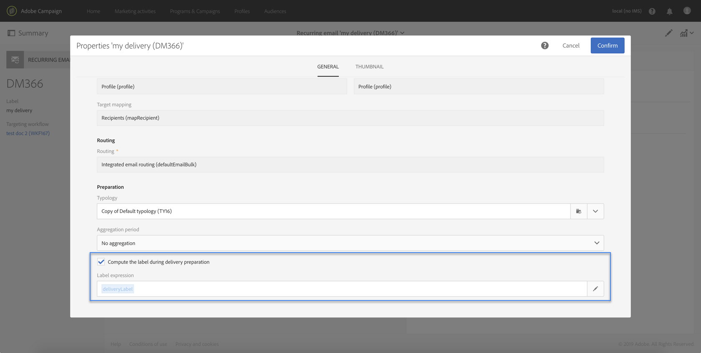

# Personalizzazione di un flusso di lavoro con parametri esterni {#customizing-a-workflow-with-external-parameters}

Una volta attivato il flusso di lavoro, i parametri vengono acquisiti nelle variabili degli eventi e possono essere utilizzati per personalizzare le attività del flusso di lavoro.

Possono, ad esempio, essere utilizzati per definire quale pubblico leggere nell&#39;attività **[!UICONTROL Read audience]**, il nome del file da trasferire nell&#39;attività **[!UICONTROL Transfer file]**, ecc. (vedere [questa pagina](../../automating/using/customizing-workflow-external-parameters.md)).

## Utilizzo delle variabili di eventi {#using-events-variables}

Le variabili degli eventi vengono utilizzate all&#39;interno di un&#39;espressione che deve rispettare la sintassi [Standard](../../automating/using/advanced-expression-editing.md#standard-syntax).

La sintassi per utilizzare le variabili evento deve seguire il formato seguente e utilizzare il nome del parametro definito nell&#39;attività **[!UICONTROL External signal]** (consulta [Dichiarazione dei parametri nell&#39;attività del segnale esterno](../../automating/using/declaring-parameters-external-signal.md)):

```
$(vars/@parameterName)
```

In questa sintassi, la funzione **$** restituisce il tipo di dati **string**. Per specificare un altro tipo di dati, utilizzare le seguenti funzioni:

* **$long**: numero intero.
* **$float**: numero decimale.
* **$booleano**: true/false.
* **$datetime**: timestamp.

Quando utilizzi una variabile in un’attività , l’interfaccia fornisce aiuto per richiamarla.


* : seleziona la variabile degli eventi tra tutte le variabili disponibili nel flusso di lavoro.

   

* : modifica le espressioni combinando variabili e funzioni (consulta  [questa pagina](../../automating/using/advanced-expression-editing.md)).

   

   Questo elenco fornisce funzioni che consentono di eseguire filtri complessi. Queste funzioni sono descritte in [questa sezione](../../automating/using/list-of-functions.md).

   Inoltre, puoi utilizzare le funzioni seguenti, disponibili in tutte le attività che ti consentono di utilizzare variabili di eventi dopo aver chiamato un flusso di lavoro con parametri esterni (consulta [questa sezione](../../automating/using/customizing-workflow-external-parameters.md#customizing-activities-with-events-variables)):

   | Nome | Descrizione | Sintassi |
   ---------|----------|---------
   | EndWith | Indica se una stringa (primo parametro) termina con una stringa specifica (secondo parametro). | EndWith(&lt;Stringa>,&lt;Stringa>) |
   | startWith | Indica se una stringa (primo parametro) inizia con una stringa specifica (secondo parametro). | startWith(&lt;Stringa>,&lt;Stringa>) |
   | Extract | Restituisce i primi caratteri di una stringa utilizzando un separatore. | Extract(&lt;Stringa>,&lt;Separatore>) |
   | ExtractRight | Restituisce gli ultimi caratteri di una stringa utilizzando un separatore. | ExtractRight(&lt;Stringa>,&lt;Separatore>) |
   | Formato data | Formatta una data utilizzando il formato specificato nel secondo parametro (esempio:  &#39;%4Y%2M%2D&#39;) | DateFormat(&lt;Data>,&lt;Formato>) |
   | NomeFile | Restituisce il nome di un percorso di file. | FileName(&lt;Stringa>) |
   | FileExt | Restituisce l&#39;estensione di un percorso di file. | FileExt(&lt;Stringa>) |
   | GetOption | Restituisce il valore della funzione specificata. | GetOption(&lt;nomeOpzione>) |
   | IsNull | Indica se una stringa o una data è null. | IsNull(&lt;Stringa/data>) |
   | UrlUtf8Encode | Codifica un URL in UTF8. | UrlUtf8Encode(&lt;Stringa>) |

## Personalizzazione delle attività con variabili di eventi {#customizing-activities-with-events-variables}

Le variabili di eventi possono essere utilizzate per personalizzare diverse attività, elencate nella sezione seguente. Per ulteriori informazioni su come chiamare una variabile da un&#39;attività, consulta [questa sezione](../../automating/using/customizing-workflow-external-parameters.md#using-events-variables).

**[!UICONTROL Read audience]** attività: definisci il pubblico di cui eseguire il targeting in base alle variabili di eventi. Per ulteriori informazioni su come utilizzare l&#39;attività, consulta [questa sezione](../../automating/using/read-audience.md).


**[!UICONTROL Test]** attività: crea condizioni in base alle variabili di eventi. Per ulteriori informazioni su come utilizzare l&#39;attività, consulta [questa sezione](../../automating/using/test.md).


**[!UICONTROL Transfer file]** attività: personalizzare il file da trasferire in base a variabili di eventi. Per ulteriori informazioni su come utilizzare l&#39;attività, consulta [questa sezione](../../automating/using/transfer-file.md).


**[!UICONTROL Query]** attività: è possibile fare riferimento ai parametri in una query utilizzando espressioni che combinano variabili di eventi e funzioni. A questo scopo, aggiungi una regola e fai clic sul collegamento **[!UICONTROL Advanced mode]** per accedere alla finestra di modifica delle espressioni (consulta [Modifica avanzata delle espressioni](../../automating/using/advanced-expression-editing.md)).

Per ulteriori informazioni su come utilizzare l&#39;attività, consulta [questa sezione](../../automating/using/query.md).


**[!UICONTROL Channels]** attività: personalizzare le consegne in base alle variabili degli eventi.

>[!NOTE]
>
>I valori dei parametri di consegna vengono recuperati ogni volta che la consegna viene preparata.
>
>La preparazione delle consegne ricorrenti si basa sul periodo di aggregazione **consegna**. Ad esempio, se il periodo di aggregazione è &quot;per giorno&quot;, la consegna verrà preparata nuovamente solo una volta al giorno. Se il valore di un parametro di consegna viene modificato durante il giorno, non verrà aggiornato nella consegna, come è già stato preparato una volta.
>
>Se prevedi di chiamare il flusso di lavoro più volte al giorno, utilizza l’opzione [!UICONTROL No aggregation] in modo che i parametri di consegna vengano aggiornati ogni volta. Per ulteriori informazioni sulla configurazione delle consegne ricorrenti, consulta [questa sezione](/help/automating/using/email-delivery.md#configuration).

Per personalizzare una consegna basata su variabili di eventi, devi prima dichiarare nell’attività di consegna le variabili che desideri utilizzare:

1. Seleziona l’attività, quindi fai clic sul pulsante  per accedere alle impostazioni.
1. Seleziona la scheda **[!UICONTROL General]** , quindi aggiungi le variabili di eventi che saranno disponibili come campi di personalizzazione nella consegna.

   

1. Fai clic sul pulsante **[!UICONTROL Confirm]**.

Le variabili di eventi dichiarati sono ora disponibili nell’elenco dei campi di personalizzazione. Puoi utilizzarli nella consegna per eseguire le azioni seguenti:

* Definisci il nome del modello da utilizzare per la consegna.

   >[!NOTE]
   >
   >Questa azione è disponibile solo per le consegne **ricorrenti** .

   

* Personalizza la consegna: quando selezioni un campo di personalizzazione per configurare una consegna, le variabili evento sono disponibili nell’elemento **[!UICONTROL Workflow parameters]** . Puoi utilizzarli come qualsiasi campo di personalizzazione, ad esempio per definire l’oggetto della consegna, il mittente e così via.

   La personalizzazione della consegna è descritta in [questa sezione](../../designing/using/personalization.md).

   

**Codici** del segmento: definisci il codice del segmento in base alle variabili degli eventi.

>[!NOTE]
>
>Questa azione può essere eseguita da qualsiasi attività che ti consente di definire un codice di segmento come, ad esempio, le attività **[!UICONTROL Query]** o **[!UICONTROL Segmentation]**.


**Etichetta** di consegna: definisci l’etichetta di consegna in base alle variabili degli eventi.


