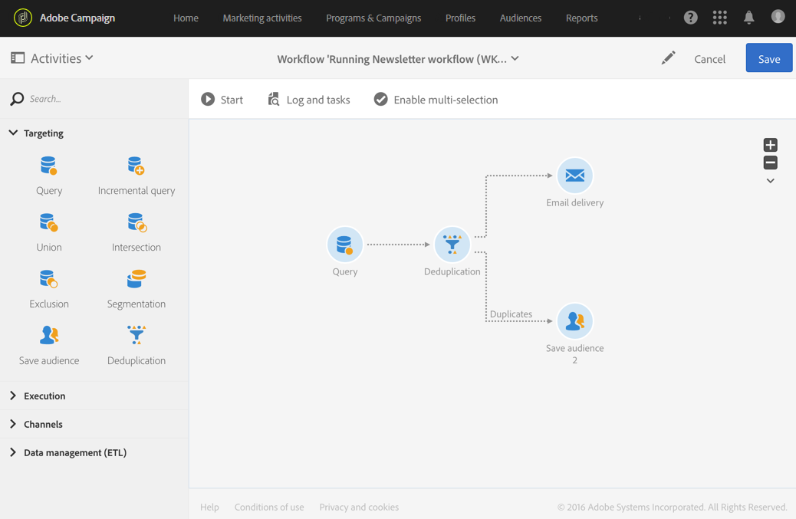

# Deduplicazione{#deduplication}

## Descrizione {#description}


L' **[!UICONTROL Deduplication]** attività consente di eliminare duplicati nei risultati delle attività in entrata.

## Contesto di utilizzo {#context-of-use}

L' **[!UICONTROL Deduplication]** attività viene generalmente utilizzata dopo le attività di targeting o dopo l'importazione di un file e prima di attività che consentono l'uso di dati con targeting.

Durante la deduplicazione, le transizioni in entrata vengono elaborate separatamente. Ad esempio, se il profilo 'A' è presente nel risultato della query 1 e anche nel risultato della query 2, non verrà deduplicato.

Si consiglia pertanto che una deduplicazione abbia una sola transizione in entrata. A questo scopo, potete combinare le vostre diverse query utilizzando attività che corrispondono alle vostre esigenze di targeting, come un'attività dell'unione, un'attività di intersezione, ecc. Ad esempio:


## Configurazione {#configuration}

Per configurare un'attività di deduplicazione, è necessario immettere un'etichetta, il metodo e i criteri di deduplicazione, nonché le opzioni relative al risultato.

1. Trascinate e rilasciate un' **[!UICONTROL Deduplication]** attività nel flusso di lavoro.
1. Selezionate l'attività, quindi apritela utilizzando il  pulsante delle azioni rapide visualizzate.

   

1. Selezionare **[!UICONTROL Resource type]** su cui eseguire la deduplicazione:

   * **[!UICONTROL Database resource]** se la deduplicazione viene eseguita su dati già presenti nel database. Selezionate il **[!UICONTROL Filtering dimension]** e il **[!UICONTROL Targeting dimension]**, a seconda dei dati da deduplicare. Per impostazione predefinita, la deduplicazione viene eseguita sui **profili**.
   * **[!UICONTROL Temporary resource]** se la deduplicazione viene eseguita sui dati temporanei del flusso di lavoro: selezionare i **[!UICONTROL Targeted set]** dati da deduplicare. Questo caso di utilizzo può essere rilevato dopo l’importazione di un file o se i dati nel database sono stati arricchiti (ad esempio con un codice del segmento).

1. Selezionare il **[!UICONTROL Number of unique records to keep]**. Il valore predefinito per questo campo è 1. Il valore 0 consente di conservare tutti i duplicati.

   Ad esempio, se i record A e B sono considerati duplicati del record Y e il record C è considerato un duplicato del record Z:

   * Se il valore del campo è 1: vengono conservati solo i record Y e Z.
   * Se il valore del campo è 0: tutti i documenti sono conservati.
   * Se il valore del campo è 2: i record C e Z sono conservati e due record da A, B e Y sono conservati, per caso o a seconda del metodo di deduplicazione selezionato successivamente.

1. Definite i **[!UICONTROL Duplicate identification]** criteri aggiungendo le condizioni nell'elenco fornito. Specificare i campi e/o le espressioni per i quali i valori identici consentono l'identificazione dei duplicati: indirizzo e-mail, nome, cognome, ecc. L'ordine delle condizioni consente di specificare quali elaborare per primi.
1. Nell'elenco a discesa, selezionate l'opzione **[!UICONTROL Deduplication method]** da utilizzare:

   * **[!UICONTROL Choose for me]**: seleziona in modo casuale il record da escludere dai duplicati.
   * **[!UICONTROL Following a list of values]**: consente di definire un valore di priorità per uno o più campi. Per definire i valori, selezionare un campo o creare un'espressione, quindi aggiungere i valori nella tabella appropriata. Per definire un nuovo campo, fare clic sul **[!UICONTROL Add]** pulsante situato sopra l'elenco dei valori.

      

   * **[!UICONTROL Non-empty value]**: consente di conservare i record per i quali il valore dell'espressione selezionata non è vuoto come priorità.

      

   * **[!UICONTROL Using an expression]**: questo consente di conservare i record in cui il valore dell'espressione immessa è il più piccolo o il più grande.

      

1. Se necessario, gestite le [Transizioni](../../automating/using/executing-a-workflow.md#managing-an-activity-s-outbound-transitions) dell'attività per accedere alle opzioni avanzate per la popolazione in uscita.
1. Confermate la configurazione dell'attività e salvate il flusso di lavoro.

## Esempio 1: Identificazione di duplicati prima della consegna {#example-1--identifying-duplicates-before-a-delivery}

L'esempio seguente illustra una deduplicazione che consente di escludere i duplicati di una destinazione prima di inviare un'e-mail. Ciò significa che eviti di inviare una comunicazione più volte allo stesso profilo.

Il flusso di lavoro è costituito da:



* Una **[!UICONTROL Query]** che consente di definire la destinazione dell’e-mail. In questo caso, il flusso di lavoro si applica a tutti i profili di età compresa tra 18 e 25 anni presenti nel database client da oltre un anno.

   

* Un' **[!UICONTROL Deduplication]** attività, che consente di identificare i duplicati derivanti dalla query precedente. In questo esempio viene salvato un solo record per ogni duplicato. I duplicati vengono identificati utilizzando l'indirizzo e-mail. Ciò significa che la consegna dell'e-mail può essere inviata solo una volta per ogni indirizzo e-mail presente nel targeting.

   Il metodo di deduplicazione selezionato è **[!UICONTROL Non-empty value]**. Questo consente di garantire che tra i record conservati in caso di duplicati, sia data priorità a quelli in cui è stato fornito il **Nome** . Questo renderà più coerente l’utilizzo del nome nei campi di personalizzazione del contenuto dell’e-mail.

   Inoltre, viene aggiunta una transizione aggiuntiva per mantenere i duplicati e per poterli elencare.

   

* Una posizione **[!UICONTROL Email delivery]** dopo la transizione in uscita principale della deduplicazione. La configurazione per le consegne tramite e-mail è dettagliata nella sezione relativa alla consegna [tramite](../../automating/using/email-delivery.md) e-mail.
* Un' **[!UICONTROL Save audience]** attività inserita dopo l'ulteriore transizione della deduplicazione per salvare i duplicati in un'audience **Duplica** . Questo pubblico può essere riutilizzato per escludere direttamente i suoi membri da ogni invio di e-mail.

## Esempio 2: Deduplicazione dei dati da un file importato {#example-2--deduplicating-the-data-from-an-imported-file}

Questo esempio mostra come deduplicare i dati da un file importato prima di caricare i dati nel database. Questa procedura migliora la qualità dei dati caricati nel database.

Il flusso di lavoro è costituito da:


* Un file che contiene un elenco di profili viene importato utilizzando un' **[!UICONTROL Load file]** attività. In questo esempio, il file importato è in formato .csv e contiene 10 profili:

   ```
   lastname;firstname;dateofbirth;email
   Smith;Hayden;23/05/1989;hayden.smith@example.com
   Mars;Daniel;17/11/1987;dannymars@example.com
   Smith;Clara;08/02/1989;hayden.smith@example.com
   Durance;Allison;15/12/1978;allison.durance@example.com
   Lucassen;Jody;28/03/1988;jody.lucassen@example.com
   Binder;Tom;19/01/1982;tombinder@example.com
   Binder;Tommy;19/01/1915;tombinder@example.com
   Connor;Jade;10/10/1979;connor.jade@example.com
   Mack;Clarke;02/03/1985;clarke.mack@example.com
   Ross;Timothy;04/07/1986;timross@example.com
   ```

   Questo file può essere utilizzato anche come file di esempio per rilevare e definire il formato delle colonne. Dalla **[!UICONTROL Column definition]** scheda, accertatevi che ogni colonna del file importato sia configurata correttamente.

   

* Un' **[!UICONTROL Deduplication]** attività. La deduplicazione viene eseguita direttamente dopo l'importazione del file e prima di inserire i dati nel database. Dovrebbe pertanto basarsi sul **[!UICONTROL Temporary resource]** risultato dell' **[!UICONTROL Load file]** attività.

   Per questo esempio, desideriamo mantenere una voce singola per indirizzo e-mail univoco contenuto nel file. L’identificazione duplicata viene quindi eseguita nella colonna **e-mail** della risorsa temporanea. Tuttavia, due indirizzi e-mail vengono visualizzati due volte nel file. Due righe sono pertanto considerate duplicati.

   

* Un' **[!UICONTROL Update data]** attività consente di inserire nel database i dati conservati dal processo di deduplicazione. È solo quando i dati vengono aggiornati che i dati importati vengono identificati come appartenenti alla dimensione del profilo.

   A questo punto, vorremmo vedere **[!UICONTROL Insert only]** i profili che non esistono già nel database. A tal fine, utilizzeremo la colonna e-mail del file e il campo e-mail dalla dimensione **Profilo** come chiave di riconciliazione.

   

   Specificare i mapping tra le colonne del file da cui si desidera inserire i dati e i campi del database dalla **[!UICONTROL Fields to update]** scheda.

   

Quindi avviate il flusso di lavoro. I record salvati dal processo di deduplicazione vengono quindi aggiunti ai profili nel database.
