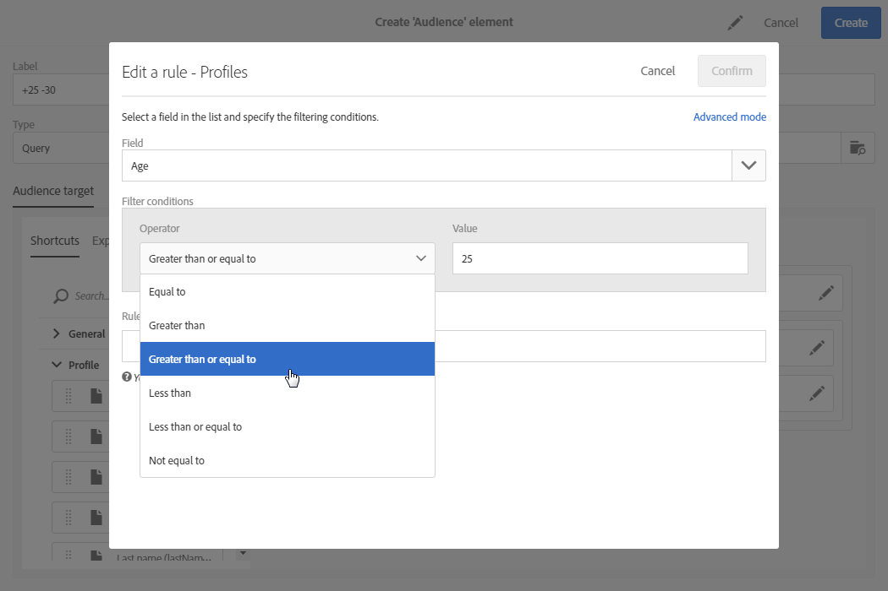
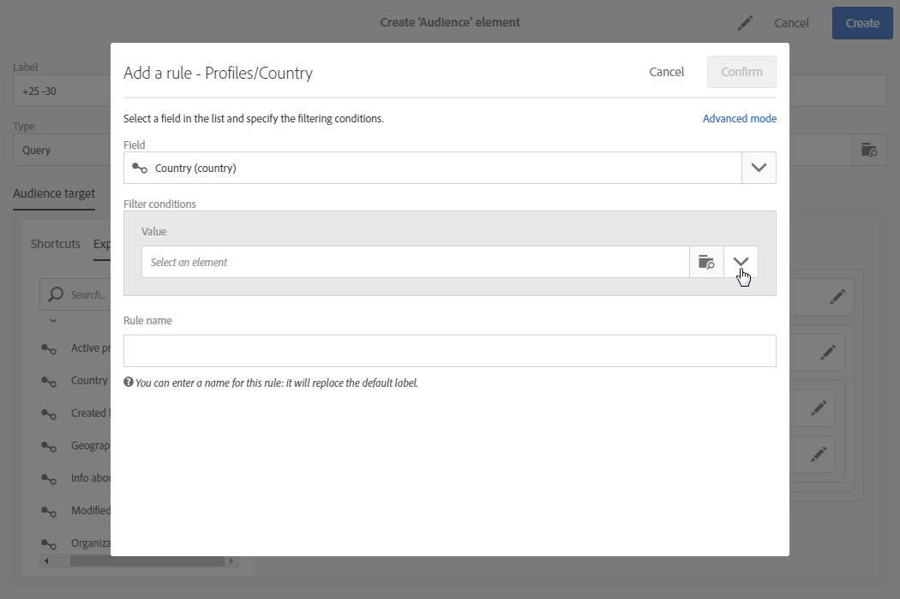

# Modifica delle query{#editing-queries}

## Informazioni sull'editor query {#about-query-editor}

L'editor query è una procedura guidata che consente di filtrare i dati contenuti nel database Adobe Campaign.

Questa funzione consente di creare una popolazione per un targeting migliore dei destinatari grazie ai filtri e alle regole predefiniti.

Diverse funzionalità dell'applicazione lo utilizzano per:

* Creare **audience** di tipo **Query**
* Definire **target e-mail**
* Definire le popolazioni nelle **attività del flusso di lavoro**

## Interfaccia dell'editor Query {#query-editor-interface}

L'editor query è composto da **una palette** e da un **'area di lavoro**.

### Palette {#palette}

La palette, posizionata sul lato sinistro dell'editor, è divisa in due schede che contengono elementi suddivisi in blocchi tematici. Queste schede sono:

* **Le scelte rapide**, per impostazione predefinita, oppure create dall'amministratore dell'istanza. Qui troverai campi, nodi, raggruppamenti, collegamenti 1-1, collegamenti 1-N e altri filtri predefiniti.
* **Esplora risorse** consente di accedere a tutti i campi disponibili nella risorsa di destinazione: nodi, elementi di raggruppamento, collegamenti (1-1 e 1-N).

Gli elementi contenuti nelle schede devono essere spostati nell'area di lavoro per essere configurati e presi in considerazione per la query. A seconda della dimensione di targeting selezionata (consultate [Dimensioni e risorse Targeting](../../automating/using/query.md#targeting-dimensions-and-resources)), potete:

* Selezione di tipi di pubblico o profili uno per uno
* Usare filtri predefiniti
* Definire regole semplici per i campi scelti
* Definire regole avanzate che consentono di applicare funzioni a determinati campi

### Area di lavoro {#workspace}

L'area di lavoro è la zona centrale in cui potete configurare e combinare regole, tipi di pubblico e filtri predefiniti aggiunti dalla palette.

Quando si sposta un elemento dalla palette nell'area di lavoro, si apre una nuova finestra e si può avviare [la creazione di query](../../automating/using/editing-queries.md#creating-queries).

## Creazione di query {#creating-queries}

L'editor query può essere utilizzato per definire un'audience o eseguire il test del profilo in un messaggio, una popolazione in un flusso di lavoro e per creare un'audience di tipo «tipo di query».

Le query possono essere definite nella **[!UICONTROL Audience]** finestra durante la creazione di una consegna o in un'attività **Query** durante la creazione di un flusso di lavoro.

1. Spostare un elemento dalla palette nell'area di lavoro. Viene aperta la finestra per la modifica della regola.

   * Per un **campo** stringa o numerico, specificate l'operatore di confronto e il valore.

      

   * Per un **campo data o data e ora**, potete scegliere di definire una data specifica, un intervallo tra due date o un punto rispetto alla data di esecuzione della query.

      

   * Per un **campo** booleano, controllate le caselle collegate ai possibili valori per il campo.
   * Per un **campo di raggruppamento** , seleziona il campo di raggruppamento su cui vuoi creare la regola, quindi definisci la condizione come per gli altri campi.

      

   * Per un **collegamento 1-1** con un'altra risorsa di database, selezionate un valore direttamente dalla tabella con targeting.

      

   * Per un **collegamento 1-N** con un'altra risorsa di database, potete definire una sottoquery sui campi di questa seconda risorsa.

      Non è necessario specificare una condizione secondaria.

      Ad esempio, potete selezionare l' **[!UICONTROL Exists]** operatore solo nei registri di tracciamento profilo e approvare la regola. La regola restituirà tutti i profili per i quali esistono i registri di tracciamento.

      

   * Per un filtro **** predefinito, immettete o selezionate gli elementi desiderati in base ai criteri offerti.

      Gli amministratori possono creare filtri per facilitare query complesse e ripetitive. Queste vengono visualizzate nell'editor query sotto forma di regole pre-configurate e limitano il numero di passaggi necessari per eseguire l'utente.

      

1. Potete specificare un nome per la regola. Viene quindi visualizzato come nome della regola nell'area di lavoro. Se alla regola non viene assegnato un nome, viene visualizzata una descrizione automatica delle condizioni.
1. Per combinare gli elementi dell'area di lavoro, potete interblocgerli tra loro per creare gruppi e/o livelli di gruppo diversi. Potete quindi selezionare un operatore logico per combinare gli elementi sullo stesso livello:

   * **[!UICONTROL AND]**: un'intersezione di due criteri. Vengono presi in considerazione solo gli elementi che corrispondono a ciascun criterio.
   * **[!UICONTROL OR]**: un'unione di due criteri. Gli elementi che corrispondono ad almeno uno dei due criteri vengono considerati.
   * **[!UICONTROL EXCEPT]**: criteri di esclusione. Gli elementi che corrispondono al primo criterio vengono considerati a meno che non corrispondano al secondo criterio.

1. Ora potete calcolare e visualizzare in anteprima il numero di elementi interessati dalla query utilizzando i  pulsanti e i  pulsanti dalla barra delle azioni.

   

Se desiderate modificare un elemento della query, fate clic sull'icona di modifica. La regola viene aperta in quanto era stata configurata in precedenza e potete quindi eseguire qualsiasi regolazione necessaria.

Le query sono ora create e definite, il che consente di creare una popolazione per personalizzare meglio le consegne.

**Argomenti correlati:**

* [Funzioni avanzate](../../automating/using/advanced-expression-editing.md)
* [Definizione dei filtri](../../developing/using/configuring-filter-definition.md)
* [Caso d'uso: Creazione di una consegna e-mail una tantum](../../automating/using/workflow-weekly-offer.md)
* [Caso d'uso: Creazione di una distribuzione segmentata sulla posizione](../../automating/using/workflow-segmentation-location.md)
* [Caso d'uso: Creazione di consegne con un complemento](../../automating/using/workflow-created-query-with-complement.md)
* [Caso d'uso: Flusso di lavoro di retargeting che invia una nuova consegna a non-openers](../../automating/using/workflow-cross-channel-retargeting.md)
