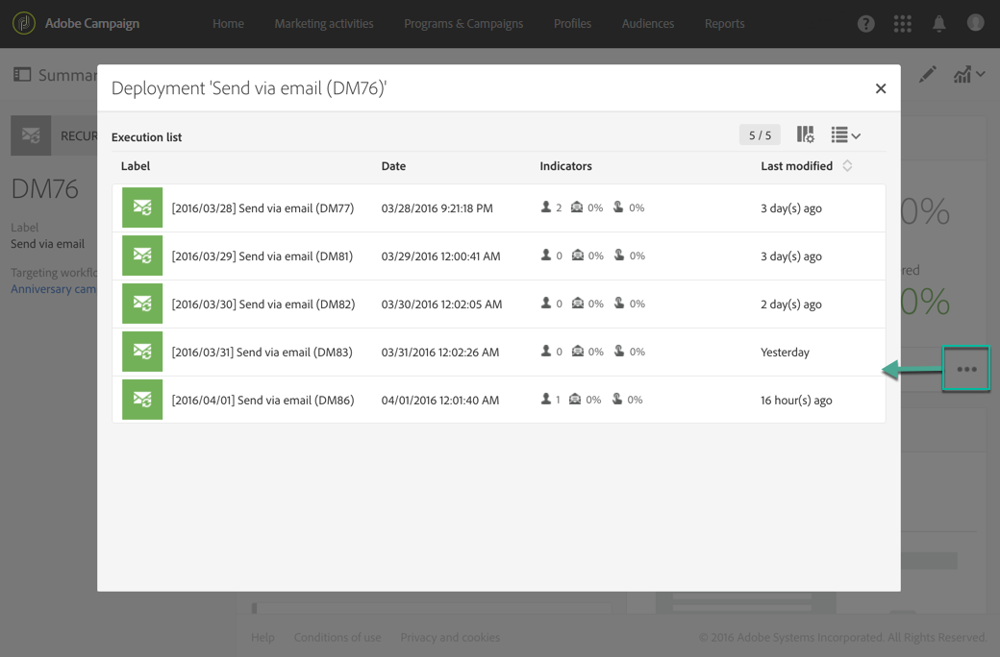

# Consegna e-mail{#email-delivery}

## Descrizione {#description}

L' **[!UICONTROL Email delivery]** attività consente di configurare l'invio di un'e-mail in un flusso di lavoro. Può trattarsi di **una sola e-mail inviata** e inviata una sola volta, oppure può essere un **messaggio e-mail ricorrente** .

Le e-mail di invio singolo sono e-mail standard, inviate una volta.

Le e-mail ricorrenti consentono di inviare lo stesso messaggio e-mail più volte a destinazioni diverse in un determinato periodo di tempo. Puoi aggregare le consegne per periodo per ottenere rapporti che corrispondono alle tue esigenze.

## Contesto di utilizzo {#context-of-use}

L **[!UICONTROL Email delivery]** 'attività viene utilizzata in genere per automatizzare l'invio di un'e-mail a una destinazione calcolata nello stesso flusso di lavoro.

Se collegate a un pianificatore, potete definire e-mail ricorrenti.

I destinatari e-mail vengono definiti a monte dell'attività nello stesso flusso di lavoro, mediante attività di targeting quali query, intersezioni ecc.

La preparazione del messaggio viene attivata in base ai parametri di esecuzione del flusso di lavoro. Dal pannello del messaggio, potete selezionare se richiedere o meno una conferma manuale per inviare il messaggio (richiesto per impostazione predefinita). Puoi avviare il flusso di lavoro manualmente oppure inserire un'attività pianificatore nel flusso di lavoro per automatizzare l'esecuzione.

## Configurazione {#configuration}

1. Trascina un **[!UICONTROL Email delivery]** 'attività nel flusso di lavoro.
1. Selezionate l'attività, quindi apritela utilizzando il  pulsante dalle azioni rapide visualizzate.

   >[!NOTE]
   >
   >Potete accedere alle proprietà generali e alle opzioni avanzate dell'attività (e non della distribuzione stessa) tramite  il pulsante dalle azioni rapide dell'attività. Questo pulsante è specifico dell' **[!UICONTROL Email delivery]** attività. Potete accedere alle proprietà dell'e-mail tramite la barra delle azioni nel dashboard e-mail.

1. Selezionate la modalità di invio e-mail:

   * **[!UICONTROL Email]**: l'e-mail viene inviata una sola volta. Potete specificare qui se desiderate aggiungere una transizione in uscita all'attività. I diversi tipi di transizione sono descritti al punto 7 di questa procedura.
   * **[!UICONTROL Recurring email]**: il messaggio e-mail viene inviato più volte, a seconda della frequenza definita in un **[!UICONTROL Scheduler]** 'attività. Selezionare il periodo di aggregazione delle mandate. Questo consente di rigenerare tutte le invii che si verificano durante il periodo definito con una sola e-mail denominata **Esecuzione ricorrente** e accessibili dall'elenco delle attività di marketing dell'applicazione.

      Ad esempio, per un messaggio e-mail di compleanno ricorrente inviato ogni giorno, potete scegliere di aggregare le mandate al mese. Questo consente di ricevere ogni giorno i rapporti sulla distribuzione, anche se l'e-mail viene inviata ogni giorno.

1. Selezionate un tipo di e-mail. I tipi di e-mail provengono dai modelli e-mail definiti nel menu **[!UICONTROL Resources]** &gt; **[!UICONTROL Templates]** &gt; **[!UICONTROL Delivery templates]** .
1. Inserite le proprietà generali dell'e-mail. Potete allegarlo a una campagna esistente. L'etichetta dell'attività di consegna del flusso di lavoro viene aggiornata con l'etichetta e-mail.
1. Definite il contenuto dell'e-mail. Fare riferimento alla sezione relativa alla modifica [dei contenuti](../../designing/using/about-email-content-design.md).
1. Per impostazione predefinita, l **[!UICONTROL Email delivery]** 'attività non include transizioni in uscita. Se desiderate aggiungere una transizione in uscita all' **[!UICONTROL Email delivery]** attività, andate alla **[!UICONTROL General]** scheda delle opzioni di attività avanzate (  pulsante nelle azioni rapide dell'attività), quindi controllate una delle seguenti opzioni:

   * **[!UICONTROL Add outbound transition without the population]**: consente di generare una transizione in uscita contenente la stessa popolazione della transizione in ingresso.
   * **[!UICONTROL Add outbound transition with the population]**: consente di generare una transizione in uscita contenente la popolazione a cui è stata inviata l'e-mail. I membri della destinazione sono esclusi durante la preparazione della consegna (quarantena, e-mail non valida, ecc.) sono esclusi da questa transizione.

1. Confermate la configurazione dell'attività e salvate il flusso di lavoro.

Quando riaprite l'attività, viene portato direttamente al dashboard e-mail. Solo il relativo contenuto può essere modificato.

Per impostazione predefinita, l'avvio di un flusso di lavoro di consegna attiva solo la preparazione del messaggio. L'invio di messaggi creati da un flusso di lavoro deve comunque essere confermato dopo che il flusso di lavoro è stato avviato. Tuttavia, dal pannello del messaggio, e solo se il messaggio è stato creato da un flusso di lavoro, potete disattivare l' **[!UICONTROL Request confirmation before sending messages]** opzione. Deselezionando questa opzione, i messaggi vengono inviati senza ulteriore preavviso una volta completata la preparazione.

## Commenti {#remarks}

Le consegne create all'interno di un flusso di lavoro sono accessibili nell'elenco delle attività di marketing dell'applicazione. Potete visualizzare lo stato di esecuzione del flusso di lavoro utilizzando il dashboard. I collegamenti nel riquadro di riepilogo delle e-mail consentono di accedere direttamente agli elementi collegati (flusso di lavoro, campagna, consegna padre nel caso di un messaggio e-mail periodico).

Tuttavia, per impostazione predefinita, le esecuzioni di consegne ricorrenti sono mascherate. Per visualizzarle, controllate l' **[!UICONTROL Show recurring executions]** opzione nel pannello di ricerca delle attività di marketing.

Nelle consegne principali, accessibili dall'elenco delle attività di marketing o direttamente tramite le esecuzioni ricorrenti associate, potete visualizzare il numero totale di invii che sono stati elaborati (in base al periodo di aggregazione specificato quando l' **[!UICONTROL Email delivery]** attività è stata configurata). A tal fine, apri la visualizzazione Dettagli del **[!UICONTROL Deployment]** blocco della consegna principale selezionando .

## Esempio {#example}

Questo esempio è un flusso di lavoro di compleanno. Ogni giorno viene inviato un messaggio e-mail a profili il cui compleanno si trova in quel giorno. A tal fine:

* Consente **[!UICONTROL Scheduler]** di avviare il flusso di lavoro ogni giorno alle 8.

   

* L' **[!UICONTROL Query]** attività consente di calcolare i profili che hanno fornito un'e-mail e il cui compleanno si trova sul giorno corrente, ogni volta che viene eseguito il flusso di lavoro. Il calcolo di compleanno viene eseguito utilizzando un filtro predefinito disponibile nella palette nello strumento di modifica query.

   

* The **[!UICONTROL Email]** recurring. Le mandate vengono aggregate per mese. Pertanto, tutte le e-mail inviate in un mese vengono aggregate in una sola visualizzazione. In un anno, sono quindi eseguite 365 consegne, ma vengono suddivise in 12 visualizzazioni (dette **anche esecuzioni ricorrenti**) nell'interfaccia di Adobe Campaign. La cronologia e i dettagli del rapporto vengono visualizzati ogni mese e non per ogni invio.

   

**Argomenti correlati**

* [Caso d'uso: Creazione di una consegna e-mail una tantum](../../automating/using/workflow-weekly-offer.md)
* [Caso d'uso: Creazione di una distribuzione segmentata sulla posizione](../../automating/using/workflow-segmentation-location.md)
* [Caso d'uso: Creazione di consegne con un complemento](../../automating/using/workflow-created-query-with-complement.md)
* [Caso d'uso: Flusso di lavoro di retargeting che invia una nuova consegna a non-openers](../../automating/using/workflow-cross-channel-retargeting.md)