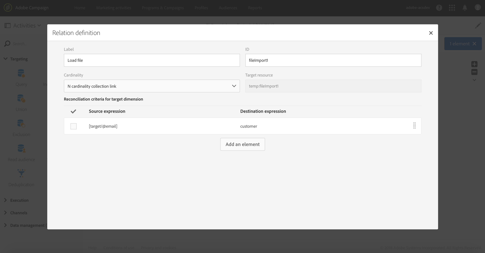

# Arricchimento dei dati del profilo con i dati contenuti in un file {#enriching-profile-data-with-data-contained-in-a-file}

Questo esempio mostra come arricchire i dati del profilo con i dati di acquisto contenuti in un file. Qui si considera che i dati di acquisto sono memorizzati in un sistema di terze parti. Ciascun profilo può contenere vari acquisti memorizzati all’interno del file. L’obiettivo finale del flusso di lavoro è quello di inviare un’e-mail ai profili di destinazione che hanno acquistato almeno due elementi, in modo da ringraziarli della loro fedeltà.

Il flusso di lavoro è configurato come segue:


* A [Query](../../automating/using/query.md) activity that targets the profiles who will receive the message.
* A [Load file](../../automating/using/load-file.md) activity that loads the purchase data. Ad esempio:

   ```
   tcode;tdate;customer;product;tamount
   aze123;21/05/2017;dannymars@example.com;TV;799
   aze124;28/05/2017;dannymars@example.com;Headphones;8
   aze125;31/07/2017;john.smith@example.com;Headphones;8
   aze126;14/12/2017;john.smith@example.com;Plastic Cover;4
   aze127;02/01/2018;dannymars@example.com;Case Cover;79
   aze128;04/03/2017;clara.smith@example.com;Phone;149
   ```

   Con questo file di esempio, utilizzeremo l’indirizzo e-mail per riconciliare i dati con i profili del database. Puoi anche eseguire l’abilitazione di ID univoci, come descritto nel [presente documento](../../developing/using/configuring-the-resource-s-data-structure.md#generating-a-unique-id-for-profiles-and-custom-resources).

* An [Enrichment](../../automating/using/enrichment.md) activity that creates a link between the transaction data loaded from the file and the profiles selected in the **[!UICONTROL Query]**. Il collegamento è definito nella scheda **[!UICONTROL Advanced relations]** dell’attività. Il collegamento è basato sulla transizione proveniente dall’attività **[!UICONTROL Load file]**. Come criteri di riconciliazione, utilizza il campo &quot;e-mail&quot; della risorsa profilo e la colonna &quot;cliente&quot; del file importato.

   

   Una volta creato il collegamento, vengono aggiunti due set di **[!UICONTROL Additional data]**:

   * Una raccolta di due righe corrispondenti alle ultime due transazioni di ciascun profilo. Per questa raccolta, il nome del prodotto, la data della transazione e il prezzo del prodotto vengono inseriti come dati aggiuntivi. Ai dati viene applicato un ordinamento decrescente. Per creare la raccolta, dalla scheda **[!UICONTROL Additional data]**:

      Scegli il collegamento precedentemente definito nella scheda **[!UICONTROL Advanced relations]** dell’attività.

      

      Seleziona **[!UICONTROL Collection]** e specifica il numero di righe da recuperare, in questo esempio sono 2. In questa schermata, puoi personalizzare **[!UICONTROL Alias]** e **[!UICONTROL Label]** della raccolta. Questi valori saranno visibili nelle seguenti attività del flusso di lavoro, ogni volta che si farà riferimento a questa raccolta.

      

      Come **[!UICONTROL Data]** da mantenere per la raccolta, seleziona le colonne che verranno utilizzate per la consegna finale.

      

      Per avere la certezza di recuperare le transazioni più recenti, applica un ordinamento decrescente alla data della transazione.

      

   * Un aggregato che conta il numero totale di transazioni per ciascun profilo. Tale aggregato verrà utilizzato successivamente per filtrare i profili in cui sono registrate almeno due transazioni. Per creare l’aggregato, dalla scheda **[!UICONTROL Additional data]**:

      Scegli il collegamento precedentemente definito nella scheda **[!UICONTROL Advanced relations]** dell’attività.

      

      Seleziona **[!UICONTROL Aggregate]**.

      

      Come **[!UICONTROL Data]** da mantenere, definisci un aggregato **Conta tutto**. Se necessario, specifica un alias personalizzato per individuarlo più rapidamente nelle seguenti attività.

      

* A [Segmentation](../../automating/using/segmentation.md) activity with only one segment, that retrieves profiles of the initial target that have at least two transactions recorded. Sono esclusi i profili con una sola transazione. A tal fine, la query della segmentazione viene eseguita sull’aggregato definito in precedenza.

   

* An [Email delivery](../../automating/using/email-delivery.md) activity that uses the additional data defined in the **[!UICONTROL Enrichment]** to dynamically retrieve the two last purchases made by the profile. Durante l’inserimento di un campo di personalizzazione, i dati aggiuntivi si trovano nel nodo **Dati aggiuntivi (TargetData)**.

   

**Argomento correlato:**

* [Arricchimento dei profili dei clienti con dati esterni](https://helpx.adobe.com/it/campaign/kb/simplify-campaign-management.html#Managedatatofuelengagingexperiences)
