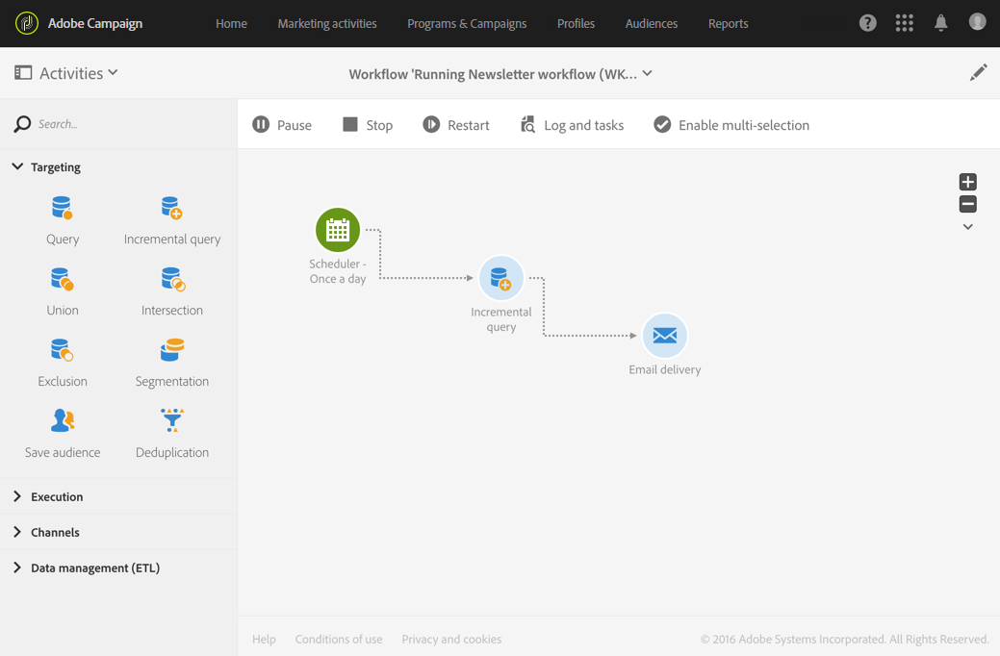

# Esecuzione di un flusso di lavoro{#executing-a-workflow}

## Informazioni sull&#39;esecuzione del flusso di lavoro {#about-workflow-execution}

Un flusso di lavoro viene sempre avviato manualmente. Tuttavia, una volta avviato, può rimanere inattivo, a seconda delle informazioni specificate in un&#39;attività [Scheduler](../../automating/using/scheduler.md) .

>[!CAUTION]
>
> Adobe consiglia ai clienti di assegnare la priorità alle esecuzioni dei flussi di lavoro e di eseguire fino a venti esecuzioni simultanee per ottenere in modo coerente il massimo delle prestazioni nell’istanza. Per impostazione predefinita, è possibile pianificare più di venti esecuzioni simultanee del flusso di lavoro e l&#39;esecuzione sequenziale sarà eseguita per impostazione predefinita. Puoi regolare le impostazioni predefinite per il numero massimo di esecuzioni simultanee del flusso di lavoro inviando un ticket all&#39;Assistenza clienti.

Azioni relative all’esecuzione (avvio, arresto, pausa, ecc.) sono processi **asincroni** : il comando viene salvato e diventerà effettivo una volta che il server sarà disponibile ad applicarlo.

In un flusso di lavoro, il risultato di ogni attività viene in genere inviato alla seguente attività tramite una transizione, rappresentata da una freccia.

Una transizione non viene terminata se non è collegata a un&#39;attività di destinazione.

>[!NOTE]
>
>È comunque possibile eseguire un flusso di lavoro contenente transizioni non interrotte: viene generato un messaggio di avviso e il flusso di lavoro viene messo in pausa una volta raggiunta la transizione, ma questo non genera un errore. Potete anche avviare un flusso di lavoro senza aver completato completamente la progettazione e completarlo man mano che procedete.

Una volta eseguita un&#39;attività, il numero di record inviati nella transizione viene visualizzato sopra di essa.

Potete aprire le transizioni per verificare che i dati inviati siano corretti durante o dopo l&#39;esecuzione del flusso di lavoro. È possibile visualizzare i dati e la struttura dei dati.

Per impostazione predefinita, è possibile accedere solo ai dettagli dell&#39;ultima transizione del flusso di lavoro. Per poter accedere ai risultati delle attività precedenti, è necessario selezionare l&#39; **[!UICONTROL Keep interim results]** opzione nella **[!UICONTROL Execution]** sezione delle proprietà del flusso di lavoro prima di avviare il flusso di lavoro.

>[!NOTE]
>
>Questa opzione consuma molta memoria ed è stata progettata per aiutare a creare un flusso di lavoro e garantire che sia configurato e si comporti correttamente. Lasciatela deselezionata sulle istanze di produzione.

Quando una transizione è aperta, potete modificarne la transizione **[!UICONTROL Label]** o **[!UICONTROL Segment code]** collegarvi. A questo scopo, modificate i campi corrispondenti e confermate le modifiche.

Utilizzando le API REST di Campaign Standard potete **avviare**, **mettere in pausa**, **riprendere** e **interrompere** un flusso di lavoro. Per ulteriori dettagli ed esempi di chiamate REST, consulta la documentazione [API.](../../api/using/controlling-a-workflow.md)

## Ciclo di vita {#life-cycle}

Il ciclo di vita di un flusso di lavoro comprende tre passaggi principali, ciascuno dei quali è collegato a uno stato e a un colore:

* **Modifica** (grigio)

   Si tratta della fase iniziale di progettazione di un flusso di lavoro (vedere [Creazione di un flusso di lavoro](../../automating/using/building-a-workflow.md#creating-a-workflow)). Il flusso di lavoro non è ancora gestito dal server e può essere modificato senza rischi.

* **In corso** (blu)

   Una volta completata la fase di progettazione iniziale, il flusso di lavoro può essere avviato e gestito dal server.

* **Finito** (verde)

   Un flusso di lavoro viene completato una volta che non sono più presenti attività in corso o quando un operatore ha interrotto in modo esplicito l&#39;istanza.

Una volta avviato, un flusso di lavoro potrebbe presentare anche altri due stati:

* **Avviso** (giallo)

   Impossibile completare il flusso di lavoro o è stato messo in pausa utilizzando i  pulsanti o  .

* **Erroneo** (rosso)

   Errore durante l&#39;esecuzione di un flusso di lavoro. Il flusso di lavoro è stato arrestato e l&#39;utente deve eseguire un&#39;azione. Per ulteriori informazioni su questo errore, utilizzare il  pulsante per accedere al registro del flusso di lavoro (fare riferimento a [Monitoraggio](#monitoring)).

L&#39;elenco delle attività di marketing consente di visualizzare tutti i flussi di lavoro e i relativi stati. Per ulteriori informazioni, consulta [Gestione delle attività](../../start/using/marketing-activities.md#about-marketing-activities)di marketing.

## Comandi di esecuzione {#execution-commands}

Le icone nella barra delle azioni consentono di avviare, tracciare e modificare l&#39;esecuzione di un flusso di lavoro. Vedere Barra delle azioni.

Le azioni disponibili sono le seguenti:

**Inizio**

Il  pulsante avvia l&#39;esecuzione di un flusso di lavoro, che assume quindi lo stato **In corso** (blu). Se il flusso di lavoro è stato messo in pausa, viene ripreso, in caso contrario viene avviato e le attività iniziali vengono quindi attivate.

>[!NOTE]
>
>Avvio è un processo asincrono: la richiesta viene salvata e verrà elaborata al più presto dal motore di esecuzione del flusso di lavoro.

**Pausa**

Il  pulsante mette in pausa l&#39;esecuzione. Il flusso di lavoro assume lo stato **Avviso** (giallo). Nessuna nuova attività verrà attivata fino alla sua ripresa, ma le operazioni in corso non saranno sospese.

**Interrompi**

Il  pulsante interrompe un flusso di lavoro in esecuzione, che assumerà quindi lo stato **Completato** (verde). Le operazioni in corso vengono interrotte, se possibile, e le importazioni o le query SQL in corso vengono immediatamente annullate. Non è possibile riprendere il flusso di lavoro dalla stessa posizione in cui è stato interrotto.

**Riavvia**

Il  pulsante comporta l&#39;arresto, quindi il riavvio di un flusso di lavoro. Nella maggior parte dei casi, questo consente di riavviare più rapidamente. Può essere utile anche automatizzare il riavvio una volta che l&#39;arresto richiede un certo tempo, perché il  pulsante è disponibile solo quando l&#39;arresto è effettivo.

Quando si selezionano una o più attività in un flusso di lavoro, è possibile eseguire altre azioni, ad esempio:

**Esecuzione immediata**

Il  pulsante avvia tutte le attività in sospeso selezionate il prima possibile.

**Esecuzione normale**

Il  pulsante riattiva tutte le attività in pausa o disattivate.

**Esecuzione sospesa**

Il  pulsante mette in pausa il flusso di lavoro nell&#39;attività selezionata: questa attività e tutte quelle che la seguono (nello stesso ramo) non vengono eseguite.

**Nessuna esecuzione**

Il  pulsante disattiva tutte le attività selezionate.

>[!NOTE]
>
>Le azioni rapide consentono di accedere a diverse azioni relative a una particolare attività e vengono visualizzate quando un&#39;attività è selezionata.

## Monitoraggio {#monitoring}

L&#39;  icona apre il registro del flusso di lavoro e il menu delle attività.

La cronologia del flusso di lavoro viene salvata per la durata specificata nelle opzioni di esecuzione del flusso di lavoro (vedere Proprietà [del](#workflow-properties)flusso di lavoro). Durante questa durata, tutti i messaggi vengono quindi salvati, anche dopo il riavvio. Se non si desidera salvare i messaggi da un&#39;esecuzione precedente, è necessario eliminare la cronologia facendo clic sul  pulsante.

La **[!UICONTROL Log]** scheda contiene la cronologia di esecuzione di tutte le attività o di tutte le attività selezionate. Esso indicizza le operazioni eseguite e gli errori di esecuzione in ordine cronologico.

La **[!UICONTROL Tasks]** scheda descrive la sequenza di esecuzione delle attività. Fate clic su un’attività per ottenere ulteriori informazioni.

In questi due elenchi:

* Fare clic sul contatore per visualizzare il numero totale di attività in base al filtro applicato. Il contatore viene visualizzato per impostazione predefinita se il numero di elementi nell&#39;elenco è inferiore a 30.
* Il **[!UICONTROL Configure list]** pulsante consente di scegliere le informazioni visualizzate, definire l’ordine delle colonne e ordinare l’elenco.
* Potete utilizzare i filtri per trovare le informazioni necessarie in modo più rapido. Usate il campo di ricerca per cercare un testo specifico nei nomi delle attività del flusso di lavoro (ad esempio: &quot;query&quot;) e registri.

## Gestione errori {#error-management}

Quando si verifica un errore, il flusso di lavoro viene messo in pausa e l&#39;attività che veniva eseguita quando l&#39;errore veniva rilevato lampeggia in rosso.

Lo stato del flusso di lavoro diventa rosso e l’errore viene registrato nel registro.

È possibile configurare il flusso di lavoro in modo che non venga messo in pausa e che continui a essere eseguito senza errori. A questo scopo, passare alle proprietà del flusso di lavoro tramite il  pulsante e, nella **[!UICONTROL Execution]** sezione, selezionare l&#39;opzione **Ignora** nel campo **In caso di errore** .

In questo caso, l&#39;attività errata viene interrotta. Questa modalità è particolarmente adatta ai flussi di lavoro progettati per ripetere l&#39;operazione in un secondo momento (azioni periodiche).

>[!NOTE]
>
>Potete applicare questa configurazione singolarmente per ogni attività. A questo scopo, selezionate un&#39;attività e apritela utilizzando l&#39;azione rapida . Selezionate quindi la modalità di gestione degli errori nella scheda Opzioni **** esecuzione. Consultate Opzioni [di esecuzione](#activity-execution-options)dell&#39;attività.

Nelle proprietà [del](#workflow-properties)flusso di lavoro sono disponibili opzioni aggiuntive relative alla gestione degli errori.

Le opzioni possibili sono:

* **[!UICONTROL Supervisors]**: consente di definire il gruppo di persone a cui inviare una notifica (e-mail e notifica in-app) in caso di errore nel flusso di lavoro. Se non viene definito alcun gruppo, non verrà inviata alcuna notifica. Per ulteriori informazioni sulle notifiche di Adobe Campaign, consulta le notifiche [di](../../administration/using/sending-internal-notifications.md)Adobe Campaign.

* **[!UICONTROL In case of error]**: consente di specificare l&#39;azione da eseguire in caso di errore dell&#39;attività. Sono disponibili due opzioni:

   * **Sospendere il processo**: il flusso di lavoro viene automaticamente sospeso. Lo stato del flusso di lavoro è quindi **Erroneo** e il colore associato diventa rosso. Una volta risolto il problema, riavviate il flusso di lavoro.
   * **Ignora**: l&#39;attività non viene eseguita, e di conseguenza nessuna delle attività che la seguono (nello stesso ramo). Ciò può risultare utile per le attività ricorrenti. Se il ramo dispone di un pianificatore posizionato a monte, questo deve essere attivato alla data di esecuzione successiva.

* **[!UICONTROL Consecutive errors]** : consente di definire un numero di errori consecutivi autorizzati prima che l&#39;esecuzione del flusso di lavoro venga automaticamente sospesa.

   * Se il numero specificato è **[!UICONTROL 0]** o finché il numero specificato non viene raggiunto, le attività che rilevano errori vengono ignorate. Gli altri rami del flusso di lavoro vengono eseguiti normalmente.

   * Se viene raggiunto il numero specificato, l&#39;intero flusso di lavoro viene sospeso e diventa **[!UICONTROL Erroneous]**. Se i supervisori sono stati definiti, vengono automaticamente informati tramite e-mail. Vedi Notifiche [di](../../administration/using/sending-internal-notifications.md)Adobe Campaign.

## Proprietà flusso di lavoro {#workflow-properties}

Per modificare le opzioni di esecuzione di un flusso di lavoro, utilizzate il  pulsante per accedere alle proprietà del flusso di lavoro e selezionate la **[!UICONTROL Execution]** sezione.

Le opzioni possibili sono:

* **[!UICONTROL Default affinity]**: questo campo consente di forzare l&#39;esecuzione di un flusso di lavoro o di un&#39;attività di workflow su un computer specifico.

* **[!UICONTROL History in days]**: specifica il numero di giorni dopo i quali la cronologia deve essere eliminata. La cronologia è composta da tutti gli elementi correlati come registri, attività, eventi. Il valore predefinito è 30 giorni per i modelli di flusso di lavoro predefiniti.

   La rimozione della cronologia viene eseguita dal flusso di lavoro tecnico di pulizia del database, che viene eseguito quotidianamente per impostazione predefinita (vedere [Elenco di flussi di lavoro](../../administration/using/technical-workflows.md)tecnici).

   >[!IMPORTANT]
   >
   >Se il **[!UICONTROL History in days]** campo viene lasciato vuoto, il relativo valore verrà considerato come &quot;1&quot;, il che significa che la cronologia verrà eliminata dopo 1 giorno.

* **[!UICONTROL Save SQL queries in the log]**: consente di salvare le query SQL dal flusso di lavoro nei registri.

* **[!UICONTROL Keep interim results]**: selezionate questa opzione per visualizzare i dettagli delle transizioni. Avviso: se si seleziona questa opzione, l&#39;esecuzione del flusso di lavoro potrebbe risultare notevolmente rallentata.

* **[!UICONTROL Execute in the engine (do not use in production)]**: consente di eseguire il flusso di lavoro localmente, a scopo di verifica dell’ambiente di sviluppo.

* **[!UICONTROL Severity]**: consente di specificare un livello di priorità per l&#39;esecuzione dei flussi di lavoro nell&#39;istanza di Adobe Campaign. I flussi di lavoro critici verranno prima eseguiti.

La **[!UICONTROL Error management]** sezione fornisce opzioni aggiuntive che consentono di gestire il funzionamento dei flussi di lavoro in caso di errori. Queste opzioni sono descritte dettagliatamente nella sezione Gestione  errori.

## Proprietà dell&#39;attività {#activity-properties}

### Proprietà generali di un&#39;attività {#general-properties-of-an-activity}

Ogni attività ha una **[!UICONTROL Properties]** scheda. Questa scheda consente di modificare i parametri generali dell&#39;attività, in particolare l&#39;etichetta e l&#39;ID. La configurazione di questa scheda è facoltativa.

### Gestione delle transizioni in uscita di un&#39;attività {#managing-an-activity-s-outbound-transitions}

Per impostazione predefinita, alcune attività non hanno una transizione in uscita. Potete aggiungerne uno dalla **[!UICONTROL Transitions]** scheda o dalla **[!UICONTROL Properties]** scheda dell&#39;attività per applicare altri processi alla popolazione nello stesso flusso di lavoro.

A seconda delle attività, è possibile aggiungere diversi tipi di transizioni in uscita:

* Transizione standard: popolazione calcolata dall&#39;attività
* Transizione senza popolazione: questo tipo di transizione in uscita può essere aggiunto per continuare il flusso di lavoro e non contiene alcuna popolazione per non utilizzare spazio inutile sul sistema.
* Rifiuta: rifiutata la popolazione. Ad esempio, se non è stato possibile elaborare i dati in entrata dell&#39;attività perché errati o incompleti.
* Complemento: popolazione rimanente dopo l&#39;esecuzione dell&#39;attività. Ad esempio, se un&#39;attività di segmentazione è configurata per salvare solo una percentuale della popolazione in entrata.

Se applicabile, specificate una **[!UICONTROL Segment code]** per la transizione in uscita dell&#39;attività. Questo codice del segmento ti consentirà di identificare da dove provengono i sottoinsiemi della popolazione di destinazione e, successivamente, di servire a scopi di personalizzazione dei messaggi.

### Opzioni di esecuzione dell&#39;attività {#activity-execution-options}

Nella schermata delle proprietà dell&#39;attività, è presente una **[!UICONTROL Advanced options]** scheda che consente di definire la modalità di esecuzione e il comportamento dell&#39;attività in caso di errori.

Per accedere a queste opzioni, selezionate un&#39;attività in un flusso di lavoro, quindi apritela utilizzando il  pulsante presente nella barra delle azioni.

Il **[!UICONTROL Execution]** campo consente di definire l’azione da eseguire all’avvio dell’attività. Sono disponibili tre opzioni:

* **Normale**: l&#39;attività viene eseguita normalmente.
* **Abilita ma non esegui**: l&#39;attività viene messa in pausa, e di conseguenza anche tutti i processi successivi. Questo può risultare utile se desiderate essere presenti all’avvio dell’attività.
* **Non abilitare**: l&#39;attività non viene eseguita e, di conseguenza, non sono eseguite tutte le attività successive (nello stesso ramo).

Il **[!UICONTROL In case of error]** campo consente di specificare l&#39;azione da eseguire in caso di errore nell&#39;attività. Sono disponibili due opzioni:

* **Sospendere il processo**: il flusso di lavoro viene automaticamente sospeso. Lo stato del flusso di lavoro è quindi **Erroneo** e il colore associato diventa rosso. Una volta risolto il problema, riavviate il flusso di lavoro.
* **Ignora**: l&#39;attività non viene eseguita, e di conseguenza nessuna delle attività che la seguono (nello stesso ramo). Ciò può risultare utile per le attività ricorrenti. Se il ramo dispone di un pianificatore posizionato a monte, questo deve essere attivato alla data di esecuzione successiva.

Il **[!UICONTROL Behavior]** campo consente di definire la procedura da seguire se vengono utilizzate le attività asincrone. Sono disponibili due opzioni:

* **Più attività autorizzate**: è possibile eseguire più attività contemporaneamente anche se la prima non è stata completata.
* **L&#39;attività corrente ha priorità**: una volta che un&#39;attività è in corso, questa è una priorità. Fino a quando un&#39;attività è ancora in corso, non verrà eseguita alcuna altra attività.

Il **[!UICONTROL Max. execution duration]** campo consente di specificare una durata, ad esempio &quot;30 s&quot; o &quot;1 h&quot;. Se l&#39;attività non è finita dopo che è trascorso il periodo specificato, viene attivato un avviso. Questo non ha alcun impatto sul funzionamento del flusso di lavoro.

Il **[!UICONTROL Affinity]** campo consente di forzare l&#39;esecuzione di un flusso di lavoro o di un&#39;attività di workflow su un computer specifico. A questo scopo, dovete specificare una o più affinità per il flusso di lavoro o l&#39;attività in questione.

Il **[!UICONTROL Time zone]** campo consente di selezionare il fuso orario dell&#39;attività. Adobe Campaign consente di gestire le differenze di tempo tra più paesi sulla stessa istanza. L&#39;impostazione applicata viene configurata al momento della creazione dell&#39;istanza.

>[!NOTE]
>
>Per impostazione predefinita, se non è selezionato alcun fuso orario, l&#39;attività utilizza il fuso orario definito nelle proprietà del flusso di lavoro.

Il campo **Commento** è un campo gratuito che consente di aggiungere una nota.
