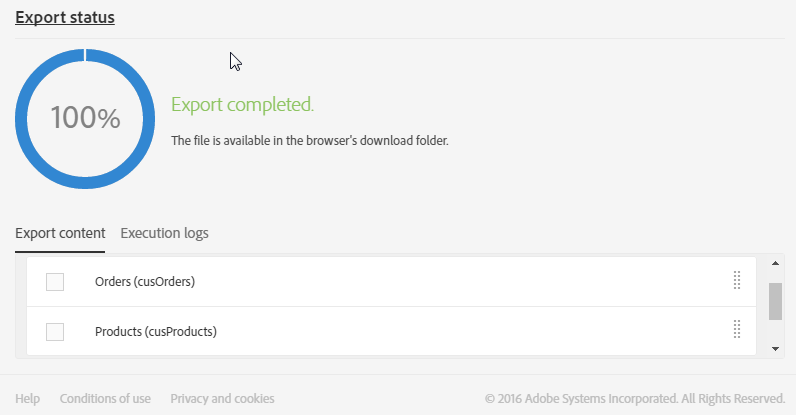
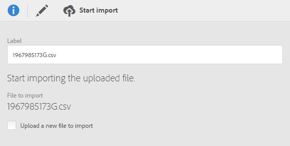
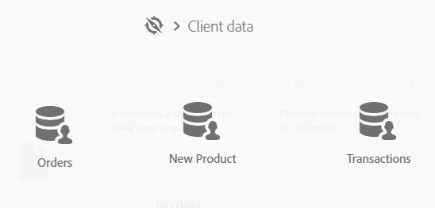

# Esportazione/importazione di risorse personalizzate {#exporting-importing-custom-resources}

Questa esercitazione spiega come esportare e importare un pacchetto di risorse personalizzate da un ambiente di sviluppo a un ambiente di produzione.

Questo esempio è destinato agli amministratori funzionali collegati ad Adobe Campaign.

Sussistono i seguenti prerequisiti:

* **Una o più risorse personalizzate** disponibili e pubblicate.

   Inoltre, devi aver definito una chiave univoca per queste risorse poiché le chiavi primarie automatiche non vengono esportate nei pacchetti. La risorsa può quindi avere una chiave primaria e una chiave univoca aggiuntiva per garantire l’univocità dei record.
* **I diritti necessari** per creare ed esportare un pacchetto.

Risorse aggiuntive:

* [Gestione dei pacchetti](../../automating/using/managing-packages.md)
* [Distribuzione dei pacchetti: principio di funzionamento](../../developing/using/data-model-concepts.md)
* [Aggiunta o estensione di una risorsa](../../developing/using/key-steps-to-add-a-resource.md)

## Esportazione della struttura {#exporting-the-structure}

In questa sezione verrà eseguita un’esportazione del primo pacchetto che descrive la struttura fisica dei dati delle risorse personalizzate.

Questo esempio include due risorse personalizzate: **Prodotti** e **Ordini**.

1. Passa al menu **[!UICONTROL Administration]** / **[!UICONTROL Deployment]** / **[!UICONTROL Package exports]**.

   Stiamo per creare un nuovo pacchetto per esportare la **[!UICONTROL Custom resource (cusResource)]** filtrata con le due risorse personalizzate, &quot;Prodotti&quot; e &quot;Ordini&quot;.

1. Nella pagina **[!UICONTROL Package exports]**, fai clic su **[!UICONTROL Create]** per creare un nuovo pacchetto.
1. Completa l’etichetta e fai clic su **[!UICONTROL Create element]**.

   

1. Cerca e seleziona la **[!UICONTROL Custom resource (cusResource)]**.

   

1. Configura i dettagli della **[!UICONTROL Custom resource]** selezionando le due risorse, **Prodotti** e **Ordini**, nelle condizioni di filtro.

   Assicurati di non dimenticare di modificare l’operatore logico. Il valore deve essere impostato su **OR** in modo tale che la struttura della risorsa prodotti e della risorsa ordini sia integrata nel pacchetto.

   

1. Conferma e salva la definizione del pacchetto.

Ora puoi fare clic su **[!UICONTROL Start export]**.

Il pacchetto generato è disponibile nella cartella Download. Il nome del file zip viene generato in modo casuale. Puoi rinominarlo.

## Esportazione dei dati {#exporting-the-data}

Questa seconda esportazione consentirà di esportare i dati dalle risorse personalizzate **Products** e **Orders**.

In base allo stesso tipo di esportazione dell’esportazione della struttura, creerai un secondo pacchetto che contiene i dati.

1. Nella pagina **[!UICONTROL Package exports]**, fai clic su **[!UICONTROL Create]** per creare un nuovo pacchetto.
1. Completa l’etichetta con **[!UICONTROL Export data of my resources]** quindi fai clic su **[!UICONTROL Create element]** nella scheda **[!UICONTROL Export content]**.
1. Cerca e seleziona la risorsa **Products**.

   

1. Configura una **condizione di filtro** avanzata con **@Label IS NOT NULL**.

   

1. Verifica il conteggio.

   

1. Ripeti la stessa operazione per la risorsa personalizzata **Ordini**.

   

1. Conferma e salva la definizione del pacchetto.

Ora puoi fare clic su **[!UICONTROL Start export]**.

Il pacchetto generato è disponibile nella cartella Download. Il nome del file zip viene generato in modo casuale. Puoi rinominarlo.

## Importazione della struttura {#importing-the-structure}

### Importazione del pacchetto {#importing-the-structure-package}

1. Collegati all’**istanza target** in cui desideri importare i pacchetti appena creati.
1. Passa al menu **[!UICONTROL Administration]** / **[!UICONTROL Deployment]** / **[!UICONTROL Package imports]** per creare un nuovo pacchetto per importare il file dalla prima esportazione.
1. Trascina e rilascia il **file di struttura** nella zona fornita a tal fine. I formati accettati sono ZIP o XML.

   

1. Modifica l’etichetta, ad esempio **Struttura di importazione**, quindi fai clic su **[!UICONTROL Save]**.
1. Fai clic su **[!UICONTROL Start import]**.

   

### Pubblicare {#publish-structure}

1. Passa al menu **[!UICONTROL Administration]** / **[!UICONTROL Development]** / **[!UICONTROL Publication]**.
1. Fai clic su **[!UICONTROL Prepare publication]** e poi su **[!UICONTROL Publish]** per aggiornare l’istanza con i dati delle nuove risorse personalizzate.
1. Le voci di menu corrispondenti al pacchetto installato verranno inserite nel menu **[!UICONTROL Client data]**.

   

## Importazione dei dati {#importing-the-data}

In questa sezione **importeremo i dati** collegati al pacchetto installato nell’istanza nel passaggio precedente.

Allo stesso modo del passaggio precedente, l’operazione è divisa in due parti: importazione del pacchetto e pubblicazione.

### Importazione del pacchetto {#importing-the-data-package}

1. Passa al menu **[!UICONTROL Administration]** / **[!UICONTROL Deployment]** / **[!UICONTROL Package imports]** per creare un nuovo pacchetto per importare il file che contiene i dati.
1. Trascina e rilascia il file di dati nella zona fornita a tal fine. I formati accettati sono ZIP o XML.
1. Modifica l’etichetta, ad esempio &quot;Dati di importazione&quot;, quindi fai clic su **[!UICONTROL Save]**.
1. Fai clic su **[!UICONTROL Start import]**.

   

### Pubblicare {#publish-data}

1. Passa al menu **[!UICONTROL Administration]** / **[!UICONTROL Development]** / **[!UICONTROL Publication]**.
1. Fai clic su **[!UICONTROL Prepare publication]** e poi su **[!UICONTROL Publish]** per aggiornare l’istanza con i dati delle risorse personalizzate.
